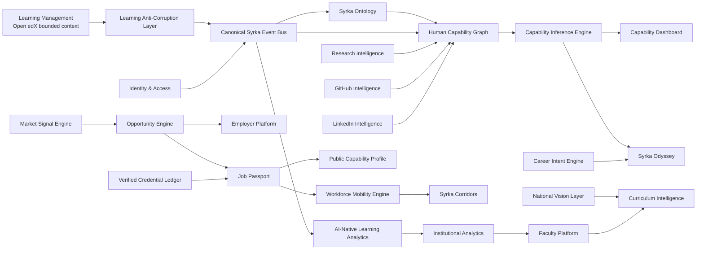
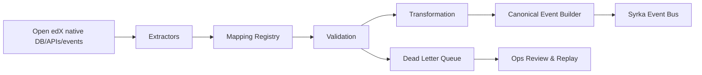
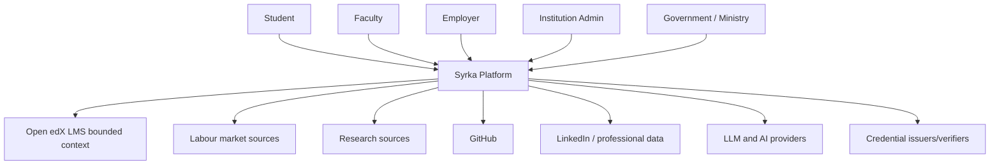
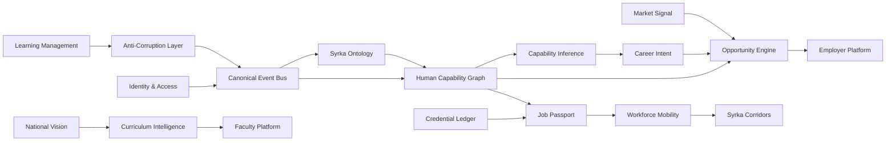
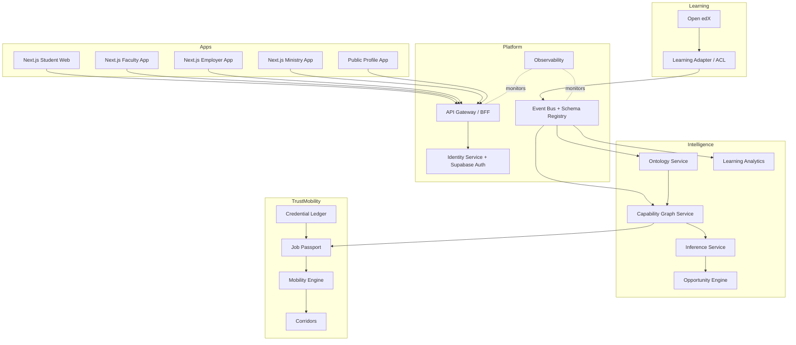
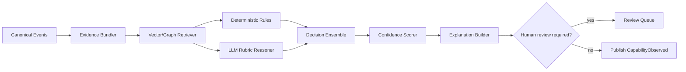
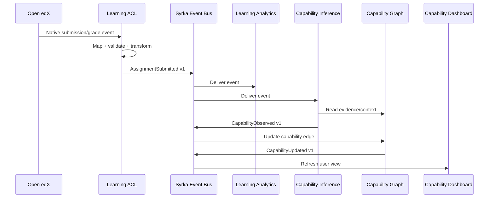
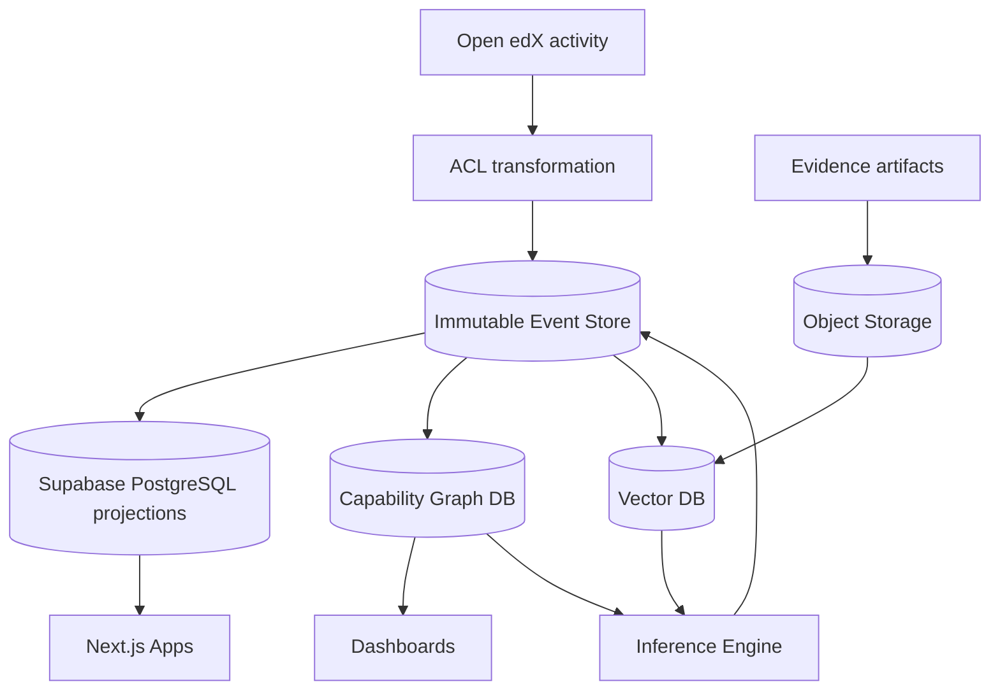
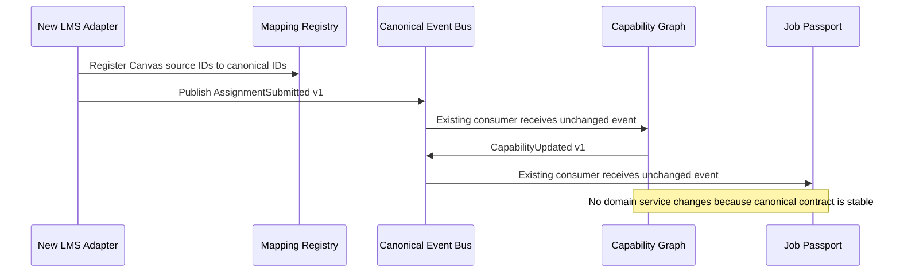
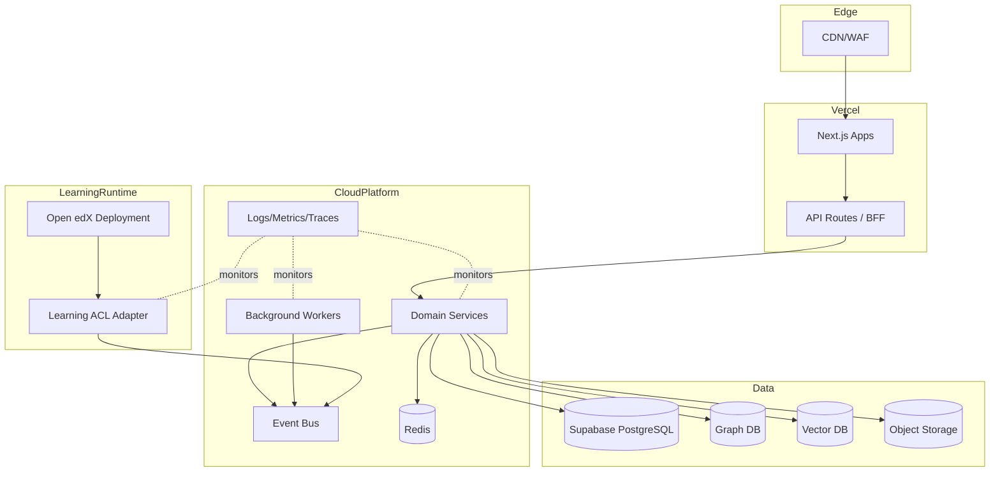

# ADR-002 — Syrka Domain Architecture, Bounded Contexts & System Ownership

Status: Accepted  
Date: 2026-07-07  
Builds on: ADR-001 — Selection of the Open-Source LMS Foundation for Syrka  
Decision owners: Architecture / Engineering / Product  
Scope: Permanent Syrka domain architecture, system ownership, data ownership, event contracts, and Open edX boundary

## 1. Executive Summary

ADR-001 selected an **Open edX Hybrid** approach: Open edX is a bounded operational LMS/runtime substrate, not the strategic product core. ADR-002 defines the permanent architecture that makes that decision safe.

**Open edX is not Syrka.** Open edX delivers learning experiences and captures educational activity. Syrka transforms those activities into human capability intelligence, career mobility, institutional analytics, workforce planning, and cross-border capability corridors.

The architectural philosophy is:

1. **Syrka owns all intelligence.** Ontologies, capability graphs, inference, career intent, market signals, national strategy alignment, recommendations, passports, and workforce mobility are Syrka-owned systems.
2. **The LMS is replaceable.** Open edX must remain behind an anti-corruption layer. Syrka must never depend directly on Open edX tables, internal APIs, event names, or implementation-specific identifiers.
3. **Events are the backbone.** Learning activity becomes canonical Syrka events. Canonical events become evidence. Evidence becomes capability claims. Capability claims become recommendations, credentials, job passports, and mobility decisions.
4. **Each domain has one owner.** No entity, table, event, or API may have shared ownership. Domains may reference each other by stable identifiers and consume each other's events, but they do not mutate each other's data.
5. **AI decisions require provenance.** No capability inference, opportunity recommendation, curriculum recommendation, or mobility judgment is accepted without evidence, confidence, explanation, model/version metadata, and bias/safety review.
6. **Syrka protects its IP by owning the semantic layer.** The proprietary value is not course delivery. It is the capability ontology, graph, inference engine, market alignment, career intelligence, passport, and corridor logic.

The permanent flow is:

```text
Student Learning
  ↓
Educational Evidence
  ↓
Canonical Syrka Event Bus
  ↓
Syrka Ontology
  ↓
Human Capability Graph
  ↓
Capability Inference Engine
  ↓
Career Intent Engine
  ↓
Market Signal Engine
  ↓
National Vision Layer
  ↓
Syrka Odyssey
  ↓
Capability Dashboard
  ↓
Job Passport
  ↓
Employer Platform
  ↓
Government Platform
  ↓
Workforce Mobility Engine
  ↓
Cross-Border Capability Corridors
```

## 2. Domain-Driven Design

### 2.1 Domain boundaries

Syrka is a domain-driven platform composed of bounded contexts. Each bounded context owns a business capability, a domain model, persistence boundaries, APIs, events, and team accountability.

The primary bounded contexts are:

1. Learning Management
2. Identity & Access
3. Syrka Ontology
4. Human Capability Graph
5. Capability Inference Engine
6. Career Intent Engine
7. Market Signal Engine
8. National Vision Layer
9. Research Intelligence
10. GitHub Intelligence
11. LinkedIn Intelligence
12. Capability Dashboard
13. Portfolio Generator
14. Opportunity Engine
15. Employer Platform
16. Faculty Platform
17. Institutional Analytics
18. Curriculum Intelligence
19. Job Passport
20. Verified Credential Ledger
21. Workforce Mobility Engine
22. Syrka Corridors
23. Public Capability Profile
24. AI-Native Learning Analytics
25. Platform/Event Infrastructure

### 2.2 Context map



### 2.3 Bounded context summary

| Bounded context | Purpose | Data owner | Public APIs | Consumed events | Produced events | Integrations | Team owner |
|---|---|---|---|---|---|---|---|
| Learning Management | Deliver courses and assessments | Open edX bounded context | LMS adapter APIs only | IdentityProvisioned, EnrollmentRequested | LearningActivityObserved via ACL | Open edX, LTI tools | Learning Platform Team |
| Identity & Access | Unified identity, authn, authz, federation | Syrka Identity | Auth/session/user APIs | InstitutionCreated | IdentityCreated, RoleAssigned | Supabase Auth, SSO, OIDC, SAML | Platform Team |
| Syrka Ontology | Canonical semantic model of skills, knowledge, occupations, curricula | Syrka Ontology | Ontology query/admin APIs | LabourMarketSignalIngested, CurriculumMapped | OntologyTermCreated, OntologyVersionPublished | ESCO/O*NET/SOC/ISCO/custom taxonomies | Ontology Team |
| Human Capability Graph | Evidence-linked capability graph | Syrka Graph | Graph query/mutation APIs | CapabilityEvidenceObserved, OntologyVersionPublished | CapabilityGraphUpdated | Graph DB/vector store | Capability Intelligence Team |
| Capability Inference Engine | Infer capabilities from evidence | Syrka AI | Inference APIs | EvidenceObserved, GraphUpdated | CapabilityObserved, CapabilityUpdated | LLMs, ML models | AI Platform Team |
| Career Intent Engine | Model learner aspirations and constraints | Syrka Career | Intent APIs | StudentUpdated | CareerIntentUpdated | Profile, dashboards | Student Intelligence Team |
| Market Signal Engine | Labour market ingestion and forecasting | Syrka Market | Market APIs | External market feeds | LabourMarketSignalIngested | Job boards, salary data, public data | Market Intelligence Team |
| National Vision Layer | Country strategy and workforce policy model | Syrka Government | Country/strategy APIs | GovernmentStrategyUpdated | NationalPriorityMapped | Ministries, public plans | Government Intelligence Team |
| Research Intelligence | Research output ingestion and mapping | Syrka Research | Research APIs | ResearchImported | ResearchCapabilityMapped | OpenAlex, Semantic Scholar, arXiv | Research Intelligence Team |
| GitHub Intelligence | Code/project evidence ingestion | Syrka Engineering Evidence | GitHub evidence APIs | GitHubRepositoryLinked | CodeCapabilityEvidenceObserved | GitHub | Evidence Integrations Team |
| LinkedIn Intelligence | Professional profile and signal ingestion | Syrka Professional Evidence | LinkedIn evidence APIs | LinkedInProfileLinked | ProfessionalSignalObserved | LinkedIn/exported data | Evidence Integrations Team |
| Capability Dashboard | Explain learner/institution capability state | Syrka Product | Dashboard APIs | CapabilityUpdated | DashboardViewed | Web apps | Product Experience Team |
| Portfolio Generator | Generate evidence-backed portfolios | Syrka Portfolio | Portfolio APIs | CapabilityUpdated, ProjectCompleted | PortfolioGenerated | Object storage, profiles | Product Experience Team |
| Opportunity Engine | Match people to jobs/projects/research/mobility | Syrka Opportunities | Recommendation APIs | CapabilityUpdated, CareerIntentUpdated, JobPosted | OpportunityMatched | Employers, markets | Opportunity Team |
| Employer Platform | Employer jobs, interest, verification | Syrka Employer | Employer/job APIs | OpportunityMatched | EmployerInterested, JobPosted | ATS/CRM | Employer Team |
| Faculty Platform | Faculty workflows and intervention tools | Syrka Faculty | Faculty APIs | LearningRiskDetected | FacultyInterventionCreated | LMS, dashboards | Academic Experience Team |
| Institutional Analytics | Institutional intelligence and benchmarking | Syrka Institution | Institution analytics APIs | LearningActivityObserved, CapabilityUpdated | InstitutionalInsightGenerated | BI/export | Institutional Team |
| Curriculum Intelligence | Map curriculum to skills/jobs/national priorities | Syrka Curriculum | Curriculum APIs | OntologyVersionPublished, LabourMarketSignalIngested | CurriculumGapDetected | LMS, faculty tools | Curriculum Team |
| Job Passport | Portable capability and credential artifact | Syrka Passport | Passport APIs | CredentialVerified, CapabilityUpdated | PassportIssued, PassportUpdated | Employers/governments | Passport Team |
| Verified Credential Ledger | Verifiable credential lifecycle | Syrka Credential | Credential APIs | AssessmentGraded, ExternalCredentialSubmitted | CredentialVerified, CredentialRevoked | VC/DID/blockchain optional | Trust Team |
| Workforce Mobility Engine | Determine mobility readiness and route | Syrka Mobility | Mobility APIs | PassportIssued, OpportunityMatched | MobilityApproved, MobilityBlocked | Governments/employers | Mobility Team |
| Syrka Corridors | Cross-border capability corridor orchestration | Syrka Corridors | Corridor APIs | MobilityApproved, NationalPriorityMapped | CorridorOpened, CorridorMatched | Governments/institutions | Corridor Team |
| Public Capability Profile | User-controlled public proof profile | Syrka Public Profile | Public profile APIs | PassportUpdated, PortfolioGenerated | PublicProfilePublished | Web, sharing, SEO | Public Platform Team |
| AI-Native Learning Analytics | Predict risk, mastery, engagement, quality | Syrka Analytics | Analytics APIs | LearningActivityObserved | LearningRiskDetected, MasterySignalDetected | LMS, dashboards | Analytics Team |
| Platform/Event Infrastructure | Event contracts, schemas, delivery, observability | Syrka Platform | Event/admin APIs | All domain events | EventAccepted, EventRejected | Kafka/NATS/Supabase queues | Platform Team |

## 3. Complete Bounded Context Catalogue

### 3.1 Learning Management — Open edX bounded context

**Purpose.** Deliver structured learning experiences and collect raw educational activity.

**Business responsibility.** Open edX owns operational LMS workflows only: course authoring/runtime, modules, lessons, assignments, assessments, quizzes, discussions, attendance adapters, content delivery, gradebook, and enrolments. It does not own Syrka capability semantics.

**Data ownership.** Open edX owns LMS-local operational data. Syrka stores only canonical projections and evidence derived through the anti-corruption layer.

**Internal models.** Course, course run, unit, block, problem, assessment, submission, grade, discussion item, enrollment, cohort, content asset, learning sequence.

**Public APIs.** None directly exposed to strategic Syrka consumers. All access goes through `learning-management-adapter` APIs and canonical event streams.

**Consumed events.** `IdentityProvisioned`, `EnrollmentRequested`, `CourseSyncRequested`, `ContentImportRequested`.

**Produced events.** Open edX-native events are private. The anti-corruption layer emits canonical `LearningActivityObserved`, `AssignmentSubmitted`, `AssignmentGraded`, `QuizCompleted`, `DiscussionParticipationObserved`, `AttendanceRecorded`, and `GradebookUpdated`.

**External integrations.** LTI 1.3 tools, SCORM/xAPI bridge where needed, video/content storage, proctoring, attendance tools, AI tutors as LTI/XBlock tools.

**Dependencies.** Identity & Access for identity; Platform/Event Infrastructure for event publication; Object Storage for exported evidence artifacts.

**Team ownership.** Learning Platform Team.

**What remains inside Open edX.** Course content, course delivery, assessment delivery, LMS gradebook, discussion integration, enrolment mechanics, instructor LMS operations, and learning activity capture remain inside Open edX. Syrka does not place ontology, graph, inference, career, employer, passport, or mobility logic inside Open edX.

### 3.2 Identity & Access

**Decision.** Identity belongs to **Syrka**, implemented initially using **Supabase Auth** as the authentication provider. Open edX receives provisioned identities and SSO assertions; it is not the source of truth.

**Purpose.** Provide universal user identity across student, faculty, employer, institution, ministry, and public-profile surfaces.

**Business responsibility.** Authentication, authorization, tenant membership, institution federation, government federation, API access, service accounts, user lifecycle, consent, and audit.

**Data ownership.** Syrka Identity owns person identity, organization identity, tenant membership, roles, permissions, identity links, and consent records. Supabase Auth stores authentication credentials and sessions as an implementation component.

**Internal models.** User, person, organization, institution, government agency, employer, tenant, role, permission, policy, identity provider, federation link, consent grant, service account.

**Public APIs.** `/identity/users`, `/identity/organizations`, `/identity/memberships`, `/identity/roles`, `/identity/consents`, OIDC/SAML federation endpoints, token introspection.

**Consumed events.** `InstitutionCreated`, `EmployerCreated`, `GovernmentAgencyCreated`, `UserInvited`.

**Produced events.** `StudentCreated`, `StudentUpdated`, `IdentityProvisioned`, `RoleAssigned`, `RoleRevoked`, `ConsentGranted`, `ConsentRevoked`, `FederationLinked`.

**External integrations.** Supabase Auth, OIDC, SAML, university identity providers, government identity providers, employer SSO, Open edX SSO.

**Dependencies.** Platform/Event Infrastructure; Supabase PostgreSQL; Redis for sessions/rate limits.

**Team ownership.** Platform Team.

**Authentication design.** Supabase Auth handles passwordless, OAuth/OIDC, SAML via enterprise extensions or identity broker, MFA, and session tokens. Syrka issues domain authorization claims and short-lived service tokens.

**Authorization design.** Syrka uses policy-based RBAC/ABAC. RBAC grants coarse roles such as student, faculty, employer admin, ministry analyst, institutional admin, platform admin. ABAC constrains access by institution, country, consent, relationship, data sensitivity, and purpose.

**Institution and government federation.** Institutions and governments federate through OIDC/SAML. Syrka maps external groups to tenant-scoped roles; no external IdP may directly grant global Syrka privileges.

### 3.3 Syrka Ontology

**Purpose.** Define the canonical semantic model for human capability, knowledge, skills, occupations, curricula, credentials, industries, tools, and evidence types.

**Business responsibility.** Maintain versioned taxonomies and semantic relationships that all intelligence systems use.

**Data ownership.** Syrka Ontology owns terms, definitions, relationships, mappings, versions, deprecations, and alignment to external standards.

**Internal models.** OntologyTerm, Skill, KnowledgeArea, Capability, Occupation, Industry, Tool, CurriculumOutcome, CredentialType, EvidenceType, Relationship, Mapping, Version, JurisdictionProfile.

**Public APIs.** `/ontology/terms`, `/ontology/skills`, `/ontology/capabilities`, `/ontology/occupations`, `/ontology/mappings`, `/ontology/versions`, GraphQL semantic query API.

**Consumed events.** `LabourMarketSignalIngested`, `CurriculumImported`, `CredentialFrameworkImported`, `NationalPriorityMapped`.

**Produced events.** `OntologyTermCreated`, `OntologyRelationshipCreated`, `OntologyVersionPublished`, `OntologyMappingDeprecated`.

**External integrations.** ESCO, O*NET, SOC, ISCO, national qualification frameworks, university catalogs, professional bodies.

**Dependencies.** PostgreSQL for governance metadata; graph database for semantic relationships; vector database for semantic similarity.

**Team ownership.** Ontology Team.

**Entity model.** Terms are immutable within a version. Relationships include `is_a`, `part_of`, `requires`, `enables`, `evidenced_by`, `maps_to`, `emerging_from`, `replaces`, `aligned_with`, and `regulated_by`.

**Taxonomy design.** Syrka supports global base taxonomy plus country/institution overlays. Overlays may add local terms and mappings but may not mutate global term meaning.

**Skill hierarchy.** Skills decompose into capabilities, procedures, tools, knowledge prerequisites, proficiency levels, and evidence requirements.

**Knowledge hierarchy.** Knowledge areas map to concepts, topics, learning outcomes, evidence forms, and assessment patterns.

**Occupation hierarchy.** Occupations map to industries, roles, tasks, required capabilities, regulation constraints, salary bands, and market signals.

**Curriculum hierarchy.** Institutions map programs, courses, modules, outcomes, assessments, and rubrics to ontology terms.

### 3.4 Human Capability Graph

**Purpose.** Store the evolving, evidence-backed graph of what a person, cohort, institution, region, or workforce can credibly do.

**Business responsibility.** Maintain capability state, relationships, temporal evolution, evidence provenance, and confidence.

**Data ownership.** Entirely Syrka-owned. No LMS owns capabilities. An LMS only produces raw learning evidence.

**Internal models.** PersonNode, CapabilityNode, EvidenceNode, AssessmentNode, ProjectNode, CredentialNode, OccupationNode, InstitutionNode, EmployerNode, ConfidenceEdge, ProvenanceEdge, TemporalState.

**Public APIs.** `/graph/person/{id}`, `/graph/capabilities`, `/graph/evidence`, `/graph/paths`, `/graph/cohorts`, graph query API.

**Consumed events.** `CapabilityEvidenceObserved`, `CapabilityObserved`, `CredentialVerified`, `ProjectCompleted`, `ResearchCapabilityMapped`, `CodeCapabilityEvidenceObserved`.

**Produced events.** `CapabilityGraphUpdated`, `CapabilityPathCreated`, `EvidenceAttached`, `CapabilityConfidenceChanged`.

**External integrations.** Graph DB, vector DB, BI projections, privacy/consent service.

**Dependencies.** Ontology, Identity, Capability Inference Engine, Event Infrastructure.

**Team ownership.** Capability Intelligence Team.

**Nodes.** Person, capability, skill, knowledge concept, evidence item, assignment, project, repository, research output, credential, occupation, opportunity, institution, employer, jurisdiction.

**Edges.** `has_evidence`, `demonstrates`, `requires`, `supports`, `contradicts`, `verified_by`, `derived_from`, `aligned_to`, `expires_at`, `observed_in`, `recommended_for`.

**Confidence.** Confidence is stored as a first-class edge/property with score, model version, evidence count, evidence quality, recency, assessor credibility, and uncertainty.

**Provenance.** Every capability assertion points to source event IDs, evidence artifacts, evaluator identity/model, timestamp, jurisdiction, and consent basis.

**Temporal relationships.** Capability state changes over time. The graph stores observations and projections, never only the latest value.

**Capability evolution.** The graph supports progression, decay, reinforcement, transferability, specialization, and adjacent-skill inference.

### 3.5 Capability Inference Engine

**Purpose.** Convert evidence into capability observations, updates, explanations, and recommendations.

**Business responsibility.** Evaluate whether evidence supports specific capabilities and at what confidence/proficiency.

**Data ownership.** Owns inference runs, model outputs, explanations, evaluation metadata, bias checks, and audit records. It does not own source evidence or ontology terms.

**Internal models.** InferenceRun, EvidenceBundle, CapabilityHypothesis, ModelDecision, ConfidenceScore, Explanation, BiasCheck, HumanReview, EvaluationSet.

**Public APIs.** `/inference/evaluate`, `/inference/explain/{runId}`, `/inference/models`, `/inference/review-queue`.

**Consumed events.** `LearningActivityObserved`, `AssignmentGraded`, `QuizCompleted`, `ProjectCompleted`, `ResearchPublished`, `GitHubRepositoryLinked`, `CredentialVerified`, `OntologyVersionPublished`.

**Produced events.** `CapabilityObserved`, `CapabilityUpdated`, `CapabilityRejected`, `InferenceReviewRequired`, `InferenceModelEvaluated`.

**External integrations.** OpenAI/Claude-compatible LLMs, embedding models, rules engines, model registry, evaluation datasets.

**Dependencies.** Ontology, Human Capability Graph, Event Infrastructure, Vector DB.

**Team ownership.** AI Platform Team.

**Inputs.** Canonical events, assessment results, rubrics, artifacts, code repositories, research outputs, credential claims, market ontology, historical graph state.

**Outputs.** Capability observations, confidence deltas, proficiency estimates, gap assessments, explanations, human-review tasks, model evaluation metrics.

**Algorithms.** Rules for deterministic mappings, rubric-to-capability scoring, Bayesian confidence update, graph propagation, embedding similarity, supervised classifiers, LLM rubric reasoning with structured outputs, and ensemble adjudication.

**Confidence scoring.** Confidence combines evidence relevance, assessor quality, recency, difficulty, independence, consistency, authenticity, and model uncertainty.

**Explainability.** Every output includes evidence references, reasoning summary, ontology version, model version, counterfactual missing evidence, and limitations.

**Bias mitigation.** Protected attributes are excluded unless legally required for fairness measurement. Models are evaluated across cohorts, countries, languages, institutions, and accessibility contexts. High-impact decisions require human review and appeal.

### 3.6 Career Intent Engine

**Purpose.** Model what a learner wants to become and the constraints under which recommendations should be made.

**Business responsibility.** Capture aspirations, pathways, preferences, geographies, industries, salary expectations, risk tolerance, mobility intent, and life constraints.

**Data ownership.** Syrka Career owns career intent records and preference history.

**Internal models.** CareerIntent, Aspiration, Pathway, PreferredIndustry, PreferredLocation, SalaryExpectation, Constraint, MobilityPreference, WorkModePreference, TimeHorizon.

**Public APIs.** `/career-intent`, `/career-pathways`, `/career-fit`, `/intent-history`.

**Consumed events.** `StudentCreated`, `CapabilityUpdated`, `OpportunityViewed`, `OpportunityAccepted`, `PassportIssued`.

**Produced events.** `CareerIntentUpdated`, `CareerPathwaySelected`, `CareerConstraintUpdated`, `MobilityIntentDeclared`.

**External integrations.** Student profile UX, career advisors, labour market data, employer platform.

**Dependencies.** Identity, Ontology, Market Signal Engine, Human Capability Graph.

**Team ownership.** Student Intelligence Team.

### 3.7 Market Signal Engine

**Purpose.** Ingest and model labour market demand, salaries, skills, occupations, emerging sectors, and disruption risk.

**Business responsibility.** Convert market data into normalized, explainable, jurisdiction-aware market signals.

**Data ownership.** Syrka Market owns labour market signals, forecasts, source metadata, and demand models.

**Internal models.** JobPosting, SkillDemandSignal, SalaryBand, DemandForecast, EmergingIndustry, DisplacementRisk, RegionalLabourMarket, EmployerDemandProfile, SourceReliability.

**Public APIs.** `/market/signals`, `/market/skills`, `/market/jobs`, `/market/salaries`, `/market/forecasts`, `/market/displacement`.

**Consumed events.** `JobPosted`, `EmployerInterested`, `NationalPriorityMapped`, external ingestion events.

**Produced events.** `LabourMarketSignalIngested`, `SkillDemandChanged`, `SalaryBandUpdated`, `EmergingIndustryDetected`, `AIDisplacementRiskUpdated`.

**External integrations.** Job boards, government statistics, employer APIs, salary datasets, economic data, web crawlers where permitted.

**Dependencies.** Ontology, Event Infrastructure, Vector DB for job/skill matching.

**Team ownership.** Market Intelligence Team.

### 3.8 National Vision Layer

**Purpose.** Model country strategies, national development plans, strategic sectors, workforce policy, and capability priorities.

**Business responsibility.** Translate national strategies into computable priority models that influence curriculum intelligence and workforce planning.

**Data ownership.** Syrka Government owns country strategy profiles and priority mappings.

**Internal models.** CountryProfile, NationalStrategy, StrategicSector, WorkforceTarget, PolicyPriority, JurisdictionRule, CapabilityPriority, ProgramAlignment.

**Public APIs.** `/national/countries`, `/national/strategies`, `/national/priorities`, `/national/workforce-targets`.

**Consumed events.** `GovernmentStrategyImported`, `LabourMarketSignalIngested`, `CurriculumGapDetected`.

**Produced events.** `NationalPriorityMapped`, `StrategicSectorUpdated`, `WorkforceTargetUpdated`.

**External integrations.** Government portals, policy documents, ministries, international organizations.

**Dependencies.** Ontology, Market Signal Engine, Research Intelligence.

**Team ownership.** Government Intelligence Team.

### 3.9 Research Intelligence

**Purpose.** Transform research publications, projects, grants, labs, and collaborations into capability and opportunity signals.

**Business responsibility.** Ingest research metadata, map research themes to ontology, identify faculty/student capabilities, and surface collaboration opportunities.

**Data ownership.** Syrka Research owns normalized research records and research-capability mappings.

**Internal models.** Publication, Author, Affiliation, ResearchTopic, CitationSignal, Grant, Lab, CollaborationOpportunity, ResearchCapabilityMapping.

**Public APIs.** `/research/publications`, `/research/topics`, `/research/collaborations`, `/research/capability-map`.

**Consumed events.** `ResearchImported`, `FacultyProfileUpdated`, `StudentProjectCompleted`, `OntologyVersionPublished`.

**Produced events.** `ResearchPublished`, `ResearchCapabilityMapped`, `ResearchCollaborationSuggested`.

**External integrations.** OpenAlex, Semantic Scholar, arXiv, Crossref, ORCID, institutional repositories.

**Dependencies.** Ontology, Human Capability Graph, Vector DB.

**Team ownership.** Research Intelligence Team.

### 3.10 GitHub Intelligence

**Purpose.** Convert code repositories, commits, pull requests, issues, tests, and reviews into software capability evidence.

**Business responsibility.** Link user-controlled repositories, analyze contribution quality, and emit code capability evidence.

**Data ownership.** Syrka Engineering Evidence owns normalized GitHub evidence records, not GitHub's source data.

**Internal models.** RepositoryLink, CommitSignal, PullRequestSignal, ReviewSignal, TestSignal, LanguageProfile, CodeQualitySignal, ProjectEvidence.

**Public APIs.** `/github/link`, `/github/repositories`, `/github/evidence`, `/github/capability-signals`.

**Consumed events.** `GitHubRepositoryLinked`, `ConsentGranted`, `ProjectCompleted`.

**Produced events.** `CodeCapabilityEvidenceObserved`, `RepositoryAnalyzed`, `GitHubRepositoryLinked`, `GitHubEvidenceRevoked`.

**External integrations.** GitHub OAuth/API/webhooks, optional GitLab/Bitbucket adapters.

**Dependencies.** Identity, Consent, Ontology, Capability Inference Engine.

**Team ownership.** Evidence Integrations Team.

### 3.11 LinkedIn Intelligence

**Purpose.** Normalize user-consented professional profile signals into career and capability evidence.

**Business responsibility.** Import profile data, experience, endorsements, certifications, and role history where legally and contractually permitted.

**Data ownership.** Syrka Professional Evidence owns normalized professional signals and consent state.

**Internal models.** ProfessionalProfileLink, ExperienceSignal, CertificationSignal, EndorsementSignal, RoleHistory, OrganizationSignal.

**Public APIs.** `/linkedin/link`, `/professional-profile/imports`, `/professional-signals`.

**Consumed events.** `ConsentGranted`, `LinkedInProfileLinked`, `CareerIntentUpdated`.

**Produced events.** `ProfessionalSignalObserved`, `LinkedInProfileLinked`, `ProfessionalSignalRevoked`.

**External integrations.** LinkedIn APIs where available, user-uploaded exports, employer verification.

**Dependencies.** Identity, Consent, Ontology, Career Intent Engine.

**Team ownership.** Evidence Integrations Team.

### 3.12 Capability Dashboard

**Purpose.** Present capability state, evidence, confidence, gaps, and recommendations to students, faculty, institutions, employers, and governments.

**Business responsibility.** Explain what Syrka believes, why it believes it, how confident it is, and what action should happen next.

**Data ownership.** Owns dashboard layouts, saved views, user annotations, and insight presentation state. Does not own capability facts.

**Internal models.** DashboardView, CapabilityCard, EvidenceTimeline, GapInsight, RecommendationPanel, ExplanationView, SavedFilter.

**Public APIs.** `/dashboards/capabilities`, `/dashboards/evidence`, `/dashboards/gaps`, `/dashboards/explanations`.

**Consumed events.** `CapabilityUpdated`, `CapabilityGraphUpdated`, `RecommendationGenerated`, `LearningRiskDetected`.

**Produced events.** `DashboardViewed`, `InsightAcknowledged`, `CapabilityDisputed`.

**External integrations.** Web apps, PDF/export service, profile service.

**Dependencies.** Human Capability Graph, Inference Engine, Opportunity Engine, Identity.

**Team ownership.** Product Experience Team.

### 3.13 Portfolio Generator

**Purpose.** Generate human-readable and machine-verifiable portfolios from evidence-backed capabilities.

**Business responsibility.** Assemble projects, credentials, reflections, artifacts, and capability claims into audience-specific portfolios.

**Data ownership.** Owns portfolio documents, templates, exports, share links, and presentation metadata.

**Internal models.** Portfolio, PortfolioSection, EvidenceReference, Artifact, Template, ShareLink, AudienceProfile.

**Public APIs.** `/portfolios`, `/portfolios/generate`, `/portfolios/share`, `/portfolios/export`.

**Consumed events.** `CapabilityUpdated`, `ProjectCompleted`, `CredentialVerified`, `PublicProfilePublished`.

**Produced events.** `PortfolioGenerated`, `PortfolioShared`, `PortfolioRevoked`.

**External integrations.** Object storage, PDF generation, public profile, employer platform.

**Dependencies.** Human Capability Graph, Job Passport, Verified Credential Ledger.

**Team ownership.** Product Experience Team.

### 3.14 Opportunity Engine

**Purpose.** Match people to jobs, internships, research projects, scholarships, courses, mentors, and mobility routes.

**Business responsibility.** Produce explainable opportunity recommendations using capabilities, intent, market signals, and constraints.

**Data ownership.** Owns recommendation runs, match scores, recommendation explanations, and opportunity matching state. Opportunity entities are owned by their domain of origin.

**Internal models.** Opportunity, MatchRun, MatchScore, Recommendation, EligibilityRule, ConstraintViolation, Explanation, FeedbackSignal.

**Public APIs.** `/opportunities`, `/opportunities/match`, `/recommendations`, `/recommendations/feedback`.

**Consumed events.** `CapabilityUpdated`, `CareerIntentUpdated`, `LabourMarketSignalIngested`, `JobPosted`, `ResearchCollaborationSuggested`, `MobilityApproved`.

**Produced events.** `OpportunityMatched`, `RecommendationGenerated`, `RecommendationAccepted`, `RecommendationRejected`.

**External integrations.** Employer platform, faculty platform, market data, public profile.

**Dependencies.** Capability Graph, Career Intent, Market Signal, National Vision.

**Team ownership.** Opportunity Team.

### 3.15 Employer Platform

**Purpose.** Allow employers to publish demand, discover candidates, express interest, verify job-passport claims, and close feedback loops.

**Business responsibility.** Employer identity, jobs, projects, talent searches, candidate interest, hiring feedback, and demand validation.

**Data ownership.** Syrka Employer owns employer profiles, job postings, employer users, interest records, and hiring feedback.

**Internal models.** Employer, EmployerUser, Job, ProjectBrief, TalentSearch, EmployerInterest, HiringFeedback, VerificationRequest.

**Public APIs.** `/employers`, `/employers/jobs`, `/employers/search`, `/employers/interests`, `/employers/verification`.

**Consumed events.** `PublicProfilePublished`, `OpportunityMatched`, `PassportIssued`, `CredentialVerified`.

**Produced events.** `EmployerCreated`, `JobPosted`, `EmployerInterested`, `HiringFeedbackSubmitted`, `VerificationRequested`.

**External integrations.** ATS, CRM, email/calendar, government employment portals.

**Dependencies.** Identity, Job Passport, Opportunity Engine, Public Capability Profile.

**Team ownership.** Employer Team.

### 3.16 Faculty Platform

**Purpose.** Support faculty with capability-aware teaching, intervention, assessment design, and curriculum improvement.

**Business responsibility.** Faculty dashboards, cohort monitoring, intervention workflows, rubric insights, assessment feedback, and course-improvement loops.

**Data ownership.** Owns faculty-specific workflows, notes, interventions, recommendations, and teaching analytics views.

**Internal models.** FacultyView, CohortInsight, Intervention, RubricInsight, AssessmentQualitySignal, TeachingRecommendation.

**Public APIs.** `/faculty/cohorts`, `/faculty/interventions`, `/faculty/rubrics`, `/faculty/recommendations`.

**Consumed events.** `LearningRiskDetected`, `MasterySignalDetected`, `CurriculumGapDetected`, `CapabilityUpdated`.

**Produced events.** `FacultyInterventionCreated`, `InterventionResolved`, `AssessmentImprovementRequested`.

**External integrations.** LMS adapter, institutional systems, notification service.

**Dependencies.** Institutional Analytics, AI-Native Learning Analytics, Curriculum Intelligence.

**Team ownership.** Academic Experience Team.

### 3.17 Institutional Analytics

**Purpose.** Provide institution-level intelligence over capabilities, programs, cohorts, outcomes, equity, and market alignment.

**Business responsibility.** Aggregate institutional insights without owning underlying student capability facts.

**Data ownership.** Owns institutional metrics, aggregates, reports, benchmarks, and authorized exports.

**Internal models.** InstitutionMetric, CohortAggregate, ProgramBenchmark, EquityMetric, OutcomeMetric, AnalyticsReport, ExportJob.

**Public APIs.** `/institutional/metrics`, `/institutional/cohorts`, `/institutional/reports`, `/institutional/exports`.

**Consumed events.** `LearningActivityObserved`, `CapabilityUpdated`, `CredentialVerified`, `OpportunityMatched`, `LearningRiskDetected`.

**Produced events.** `InstitutionalInsightGenerated`, `OutcomeBenchmarkUpdated`, `EquityRiskDetected`.

**External integrations.** BI tools, accreditation reporting, ministry exports.

**Dependencies.** Identity, Analytics, Graph, Data Warehouse/PostgreSQL projections.

**Team ownership.** Institutional Team.

### 3.18 Curriculum Intelligence

**Purpose.** Evaluate and improve curricula by aligning courses, assessments, outcomes, capabilities, market signals, and national priorities.

**Business responsibility.** Detect gaps, duplication, outdated content, assessment misalignment, and strategic opportunities.

**Data ownership.** Owns curriculum maps, gap analyses, recommendations, and alignment reports. LMS owns course delivery; Curriculum Intelligence owns semantic curriculum understanding.

**Internal models.** CurriculumMap, CourseOutcomeMapping, AssessmentMapping, SkillCoverageMatrix, GapAnalysis, CurriculumRecommendation, AccreditationMapping.

**Public APIs.** `/curriculum/maps`, `/curriculum/gaps`, `/curriculum/recommendations`, `/curriculum/alignment`.

**Consumed events.** `OntologyVersionPublished`, `CourseImported`, `AssessmentGraded`, `LabourMarketSignalIngested`, `NationalPriorityMapped`.

**Produced events.** `CurriculumGapDetected`, `CurriculumRecommendationGenerated`, `CourseOutcomeMapped`.

**External integrations.** Open edX adapter, catalogs, accreditation bodies, ministry frameworks.

**Dependencies.** Ontology, Market Signal, National Vision, Learning Management adapter.

**Team ownership.** Curriculum Team.

### 3.19 Job Passport

**Purpose.** Produce a portable, evidence-backed representation of a person's capabilities, credentials, preferences, and mobility readiness.

**Business responsibility.** Package verified capability claims for employers, governments, and cross-border mobility workflows.

**Data ownership.** Syrka Passport owns passport records, versions, shares, revocations, and disclosure policies.

**Internal models.** Passport, PassportVersion, CapabilityClaim, CredentialReference, MobilityReadiness, DisclosurePolicy, VerificationStatus, ShareToken.

**Public APIs.** `/passports`, `/passports/issue`, `/passports/share`, `/passports/revoke`, `/passports/verify`.

**Consumed events.** `CapabilityUpdated`, `CredentialVerified`, `CareerIntentUpdated`, `MobilityIntentDeclared`.

**Produced events.** `PassportIssued`, `PassportUpdated`, `PassportShared`, `PassportRevoked`.

**External integrations.** Employer platform, government platform, public profile, credential ledger.

**Dependencies.** Capability Graph, Credential Ledger, Identity, Consent.

**Team ownership.** Passport Team.

### 3.20 Verified Credential Ledger

**Purpose.** Manage credential claims, verification, revocation, issuer trust, and portable proof.

**Business responsibility.** Ensure credential assertions are verifiable, auditable, revocable, and tied to evidence.

**Data ownership.** Syrka Credential owns credential records, issuer registry, verification status, revocation state, and trust policies.

**Internal models.** Credential, CredentialClaim, Issuer, Verification, Revocation, TrustPolicy, EvidenceReference, VCExport.

**Public APIs.** `/credentials`, `/credentials/verify`, `/credentials/issue`, `/credentials/revoke`, `/issuers`.

**Consumed events.** `AssessmentGraded`, `CredentialSubmitted`, `IssuerApproved`, `PassportIssued`.

**Produced events.** `CredentialVerified`, `CredentialIssued`, `CredentialRevoked`, `IssuerTrustChanged`.

**External integrations.** W3C Verifiable Credentials, DID providers, credential issuers, optional blockchain anchoring.

**Dependencies.** Identity, Capability Graph, Object Storage, optional ledger infrastructure.

**Team ownership.** Trust Team.

### 3.21 Workforce Mobility Engine

**Purpose.** Determine whether a person, cohort, or talent pool is ready for internal, regional, or cross-border mobility.

**Business responsibility.** Match capability passports to mobility routes, visa/regulatory requirements, employer demand, government priorities, and readiness gaps.

**Data ownership.** Syrka Mobility owns mobility assessments, route decisions, readiness gaps, approvals, and case status.

**Internal models.** MobilityRoute, MobilityAssessment, ReadinessGap, EligibilityRule, RegulatoryRequirement, MobilityCase, ApprovalDecision.

**Public APIs.** `/mobility/routes`, `/mobility/assess`, `/mobility/cases`, `/mobility/approvals`.

**Consumed events.** `PassportIssued`, `OpportunityMatched`, `CredentialVerified`, `NationalPriorityMapped`, `EmployerInterested`.

**Produced events.** `MobilityApproved`, `MobilityBlocked`, `MobilityGapDetected`, `MobilityCaseOpened`.

**External integrations.** Government agencies, immigration/regulatory datasets, employer platform, corridor service.

**Dependencies.** Passport, National Vision, Market Signal, Credential Ledger.

**Team ownership.** Mobility Team.

### 3.22 Syrka Corridors

**Purpose.** Operate cross-border capability corridors between countries, institutions, employers, and sectors.

**Business responsibility.** Coordinate demand, supply, standards, credentials, mobility rules, and reporting across jurisdictions.

**Data ownership.** Syrka Corridors owns corridor definitions, agreements, eligibility mappings, pipeline status, and corridor analytics.

**Internal models.** Corridor, CorridorPartner, CorridorAgreement, CapabilityStandard, CandidatePipeline, CorridorMatch, JurisdictionMapping.

**Public APIs.** `/corridors`, `/corridors/partners`, `/corridors/pipelines`, `/corridors/matches`, `/corridors/reports`.

**Consumed events.** `MobilityApproved`, `NationalPriorityMapped`, `WorkforceTargetUpdated`, `EmployerInterested`.

**Produced events.** `CorridorOpened`, `CorridorMatched`, `CorridorCapacityUpdated`, `CorridorOutcomeReported`.

**External integrations.** Governments, institutions, employers, credential authorities.

**Dependencies.** Mobility Engine, National Vision, Employer Platform, Credential Ledger.

**Team ownership.** Corridor Team.

### 3.23 Public Capability Profile

**Purpose.** Provide user-controlled public profiles that expose selected capability evidence, portfolios, passports, and credentials.

**Business responsibility.** Manage public presentation, privacy, consent, sharing, SEO, verification views, and revocation.

**Data ownership.** Syrka Public Profile owns profile pages, slugs, visibility settings, shared claims, and access logs.

**Internal models.** PublicProfile, ProfileSection, VisibilityPolicy, SharedClaim, VerificationView, AccessLog.

**Public APIs.** `/profiles/public`, `/profiles/{slug}`, `/profiles/share`, `/profiles/visibility`.

**Consumed events.** `PassportUpdated`, `PortfolioGenerated`, `CredentialVerified`, `ConsentRevoked`.

**Produced events.** `PublicProfilePublished`, `PublicProfileViewed`, `PublicProfileRevoked`.

**External integrations.** Web, social sharing, employer verification, search indexing where allowed.

**Dependencies.** Identity, Portfolio, Passport, Consent.

**Team ownership.** Public Platform Team.

### 3.24 AI-Native Learning Analytics

**Purpose.** Analyze learning activity for mastery, risk, engagement, assessment quality, and pedagogical effectiveness.

**Business responsibility.** Produce learning analytics signals from canonical events while respecting privacy and explainability.

**Data ownership.** Syrka Analytics owns analytics models, aggregates, risk signals, mastery signals, and explainability metadata.

**Internal models.** LearningSession, EngagementSignal, MasterySignal, RiskPrediction, AssessmentQualityMetric, CohortPattern, AnalyticsModelRun.

**Public APIs.** `/analytics/learning`, `/analytics/mastery`, `/analytics/risk`, `/analytics/quality`, `/analytics/models`.

**Consumed events.** `LearningActivityObserved`, `AssignmentSubmitted`, `AssignmentGraded`, `QuizCompleted`, `DiscussionParticipationObserved`, `AttendanceRecorded`.

**Produced events.** `LearningRiskDetected`, `MasterySignalDetected`, `AssessmentQualitySignalGenerated`, `EngagementChanged`.

**External integrations.** Faculty platform, institutional analytics, capability inference engine.

**Dependencies.** Event Infrastructure, Learning Management adapter, Graph, Inference Engine.

**Team ownership.** Analytics Team.

## 4. Data Ownership Matrix

No entity may have shared ownership. Other domains may hold read models, projections, references, or cached views only.

| Entity | Single owner | Storage of record | Notes |
|---|---|---|---|
| Student | Syrka Identity | Supabase PostgreSQL/Auth | Open edX receives provisioned LMS account only |
| Person profile | Syrka Identity | Supabase PostgreSQL | Public profile is a separate presentation entity |
| Institution | Syrka Identity | Supabase PostgreSQL | Institution analytics consumes it |
| Government agency | Syrka Identity | Supabase PostgreSQL | National Vision references it |
| Employer | Employer Platform | Supabase PostgreSQL | Identity owns employer users/memberships |
| Course | Learning Management | Open edX DB | Curriculum Intelligence stores mappings only |
| Module/lesson | Learning Management | Open edX DB | Canonical IDs are mapped in ACL |
| Assignment | Learning Management | Open edX DB | Syrka stores evidence projection only |
| Assessment/quiz | Learning Management | Open edX DB | Results become canonical events |
| Grade | Learning Management | Open edX DB | Syrka stores evidence and derived capability claims |
| Enrollment | Learning Management | Open edX DB plus Syrka projection | Source of LMS enrollment remains Open edX |
| Skill | Syrka Ontology | Ontology DB/Graph | Versioned semantic object |
| Knowledge concept | Syrka Ontology | Ontology DB/Graph | Versioned semantic object |
| Capability | Human Capability Graph | Graph DB | References ontology terms |
| Capability observation | Capability Inference Engine | PostgreSQL + Graph projection | Graph consumes accepted observations |
| Evidence item | Human Capability Graph | Graph DB + object storage refs | Source artifact remains in source system |
| Career intent | Career Intent Engine | Supabase PostgreSQL | User-controlled and versioned |
| Research output | Research Intelligence | PostgreSQL/object refs/vector | Mapped to graph as evidence |
| Project | Portfolio Generator or source domain | Supabase PostgreSQL/object storage | Learning project from LMS remains LMS-owned until normalized as evidence |
| GitHub repository link | GitHub Intelligence | Supabase PostgreSQL | GitHub owns repository; Syrka owns normalized evidence |
| LinkedIn profile link | LinkedIn Intelligence | Supabase PostgreSQL | User consent required |
| Credential | Verified Credential Ledger | Credential DB/ledger | Passport references verified credentials |
| Job | Employer Platform | Supabase PostgreSQL | Opportunity Engine recommends jobs |
| Opportunity match | Opportunity Engine | Supabase PostgreSQL | Does not own underlying opportunity entity |
| Passport | Job Passport | Supabase PostgreSQL/object storage | Versioned, revocable |
| Public capability profile | Public Capability Profile | Supabase PostgreSQL/object storage | User-controlled disclosure |
| Government strategy | National Vision Layer | PostgreSQL/vector/object refs | Parsed from official sources |
| Labour market signal | Market Signal Engine | PostgreSQL/vector/time-series | Versioned by source and timestamp |
| Curriculum map | Curriculum Intelligence | Supabase PostgreSQL/Graph | Does not own LMS course content |
| Institutional report | Institutional Analytics | Warehouse/PostgreSQL/object storage | Aggregate projection only |
| Mobility case | Workforce Mobility Engine | Supabase PostgreSQL | References passport/opportunity |
| Corridor | Syrka Corridors | Supabase PostgreSQL | Cross-jurisdiction orchestration |
| Event schema | Platform/Event Infrastructure | Schema registry | Canonical contract owner |

## 5. Canonical Event Architecture

### 5.1 Universal event envelope

Every canonical event uses the same envelope:

```json
{
  "event_id": "uuid",
  "event_type": "AssignmentSubmitted",
  "event_version": "1.0.0",
  "occurred_at": "2026-07-07T00:00:00Z",
  "published_at": "2026-07-07T00:00:01Z",
  "producer": "learning-management-adapter",
  "source_system": "openedx",
  "tenant_id": "uuid",
  "country_code": "SA",
  "institution_id": "uuid",
  "subject": { "type": "student", "id": "uuid" },
  "correlation_id": "uuid",
  "causation_id": "uuid",
  "idempotency_key": "source-system:source-event-id:version",
  "privacy": { "classification": "restricted", "consent_basis": "education" },
  "payload": {},
  "provenance": { "source_event_id": "...", "source_url": "...", "adapter_version": "..." },
  "schema_url": "https://schemas.syrka.ai/events/AssignmentSubmitted/1.0.0"
}
```

### 5.2 Event catalogue

| Event | Producer | Primary consumers | Payload summary | Retention/replay |
|---|---|---|---|---|
| `StudentCreated` | Identity | LMS adapter, Graph, Dashboards | student_id, tenant, institution, role metadata | Permanent identity audit; replay to provision services |
| `StudentUpdated` | Identity | Career, Dashboards, Analytics | changed profile fields, tenant scope | Permanent audit with PII controls |
| `AssignmentSubmitted` | Learning ACL | Analytics, Inference, Graph | assignment_id, attempt_id, artifact refs, timestamps | Long-term educational evidence; replayable |
| `AssignmentGraded` | Learning ACL | Inference, Graph, Faculty, Analytics | grade, rubric, feedback, assessor, attempt | Long-term evidence; replayable |
| `QuizCompleted` | Learning ACL | Analytics, Inference | quiz_id, score, attempts, duration, item-level summary | Long-term evidence with sensitive detail controls |
| `ProjectCompleted` | Learning ACL/Portfolio/GitHub | Graph, Portfolio, Inference | project_id, artifacts, collaborators, rubric | Long-term portfolio/evidence |
| `ResearchPublished` | Research Intelligence | Graph, Portfolio, Opportunity | publication metadata, authors, topics | Permanent scholarly evidence |
| `GitHubRepositoryLinked` | GitHub Intelligence | Inference, Graph | repo link, consent, ownership proof | Retained while consent active |
| `CapabilityObserved` | Inference Engine | Graph, Dashboard, Passport | capability_id, evidence refs, confidence, explanation | Permanent with model provenance |
| `CapabilityUpdated` | Graph | Dashboard, Opportunity, Passport | capability state delta, confidence, timestamp | Permanent graph history |
| `CareerIntentUpdated` | Career Intent | Opportunity, Mobility, Odyssey | aspirations, preferences, constraints | User-controlled history |
| `RecommendationGenerated` | Opportunity/Odyssey | Dashboard, Audit | recommendation, score, explanation, model | Retain for audit and learning |
| `PassportIssued` | Job Passport | Employer, Mobility, Public Profile | passport_id, version, claims, disclosure policy | Permanent/revocable versions |
| `CredentialVerified` | Credential Ledger | Graph, Passport, Employer | credential_id, issuer, verification result | Permanent trust audit |
| `OpportunityMatched` | Opportunity Engine | Student, Employer, Mobility | opportunity_id, match score, reasons | Retain for audit and feedback |
| `EmployerInterested` | Employer Platform | Opportunity, Mobility, Analytics | employer_id, profile/passport target, job | Retain under consent and policy |
| `MobilityApproved` | Mobility Engine | Corridors, Passport, Government dashboards | route, eligibility, conditions, expiry | Permanent case history |

### 5.3 Versioning

- Event names are stable business facts, not implementation names.
- Schema versions use semantic versioning.
- Consumers must tolerate additive fields.
- Breaking changes create a new major version and dual-publish during migration.
- A schema registry stores JSON Schema/OpenAPI/AsyncAPI definitions.

### 5.4 Retry and idempotency

- Producers attach deterministic `idempotency_key` values.
- Event ingestion is at-least-once; consumers must be idempotent.
- Failed deliveries go to dead-letter queues with replay tooling.
- Consumer checkpoints are stored per consumer group.

### 5.5 Security

- Events are signed by producers or delivered through authenticated infrastructure.
- Event payloads are classified: public, internal, restricted, highly restricted.
- PII is minimized; sensitive artifacts are referenced by secure object IDs rather than embedded.
- Domain authorization applies to event subscriptions.

### 5.6 Retention and replay

- Canonical events are immutable.
- Long-term evidence events are retained for the lifetime required by product, legal, and institutional policy.
- Retention is domain-specific and country-aware.
- Replay can rebuild graph projections, dashboards, analytics aggregates, and passports.

## 6. Anti-Corruption Layer

The Learning Anti-Corruption Layer is the permanent translation boundary between Open edX and Syrka.



**Mapping.** Open edX courses, blocks, submissions, grades, discussions, and enrollment records are mapped to Syrka canonical identifiers using a mapping registry. The registry stores `source_system`, `source_id`, `canonical_id`, `entity_type`, `valid_from`, and `valid_to`.

**Validation.** The ACL validates source completeness, tenant ownership, consent/policy basis, schema compatibility, timestamp sanity, duplicate status, and required evidence references.

**Transformation.** The ACL converts Open edX concepts into canonical Syrka facts. Example: an Open edX problem attempt becomes `QuizCompleted` or `AssessmentAttempted`, not an Open edX-specific event.

**Error handling.** Invalid records are rejected into a dead-letter queue with source pointer, validation errors, adapter version, and replay eligibility. Poison messages are quarantined.

**Monitoring.** Metrics include extraction lag, transform error rate, event publish success, unmapped entity rate, duplicate rate, DLQ volume, and per-tenant throughput.

**Logging.** Logs must not contain student submissions or PII beyond stable IDs. Sensitive payloads are stored in secure object storage and referenced.

**Versioning.** Each adapter has a version. Mapping changes are migration-controlled. Source version and adapter version are written into event provenance.

**Migration strategy.** If Open edX is replaced, only this ACL changes. Canonical event contracts, ontology, graph, dashboards, inference, passport, and mobility systems remain unchanged.

## 7. API Ownership

| Domain | Public APIs | Internal APIs | Protocols | AuthN/AuthZ | Rate limiting | Consumers | Provider/owner |
|---|---|---|---|---|---|---|---|
| Learning Management Adapter | course projections, enrollment requests, evidence exports | Open edX connector APIs | REST/events | Syrka service tokens + RBAC | tenant/service limits | Web, Curriculum, Analytics | Learning Platform Team |
| Identity | users, orgs, roles, consents, federation | policy evaluation, token introspection | REST/OIDC/SAML | Supabase Auth + Syrka policies | per user/org/IP | all domains | Platform Team |
| Ontology | terms, mappings, versions | ontology admin/versioning | REST/GraphQL | service/user policies | per tenant and API key | graph, inference, curriculum | Ontology Team |
| Graph | capability graph, evidence, paths | graph mutation/event consumers | GraphQL/REST/events | consent + purpose policy | strict per purpose | dashboards, passport, opportunity | Capability Intelligence Team |
| Inference | evaluate, explain, review | model adapters, batch jobs | REST/events/workers | service identity + policy | cost/model budgets | graph, analytics | AI Platform Team |
| Career Intent | intent, pathways, constraints | scoring features | REST/events | user-owned + advisor scopes | per user | opportunity, mobility | Student Intelligence Team |
| Market | signals, salaries, forecasts | ingestion jobs | REST/events | service/user policies | per org/API key | opportunity, curriculum, national | Market Intelligence Team |
| National Vision | country strategies, priorities | policy ingestion | REST/events | government/institution scopes | per tenant | curriculum, mobility | Government Intelligence Team |
| Research | publications, topics, collaborations | source ingestion | REST/events | institution/user scopes | per source | graph, portfolio | Research Team |
| Evidence Integrations | GitHub/LinkedIn links and signals | webhook handlers | REST/webhooks/events | OAuth + consent | provider-specific | inference, graph | Evidence Integrations Team |
| Dashboard | capability views and explanations | saved-view service | REST/GraphQL | user/tenant roles | per user | web apps | Product Experience Team |
| Portfolio | portfolio generate/share/export | template renderer | REST/events | user consent | per user/export | public profile, employer | Product Experience Team |
| Opportunity | matches/recommendations | scorer workers | REST/events | user/employer roles | per user/org | web, employer, mobility | Opportunity Team |
| Employer | employers/jobs/search/interests | ATS connectors | REST/webhooks | employer RBAC | per employer | opportunity, passport | Employer Team |
| Faculty | cohort/intervention/rubric APIs | LMS/faculty projections | REST/events | faculty/institution roles | per institution | faculty app | Academic Experience Team |
| Institutional Analytics | metrics/reports/exports | aggregate builders | REST/events | institution roles | export quotas | admin/ministry | Institutional Team |
| Curriculum | maps/gaps/recommendations | mapping workers | REST/events | faculty/admin roles | per institution | faculty, ministry | Curriculum Team |
| Passport | issue/share/verify | claim builder | REST/events | user consent + verifier scopes | per verifier | employer, mobility | Passport Team |
| Credential Ledger | issue/verify/revoke | issuer registry | REST/events/VC | issuer trust policy | per issuer | passport, employer | Trust Team |
| Mobility | routes/assess/cases | rule engine | REST/events | government/employer/user scopes | case quotas | corridors | Mobility Team |
| Corridors | corridors/pipelines/reports | partner integrations | REST/events | corridor partner roles | per partner | governments | Corridor Team |
| Public Profile | publish/share/view | rendering/cache | REST | public + signed URLs | public abuse limits | web/employers | Public Platform Team |
| Analytics | mastery/risk/quality | model workers | REST/events | institution/faculty scopes | per tenant | faculty/institution | Analytics Team |

REST is the default for transactional APIs. GraphQL is appropriate for graph/dashboard read composition. gRPC is reserved for high-throughput internal model or scoring calls. Events are required for domain state propagation.

## 8. Database Ownership

### 8.1 Supabase PostgreSQL

**Purpose.** Primary application relational store for Syrka-owned transactional domains, tenant models, API projections, audit metadata, and operational read models.

**Owner.** Platform Team owns the cluster and standards; each domain owns its schema.

**Schema strategy.** Use schema-per-domain: `identity`, `ontology`, `career`, `market`, `national`, `portfolio`, `opportunity`, `employer`, `faculty`, `institutional`, `curriculum`, `passport`, `credentials`, `mobility`, `corridors`, `public_profile`, `analytics`, `events`.

**Indexes.** All tenant-scoped tables index `tenant_id`; all event projections index `event_id`, `occurred_at`, `subject_id`; all user-owned tables index `user_id` plus `consent_state` where relevant.

**Relationships.** Cross-domain references use stable IDs only. No cross-domain foreign keys that create deployment coupling.

**Partitioning.** Event projections and analytics aggregates partition by tenant/country/time depending on query patterns.

**Scaling.** Read replicas for dashboards; logical replication into warehouse; row-level security for user/tenant access; connection pooling.

### 8.2 Graph Database

**Purpose.** Capability graph, ontology relationships, evidence-to-capability relationships, occupation paths, and mobility routes.

**Owner.** Capability Intelligence Team for capability graph; Ontology Team for ontology subgraph. Platform owns infrastructure standards.

**Data.** Nodes and edges described in sections 3.3 and 3.4.

**Indexes.** Node IDs, ontology term IDs, person IDs, capability IDs, temporal validity, relationship types, confidence ranges.

**Scaling.** Partition by tenant/person/country as needed; materialize read models for common dashboard queries.

### 8.3 Vector Database

**Purpose.** Semantic retrieval over evidence artifacts, course descriptions, resumes, publications, job postings, national strategies, and ontology terms.

**Owner.** AI Platform Team, with domain-owned collections.

**Collections.** `evidence_embeddings`, `job_embeddings`, `research_embeddings`, `curriculum_embeddings`, `policy_embeddings`, `ontology_embeddings`, `portfolio_embeddings`.

**Indexes.** ANN indexes by collection; metadata filters for tenant, country, language, source, consent, and freshness.

**Scaling.** Store embeddings with model/version metadata. Re-embed on model upgrades with dual-index migration.

### 8.4 Redis

**Purpose.** Caching, rate limiting, short-lived sessions, job locks, idempotency windows, and queue coordination.

**Owner.** Platform Team.

**Data.** No durable domain state. All Redis data must be rebuildable.

### 8.5 Object Storage

**Purpose.** Store artifacts: submissions, portfolios, PDFs, research files, credential proofs, profile media, exports, and evidence snapshots.

**Owner.** Platform Team infrastructure; domains own buckets/prefixes and retention policy.

**Security.** Signed URLs, encryption, classification metadata, virus/malware scanning, retention tags, legal hold where required.

### 8.6 Open edX database

**Purpose.** LMS-local operational persistence only.

**Owner.** Learning Platform Team.

**Rule.** Syrka services may not query Open edX databases directly. Only the ACL may read/translate Open edX state.

## 9. Service Architecture

| Bounded context | Service form | Justification |
|---|---|---|
| Learning Management | External bounded platform + adapter service | Open edX remains isolated and replaceable |
| Identity & Access | Modular platform service | Shared dependency with strong security boundary |
| Syrka Ontology | Modular service + graph-backed admin | Versioned domain used by many services |
| Human Capability Graph | Dedicated service + event consumer | Central strategic graph with specialized persistence |
| Capability Inference Engine | AI service + background workers | Model orchestration, batch scoring, human review |
| Career Intent Engine | Modular service | User-owned profile/intention workflows |
| Market Signal Engine | Ingestion workers + API service | External feeds, forecasts, scheduled jobs |
| National Vision Layer | Ingestion workers + API service | Policy document parsing and government workflows |
| Research Intelligence | Ingestion workers + API service | External APIs and semantic mapping |
| GitHub Intelligence | Integration service + webhook workers | Provider OAuth/webhooks and code analysis |
| LinkedIn Intelligence | Integration service + ingestion workers | Consent-heavy professional signal ingestion |
| Capability Dashboard | Web/BFF module | Presentation composition over graph/inference APIs |
| Portfolio Generator | Background worker + API service | Document generation and object storage exports |
| Opportunity Engine | Recommendation AI service + API | Scoring, ranking, feedback learning |
| Employer Platform | Modular service + web app | Employer workflows and job lifecycle |
| Faculty Platform | Web/BFF module + workflow service | Institution/faculty UX and interventions |
| Institutional Analytics | Event consumers + aggregate API | Heavy read models and reports |
| Curriculum Intelligence | AI service + mapping workers | Semantic curriculum analysis and recommendations |
| Job Passport | Dedicated service | Trust, versioning, sharing, revocation |
| Verified Credential Ledger | Dedicated trust service | Security-critical credential lifecycle |
| Workforce Mobility Engine | Rule engine + workflow service | Eligibility, routes, cases, approvals |
| Syrka Corridors | Workflow/orchestration service | Multi-party cross-border operations |
| Public Capability Profile | Public web service + cache | Public traffic, privacy, SEO/security boundary |
| AI-Native Learning Analytics | Event consumers + AI service | Predictive analytics over canonical learning events |
| Platform/Event Infrastructure | Shared platform services | Event bus, schema registry, observability |

## 10. Repository Architecture

Recommended future monorepo layout:

```text
apps/
  web/                    # student and public Syrka web app
  admin/                  # platform administration
  employer/               # employer portal
  faculty/                # faculty workflows
  ministry/               # government/ministry platform
  public-profile/         # public capability profile surface

services/
  learning-management-adapter/
  identity/
  ontology/
  capability-graph/
  capability-inference/
  career-intent/
  market-signals/
  national-vision/
  research-intelligence/
  github-intelligence/
  linkedin-intelligence/
  opportunity-engine/
  portfolio-generator/
  employer-platform/
  faculty-platform/
  institutional-analytics/
  curriculum-intelligence/
  job-passport/
  credential-ledger/
  workforce-mobility/
  syrka-corridors/
  learning-analytics/

packages/
  ui/                     # shared design system
  auth/                   # client/server auth helpers
  sdk/                    # generated API clients
  events/                 # canonical event types, schemas, publishers
  database/               # DB clients and migration helpers
  types/                  # shared TypeScript types
  telemetry/              # logging, tracing, metrics helpers
  policy/                 # authorization policy helpers
  ai/                     # model client abstractions, not business logic
  testing/                # test utilities and fixtures

infrastructure/
  terraform/
  docker/
  k8s/
  observability/
  event-bus/
  secrets/

supabase/
  migrations/
  seed/
  policies/
  functions/

docs/
  adr/
  architecture/
  schemas/
  runbooks/
```

**Ownership rules.**

- `apps/*` are owned by Product Experience teams but may not contain domain business logic beyond presentation orchestration.
- `services/*` are owned by the named domain teams.
- `packages/events` is owned by Platform/Event Infrastructure and reviewed by affected domain owners.
- `packages/ai` owns model-provider abstractions only; inference rules belong in domain services.
- `supabase/migrations` are schema-per-domain and reviewed by the owning domain team plus Platform.
- `infrastructure` is owned by Platform/SRE.

## 11. Technology Ownership

| Technology | Owning domain/use | Why |
|---|---|---|
| Next.js | User-facing apps and BFF routes | Fits current Syrka web architecture and modern UX |
| TypeScript | Apps, API surfaces, event contracts | Strong contracts and Claude-assisted maintainability |
| Supabase Auth | Identity implementation provider | Fast, secure auth foundation while Syrka owns identity model |
| Supabase PostgreSQL | Transactional app persistence | Strong relational source for Syrka-owned data |
| PostgreSQL RLS | Identity/tenant security | Enforces row-level tenant and user boundaries |
| Redis | Platform cache/session/rate limits | Ephemeral performance and coordination |
| Graph Database | Ontology and capability graph | Natural fit for semantic capability relationships |
| Vector Database | AI retrieval and semantic matching | Required for LLM grounding, similarity, recommendations |
| Open edX | Learning Management bounded context | Course/runtime/assessment foundation selected in ADR-001 |
| Python | AI, inference, ingestion, graph workflows | Best ecosystem for ML/LLM/data pipelines |
| TypeScript workers | Event adapters and product-adjacent jobs | Shared types and integration speed |
| Claude/OpenAI-compatible LLMs | AI services through provider abstraction | Model vendors are replaceable; prompts/evals are Syrka IP |
| Object Storage | Evidence artifacts, exports, passports | Durable binary/object evidence storage |
| Event Bus | Platform/Event Infrastructure | Backbone for replaceability and domain decoupling |
| Mermaid/ADR docs | Architecture governance | Makes decisions reviewable and enforceable |

## 12. Replaceability Analysis

### 12.1 If Open edX disappears tomorrow

**Services that continue operating:** Identity, Ontology, Capability Graph, Inference over existing evidence, Career Intent, Market Signal, National Vision, Research Intelligence, GitHub Intelligence, LinkedIn Intelligence, Dashboards over existing projections, Portfolio, Opportunity, Employer Platform, Institutional Analytics over existing projections, Curriculum Intelligence over existing mappings, Job Passport, Credential Ledger, Mobility, Corridors, Public Profiles, and AI-Native Analytics over historical events.

**Services that fail or degrade:** New LMS course delivery, new LMS assignment submissions, new LMS quizzes, LMS gradebook sync, LMS-native discussions, attendance capture tied to Open edX, and any Open edX-specific authoring workflow.

**Why Syrka survives.** Canonical events, graph state, passports, credentials, and intelligence services are not stored in Open edX. Historical evidence remains replayable from Syrka event storage and object storage.

### 12.2 Replacing Open edX with Canvas

**Required work.** Build a Canvas ACL adapter, map Canvas courses/assignments/submissions/grades/users to canonical IDs, integrate Canvas SSO, validate LTI behavior, replay backfills, and dual-run during migration.

**Estimated effort.** 3–6 months for parity with core LMS activity events; 6–12 months for deep feature parity, depending on institution workflows.

### 12.3 Replacing Open edX with Moodle

**Required work.** Build Moodle ACL adapter, map Moodle plugin/activity events, implement SSO, migrate course structures where required, map gradebook and activity modules, validate event coverage.

**Estimated effort.** 4–8 months for core event parity; 9–15 months for broad plugin-heavy deployments.

### 12.4 Replacing Open edX with custom LMS

**Required work.** Build course runtime, content authoring, assessments, gradebook, enrolments, discussions/attendance integrations, LTI support, and canonical event producer natively.

**Estimated effort.** 12–24 months for credible institutional LMS parity; less if the custom LMS is intentionally narrow and Syrka controls all content formats.

## 13. Intellectual Property Boundary

Syrka's proprietary IP is concentrated in:

1. **Syrka Ontology** — the semantic model connecting education, capability, occupations, markets, and national strategies.
2. **Human Capability Graph** — the evidence-backed representation of human potential and verified capability evolution.
3. **Capability Inference Engine** — algorithms, prompts, evaluations, confidence models, explainability, and bias controls.
4. **Career Intent Engine** — aspiration and pathway intelligence.
5. **Market Signal Engine** — normalized demand, salary, emerging-industry, and AI-displacement signals.
6. **National Vision Layer** — computable strategy alignment for governments.
7. **Opportunity Engine** — matching and recommendation logic.
8. **Job Passport** — portable, trustworthy, evidence-backed capability artifact.
9. **Verified Credential Ledger** — credential trust, verification, revocation, and issuer logic.
10. **Workforce Mobility Engine and Syrka Corridors** — cross-border capability mobility rules and orchestration.
11. **AI-native Learning Analytics** — predictive and explanatory learning intelligence.
12. **Canonical Event Schemas and Anti-Corruption Layer** — the abstraction that makes every LMS replaceable.

These components must remain independent of LMS implementation details. Open edX, Canvas, Moodle, or any future LMS may feed the system; none may define Syrka's core semantics.

## 14. Architecture Principles

1. **LMSs are replaceable.** No strategic Syrka domain may depend on LMS-specific schemas or APIs.
2. **Syrka owns all intelligence.** Capabilities, inference, graphs, recommendations, passports, and mobility decisions are Syrka-owned.
3. **Events are immutable.** Corrections are new events, not mutations of history.
4. **Every capability must have evidence.** Capability claims without evidence are drafts or hypotheses, never verified facts.
5. **No AI decision without provenance.** Model outputs require evidence references, model version, confidence, explanation, and audit record.
6. **Every domain has one owner.** Shared ownership is forbidden. Read models and references are allowed.
7. **APIs are contracts.** Domains integrate through versioned APIs/events, not database access.
8. **Domain models are independent of implementation.** Supabase, Open edX, graph DBs, and LLM providers are implementation choices.
9. **Consent is a product primitive.** User-controlled data sharing must be explicit, revocable, and auditable.
10. **Privacy is designed in.** Minimize data, classify payloads, and separate artifacts from event metadata.
11. **Security follows the data.** Authorization is based on user, tenant, role, purpose, consent, and jurisdiction.
12. **Country independence is mandatory.** Country overlays may specialize policy, but global architecture remains stable.
13. **Institution independence is mandatory.** Institutions configure mappings and policies; they do not fork Syrka semantics.
14. **AI vendors are replaceable.** Prompt templates, evaluations, schemas, and provenance are Syrka IP; providers are adapters.
15. **Reproducibility matters.** Inference runs must be replayable or explainably non-replayable when models are deprecated.
16. **Observability is required.** Every event, API, worker, model run, and adapter must emit logs, metrics, and traces.
17. **Human review exists for high-impact decisions.** Mobility, credential disputes, and adverse opportunity decisions require appeal paths.
18. **Data lineage is non-negotiable.** Every derived object must point to source events and evidence artifacts.
19. **Open standards are preferred.** Use OIDC, SAML, LTI, W3C VC, OpenAPI, AsyncAPI, and portable data formats where possible.
20. **Architecture is governed by ADRs.** Future deviations require new ADRs that explicitly update or supersede this constitution.

## 15. Architecture Diagrams

### 15.1 System Context Diagram



### 15.2 Bounded Context Map



### 15.3 Container Diagram



### 15.4 Component Diagram — Capability Inference



### 15.5 Event Flow Diagram



### 15.6 Data Flow Diagram



### 15.7 Sequence Diagram — Replacing Open edX



### 15.8 Deployment Diagram



## 16. Final Decision

Syrka's permanent architecture is a domain-driven, event-driven, AI-native platform in which Open edX is only the Learning Management bounded context. Open edX stops at course delivery, assessment operations, gradebook mechanics, enrolments, discussions, attendance capture, and raw educational activity.

Syrka begins at canonical event ownership, ontology, graph, inference, career intent, market intelligence, national vision alignment, dashboards, portfolios, opportunities, passports, credentials, mobility, public profiles, and cross-border corridors.

All future engineering work must preserve the replaceability of Open edX. Any proposal that places Syrka ontology, capability inference, graph state, job passport logic, employer intelligence, workforce mobility, or national strategy logic inside Open edX violates this ADR unless superseded by a later accepted ADR.
