# CEA-001 — Syrka Canonical Event Architecture

Status: Accepted  
Date: 2026-07-07  
Builds on: ADR-001 — Selection of the Open-Source LMS Foundation for Syrka; ADR-002 — Syrka Domain Architecture, Bounded Contexts & System Ownership  
Decision owners: Architecture / Platform Engineering / AI Engineering / Security  
Scope: Canonical event language, envelope, taxonomy, event bus, event store, projections, connector mappings, AI consumption, security, privacy, versioning, testing, and governance

## 1. Executive Overview

Syrka is an event-driven Human Capital Infrastructure platform. Every meaningful business fact is represented as an immutable, canonical Syrka event. These events are the universal language used by the LMS boundary, identity, ontology, capability graph, inference engine, career engine, market intelligence, national vision layer, dashboards, passports, credentials, employers, governments, and cross-border workforce corridors.

The Canonical Event Architecture exists because Syrka must never be coupled to Open edX, Canvas, Moodle, Sakai, Chamilo, ILIAS, GitHub, LinkedIn, ORCID, OpenAlex, Semantic Scholar, an employer API, a government system, or any AI provider. External systems may produce signals. They do not define Syrka's facts.

Every subsystem communicates through canonical events rather than direct database access because:

1. **Replaceability.** Open edX can be replaced by Canvas, Moodle, a custom LMS, or a future platform by changing only the connector/anti-corruption layer.
2. **Auditability.** Events create a chronological, immutable record of what happened, who/what produced it, when it occurred, and which evidence supports it.
3. **AI explainability.** AI systems reason over canonical, provenance-rich evidence rather than opaque third-party schemas.
4. **Domain ownership.** Each bounded context owns its own model and projections. No service reaches into another service's database.
5. **Replayability.** Syrka can rebuild projections, dashboards, capability graph state, analytics, passports, and recommendations from the event store.
6. **Scalability.** Producers and consumers evolve independently through versioned schemas and asynchronous delivery.
7. **Compliance.** Consent, privacy classification, retention, jurisdiction, and lineage travel with every event.

Events protect Syrka from LMS lock-in by turning LMS-specific activity into LMS-independent facts. For example, Open edX `problem_check`, Canvas `quiz_submission`, Moodle `mod_quiz_attempt_submitted`, and Sakai assessment submission events can all become canonical `QuizCompleted` or `AssessmentSubmitted` events. Downstream intelligence systems consume only the canonical event and therefore remain unchanged when the upstream LMS changes.

## 2. Event Philosophy

### 2.1 Event

An **event** is an immutable record that something happened at a specific time. Events are append-only. They are not updated. If a correction is required, a new correcting event is published.

### 2.2 Business Event

A **business event** is an event that has domain meaning to Syrka. It describes a fact the business cares about, such as `AssignmentSubmitted`, `CapabilityObserved`, `PassportIssued`, or `EmployerInterested`.

### 2.3 Canonical Event

A **canonical event** is a business event expressed in Syrka's platform-independent language, envelope, schema, privacy model, and versioning rules. Canonical events are independent of any source system's internal event names or database schemas.

### 2.4 Observation

An **observation** is a captured signal that may indicate a capability, behavior, preference, risk, or market condition. Observations are not necessarily conclusions. `CommitObserved`, `AttendanceRecorded`, and `DiscussionParticipated` are observations.

### 2.5 Evidence

**Evidence** is an observation, artifact, assessment, credential, or verified external signal that can support a claim. Evidence must have provenance and must be referenceable. Evidence may be strong, weak, conflicting, stale, or revoked.

### 2.6 Provenance

**Provenance** describes where an event came from, which system produced it, which source record/artifact it references, what adapter/model version transformed it, and how it can be verified or replayed.

### 2.7 Fact

A **fact** is a canonical event accepted by the event platform after validation. A fact may later be superseded or corrected, but the original fact remains part of the audit history.

### 2.8 Projection

A **projection** is derived state built from events. Examples include a student's current capability summary, an institutional dashboard aggregate, or a passport read model. Projections are rebuildable.

### 2.9 Read Model

A **read model** is an optimized query representation of one or more projections. Read models are built for product surfaces and analytics. They are not sources of truth.

### 2.10 Distinctions

| Concept | Source of truth? | Mutable? | Example | Notes |
|---|---:|---:|---|---|
| Event | Yes, for the fact it records | No | `AssignmentSubmitted` | Append-only |
| Observation | Yes, for observed signal | No | `CommitObserved` | May support inference |
| Evidence | Yes, as support for claims | No or revocable by new event | Submission artifact | Linked to provenance |
| Fact | Yes | No | Accepted canonical event | Validated event |
| Projection | No | Rebuildable | current capability score | Derived from events |
| Read model | No | Rebuildable | dashboard table | Optimized for queries |
| Command | No event | N/A | `SubmitAssignment` | Request to do something, not a fact |

## 3. Event Taxonomy

Canonical events are grouped into categories. Categories determine ownership, governance, retention defaults, sensitivity, topic naming, and consumer expectations.

| Category | Purpose | Owning domain | Typical producers | Typical consumers | Examples |
|---|---|---|---|---|---|
| Identity Events | Lifecycle of people, organizations, roles, consent, federation | Identity & Access | Auth, admin apps, SSO | LMS adapter, graph, dashboards | `IdentityCreated`, `StudentCreated`, `ConsentGranted` |
| Learning Events | Course/content interaction and progress | Learning Management ACL | Open edX/Canvas/Moodle adapters | Analytics, inference, graph | `LessonViewed`, `ModuleCompleted` |
| Assessment Events | Assignment, quiz, rubric, grade, feedback facts | Learning Management ACL, faculty tools | LMS adapters, assessment tools | Inference, analytics, graph | `AssignmentSubmitted`, `QuizCompleted` |
| Collaboration Events | Discussions, peer review, teams, attendance, group work | Learning Management ACL, collaboration tools | LMS, LTI tools | Analytics, inference | `DiscussionParticipated`, `PeerReviewCompleted` |
| Research Events | Publications, research projects, grants, collaborations | Research Intelligence | OpenAlex, ORCID, Semantic Scholar | Graph, portfolio, opportunity | `ResearchPublished` |
| Engineering Evidence Events | Code/project signals | GitHub Intelligence | GitHub webhooks/API | Inference, graph, portfolio | `GitHubRepositoryLinked`, `CommitObserved` |
| Professional Profile Events | Professional/social career evidence | LinkedIn Intelligence | LinkedIn/export imports | Career, graph | `LinkedInProfileLinked` |
| Ontology Events | Semantic model and taxonomy changes | Syrka Ontology | Ontology admin/ingestion | Inference, graph, curriculum | `OntologyVersionPublished` |
| Capability Events | Capability observations and graph updates | Inference, Graph | AI/rules/graph services | Dashboards, passport, opportunity | `CapabilityObserved`, `CapabilityUpdated` |
| Career Events | User intent, preferences, constraints, aspirations | Career Intent | Student app, advisor app | Opportunity, mobility | `CareerIntentUpdated` |
| Market Events | Labour-market and employer demand signals | Market Signal, Employer | Job boards, employers | Opportunity, curriculum, national | `MarketSignalObserved`, `JobPosted` |
| Government Events | National strategies and policy priorities | National Vision | Ministry apps, policy ingestion | Curriculum, mobility, corridors | `NationalPriorityMapped` |
| Portfolio Events | Portfolio creation, sharing, revocation | Portfolio Generator | Portfolio service | Public profile, employer | `PortfolioGenerated` |
| Passport Events | Job passport lifecycle and disclosure | Job Passport | Passport service | Employer, mobility, public profile | `PassportIssued`, `PassportUpdated` |
| Credential Events | Issuance, verification, revocation | Credential Ledger | Issuers, ledger service | Passport, graph, employer | `CredentialVerified` |
| Employer Events | Employer lifecycle, jobs, interest, feedback | Employer Platform | Employer portal/API | Opportunity, mobility | `EmployerInterested` |
| Mobility Events | Mobility assessment, approvals, corridor readiness | Mobility Engine | Mobility service | Corridors, government | `MobilityApproved` |
| Corridor Events | Cross-border corridor setup and matching | Syrka Corridors | Corridor service | Government, employer | `CorridorMatched` |
| Analytics Events | Risk, mastery, engagement, quality signals | AI-native Learning Analytics | Analytics workers | Faculty, institution, inference | `LearningRiskDetected` |
| AI Events | Model runs, decisions, reviews, evaluations | AI Platform | Inference/recommendation services | Audit, graph, dashboards | `InferenceRunCompleted` |
| Recommendation Events | Recommendations and feedback | Opportunity/Odyssey | Recommenders | Dashboards, audit | `RecommendationGenerated` |
| Notification Events | Delivery lifecycle of user communications | Notification service | Email/SMS/in-app service | Audit, UX | `NotificationDelivered` |
| Audit Events | Security, admin, policy, data access | Platform/Security | All services | Compliance/audit | `DataAccessed`, `PolicyDenied` |
| System Events | Operational lifecycle, schema, replay, health | Platform | Event platform, services | SRE, governance | `SchemaPublished`, `ReplayCompleted` |

## 4. Event Catalogue

### 4.1 Catalogue format

Each event is documented with a compact implementation row. Full universal requirements are defined in sections 5 and 6 and apply to every event unless overridden.

Legend:

- **Producer** is the authoritative producer of the canonical event.
- **Consumers** are primary consumers, not an exhaustive subscription list.
- **Privacy** defaults: `public`, `internal`, `restricted`, `highly_restricted`.
- **Retention** defaults: `short`, `standard`, `long`, `permanent`, `jurisdictional`.

### 4.2 Identity events

| Event | Purpose/business meaning | Producer | Consumers | Required payload fields | Optional fields | Validation | Privacy | Retention | Replay/idempotency |
|---|---|---|---|---|---|---|---|---|---|
| `IdentityCreated` | A platform identity was created | Identity | all domain provisioners | identity_id, identity_type, tenant_id | external_ids | unique identity_id; tenant valid | restricted | permanent | replay provisions read models; idempotency by identity_id |
| `IdentityUpdated` | Identity attributes changed | Identity | dashboards, ACLs | identity_id, changed_fields | previous_hash | identity exists; allowed fields | restricted | permanent | latest projection rebuilt by order |
| `StudentCreated` | A learner identity was created | Identity | LMS adapter, graph, analytics | student_id, identity_id, institution_id | program_id, cohort_id | identity exists; role student | restricted | permanent | idempotency by student_id |
| `StudentUpdated` | Learner profile changed | Identity | career, dashboards | student_id, changed_fields | profile_completeness | student exists | restricted | permanent | replay updates profile projection |
| `StudentEnrolled` | Student was enrolled in a learning offering | Learning Adapter | analytics, graph, faculty | student_id, course_id, enrollment_id | section_id, cohort_id | course/student mapped | restricted | long | idempotency by enrollment_id |
| `RoleAssigned` | Role granted to identity | Identity | all authz consumers | identity_id, role, scope | expires_at | role/scope valid | restricted | permanent | authorization projections replayed |
| `RoleRevoked` | Role removed | Identity | all authz consumers | identity_id, role, scope | reason | assignment exists | restricted | permanent | revocation ordered after assignment |
| `ConsentGranted` | User granted data processing/sharing consent | Identity/Consent | connectors, public profile | subject_id, consent_type, scope | expires_at | consent text/version valid | highly_restricted | jurisdictional | idempotency by consent grant id |
| `ConsentRevoked` | User revoked consent | Identity/Consent | connectors, profile, graph | subject_id, consent_type, scope | effective_at | prior grant exists | highly_restricted | jurisdictional | consumers stop future processing |
| `FederationLinked` | External identity provider linked | Identity | LMS adapter, institutions | identity_id, provider, external_subject | assurance_level | provider trusted | highly_restricted | permanent | idempotency by provider subject |

### 4.3 Learning events

| Event | Purpose/business meaning | Producer | Consumers | Required payload fields | Optional fields | Validation | Privacy | Retention | Replay/idempotency |
|---|---|---|---|---|---|---|---|---|---|
| `CourseCreated` | Canonical course projection exists | Learning Adapter | curriculum, analytics | course_id, title, source_system | start_at, end_at | mapped source id unique | internal | long | idempotency by course_id/source |
| `CourseUpdated` | Course metadata changed | Learning Adapter | curriculum, dashboards | course_id, changed_fields | syllabus_ref | course exists | internal | long | rebuild course projection |
| `ModuleCompleted` | Student completed module/unit | Learning Adapter | analytics, inference | student_id, course_id, module_id, completed_at | duration_seconds | enrollment exists | restricted | long | idempotency by student+module+attempt |
| `LessonViewed` | Student viewed lesson/content | Learning Adapter | analytics | student_id, lesson_id, viewed_at | duration_seconds, device_type | content mapped | restricted | standard | high-volume compaction allowed |
| `ContentDownloaded` | Student downloaded course content | Learning Adapter | analytics, audit | student_id, content_id, downloaded_at | file_type | content exists | restricted | standard | idempotency source event id |
| `LearningSessionStarted` | Learning session started | Learning Adapter/Web | analytics | student_id, session_id, started_at | device, ip_region | session unique | restricted | standard | session ordered by timestamp |
| `LearningSessionEnded` | Learning session ended | Learning Adapter/Web | analytics | student_id, session_id, ended_at | duration_seconds | start exists or inferred | restricted | standard | updates session projection |
| `AttendanceRecorded` | Attendance/participation recorded | LMS/Attendance Adapter | faculty, analytics, graph | student_id, activity_id, status, recorded_at | location, method | valid status | restricted | long | idempotency by attendance record |

### 4.4 Assessment and collaboration events

| Event | Purpose/business meaning | Producer | Consumers | Required payload fields | Optional fields | Validation | Privacy | Retention | Replay/idempotency |
|---|---|---|---|---|---|---|---|---|---|
| `AssignmentOpened` | Student opened an assignment | Learning Adapter | analytics | student_id, assignment_id, opened_at | attempt_id | assignment mapped | restricted | standard | high-volume event; source id |
| `AssignmentSubmitted` | Student submitted assignment evidence | Learning Adapter/LTI | inference, graph, analytics | student_id, assignment_id, submission_id, submitted_at, artifact_refs | attempt_number, word_count | artifact exists; enrollment valid | highly_restricted | long | idempotency by submission_id |
| `AssignmentGraded` | Assignment received grade/rubric | Learning Adapter/Faculty | inference, graph, faculty | submission_id, grade, graded_at, assessor_id | rubric_scores, feedback_ref | submission mapped; grade valid | highly_restricted | long | ordering after submission preferred |
| `QuizStarted` | Quiz attempt started | Learning Adapter | analytics | student_id, quiz_id, attempt_id, started_at | time_limit | attempt unique | restricted | standard | idempotency by attempt_id |
| `QuizCompleted` | Quiz attempt completed | Learning Adapter | inference, analytics | student_id, quiz_id, attempt_id, completed_at, score | item_summary, duration | attempt exists; score range valid | highly_restricted | long | idempotency by attempt_id+completed |
| `DiscussionCreated` | Discussion topic created | Learning Adapter | analytics, faculty | discussion_id, course_id, creator_id | title | course mapped | restricted | standard | source event id |
| `DiscussionParticipated` | User posted/replied/reacted | Learning Adapter | analytics, inference | participant_id, discussion_id, action, occurred_at | content_ref, sentiment_features | action valid | highly_restricted | standard | content minimized |
| `PeerReviewCompleted` | Peer review submitted | Learning Adapter/LTI | inference, faculty | reviewer_id, target_submission_id, review_id | rubric_scores, feedback_ref | reviewer authorized | highly_restricted | long | idempotency review_id |
| `FeedbackReceived` | Learner received feedback | Learning Adapter/Faculty | dashboard, inference | recipient_id, feedback_id, source_type | feedback_ref | recipient exists | highly_restricted | long | idempotency feedback_id |
| `ProjectStarted` | Project work began | Learning/Portfolio/GitHub | graph, portfolio | project_id, owner_id, started_at | collaborators, repo_id | owner valid | restricted | long | idempotency project_id |
| `ProjectCompleted` | Project reached completion | Learning/Portfolio/GitHub | inference, graph, portfolio | project_id, owner_id, completed_at, artifact_refs | collaborators, rubric | artifacts exist | highly_restricted | long | idempotency project_id+version |

### 4.5 Research and engineering evidence events

| Event | Purpose/business meaning | Producer | Consumers | Required payload fields | Optional fields | Validation | Privacy | Retention | Replay/idempotency |
|---|---|---|---|---|---|---|---|---|---|
| `ResearchPublished` | Research output published/imported | Research Intelligence | graph, portfolio, opportunity | research_id, title, authors, published_at | doi, abstract_ref, topics | source trusted or user verified | internal/restricted | permanent | idempotency DOI/source id |
| `ResearchCapabilityMapped` | Research mapped to capabilities | Research Intelligence | graph, dashboard | research_id, capability_ids, confidence | model_version | ontology version valid | restricted | long | replay on ontology versions |
| `GitHubRepositoryLinked` | User linked repository as evidence source | GitHub Intelligence | inference, graph | user_id, repository_id, provider, linked_at | visibility, default_branch | consent valid; ownership verified | restricted | jurisdictional | idempotency provider repo id |
| `CommitObserved` | Commit/contribution observed | GitHub Intelligence | inference, graph | repository_id, commit_sha, author_id, committed_at | files_changed, languages | repository linked | restricted | standard | idempotency commit_sha |
| `PullRequestMerged` | PR merged as collaboration/code signal | GitHub Intelligence | inference, graph | repository_id, pull_request_id, merged_at, author_id | reviewers, checks | repo linked; merged true | restricted | standard | idempotency PR id+merged |
| `CodeReviewCompleted` | Code review completed | GitHub Intelligence | inference, graph | repository_id, review_id, reviewer_id, submitted_at | outcome | repo linked | restricted | standard | idempotency review_id |
| `LinkedInProfileLinked` | User linked professional profile | LinkedIn Intelligence | career, graph | user_id, provider_profile_id, linked_at | headline, consent_scope | consent valid | highly_restricted | jurisdictional | idempotency provider profile |
| `ProfessionalExperienceObserved` | Experience/certification imported | LinkedIn Intelligence | career, graph | user_id, experience_id, organization, role | dates, description_ref | consent valid | highly_restricted | jurisdictional | revoke on consent |

### 4.6 Ontology, capability, AI, recommendation events

| Event | Purpose/business meaning | Producer | Consumers | Required payload fields | Optional fields | Validation | Privacy | Retention | Replay/idempotency |
|---|---|---|---|---|---|---|---|---|---|
| `OntologyTermCreated` | New semantic term created | Ontology | inference, graph, curriculum | term_id, term_type, label, version | description | unique in version | internal | permanent | idempotency term_id+version |
| `OntologyVersionPublished` | Ontology version became active | Ontology | all intelligence domains | version, published_at, changeset_ref | migration_notes | version monotonic | internal | permanent | triggers remapping/replay |
| `SkillObserved` | Evidence suggests a skill | Inference/Analytics | graph, dashboard | subject_id, skill_id, evidence_refs, confidence | explanation | ontology version valid | restricted | long | idempotency evidence+skill |
| `CapabilityObserved` | Evidence supports capability claim | Inference | graph, passport, dashboard | subject_id, capability_id, evidence_refs, confidence, model_version | explanation_ref | confidence range valid | restricted | permanent | idempotency evidence+capability+model |
| `CapabilityUpdated` | Capability graph state changed | Graph | dashboard, opportunity, passport | subject_id, capability_id, previous_state, new_state | confidence_delta | graph transition valid | restricted | permanent | ordered per subject+capability |
| `InferenceRunStarted` | AI/rules inference run began | Inference | audit, ops | run_id, model_version, input_event_ids | purpose | authorized purpose | restricted | standard | idempotency run_id |
| `InferenceRunCompleted` | AI/rules inference run completed | Inference | audit, graph | run_id, output_event_ids, metrics | cost, latency | run exists | restricted | standard | idempotency run_id |
| `InferenceReviewRequired` | Human review required | Inference | review queue | run_id, subject_id, reason | risk_flags | high-impact rules valid | highly_restricted | long | idempotency run_id+reason |
| `RecommendationGenerated` | Recommendation produced | Opportunity/Odyssey | dashboard, audit | recommendation_id, subject_id, type, score, reasons | alternatives | model/policy valid | restricted | long | idempotency recommendation_id |
| `RecommendationAccepted` | User accepted recommendation | Product app | opportunity, analytics | recommendation_id, subject_id, accepted_at | action | recommendation exists | restricted | standard | idempotency recommendation+action |

### 4.7 Career, market, employer, opportunity events

| Event | Purpose/business meaning | Producer | Consumers | Required payload fields | Optional fields | Validation | Privacy | Retention | Replay/idempotency |
|---|---|---|---|---|---|---|---|---|---|
| `CareerIntentUpdated` | User career goals/preferences changed | Career Intent | opportunity, mobility | subject_id, intent_id, changed_fields | salary, geography, industry | user authorized | highly_restricted | jurisdictional | latest projection replayed |
| `MarketSignalObserved` | Labour-market signal captured | Market Signal | opportunity, curriculum, national | signal_id, signal_type, source, observed_at | geography, confidence | source recorded | internal | long | idempotency source signal id |
| `SkillDemandChanged` | Skill demand materially changed | Market Signal | curriculum, opportunity | skill_id, geography, change_metric | forecast_window | ontology valid | internal | long | ordered by skill/geography |
| `JobPosted` | Employer published job/opportunity | Employer | opportunity, market | job_id, employer_id, title, location | salary, skills | employer verified | internal | standard | idempotency job_id |
| `JobUpdated` | Job details changed | Employer | opportunity | job_id, changed_fields | close_at | job exists | internal | standard | projection update |
| `EmployerInterested` | Employer expressed interest in candidate/profile | Employer | opportunity, mobility, audit | employer_id, subject_id, context_id, occurred_at | message_ref | consent/disclosure valid | highly_restricted | jurisdictional | idempotency interest_id |
| `OpportunityMatched` | Subject matched to opportunity | Opportunity | dashboard, employer, mobility | match_id, subject_id, opportunity_id, score, reasons | constraints | opportunity valid | restricted | long | idempotency match_id |
| `OpportunityAccepted` | Subject accepted opportunity | Product app | employer, mobility | match_id, subject_id, accepted_at | notes | match exists | restricted | standard | ordered after match |

### 4.8 Portfolio, passport, credential, mobility, corridor events

| Event | Purpose/business meaning | Producer | Consumers | Required payload fields | Optional fields | Validation | Privacy | Retention | Replay/idempotency |
|---|---|---|---|---|---|---|---|---|---|
| `PortfolioGenerated` | Evidence-backed portfolio created | Portfolio | public profile, employer | portfolio_id, subject_id, generated_at, evidence_refs | template_id | evidence accessible | restricted | long | idempotency portfolio version |
| `PortfolioShared` | Portfolio shared with audience | Portfolio | audit, employer | portfolio_id, share_id, audience, shared_at | expires_at | consent valid | highly_restricted | jurisdictional | idempotency share_id |
| `CredentialIssued` | Credential issued by trusted issuer | Credential Ledger | graph, passport | credential_id, issuer_id, subject_id, issued_at | vc_ref | issuer trusted | restricted | permanent | idempotency credential_id |
| `CredentialVerified` | Credential verification succeeded/failed | Credential Ledger | graph, passport, employer | credential_id, verification_status, verified_at | verifier_id | credential exists | restricted | permanent | verification events append-only |
| `CredentialRevoked` | Credential revoked | Credential Ledger | graph, passport, employer | credential_id, revoked_at, reason | issuer_signature | issuer authorized | restricted | permanent | ordered after issue |
| `PassportIssued` | Job Passport issued | Job Passport | employer, mobility, public profile | passport_id, subject_id, version, issued_at, claim_refs | disclosure_policy | claims verified | highly_restricted | permanent | idempotency passport version |
| `PassportUpdated` | Passport version/claims updated | Job Passport | employer, mobility, public profile | passport_id, version, changed_claims | reason | version monotonic | highly_restricted | permanent | ordered by passport version |
| `PassportRevoked` | Passport revoked or disabled | Job Passport | employer, mobility, public profile | passport_id, revoked_at, reason | replacement_id | owner authorized | highly_restricted | permanent | invalidates shares |
| `MobilityApproved` | Mobility assessment approved | Mobility | corridors, passport, government | mobility_case_id, subject_id, route_id, approved_at | conditions, expiry | eligibility rules satisfied | highly_restricted | permanent | idempotency case+decision |
| `MobilityBlocked` | Mobility assessment blocked | Mobility | dashboard, government | mobility_case_id, subject_id, reasons | remediation | case exists | highly_restricted | long | append-only decision |
| `CorridorMatched` | Candidate matched to corridor | Corridors | government, employer, mobility | corridor_id, subject_id, match_id, matched_at | stage | corridor active | highly_restricted | long | idempotency corridor match |
| `CorridorOutcomeReported` | Corridor outcome reported | Corridors | government, analytics | corridor_id, outcome_type, reported_at | metrics | partner authorized | restricted | permanent | aggregate replayable |

### 4.9 Analytics, notification, audit, system events

| Event | Purpose/business meaning | Producer | Consumers | Required payload fields | Optional fields | Validation | Privacy | Retention | Replay/idempotency |
|---|---|---|---|---|---|---|---|---|---|
| `DashboardViewed` | User viewed dashboard/insight | Product app | analytics, audit | viewer_id, dashboard_id, viewed_at | filters | viewer authorized | restricted | short | high-volume compaction |
| `LearningRiskDetected` | Analytics detected learning risk | Analytics | faculty, dashboard | subject_id, risk_type, confidence, evidence_refs | recommended_actions | threshold met | highly_restricted | long | idempotency subject+risk+window |
| `MasterySignalDetected` | Analytics detected mastery signal | Analytics | inference, faculty | subject_id, concept_id, confidence | evidence_refs | ontology valid | restricted | long | idempotency subject+concept+window |
| `NotificationRequested` | Domain requested notification | Any domain | notification service | notification_id, recipient_id, channel, template | context | recipient allowed | restricted | standard | idempotency notification_id |
| `NotificationDelivered` | Notification delivered | Notification | audit, product | notification_id, delivered_at, channel | provider_id | request exists | restricted | standard | provider idempotency |
| `DataAccessed` | Sensitive data accessed | Platform/Security | audit | actor_id, resource_type, resource_id, purpose | query_hash | authorized access | highly_restricted | permanent | append-only audit |
| `PolicyDenied` | Authorization/policy denied action | Platform/Security | security/audit | actor_id, action, resource, reason | risk_score | policy engine result | restricted | long | append-only audit |
| `SchemaPublished` | Event schema published | Event Governance | all producers/consumers | schema_name, version, published_at | compatibility | approvals complete | internal | permanent | idempotency schema+version |
| `ReplayStarted` | Replay job started | Event Platform | SRE/audit | replay_id, event_range, consumers | reason | authorized job | internal | long | idempotency replay_id |
| `ReplayCompleted` | Replay job completed | Event Platform | SRE/audit | replay_id, status, counts | errors_ref | replay exists | internal | long | append-only |
| `DeadLetterRecorded` | Event moved to DLQ | Event Platform | SRE/domain owner | event_id, consumer, error_code | payload_ref | failure classified | restricted | long | idempotency event+consumer |

## 5. Event Specification

### 5.1 Mandatory specification fields

Every event schema must define:

1. **Purpose** — why the event exists.
2. **Business meaning** — the fact it records.
3. **Producer** — exactly one canonical producer domain.
4. **Consumers** — primary expected consumers.
5. **Required fields** — payload fields required in addition to the universal envelope.
6. **Optional fields** — additive payload fields.
7. **Validation rules** — schema, domain, authorization, and referential checks.
8. **Privacy classification** — public/internal/restricted/highly restricted.
9. **Security requirements** — signing, encryption, scopes, tenant boundaries.
10. **Versioning rules** — compatibility and migration requirements.
11. **Retention policy** — short/standard/long/permanent/jurisdictional.
12. **Replay policy** — whether replay is safe, constrained, or forbidden.
13. **Example payload** — canonical JSON example.
14. **Failure handling** — validation, retry, DLQ, quarantine.
15. **Idempotency strategy** — deterministic keys and duplicate handling.
16. **Ordering guarantees** — partition key and expected order.

### 5.2 Default validation rules

- Envelope validates against the universal JSON Schema.
- `event_type` must match the schema name.
- `event_version` must be registered.
- `tenant_id`, `source_system`, `producer`, `occurred_at`, and `idempotency_key` are required.
- `actor`, `subject`, and `resource` must use canonical ID formats where applicable.
- Required payload fields must be present and type-valid.
- Payload must not contain raw secrets, passwords, tokens, or unclassified large artifacts.
- Evidence artifacts must be referenced through secure `evidence_refs`, not embedded.
- Events from connectors must include source provenance.

### 5.3 Default privacy classifications

| Classification | Meaning | Examples | Handling |
|---|---|---|---|
| `public` | Intended for public disclosure | published public profile event | signed; no sensitive data |
| `internal` | Syrka internal operational data | schema published, market aggregate | tenant-aware access |
| `restricted` | Personal, institutional, or business-sensitive | course progress, job matches | encrypted, scoped authorization |
| `highly_restricted` | High-impact personal/evidence data | grades, passport, consent, mobility | strict authorization, audit, minimization |

### 5.4 Example event payload — AssignmentSubmitted

```json
{
  "event_id": "01JZCEA000000000000000001",
  "event_type": "AssignmentSubmitted",
  "event_version": "1.0.0",
  "schema_version": "1.0.0",
  "occurred_at": "2026-07-07T10:15:00Z",
  "published_at": "2026-07-07T10:15:03Z",
  "correlation_id": "01JZCORR0000000000000001",
  "causation_id": "01JZCAUSE00000000000001",
  "trace_id": "00-4bf92f3577b34da6a3ce929d0e0e4736-00f067aa0ba902b7-00",
  "tenant_id": "tenant_sa_001",
  "institution_id": "inst_ksu_001",
  "country_code": "SA",
  "source_system": "openedx",
  "producer": "learning-management-adapter",
  "actor": { "type": "student", "id": "stu_123" },
  "subject": { "type": "student", "id": "stu_123" },
  "resource": { "type": "assignment", "id": "assign_456" },
  "evidence_refs": [
    { "type": "object", "uri": "s3://syrka-evidence/tenant_sa_001/submissions/sub_789.pdf", "hash": "sha256:..." }
  ],
  "privacy": { "classification": "highly_restricted", "consent_basis": "education", "jurisdiction": "SA" },
  "security": { "signature": "base64url-jws", "signature_alg": "EdDSA", "key_id": "kid_2026_01" },
  "metadata": { "adapter_version": "openedx-acl@1.4.0" },
  "payload": {
    "submission_id": "sub_789",
    "assignment_id": "assign_456",
    "course_id": "course_101",
    "attempt_number": 1,
    "submitted_at": "2026-07-07T10:15:00Z",
    "artifact_count": 1
  },
  "provenance": {
    "source_event_id": "openedx:event:abc123",
    "source_record_id": "openedx_submission_987",
    "source_event_type": "submission_created",
    "transformer": "openedx-assignment-submission-mapper",
    "transformer_version": "1.4.0"
  },
  "idempotency_key": "openedx:openedx_submission_987:AssignmentSubmitted:1.0.0"
}
```

### 5.5 Failure handling defaults

- **Producer validation failure:** reject before publish and log `EventRejected` internally.
- **Broker publish failure:** retry with exponential backoff and jitter.
- **Consumer transient failure:** retry according to consumer policy.
- **Consumer permanent failure:** move to DLQ with error classification.
- **Privacy/security failure:** quarantine, alert Security, and block replay until reviewed.
- **Schema mismatch:** reject and notify schema owner and producer owner.

### 5.6 Ordering guarantees

Syrka provides ordering within a partition key, not globally. Recommended partition keys:

| Event family | Partition key |
|---|---|
| Identity | `identity_id` |
| Learning/assessment | `student_id` or `student_id:course_id` |
| Capability | `subject_id:capability_id` |
| Passport | `passport_id` |
| Credential | `credential_id` |
| Mobility | `mobility_case_id` |
| Corridor | `corridor_id` |
| Market | `geography:occupation_or_skill_id` |

## 6. Universal Event Envelope

### 6.1 Required envelope fields

| Field | Required | Meaning |
|---|---:|---|
| `event_id` | yes | Globally unique immutable event identifier, preferably UUIDv7/ULID |
| `event_type` | yes | Canonical PascalCase business event name |
| `event_version` | yes | Version of this event type |
| `schema_version` | yes | Envelope/schema registry version |
| `occurred_at` | yes | Time the business fact occurred |
| `published_at` | yes | Time event was accepted/published |
| `correlation_id` | yes | Groups related workflow events |
| `causation_id` | no | Event/command that caused this event |
| `trace_id` | yes | Distributed tracing ID |
| `tenant_id` | yes | Tenant boundary |
| `institution_id` | conditional | Institution when applicable |
| `country_code` | conditional | ISO country/jurisdiction when applicable |
| `source_system` | yes | Original source, e.g. openedx, canvas, syrka |
| `producer` | yes | Canonical producer service/domain |
| `actor` | conditional | Entity that performed action |
| `subject` | conditional | Entity the event is about |
| `resource` | conditional | Entity/resource acted upon |
| `evidence_refs` | no | Evidence artifact references |
| `privacy` | yes | Classification, consent, jurisdiction |
| `security` | yes | Signature and verification metadata |
| `metadata` | no | Non-domain operational metadata |
| `payload` | yes | Event-specific body |
| `provenance` | yes | Source and transformation details |
| `idempotency_key` | yes | Deterministic duplicate detection key |

### 6.2 Canonical JSON Schema — envelope

```json
{
  "$schema": "https://json-schema.org/draft/2020-12/schema",
  "$id": "https://schemas.syrka.ai/events/envelope/1.0.0",
  "title": "SyrkaCanonicalEventEnvelope",
  "type": "object",
  "required": [
    "event_id", "event_type", "event_version", "schema_version",
    "occurred_at", "published_at", "correlation_id", "trace_id",
    "tenant_id", "source_system", "producer", "privacy", "security",
    "payload", "provenance", "idempotency_key"
  ],
  "properties": {
    "event_id": { "type": "string", "minLength": 10 },
    "event_type": { "type": "string", "pattern": "^[A-Z][A-Za-z0-9]+$" },
    "event_version": { "type": "string", "pattern": "^[0-9]+\\.[0-9]+\\.[0-9]+$" },
    "schema_version": { "type": "string", "pattern": "^[0-9]+\\.[0-9]+\\.[0-9]+$" },
    "occurred_at": { "type": "string", "format": "date-time" },
    "published_at": { "type": "string", "format": "date-time" },
    "correlation_id": { "type": "string" },
    "causation_id": { "type": ["string", "null"] },
    "trace_id": { "type": "string" },
    "tenant_id": { "type": "string" },
    "institution_id": { "type": ["string", "null"] },
    "country_code": { "type": ["string", "null"], "pattern": "^[A-Z]{2}$" },
    "source_system": { "type": "string" },
    "producer": { "type": "string" },
    "actor": { "$ref": "#/$defs/entityRef" },
    "subject": { "$ref": "#/$defs/entityRef" },
    "resource": { "$ref": "#/$defs/entityRef" },
    "evidence_refs": { "type": "array", "items": { "$ref": "#/$defs/evidenceRef" } },
    "privacy": { "$ref": "#/$defs/privacy" },
    "security": { "$ref": "#/$defs/security" },
    "metadata": { "type": "object", "additionalProperties": true },
    "payload": { "type": "object" },
    "provenance": { "$ref": "#/$defs/provenance" },
    "idempotency_key": { "type": "string", "minLength": 8 }
  },
  "$defs": {
    "entityRef": {
      "type": "object",
      "required": ["type", "id"],
      "properties": {
        "type": { "type": "string" },
        "id": { "type": "string" }
      },
      "additionalProperties": false
    },
    "evidenceRef": {
      "type": "object",
      "required": ["type", "uri"],
      "properties": {
        "type": { "type": "string" },
        "uri": { "type": "string" },
        "hash": { "type": "string" },
        "content_type": { "type": "string" },
        "created_at": { "type": "string", "format": "date-time" }
      }
    },
    "privacy": {
      "type": "object",
      "required": ["classification"],
      "properties": {
        "classification": { "enum": ["public", "internal", "restricted", "highly_restricted"] },
        "consent_basis": { "type": ["string", "null"] },
        "jurisdiction": { "type": ["string", "null"] },
        "retention_policy": { "type": ["string", "null"] }
      }
    },
    "security": {
      "type": "object",
      "required": ["signature", "signature_alg", "key_id"],
      "properties": {
        "signature": { "type": "string" },
        "signature_alg": { "type": "string" },
        "key_id": { "type": "string" }
      }
    },
    "provenance": {
      "type": "object",
      "required": ["source_event_type", "transformer", "transformer_version"],
      "properties": {
        "source_event_id": { "type": ["string", "null"] },
        "source_record_id": { "type": ["string", "null"] },
        "source_event_type": { "type": "string" },
        "source_url": { "type": ["string", "null"] },
        "transformer": { "type": "string" },
        "transformer_version": { "type": "string" }
      }
    }
  }
}
```

## 7. Event Relationships

### 7.1 Learning-to-mobility chain

```text
AssignmentSubmitted
  ↓
AssignmentGraded
  ↓
CapabilityObserved
  ↓
CapabilityUpdated
  ↓
RecommendationGenerated
  ↓
PassportUpdated
  ↓
OpportunityMatched
  ↓
EmployerInterested
  ↓
MobilityApproved
```

### 7.2 Sequence diagram

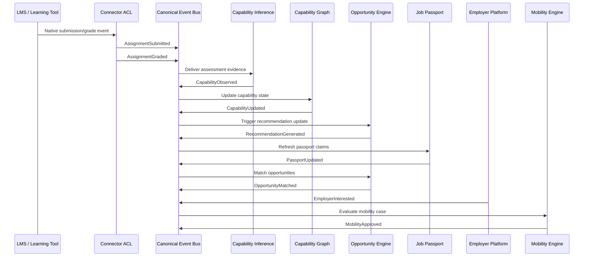

### 7.3 Causation and correlation rules

- `correlation_id` remains constant across a business workflow.
- `causation_id` points to the event that directly caused another event.
- `trace_id` follows runtime request/worker execution.
- Capability events must include evidence event IDs.
- Recommendation and passport events must include upstream capability event IDs or graph version references.

## 8. Canonical Event Mapping — LMS Platforms

Mapping is owned by the connector anti-corruption layer. Downstream systems never consume native LMS events.

### 8.1 Open edX mapping

| Native Open edX signal | Canonical event | Notes |
|---|---|---|
| enrollment created | `StudentEnrolled` | Map course run and learner IDs |
| course published/imported | `CourseCreated` / `CourseUpdated` | Studio metadata to course projection |
| sequential/vertical completed | `ModuleCompleted` | Normalize block IDs |
| page/block viewed | `LessonViewed` | High-volume analytics event |
| problem_check | `QuizCompleted` or `AssessmentSubmitted` | Depends on assessment type |
| submission_created | `AssignmentSubmitted` | Artifact refs required |
| score_changed / grade updated | `AssignmentGraded` | Include rubric if available |
| discussion post/reply | `DiscussionParticipated` | Content stored by reference |
| certificate generated | `CredentialIssued` candidate | Verified by Credential Ledger before `CredentialVerified` |
| team activity | `ProjectStarted` / `ProjectCompleted` | Requires project mapping |

### 8.2 Canvas mapping

| Native Canvas signal | Canonical event | Notes |
|---|---|---|
| user/account created | `IdentityCreated` candidate or `StudentCreated` via Identity | Identity remains Syrka-owned |
| enrollment_created | `StudentEnrolled` | Section/course mapped |
| course_created | `CourseCreated` | Canvas course ID mapped |
| module_item_completed | `ModuleCompleted` | Module progress |
| page_view | `LessonViewed` | High-volume compactable |
| assignment_created | `CourseUpdated` or curriculum event | Assignment entity projection |
| submission_created | `AssignmentSubmitted` | Submission artifact refs |
| submission_graded | `AssignmentGraded` | Grade/rubric/feedback |
| quiz_submission_created | `QuizStarted` | Attempt begins |
| quiz_submission_completed | `QuizCompleted` | Attempt completes |
| discussion_entry_created | `DiscussionParticipated` | Post/reply action |

### 8.3 Moodle mapping

| Native Moodle signal | Canonical event | Notes |
|---|---|---|
| user_created | `IdentityCreated` candidate | Prefer Syrka Identity as source |
| role_assigned | `RoleAssigned` candidate | Tenant scoped |
| user_enrolment_created | `StudentEnrolled` | Map enrolment plugin source |
| course_created | `CourseCreated` | Moodle course ID mapped |
| course_module_completion_updated | `ModuleCompleted` | Activity completion |
| course_viewed | `LessonViewed` | Context determines resource |
| mod_assign_submission_created | `AssignmentSubmitted` | Normalize files/text |
| assign_submission_graded | `AssignmentGraded` | Gradebook mapping |
| mod_quiz_attempt_started | `QuizStarted` | Attempt ID required |
| mod_quiz_attempt_submitted | `QuizCompleted` | Score may arrive separately |
| mod_forum_post_created | `DiscussionParticipated` | Content by reference |

### 8.4 Sakai mapping

| Native Sakai signal | Canonical event | Notes |
|---|---|---|
| site membership added | `StudentEnrolled` | Site/course mapping |
| content resource viewed | `LessonViewed` | Resource ID mapped |
| assignment submission | `AssignmentSubmitted` | Submission refs |
| assignment grade released | `AssignmentGraded` | Gradebook integration |
| assessment started | `QuizStarted` | Samigo/tests mapping |
| assessment submitted | `QuizCompleted` | Scores normalized |
| forum message created | `DiscussionParticipated` | Topic/reply action |
| calendar/attendance event | `AttendanceRecorded` | Tool-specific mapping |

### 8.5 Chamilo mapping

| Native Chamilo signal | Canonical event | Notes |
|---|---|---|
| course subscription | `StudentEnrolled` | User/course mapped |
| learning path item completed | `ModuleCompleted` | Learning path normalized |
| document viewed/downloaded | `LessonViewed` / `ContentDownloaded` | Content type determines event |
| assignment submitted | `AssignmentSubmitted` | Artifact refs |
| exercise attempt started | `QuizStarted` | Attempt ID synthesized if needed |
| exercise completed | `QuizCompleted` | Score normalized |
| forum post created | `DiscussionParticipated` | Content by reference |
| attendance entry | `AttendanceRecorded` | Status normalized |

### 8.6 ILIAS mapping

| Native ILIAS signal | Canonical event | Notes |
|---|---|---|
| course membership assigned | `StudentEnrolled` | Role and object mapping |
| learning module progress | `ModuleCompleted` | Repository object mapped |
| content object viewed | `LessonViewed` | High-volume analytics |
| exercise submitted | `AssignmentSubmitted` | File/text refs |
| exercise graded | `AssignmentGraded` | Feedback/grade normalized |
| test started | `QuizStarted` | Test attempt ID |
| test finished | `QuizCompleted` | Score normalized |
| forum posting created | `DiscussionParticipated` | Content reference |

### 8.7 Future LMS mapping contract

Any future LMS must implement:

1. Identity mapping to Syrka canonical identities.
2. Course/resource mapping registry.
3. Enrollment event production.
4. Learning activity event production.
5. Assessment/submission/grade event production.
6. Evidence artifact reference export.
7. Connector provenance and idempotency keys.
8. Replay/backfill support.
9. DLQ and monitoring hooks.
10. Versioned adapter contract tests.

## 9. External Connector Events

### 9.1 GitHub

| GitHub signal | Canonical event | Required normalization |
|---|---|---|
| OAuth app installed/link approved | `GitHubRepositoryLinked` | consent, owner proof, repo identity |
| push/commit webhook | `CommitObserved` | author mapping, SHA, files/languages |
| pull_request closed+merged | `PullRequestMerged` | PR ID, reviewers, checks |
| pull_request_review submitted | `CodeReviewCompleted` | reviewer, outcome, comments ref |
| workflow_run completed | `ProjectCompleted` or quality signal | checks/tests as evidence |

### 9.2 LinkedIn

| LinkedIn/export signal | Canonical event | Required normalization |
|---|---|---|
| profile linked | `LinkedInProfileLinked` | consent, profile proof |
| experience imported | `ProfessionalExperienceObserved` | role, organization, dates |
| certification imported | `CredentialIssued` candidate | verified later by Credential Ledger |
| skill/endorsement imported | `SkillObserved` candidate | low confidence unless verified |

### 9.3 ORCID

| ORCID signal | Canonical event | Required normalization |
|---|---|---|
| ORCID linked | `ProfessionalExperienceObserved` or identity link event | researcher identity proof |
| work added | `ResearchPublished` | DOI/source mapping |
| affiliation added | `ProfessionalExperienceObserved` | institution mapping |

### 9.4 OpenAlex and Semantic Scholar

| Source signal | Canonical event | Required normalization |
|---|---|---|
| work discovered | `ResearchPublished` | DOI/OpenAlex/S2 IDs, authors |
| citation update | `MarketSignalObserved` or research metric projection | citations are signals, not capability facts |
| topic classification | `ResearchCapabilityMapped` | ontology version/model provenance |
| collaboration pattern | `RecommendationGenerated` candidate | research collaboration suggestions |

### 9.5 Employer APIs

| Employer API signal | Canonical event | Required normalization |
|---|---|---|
| job created | `JobPosted` | occupation/skill mapping |
| job updated/closed | `JobUpdated` | status, dates |
| candidate shortlisted | `EmployerInterested` | consent/disclosure validation |
| hire/feedback submitted | `OpportunityAccepted` or hiring feedback event | outcome and feedback refs |

### 9.6 Government APIs

| Government signal | Canonical event | Required normalization |
|---|---|---|
| strategy document published | `NationalPriorityMapped` after parsing | source document and policy refs |
| priority sector updated | `NationalPriorityMapped` | sector/occupation/capability mapping |
| workforce target changed | `MarketSignalObserved` / government event | country/jurisdiction metadata |
| mobility rule changed | mobility rule event | legal/policy source required |

### 9.7 Future connectors

Future connectors must publish only canonical events, pass contract tests, support consent enforcement, provide provenance, and include replay/backfill tooling before production approval.

## 10. Event Bus Architecture

### 10.1 Broker choice

The architecture is broker-agnostic. Recommended progression:

1. **Early stage:** managed Postgres/Supabase queues or a managed message broker for simplicity.
2. **Scale stage:** Kafka-compatible broker or NATS JetStream for durable streams, partitions, replay, and consumer groups.
3. **Enterprise stage:** multi-region Kafka-compatible event platform with schema registry, tiered storage, and strict governance.

### 10.2 Topic design

Topic names use lowercase dotted domains:

```text
syrka.identity.v1
syrka.learning.v1
syrka.assessment.v1
syrka.collaboration.v1
syrka.research.v1
syrka.engineering_evidence.v1
syrka.ontology.v1
syrka.capability.v1
syrka.career.v1
syrka.market.v1
syrka.government.v1
syrka.portfolio.v1
syrka.passport.v1
syrka.credential.v1
syrka.employer.v1
syrka.mobility.v1
syrka.corridor.v1
syrka.analytics.v1
syrka.ai.v1
syrka.recommendation.v1
syrka.notification.v1
syrka.audit.v1
syrka.system.v1
```

### 10.3 Queues and consumers

- Consumers belong to named consumer groups.
- Each bounded context owns its consumer group names.
- Retry queues are per topic or per consumer group.
- DLQs preserve original event, error metadata, consumer, attempt count, and last exception class.

### 10.4 Partitions and ordering

Partition by stable business key, not random event ID. Partition keys are defined in section 5.6. Global ordering is not guaranteed and must not be required.

### 10.5 Delivery semantics

Syrka uses **at-least-once delivery** with idempotent producers and consumers. Exactly-once end-to-end delivery is not assumed. Exactly-once-like behavior is implemented through idempotency keys, transactional outbox, consumer checkpoints, and deterministic projections.

### 10.6 Retry and back-pressure

- Use exponential backoff with jitter.
- Use bounded retries before DLQ.
- Consumers must expose lag metrics.
- Producers must support back-pressure and circuit breakers.
- High-volume analytics events may be sampled only if explicitly declared and not used as durable evidence.

### 10.7 Throughput and horizontal scaling

- Partition counts scale by tenant/institution volume.
- Consumers scale horizontally within consumer groups.
- Heavy AI consumers should decouple event ingestion from model execution with work queues.
- Batch replays should use isolated consumer groups to avoid starving live processing.

### 10.8 Observability

Required metrics:

- event publish rate
- publish latency
- validation failures
- consumer lag
- retry count
- DLQ volume
- replay throughput
- schema rejection count
- partition skew
- end-to-end workflow latency
- PII/security policy violations

## 11. Event Store

### 11.1 Purpose

The event store is the immutable source of canonical business facts. It must support audit, replay, projection rebuilds, compliance review, model reproducibility, and disaster recovery.

### 11.2 Storage model

Recommended layers:

1. **Hot stream store:** broker retention for recent operational replay.
2. **Canonical event lake:** append-only object storage partitioned by date/topic/tenant/country.
3. **Event index:** PostgreSQL index of event metadata for discovery and audit.
4. **Schema registry:** versioned schema definitions and compatibility metadata.

### 11.3 Retention

| Retention class | Default period | Examples |
|---|---:|---|
| short | 30–90 days | dashboard views, transient notifications |
| standard | 1–3 years | content views, sessions |
| long | 7–10 years | learning evidence, analytics decisions |
| permanent | indefinite unless law requires deletion/anonymization | credentials, passports, audit facts |
| jurisdictional | policy-specific | consent, minors, country-specific education records |

### 11.4 Snapshots and compaction

- Snapshots speed up replay for large aggregates such as capability graph and passport state.
- Snapshots are derived and replaceable, not sources of truth.
- Compactable events must be explicitly marked; evidence events are not compacted away from the canonical event lake.

### 11.5 Archiving

Cold events move to lower-cost storage with searchable metadata indexes. Archive format must remain open and documented: JSON Lines or Parquet with schema version metadata.

### 11.6 Disaster recovery and multi-region

- Event lake replicated across regions according to customer/jurisdiction policy.
- Recovery point objective target: <= 15 minutes for canonical events.
- Recovery time objective target: <= 4 hours for event ingestion core.
- Multi-region active-active requires deterministic event IDs and regional conflict policy.

## 12. Read Models

### 12.1 Projection construction

Projections are built by consumers that subscribe to canonical events and write domain-owned read models. Projection code must be deterministic, idempotent, observable, and replayable.

### 12.2 Dashboards

Dashboards consume read models from Graph, Analytics, Opportunity, Passport, and Institutional Analytics. Dashboard services must not recompute facts from raw LMS tables.

### 12.3 Analytics

Analytics projections aggregate learning events by learner, cohort, course, institution, capability, time window, and jurisdiction. Aggregates retain pointers to source event IDs.

### 12.4 Job Passport

The Job Passport is built from `CapabilityUpdated`, `CredentialVerified`, `CareerIntentUpdated`, and selected portfolio/public-profile events. Passport versions include claim references and provenance.

### 12.5 Capability Graph

The graph updates from `CapabilityObserved`, `CapabilityUpdated`, `CredentialVerified`, `ResearchCapabilityMapped`, `CodeCapabilityEvidenceObserved`-style events, and ontology version events. Every edge references evidence events.

### 12.6 AI projections

AI services may consume vectorized evidence projections, graph neighborhoods, and feature stores, but model outputs must reference original canonical event IDs.

## 13. AI Integration

### 13.1 AI processing pipeline

```text
AssignmentSubmitted
  ↓
Evidence Extraction
  ↓
Ontology Mapping
  ↓
Capability Inference
  ↓
Confidence Scoring
  ↓
Human Review when required
  ↓
CapabilityObserved
  ↓
CapabilityUpdated
  ↓
Career Intelligence
  ↓
RecommendationGenerated
  ↓
PassportUpdated
```

### 13.2 Stages

1. **Evidence extraction.** Extract text, metadata, rubric scores, code metrics, citations, or artifacts from evidence references.
2. **Normalization.** Convert raw evidence into feature records with source event IDs.
3. **Ontology mapping.** Match evidence to skills, knowledge, occupations, and capabilities using ontology version metadata.
4. **Retrieval.** Pull relevant graph context, prior evidence, rubric definitions, and market signals.
5. **Inference.** Apply deterministic rules, statistical models, and LLM reasoning through provider adapters.
6. **Confidence scoring.** Combine evidence quality, recency, difficulty, assessor trust, model uncertainty, and corroboration.
7. **Explainability.** Generate evidence-linked explanations and limitations.
8. **Policy and bias checks.** Apply fairness, safety, and high-impact decision gates.
9. **Publication.** Publish `CapabilityObserved`, `RecommendationGenerated`, or review events.
10. **Feedback loop.** Consume user/faculty/employer feedback as new events.

### 13.3 AI-provider independence

AI providers are adapters. Canonical events must not include provider-specific opaque structures as required fields. Provider outputs are stored with model name, version, prompt/template ID, evaluation version, and evidence references.

## 14. Security Model

### 14.1 Encryption

- Transport encryption is mandatory for all producers, brokers, consumers, and storage.
- Sensitive event lake partitions are encrypted at rest.
- Highly restricted evidence artifacts use object-level encryption where supported.

### 14.2 Signing and verification

- Producers sign events or publish through infrastructure that signs accepted events.
- Consumers verify event signatures for high-impact domains.
- Key rotation is mandatory and tracked by `key_id`.

### 14.3 Replay protection

- Event IDs and idempotency keys prevent duplicate acceptance.
- Replay jobs use new replay metadata; they do not mint new business event IDs.
- Consumers distinguish live delivery from replay context.

### 14.4 Tamper detection

- Event lake objects include hashes/manifests.
- Append-only storage and audit logs detect unauthorized mutation.
- Credential/passport events may be anchored in external verification systems where required.

### 14.5 Authorization and multi-tenancy

- Producers require domain-specific publish scopes.
- Consumers require domain-specific subscribe scopes.
- Tenant boundaries are enforced at broker, consumer, projection, and API layers.
- Cross-tenant aggregation requires explicit policy and anonymization.

### 14.6 Audit and compliance

Every sensitive event access emits `DataAccessed` or equivalent audit records. Security policies must support FERPA, GDPR, local education regulations, labour-market privacy, credential law, and government data-sharing agreements.

## 15. Privacy Model

### 15.1 Consent

Consent is evented. `ConsentGranted` and `ConsentRevoked` determine whether connectors, public profiles, employer sharing, and professional data processing are allowed.

### 15.2 GDPR compatibility

- Data minimization is mandatory.
- Processing basis is recorded in the privacy block.
- Right to access is served through projections and event index search.
- Right to deletion is implemented through deletion/anonymization workflows where legally allowed; immutable event history may be cryptographically tombstoned or anonymized according to policy.

### 15.3 FERPA compatibility

- Education records are restricted or highly restricted.
- Access requires legitimate educational interest or explicit consent.
- Disclosure to employers/governments requires purpose, consent, and audit.

### 15.4 Jurisdiction overlays

Jurisdiction-specific policies may override retention, processing basis, data residency, cross-border transfer, and minor-student rules. The event envelope carries jurisdiction metadata.

### 15.5 Sensitive and public events

Sensitive events include grades, submissions, capability inferences, passports, credentials, mobility decisions, consent, identity federation, and employer interest. Public events are rare and normally represent user-published profile updates or public research metadata.

## 16. Event Versioning

### 16.1 Schema evolution

- Minor versions may add optional fields.
- Patch versions clarify validation without changing compatible structure.
- Major versions introduce breaking changes.
- Field removal is breaking.
- Semantic meaning changes are breaking even if JSON shape is unchanged.

### 16.2 Backward compatibility

Consumers must ignore unknown optional fields. Producers must continue publishing previous major versions during migration windows.

### 16.3 Breaking changes

Breaking changes require:

1. Schema proposal.
2. Impact analysis.
3. Approval by event governance board and affected domain owners.
4. Dual-publish or transform plan.
5. Replay/backfill plan.
6. Deprecation date.
7. ADR if the meaning or ownership changes.

### 16.4 Deprecation

Deprecated events remain documented. Producers stop publishing only after all consumers migrate and replay strategy is validated.

## 17. Performance Targets

Initial targets are planning estimates and must be validated during load testing.

| Scale stage | Institutions | Learners | Peak events/sec | P95 publish-to-consume latency | Replay target |
|---|---:|---:|---:|---:|---|
| Pilot | 1–5 | 1k–25k | 100–500 | < 5s | 1 day in < 1 hour |
| Regional | 10–100 | 25k–1M | 1k–10k | < 10s | 30 days in < 8 hours |
| National | 100–1k | 1M–20M | 10k–100k | < 30s | 90 days in < 24 hours |
| Multi-country | 1k+ | 20M+ | 100k+ | < 60s by priority class | partitioned replay by tenant/country |

Storage growth estimate:

- Average envelope event: 2–8 KB excluding artifacts.
- High-volume view/session events dominate count.
- Evidence artifacts stored separately in object storage.
- Event lake should plan for TB-scale at national stage and PB-scale at multi-country stage.

Scaling strategy:

- Partition by tenant, subject, capability, or geography.
- Separate high-volume analytics topics from durable evidence topics.
- Use tiered storage for older events.
- Use read-model rebuild clusters for replay.
- Isolate AI processing queues to protect core ingestion.

## 18. Testing Strategy

| Test type | Purpose | Required coverage |
|---|---|---|
| Unit tests | Validate mappers, schema validators, idempotency code | every producer/consumer |
| Integration tests | Validate publish/consume with broker and store | every event family |
| Contract tests | Ensure producers and consumers obey schemas | every schema version |
| Replay tests | Rebuild projections from event history | graph, passport, dashboards, analytics |
| Chaos tests | Validate broker/consumer failure behavior | critical consumers |
| Load tests | Validate throughput, lag, back-pressure | scale milestones |
| Failure injection | Validate retries, DLQ, poison events | connectors and AI consumers |
| Schema validation tests | Reject invalid event payloads | CI and runtime |
| Consumer validation tests | Ensure idempotent/ordered behavior | all stateful consumers |
| Privacy/security tests | Validate classification, consent, scopes | sensitive events |

Minimum CI requirements for event producers:

1. Schema validation passes.
2. Example payloads validate.
3. Idempotency key test passes.
4. Contract tests pass against latest and supported previous schemas.
5. No forbidden fields/secrets in payload.
6. Privacy classification present.

## 19. Governance

### 19.1 Ownership

The Platform/Event Infrastructure Team owns the envelope, broker standards, schema registry, event store, and governance workflow. Each bounded context owns schemas for its event types.

### 19.2 Approval process

Event schema changes require:

1. Domain owner approval.
2. Platform/Event review.
3. Security/privacy review for restricted/highly restricted events.
4. AI review if events feed high-impact models.
5. Documentation update in CEA or schema registry.
6. Migration/replay plan for changes affecting existing consumers.

### 19.3 Breaking changes

Breaking changes require architecture review and, when domain ownership or semantic meaning changes, a new ADR.

### 19.4 Deprecation handling

Deprecated events are marked in the registry with replacement event, last producer date, consumer migration status, and replay transform guidance.

### 19.5 ADR governance

CEA-001 is the constitutional event specification. Future changes that alter fundamental principles—immutability, canonical envelope, LMS independence, ownership, privacy, or replayability—must update or supersede this document through a new accepted ADR/CEA.

## 20. Event Naming Convention

### 20.1 Mandatory rules

- Use PascalCase.
- Use past-tense facts.
- Use business language, not technical implementation language.
- Avoid source-system names.
- Avoid version numbers in names.
- Avoid vague words like `Thing`, `Data`, `Event`, `Foo`, `Test`.
- Name the business outcome, not the command.

### 20.2 Good names

- `AssignmentSubmitted`
- `AssignmentGraded`
- `CapabilityObserved`
- `CapabilityUpdated`
- `ResearchPublished`
- `CredentialVerified`
- `PassportIssued`
- `MobilityApproved`

### 20.3 Forbidden names

- `assignment_complete_v2`
- `foo_event`
- `test123`
- `openedx_problem_check`
- `canvas_submission_created`
- `doRecommendation`
- `UpdatePassportCommand`

### 20.4 Naming pattern

```text
<Noun><PastTenseVerb>
```

Examples:

```text
AssignmentSubmitted
QuizCompleted
GitHubRepositoryLinked
CareerIntentUpdated
OpportunityMatched
```

## 21. Mermaid Diagrams

### 21.1 Event Taxonomy

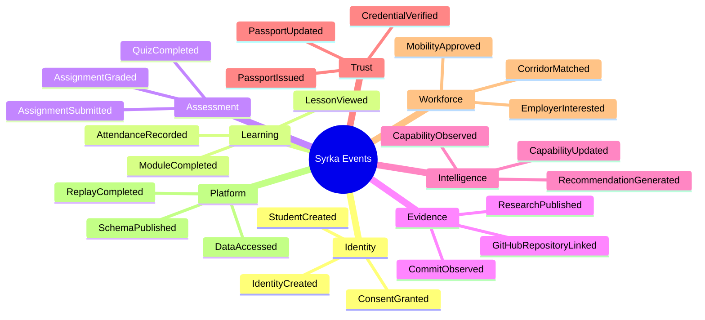

### 21.2 Event Lifecycle

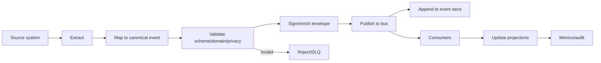

### 21.3 Event Flow

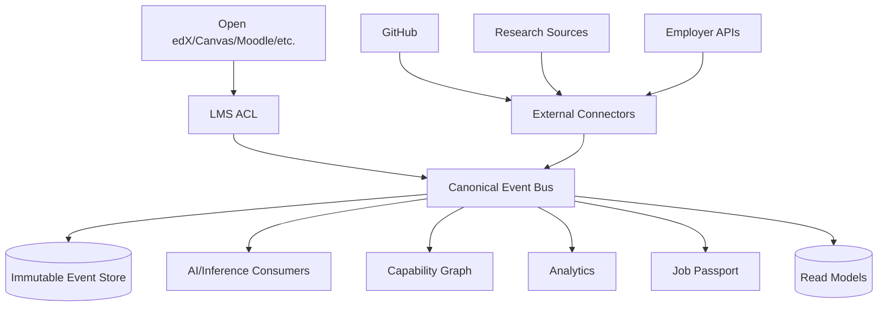

### 21.4 Event Bus

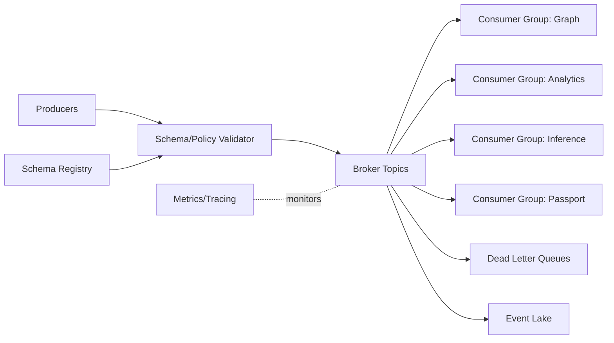

### 21.5 Replay Process

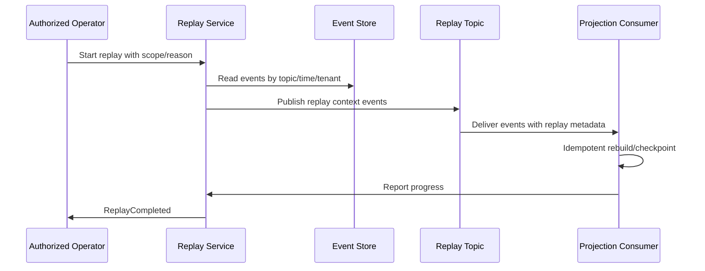

### 21.6 Event Store

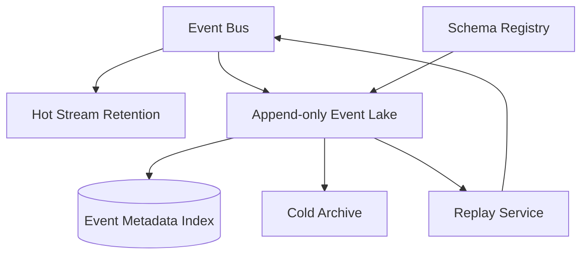

### 21.7 AI Processing Pipeline

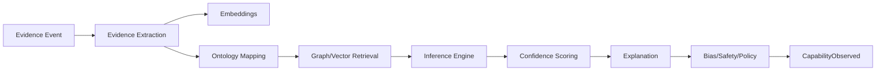

### 21.8 Connector Architecture

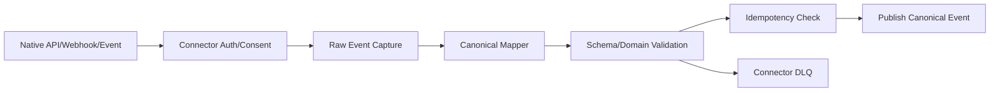

### 21.9 Projection Architecture

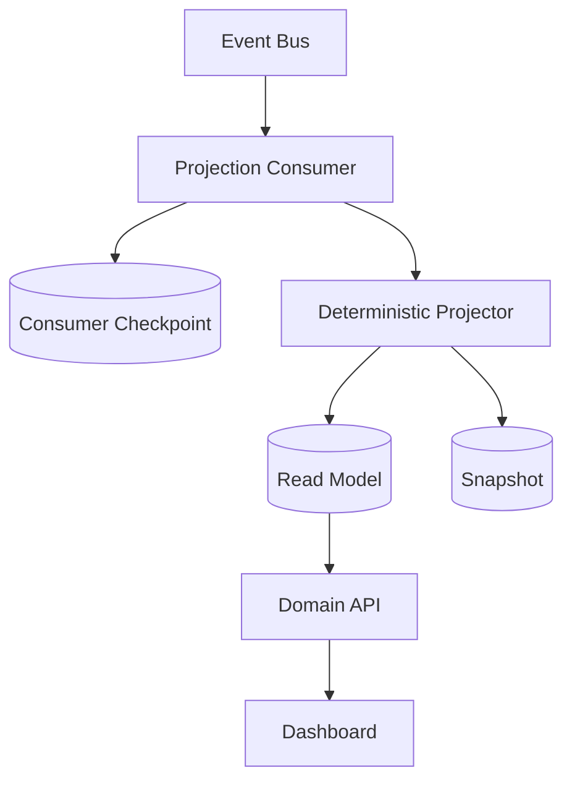

### 21.10 Job Passport Update Flow

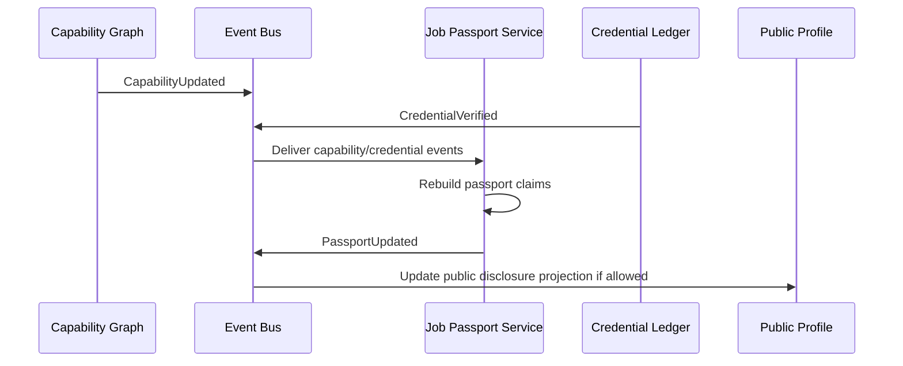

## 22. Appendices

### Appendix A — Event-specific JSON Schema example: AssignmentSubmitted

```json
{
  "$schema": "https://json-schema.org/draft/2020-12/schema",
  "$id": "https://schemas.syrka.ai/events/AssignmentSubmitted/1.0.0",
  "allOf": [
    { "$ref": "https://schemas.syrka.ai/events/envelope/1.0.0" },
    {
      "type": "object",
      "properties": {
        "event_type": { "const": "AssignmentSubmitted" },
        "payload": {
          "type": "object",
          "required": ["submission_id", "assignment_id", "course_id", "submitted_at"],
          "properties": {
            "submission_id": { "type": "string" },
            "assignment_id": { "type": "string" },
            "course_id": { "type": "string" },
            "attempt_number": { "type": "integer", "minimum": 1 },
            "submitted_at": { "type": "string", "format": "date-time" },
            "artifact_count": { "type": "integer", "minimum": 0 }
          },
          "additionalProperties": false
        }
      }
    }
  ]
}
```

### Appendix B — Example event stream

```text
01 StudentCreated
02 StudentEnrolled
03 LessonViewed
04 AssignmentOpened
05 AssignmentSubmitted
06 AssignmentGraded
07 CapabilityObserved
08 CapabilityUpdated
09 RecommendationGenerated
10 PassportUpdated
11 OpportunityMatched
12 EmployerInterested
13 MobilityApproved
```

### Appendix C — Example replay request

```json
{
  "replay_id": "replay_2026_07_07_001",
  "requested_by": "platform_admin_001",
  "reason": "Rebuild capability graph after ontology version 2.1.0",
  "scope": {
    "tenant_id": "tenant_sa_001",
    "topics": ["syrka.assessment.v1", "syrka.capability.v1"],
    "from": "2026-01-01T00:00:00Z",
    "to": "2026-07-07T00:00:00Z"
  },
  "target_consumer_group": "capability-graph-replay",
  "dry_run": false
}
```

### Appendix D — Example audit log

```json
{
  "audit_id": "audit_001",
  "event_id": "01JZCEA000000000000000001",
  "action": "event_consumed",
  "consumer": "capability-inference",
  "actor": "svc_capability_inference",
  "purpose": "capability_inference",
  "occurred_at": "2026-07-07T10:15:05Z",
  "authorization_decision": "allow",
  "policy_version": "policy@2026.07"
}
```

### Appendix E — Example dead letter queue record

```json
{
  "dlq_id": "dlq_001",
  "event_id": "01JZCEA000000000000000001",
  "consumer": "capability-inference",
  "topic": "syrka.assessment.v1",
  "attempts": 5,
  "first_failed_at": "2026-07-07T10:15:06Z",
  "last_failed_at": "2026-07-07T10:22:30Z",
  "error_code": "ONTOLOGY_TERM_NOT_FOUND",
  "error_message": "Capability mapping references ontology term unavailable in version 2.1.0",
  "payload_ref": "s3://syrka-dlq/2026/07/07/dlq_001.json",
  "replay_eligible": true
}
```

### Appendix F — Example producer pseudocode

```ts
const event = buildCanonicalEvent({
  eventType: "AssignmentSubmitted",
  version: "1.0.0",
  sourceSystem: "openedx",
  producer: "learning-management-adapter",
  actor: { type: "student", id: studentId },
  subject: { type: "student", id: studentId },
  resource: { type: "assignment", id: assignmentId },
  payload: { submission_id, assignment_id, course_id, submitted_at },
  provenance: { source_event_type: "submission_created", transformer: "openedx-mapper", transformer_version: "1.4.0" },
  idempotencyKey: `openedx:${sourceSubmissionId}:AssignmentSubmitted:1.0.0`
});
await validateAndPublish(event);
```

### Appendix G — Example consumer pseudocode

```ts
for await (const event of consumer.subscribe("syrka.assessment.v1")) {
  if (await alreadyProcessed(event.idempotency_key, consumer.name)) continue;
  await db.transaction(async tx => {
    await applyProjection(tx, event);
    await recordCheckpoint(tx, event.event_id, event.idempotency_key);
  });
  await consumer.ack(event);
}
```

### Appendix H — Event mapping table summary

| Source family | Native language | Syrka canonical language |
|---|---|---|
| Open edX | problem_check, score_changed, submission_created | `QuizCompleted`, `AssignmentGraded`, `AssignmentSubmitted` |
| Canvas | submission_created, quiz_submission_completed | `AssignmentSubmitted`, `QuizCompleted` |
| Moodle | mod_assign_submission_created, mod_quiz_attempt_submitted | `AssignmentSubmitted`, `QuizCompleted` |
| Sakai | assignment submission, assessment submitted | `AssignmentSubmitted`, `QuizCompleted` |
| Chamilo | assignment submitted, exercise completed | `AssignmentSubmitted`, `QuizCompleted` |
| ILIAS | exercise submitted, test finished | `AssignmentSubmitted`, `QuizCompleted` |
| GitHub | push, pull_request, workflow_run | `CommitObserved`, `PullRequestMerged`, `ProjectCompleted` |
| LinkedIn | profile/experience/certification import | `LinkedInProfileLinked`, `ProfessionalExperienceObserved`, `CredentialIssued` candidate |
| Research | works, citations, topics | `ResearchPublished`, `ResearchCapabilityMapped` |
| Employer | job, interest, hiring feedback | `JobPosted`, `EmployerInterested`, `OpportunityAccepted` |

## 23. Final Decision

CEA-001 establishes canonical events as the permanent language of Syrka. Every service, connector, AI model, dashboard, database projection, API, and future LMS integration must produce or consume canonical events rather than relying on platform-specific schemas.

The architecture guarantees that any LMS can be replaced without changing Syrka's intelligence layer; every AI capability operates on canonical, provenance-rich evidence; every event is auditable, explainable, replayable, secure, and versioned; and Syrka's strategic intellectual property remains independent of Open edX or any other external platform.
