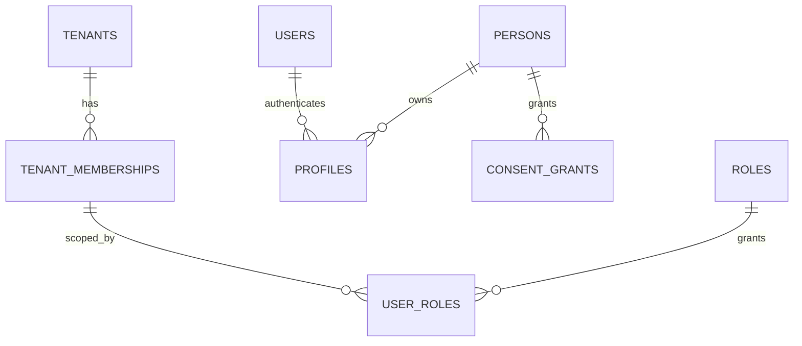
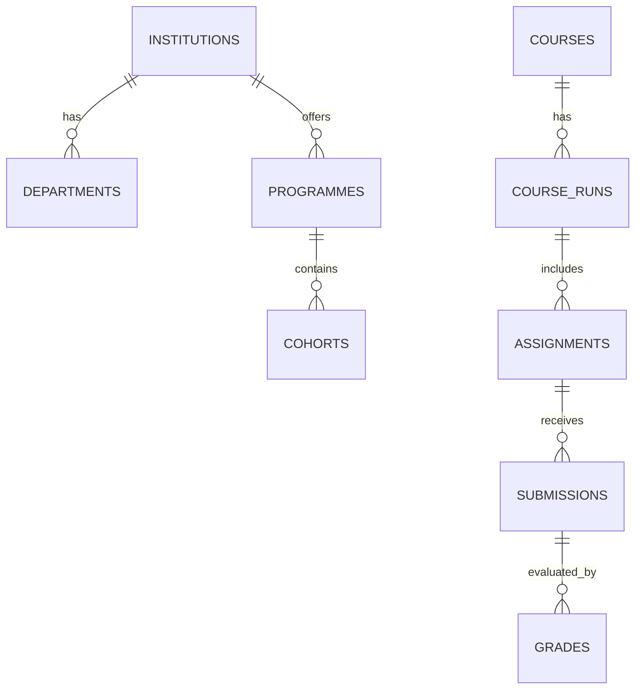
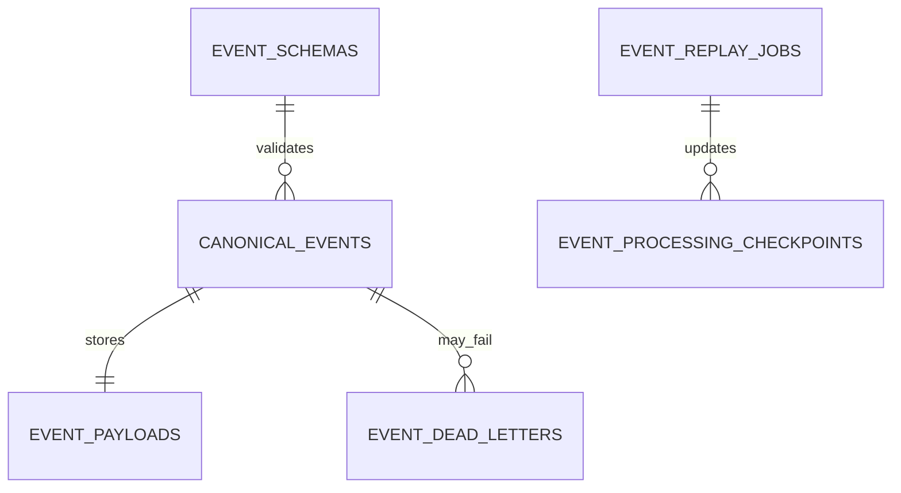
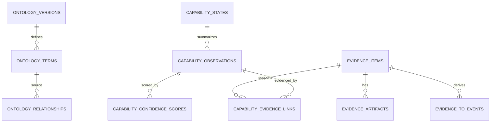
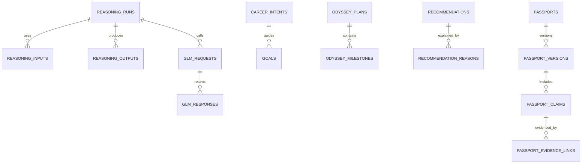
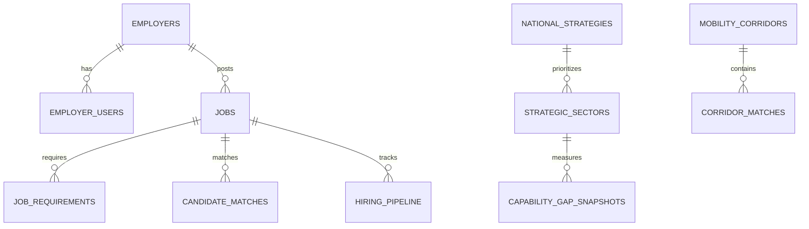

# DB-001 — Syrka Supabase MVP Database Architecture

Status: Implementation Specification  
Version: 1.0  
Date: 2026-07-08  
Builds upon: Product Suite; ADR-001; ADR-002; CEA-001; ONT-001; GRAPH-001; REASON-001; INF-001; UX-001  
Decision owners: Database Architecture / Supabase Engineering / Backend Architecture / Security / Platform Engineering  
Scope: Supabase PostgreSQL schemas, tables, RLS, storage buckets, event store, projections, seed data, migrations, implementation order, and future extraction boundaries for Syrka MVP

## 1. Executive Overview

Supabase PostgreSQL is Syrka's MVP operational backend. It stores the first production-grade implementation of identity profiles, tenants, institutions, learning projections, canonical events, ontology terms, evidence, capability observations, recommendations, Odyssey plans, Job Passport records, employer workflows, faculty dashboards, government aggregates, integration mappings, storage metadata, and audit logs.

Supabase is the MVP system of record for operational product data, not the permanent replacement for specialized graph, vector, event-store, warehouse, credential-ledger, or object-storage systems. The schema must therefore be practical enough for Claude Sonnet and backend engineers to implement quickly while preserving clean extraction paths.

| Data/system | In Supabase MVP now | Future extraction path |
|---|---|---|
| Authentication | Supabase Auth + identity schemas | optional enterprise identity broker, still synchronized to identity projections |
| Operational profiles/tenants | PostgreSQL schemas | remains relational source of truth |
| Canonical events | PostgreSQL append-only MVP event store | Kafka/NATS + event lake + schema registry |
| Ontology | relational tables | RDF/OWL store + graph semantic layer |
| Human Capability Graph | relational graph-like projections | Neo4j/property graph + RDF layer |
| Evidence metadata | PostgreSQL | stays relational; artifacts in object storage; embeddings in vector DB |
| AI embeddings | pgvector optional | dedicated vector database |
| Analytics | materialized views/tables | warehouse/lakehouse |
| Credential ledger | passport/credential tables | dedicated verifiable credential ledger |
| Files/artifacts | Supabase Storage metadata | object storage with scanning/lifecycle policies |

Avoid overengineering by building only MVP-required tables and projections first, but avoid lock-in by using canonical IDs, canonical events, source mappings, ontology term IDs, evidence provenance, RLS, and append-only logs from day one.

## 2. Database Architecture Principles

1. **MVP-first but future-compatible.** Build operational tables that support product workflows now and can be extracted into graph/vector/event systems later.
2. **Strict tenant isolation.** Tenant-scoped rows include `tenant_id`; RLS policies enforce tenant access.
3. **RLS by default.** All non-public tables enable Row Level Security before production.
4. **Canonical IDs.** Use Syrka UUIDs/ULIDs as canonical IDs; LMS-native IDs remain mapping fields.
5. **Event-first architecture.** Important state changes publish and/or derive from canonical events.
6. **Auditability.** Sensitive reads/writes create audit records.
7. **Evidence provenance.** Evidence rows link to canonical events, source systems, artifacts, and ontology terms.
8. **Soft deletion where required.** Use `deleted_at`/`archived_at` for user-facing/domain objects; event logs remain immutable.
9. **Immutable event logs.** `events.canonical_events` is append-only; corrections are new events.
10. **Country/institution overlays.** Include `country_code`, `institution_id`, jurisdiction and overlay tables.
11. **Privacy-aware schema.** Include `privacy_classification`, `consent_basis`, `visibility`, and retention metadata.
12. **No direct LMS coupling.** Learning tables may project LMS data but never make LMS IDs canonical.
13. **No AI outputs without evidence/provenance.** Reasoning/AI tables store candidate outputs with source evidence and validation status.
14. **Server-only privileged access.** Service-role writes are isolated to backend workers/API routes.

## 3. Supabase Schema Organization

| Schema | Purpose | Owned tables | Access patterns | RLS strategy | Future migration path |
|---|---|---|---|---|---|
| `public` | Compatibility, public lookup views, generated API-safe views. | public views only | frontend read of safe data | expose only safe views | keep thin |
| `auth` | Supabase-managed authentication. | users, sessions | Supabase internal | managed | keep Supabase or identity broker sync |
| `identity` | Syrka identity, tenant, role, consent model. | profiles, persons, organizations, tenants, roles, consent | all apps | tenant/user scoped | remains relational core |
| `institutions` | Institution, programme, cohort, term, enrollments. | institutions, departments, programmes, cohorts | faculty/admin/student | tenant + institution scoped | remains relational + analytics exports |
| `learning` | MVP LMS projections/native learning records. | courses, modules, assignments, submissions | student/faculty | enrollment/faculty scoped | replaceable adapter projections |
| `events` | MVP canonical event store and processing. | canonical_events, schemas, checkpoints, DLQ | services, audits | service/admin mostly | move to broker/event lake |
| `ontology` | MVP ontology concepts and mappings. | ontology_terms, relationships, overlays | read-heavy | mostly read; admin write | RDF/graph semantic layer |
| `evidence` | Evidence metadata, artifacts, reviews, provenance. | evidence_items, artifacts, reviews | student/faculty/AI | owner/reviewer scoped | metadata stays, artifacts external |
| `capability` | Capability observations/states/confidence. | observations, states, dependencies | dashboards/passport | subject/role scoped | move to HCG property graph |
| `reasoning` | AI/reasoning runs, GLM requests, human review. | runs, inputs, outputs, prompts | AI services/admin/reviewers | service/reviewer scoped | model registry + eval platform |
| `recommendations` | Odyssey, recommendations, goals, matches. | intents, goals, odyssey, recs | student/advisor/employer | subject scoped | recommender service projections |
| `passport` | Job Passport and public profile. | passports, versions, claims, shares | student/employer/public | owner/share scoped | credential ledger/public profile service |
| `portfolio` | Portfolio pages/items/artifacts. | portfolios, sections, items | student/public share | owner/share scoped | portfolio service |
| `employer` | Employer, jobs, pipeline, matching. | employers, jobs, matches | employer/recruiter | employer tenant scoped | employer service |
| `faculty` | Faculty queues/interventions/curriculum mapping. | access, snapshots, reviews | faculty/admin | assigned-course scoped | academic service |
| `government` | Government/institution aggregate analytics. | strategies, signals, gaps, corridors | government/admin | aggregate only | warehouse/government platform |
| `integrations` | External connectors and source mappings. | connections, mappings, sync_jobs | service/admin/user consent | owner/service scoped | connector services |
| `audit` | Audit/access/security logs. | audit_logs, access_logs | security/admin | append-only/admin | SIEM/export |
| `storage_meta` | File metadata for Supabase Storage. | storage_objects, scans | storage/API | owner/bucket scoped | object metadata service |

## 4. Core Identity Tables

### 4.1 Identity table definitions

| Table | Columns | PK / FKs | Indexes | RLS policy | Example query | Lifecycle events |
|---|---|---|---|---|---|---|
| `identity.profiles` | `user_id uuid`, `person_id uuid`, `display_name text`, `avatar_url text`, `country_code char(2)`, `locale text`, `timezone text`, `onboarding_status text`, `created_at timestamptz`, `updated_at timestamptz` | PK `user_id`; FK `auth.users(id)`, `identity.persons(id)` | `person_id`, `country_code` | user can read/update own profile; tenant admins read members | `select * from identity.profiles where user_id = auth.uid()` | `IdentityCreated`, `StudentUpdated` |
| `identity.persons` | `person_id uuid default gen_random_uuid()`, `tenant_id uuid`, `primary_user_id uuid`, `legal_name_encrypted text`, `preferred_name text`, `date_of_birth date`, `country_code char(2)`, `status text`, `created_at`, `updated_at`, `deleted_at` | PK `person_id`; FK tenant/user | `tenant_id`, `primary_user_id`, `(tenant_id,status)` | own person; faculty/employer via policy views only | join profile to person by user_id | `StudentCreated`, `PersonUpdated` |
| `identity.organizations` | `organization_id uuid`, `tenant_id uuid`, `type text`, `name text`, `country_code char(2)`, `verified boolean`, `metadata jsonb`, timestamps | PK; FK tenant | `(tenant_id,type)`, `country_code` | tenant members read; admins write | find employer/institution orgs | `OrganizationCreated` |
| `identity.tenants` | `tenant_id uuid`, `slug text`, `name text`, `type text`, `country_code char(2)`, `status text`, `settings jsonb`, timestamps | PK; unique slug | `slug`, `country_code` | members read; platform admins write | load tenant by slug | `TenantCreated` |
| `identity.tenant_memberships` | `membership_id uuid`, `tenant_id uuid`, `user_id uuid`, `person_id uuid`, `organization_id uuid`, `status text`, timestamps | PK; FK tenant/user/person/org | `(tenant_id,user_id) unique`, `person_id` | user reads own; tenant admin manages | list tenant members | `TenantMemberAdded` |
| `identity.roles` | `role_id uuid`, `tenant_id uuid null`, `code text`, `name text`, `description text`, `system_role boolean` | PK; unique `(tenant_id,code)` | `code` | readable to tenant; platform writes | map role codes | `RoleCreated` |
| `identity.permissions` | `permission_id uuid`, `code text`, `description text`, `resource text`, `action text` | PK; unique code | `(resource,action)` | readable to admins/services | permission catalog | `PermissionCreated` |
| `identity.user_roles` | `user_role_id uuid`, `tenant_id uuid`, `user_id uuid`, `role_id uuid`, `scope_type text`, `scope_id uuid`, `granted_by uuid`, `expires_at timestamptz`, timestamps | PK; FKs user/role | `(tenant_id,user_id)`, `(scope_type,scope_id)` | self reads own; admins manage; services evaluate | check faculty course role | `RoleAssigned`, `RoleRevoked` |
| `identity.consent_grants` | `consent_id uuid`, `tenant_id uuid`, `person_id uuid`, `consent_type text`, `scope jsonb`, `status text`, `granted_at`, `revoked_at`, `expires_at`, `policy_version text` | PK; FK person/tenant | `(person_id,consent_type,status)`, `expires_at` | person owns; services read active consents | active GitHub consent | `ConsentGranted`, `ConsentRevoked` |
| `identity.identity_links` | `link_id uuid`, `person_id uuid`, `provider text`, `external_subject_hash text`, `assurance_level text`, `linked_at`, `revoked_at` | PK; FK person; unique provider+subject | `person_id`, `(provider,external_subject_hash)` | person/admin scoped | find SSO identities | `FederationLinked` |
| `identity.service_accounts` | `service_account_id uuid`, `tenant_id uuid null`, `name text`, `service_code text`, `scopes text[]`, `active boolean`, `created_at`, `rotated_at` | PK | `service_code`, `tenant_id` | platform admins only; services by secret infra | event processor account | `ServiceAccountCreated` |

### 4.2 Identity SQL skeleton

```sql
create schema if not exists identity;
create table identity.tenants (
  tenant_id uuid primary key default gen_random_uuid(),
  slug text not null unique,
  name text not null,
  type text not null check (type in ('platform','institution','employer','government','demo')),
  country_code char(2),
  status text not null default 'active',
  settings jsonb not null default '{}',
  created_at timestamptz not null default now(),
  updated_at timestamptz not null default now()
);

alter table identity.tenants enable row level security;
```

## 5. Institution Tables

| Table | Purpose | Key columns | Relationships | RLS / access |
|---|---|---|---|---|
| `institutions.institutions` | canonical institution record | `institution_id`, `tenant_id`, `organization_id`, `name`, `country_code`, `type`, `verified`, `metadata` | tenant and organization | institution members read; admins manage |
| `institutions.departments` | academic units | `department_id`, `institution_id`, `name`, `code`, `parent_department_id` | institution hierarchy | institution scoped |
| `institutions.programmes` | degree/certificate pathways | `programme_id`, `institution_id`, `department_id`, `title`, `level`, `ontology_mapping jsonb` | departments, cohorts, courses | student/faculty/admin scoped |
| `institutions.cohorts` | learner groups | `cohort_id`, `programme_id`, `term_id`, `name`, `start_date`, `end_date` | programme/term | assigned faculty/admin/students |
| `institutions.academic_terms` | time periods | `term_id`, `institution_id`, `name`, `start_date`, `end_date` | institution | institution scoped |
| `institutions.faculty_assignments` | faculty-course/cohort access | `assignment_id`, `faculty_person_id`, `course_run_id`, `cohort_id`, `role` | learning course runs/cohorts | faculty sees assigned |
| `institutions.student_enrollments` | programme/cohort enrollment projection | `enrollment_id`, `student_person_id`, `programme_id`, `cohort_id`, `status` | persons/programmes/cohorts | student own; faculty assigned |

Institutions relate to tenants through `tenant_id`, to users through memberships/persons, to courses through `learning.course_runs.institution_id`, and to analytics through aggregate snapshots keyed by `institution_id`, `programme_id`, `cohort_id`, and `term_id`.

## 6. Learning MVP Tables

Learning tables are Syrka-native projections or connector projections. Canonical IDs are Syrka UUIDs. Source fields are references only.

| Table | Key columns | Mapping fields | Notes |
|---|---|---|---|
| `learning.courses` | `course_id uuid`, `tenant_id`, `institution_id`, `title`, `description`, `status`, `created_at` | `source_system`, `source_record_id`, `canonical_id`, `adapter_version` | course metadata projection |
| `learning.course_runs` | `course_run_id`, `course_id`, `term_id`, `start_at`, `end_at`, `status` | source fields | concrete offering |
| `learning.modules` | `module_id`, `course_id`, `title`, `sequence`, `status` | source fields | course structure |
| `learning.lessons` | `lesson_id`, `module_id`, `title`, `content_ref`, `sequence`, `estimated_minutes` | source fields | content projection |
| `learning.assignments` | `assignment_id`, `course_run_id`, `title`, `rubric jsonb`, `due_at`, `status` | source fields | task/assessment bridge |
| `learning.submissions` | `submission_id`, `assignment_id`, `student_person_id`, `submitted_at`, `artifact_refs jsonb`, `status` | source fields | evidence source |
| `learning.grades` | `grade_id`, `submission_id`, `score numeric`, `max_score numeric`, `rubric_scores jsonb`, `graded_by`, `graded_at` | source fields | assessment evidence |
| `learning.feedback` | `feedback_id`, `submission_id`, `author_person_id`, `feedback_ref`, `visibility`, `created_at` | source fields | may become evidence |
| `learning.discussions` | `discussion_id`, `course_run_id`, `participant_person_id`, `action`, `content_ref`, `occurred_at` | source fields | high privacy caution |
| `learning.attendance_records` | `attendance_id`, `course_run_id`, `student_person_id`, `status`, `recorded_at`, `method` | source fields | weak evidence |

Recommended composite index for every projected LMS table:

```sql
create unique index on learning.courses(source_system, source_record_id) where source_record_id is not null;
create index on learning.submissions(student_person_id, submitted_at desc);
create index on learning.grades(submission_id, graded_at desc);
```

## 7. Canonical Event Tables

### 7.1 Table design

| Table | Purpose | Key columns |
|---|---|---|
| `events.canonical_events` | append-only event metadata and searchable envelope | `event_id uuid`, `event_type text`, `event_version text`, `schema_version text`, `occurred_at`, `published_at`, `tenant_id`, `institution_id`, `country_code`, `source_system`, `producer`, `actor jsonb`, `subject jsonb`, `resource jsonb`, `evidence_refs jsonb`, `privacy jsonb`, `security jsonb`, `provenance jsonb`, `idempotency_key text`, `payload_hash text`, `partition_key text` |
| `events.event_payloads` | potentially large JSON payload split from metadata | `event_id`, `payload jsonb`, `created_at` |
| `events.event_schemas` | schema registry MVP | `schema_id`, `event_type`, `event_version`, `json_schema jsonb`, `status`, `published_at` |
| `events.event_processing_checkpoints` | consumer offsets/checkpoints | `consumer_name`, `topic`, `partition_key`, `last_event_id`, `last_occurred_at`, `updated_at` |
| `events.event_dead_letters` | failed consumer records | `dead_letter_id`, `event_id`, `consumer_name`, `error_code`, `error_message`, `payload_ref`, `attempts`, `replay_eligible` |
| `events.event_replay_jobs` | replay requests and status | `replay_id`, `requested_by`, `scope jsonb`, `status`, `started_at`, `completed_at`, `counts jsonb` |

### 7.2 Canonical event SQL skeleton

```sql
create schema if not exists events;
create table events.canonical_events (
  event_id uuid primary key default gen_random_uuid(),
  event_type text not null,
  event_version text not null,
  schema_version text not null,
  occurred_at timestamptz not null,
  published_at timestamptz not null default now(),
  tenant_id uuid,
  institution_id uuid,
  country_code char(2),
  source_system text not null,
  producer text not null,
  actor jsonb,
  subject jsonb,
  resource jsonb,
  evidence_refs jsonb not null default '[]',
  privacy jsonb not null,
  security jsonb not null default '{}',
  provenance jsonb not null,
  idempotency_key text not null unique,
  payload_hash text,
  partition_key text,
  created_at timestamptz not null default now()
);

create table events.event_payloads (
  event_id uuid primary key references events.canonical_events(event_id) on delete restrict,
  payload jsonb not null,
  created_at timestamptz not null default now()
);

create index canonical_events_type_time_idx on events.canonical_events(event_type, occurred_at desc);
create index canonical_events_tenant_time_idx on events.canonical_events(tenant_id, occurred_at desc);
create index canonical_events_source_idx on events.canonical_events(source_system, (provenance->>'source_record_id'));
```

### 7.3 Event rules

- **Immutability:** deny update/delete to application roles; corrections are new events.
- **Idempotency:** unique `idempotency_key` per producer/source fact.
- **Replay:** replay jobs read ordered events and write checkpoints.
- **Ordering:** use `partition_key`; no global ordering guarantee.
- **Partitioning:** start with indexes; later partition by month/tenant/event_type.
- **RLS:** users do not read raw events directly; service roles and audit/admin only; safe projections expose data.
- **Audit:** every replay/admin access is logged in `audit.audit_logs`.

## 8. Ontology Tables

| Table | Purpose | Key columns |
|---|---|---|
| `ontology.ontology_versions` | immutable ontology releases | `version text pk`, `status`, `published_at`, `notes`, `checksum` |
| `ontology.ontology_terms` | canonical concepts | `term_id text pk`, `version`, `term_type`, `label`, `definition`, `status`, `parent_term_id`, `synonyms text[]`, `deprecated_terms text[]`, `metadata jsonb` |
| `ontology.ontology_relationships` | semantic relationships | `relationship_id uuid`, `version`, `source_term_id`, `relationship_type`, `target_term_id`, `confidence`, `provenance jsonb`, `valid_from`, `valid_to` |
| `ontology.external_mappings` | ESCO/O*NET/SOC/etc. | `mapping_id`, `term_id`, `standard`, `external_id`, `relation`, `confidence`, `jurisdiction`, `provenance` |
| `ontology.jurisdiction_overlays` | country/regulatory overlays | `overlay_id`, `country_code`, `version`, `term_id`, `overlay_type`, `data jsonb` |
| `ontology.institution_overlays` | institution-specific mappings | `overlay_id`, `institution_id`, `version`, `term_id`, `data jsonb` |

Constraints:

- `ontology_terms.definition` is immutable within a published version.
- `relationship_type` must match ONT-001 allowed relationships.
- external mappings include exact/close/broader/narrower/related relation.

## 9. Evidence Tables

| Table | Purpose | Key columns / constraints |
|---|---|---|
| `evidence.evidence_items` | central evidence metadata | `evidence_id`, `tenant_id`, `person_id`, `evidence_type`, `title`, `source_system`, `source_record_id`, `privacy_classification`, `consent_basis`, `trust_score`, `quality_score`, `freshness_at`, `review_status`, `status`, timestamps |
| `evidence.evidence_artifacts` | file/object refs | `artifact_id`, `evidence_id`, `bucket`, `object_path`, `content_hash`, `content_type`, `size_bytes`, `scan_status` |
| `evidence.evidence_reviews` | human/AI review records | `review_id`, `evidence_id`, `reviewer_type`, `reviewer_id`, `decision`, `rationale`, `created_at` |
| `evidence.evidence_disputes` | student/user disputes | `dispute_id`, `evidence_id`, `person_id`, `reason`, `status`, `resolution` |
| `evidence.evidence_provenance` | source lineage | `provenance_id`, `evidence_id`, `source_event_id`, `source_system`, `transformer`, `adapter_version`, `raw_ref` |
| `evidence.evidence_quality_scores` | score versions | `score_id`, `evidence_id`, `quality`, `reliability`, `independence`, `recency`, `method_version` |
| `evidence.evidence_to_events` | many-to-many evidence/events | `evidence_id`, `event_id` |
| `evidence.evidence_to_ontology_terms` | evidence semantic mapping | `evidence_id`, `term_id`, `mapping_confidence`, `model_version`, `review_status` |

RLS: students read own evidence; faculty reads assigned students; employers read only shared passport evidence; AI service reads only authorized evidence bundles.

## 10. Capability Tables

| Table | Purpose | Key columns |
|---|---|---|
| `capability.capability_observations` | temporal evidence-backed observations | `observation_id`, `tenant_id`, `person_id`, `capability_term_id`, `context`, `status`, `maturity`, `ontology_version`, `reasoning_version`, `valid_from`, `valid_to`, `created_at` |
| `capability.capability_states` | current projection per person/capability | `state_id`, `person_id`, `capability_term_id`, `current_confidence`, `maturity`, `freshness_status`, `last_observed_at`, `status` |
| `capability.capability_confidence_scores` | confidence history | `score_id`, `observation_id`, `score numeric`, `band`, `method_version`, `calibration_status`, `uncertainty jsonb` |
| `capability.capability_evidence_links` | observation/evidence support | `observation_id`, `evidence_id`, `relationship`, `weight`, `rationale` |
| `capability.capability_contradictions` | conflicts | `contradiction_id`, `observation_id`, `evidence_id`, `severity`, `resolution_status` |
| `capability.capability_decay_rules` | decay configuration | `rule_id`, `capability_term_id`, `decay_type`, `parameters jsonb`, `jurisdiction` |
| `capability.capability_dependencies` | prereq/support/composite | `dependency_id`, `source_capability_term_id`, `target_term_id`, `dependency_type`, `required boolean`, `min_confidence` |
| `capability.capability_transfer_mappings` | transfer/similarity | `mapping_id`, `source_capability_term_id`, `target_capability_term_id`, `transfer_confidence`, `context_notes` |
| `capability.capability_review_actions` | review/appeal/correction | `action_id`, `observation_id`, `reviewer_id`, `action`, `rationale`, `created_at` |

Maturity enum: `exposed`, `emerging`, `developing`, `proficient`, `advanced`, `expert`, `stale`, `revoked`.

Every observation must link to at least one evidence item through `capability_evidence_links` before it can become `accepted`.

## 11. Reasoning & AI Tables

| Table | Purpose | Key columns |
|---|---|---|
| `reasoning.reasoning_runs` | reasoning lifecycle record | `run_id`, `tenant_id`, `person_id`, `run_type`, `status`, `ontology_version`, `graph_snapshot_ref`, `started_at`, `completed_at`, `error` |
| `reasoning.reasoning_inputs` | evidence/input refs | `input_id`, `run_id`, `input_type`, `ref_id`, `payload jsonb` |
| `reasoning.reasoning_outputs` | candidate/validated outputs | `output_id`, `run_id`, `output_type`, `claims jsonb`, `validation_status`, `confidence_before`, `confidence_after`, `published_event_id` |
| `reasoning.ai_model_registry` | model registry | `model_id`, `provider`, `model_name`, `model_version`, `status`, `eval_version`, `metadata` |
| `reasoning.ai_prompt_versions` | prompt templates | `prompt_id`, `task_type`, `version`, `template`, `status`, `checksum` |
| `reasoning.glm_requests` | GLM 5.2 request log | `request_id`, `run_id`, `model_id`, `prompt_id`, `input_hash`, `started_at`, `latency_ms`, `cost_estimate`, `status` |
| `reasoning.glm_responses` | GLM candidate outputs | `response_id`, `request_id`, `raw_response jsonb`, `parsed_response jsonb`, `validation_status`, `error` |
| `reasoning.ai_evaluations` | eval results | `evaluation_id`, `model_id`, `task_type`, `dataset_version`, `metrics jsonb`, `approved boolean` |
| `reasoning.human_review_queue` | review tasks | `review_task_id`, `tenant_id`, `person_id`, `target_type`, `target_id`, `priority`, `reason`, `assigned_to`, `status` |
| `reasoning.human_review_results` | review decisions | `review_result_id`, `review_task_id`, `reviewer_id`, `decision`, `rationale`, `event_id`, `created_at` |

Rule: GLM outputs are candidate reasoning. Only validated outputs that pass evidence/provenance rules can publish capability or recommendation events.

## 12. Odyssey & Recommendation Tables

| Table | Purpose | Key columns |
|---|---|---|
| `recommendations.career_intents` | user goals/preferences | `intent_id`, `person_id`, `target_roles`, `industries`, `geographies`, `salary_expectation`, `constraints`, `status` |
| `recommendations.goals` | specific goals | `goal_id`, `person_id`, `goal_type`, `title`, `target_date`, `status` |
| `recommendations.odyssey_plans` | roadmap | `plan_id`, `person_id`, `goal_id`, `version`, `status`, `generated_by_run_id` |
| `recommendations.odyssey_milestones` | roadmap steps | `milestone_id`, `plan_id`, `title`, `sequence`, `target_capability_id`, `status` |
| `recommendations.recommendations` | recommendation records | `recommendation_id`, `person_id`, `type`, `title`, `next_action`, `confidence`, `explanation`, `status`, `expires_at` |
| `recommendations.recommendation_reasons` | basis/explanations | `reason_id`, `recommendation_id`, `basis_type`, `basis_id`, `weight`, `rationale` |
| `recommendations.recommendation_feedback` | user feedback | `feedback_id`, `recommendation_id`, `person_id`, `rating`, `action`, `comment` |
| `recommendations.learning_pathways` | suggested learning path | `pathway_id`, `person_id`, `target_capability_id`, `steps jsonb`, `status` |
| `recommendations.opportunity_matches` | opportunity/job matches | `match_id`, `person_id`, `opportunity_type`, `opportunity_id`, `score`, `explanation`, `status` |

Every recommendation includes evidence basis through `recommendation_reasons`, confidence, explanation, next action, and status.

## 13. Job Passport Tables

| Table | Purpose | Key columns |
|---|---|---|
| `passport.passports` | passport root | `passport_id`, `person_id`, `tenant_id`, `status`, `current_version`, `created_at` |
| `passport.passport_versions` | immutable versions | `passport_version_id`, `passport_id`, `version_number`, `issued_at`, `expires_at`, `summary`, `status` |
| `passport.passport_claims` | capability/credential claims | `claim_id`, `passport_version_id`, `claim_type`, `capability_observation_id`, `credential_id`, `confidence`, `visibility`, `status` |
| `passport.passport_evidence_links` | claim evidence trails | `claim_id`, `evidence_id`, `display_order`, `redaction_policy` |
| `passport.passport_shares` | share links/QR | `share_id`, `passport_id`, `passport_version_id`, `recipient_type`, `recipient_id`, `token_hash`, `expires_at`, `revoked_at`, `qr_ref` |
| `passport.passport_verifications` | employer/verifier checks | `verification_id`, `share_id`, `verifier_id`, `status`, `verified_at`, `details jsonb` |
| `passport.passport_revocations` | revocation history | `revocation_id`, `passport_id`, `claim_id`, `reason`, `revoked_by`, `revoked_at` |
| `passport.public_capability_profiles` | public profile projection | `profile_id`, `person_id`, `slug`, `visibility`, `published_version`, `settings jsonb` |

## 14. Portfolio Tables

| Table | Key columns | Purpose |
|---|---|---|
| `portfolio.portfolios` | `portfolio_id`, `person_id`, `title`, `status`, `visibility` | portfolio root |
| `portfolio.portfolio_sections` | `section_id`, `portfolio_id`, `type`, `title`, `sequence` | structure |
| `portfolio.portfolio_items` | `item_id`, `section_id`, `item_type`, `title`, `description`, `evidence_id`, `capability_term_id` | projects/research/reflections |
| `portfolio.portfolio_artifacts` | `portfolio_artifact_id`, `item_id`, `artifact_id`, `display_order` | artifact links |
| `portfolio.portfolio_share_links` | `share_id`, `portfolio_id`, `token_hash`, `expires_at`, `revoked_at` | public/private sharing |
| `portfolio.generated_portfolio_pages` | `page_id`, `portfolio_id`, `generator_run_id`, `html_ref`, `pdf_ref`, `status` | AI/generated pages |

## 15. Employer Tables

| Table | Key columns | Purpose |
|---|---|---|
| `employer.employers` | `employer_id`, `tenant_id`, `organization_id`, `name`, `industry_id`, `verified` | employer profile |
| `employer.employer_users` | `employer_user_id`, `employer_id`, `user_id`, `role`, `status` | employer membership |
| `employer.employer_verifications` | `verification_id`, `employer_id`, `method`, `status`, `verified_at` | employer trust |
| `employer.jobs` | `job_id`, `employer_id`, `title`, `description`, `location`, `salary_range`, `status` | jobs/opportunities |
| `employer.job_requirements` | `requirement_id`, `job_id`, `ontology_term_id`, `requirement_type`, `min_confidence`, `weight` | capability-first requirements |
| `employer.candidate_searches` | `search_id`, `employer_id`, `created_by`, `filters jsonb`, `created_at` | search audit |
| `employer.candidate_matches` | `match_id`, `job_id`, `person_id`, `score`, `explanation`, `status` | matching projection |
| `employer.employer_interests` | `interest_id`, `employer_id`, `person_id`, `job_id`, `status`, `message_ref` | consent-aware interest |
| `employer.hiring_pipeline` | `pipeline_id`, `job_id`, `person_id`, `stage`, `updated_at` | recruiting workflow |
| `employer.hiring_feedback` | `feedback_id`, `job_id`, `person_id`, `feedback jsonb`, `event_id` | outcome feedback |

## 16. Faculty Tables

| Table | Key columns | Purpose |
|---|---|---|
| `faculty.faculty_course_access` | `access_id`, `faculty_person_id`, `course_run_id`, `role` | course access |
| `faculty.cohort_analytics_snapshots` | `snapshot_id`, `cohort_id`, `term_id`, `metrics jsonb`, `created_at` | cohort dashboard |
| `faculty.evidence_review_assignments` | `assignment_id`, `evidence_id`, `reviewer_person_id`, `status`, `due_at` | review queues |
| `faculty.interventions` | `intervention_id`, `student_person_id`, `faculty_person_id`, `reason`, `status` | student support |
| `faculty.faculty_feedback` | `feedback_id`, `student_person_id`, `faculty_person_id`, `content_ref`, `visibility` | feedback records |
| `faculty.curriculum_mappings` | `mapping_id`, `course_id`, `assignment_id`, `ontology_term_id`, `mapping_confidence` | curriculum intelligence |
| `faculty.assessment_quality_signals` | `signal_id`, `assessment_id`, `metric_type`, `value`, `reasoning_run_id` | assessment quality |

## 17. Government & Institutional Analytics Tables

| Table | Key columns | Purpose |
|---|---|---|
| `government.government_agencies` | `agency_id`, `tenant_id`, `organization_id`, `jurisdiction_id`, `name` | government users/orgs |
| `government.national_strategies` | `strategy_id`, `country_code`, `title`, `period_start`, `period_end`, `document_ref` | national vision layer |
| `government.strategic_sectors` | `strategic_sector_id`, `strategy_id`, `sector_term_id`, `priority_level` | priority sectors |
| `government.labour_market_signals` | `signal_id`, `country_code`, `ontology_term_id`, `signal_type`, `value`, `observed_at`, `source` | market signals |
| `government.capability_gap_snapshots` | `snapshot_id`, `country_code`, `institution_id`, `sector_term_id`, `metrics jsonb`, `as_of` | aggregate gaps |
| `government.institutional_reports` | `report_id`, `institution_id`, `report_type`, `metrics jsonb`, `generated_at` | institutional analytics |
| `government.mobility_corridors` | `corridor_id`, `from_country`, `to_country`, `sector_term_id`, `status` | corridors |
| `government.corridor_matches` | `match_id`, `corridor_id`, `aggregate_group jsonb`, `count`, `status` | aggregate matching |
| `government.policy_briefs` | `brief_id`, `strategy_id`, `generated_by`, `document_ref`, `summary`, `created_at` | policy outputs |

Default: aggregate/privacy-preserving data. Individual-level government access requires explicit legal basis and separate policy review.

## 18. Integration Tables

| Table | Key columns | Purpose |
|---|---|---|
| `integrations.integration_connections` | `connection_id`, `tenant_id`, `provider`, `connected_by`, `status`, `scopes`, `expires_at` | external connections |
| `integrations.lms_source_mappings` | `mapping_id`, `source_system`, `source_record_id`, `canonical_type`, `canonical_id`, `adapter_version` | LMS anti-corruption mapping |
| `integrations.openedx_mappings` | `openedx_id`, `canonical_type`, `canonical_id`, `course_key`, `metadata` | Open edX-specific projection |
| `integrations.canvas_mappings` | `canvas_id`, `canonical_type`, `canonical_id`, `metadata` | Canvas-specific projection |
| `integrations.moodle_mappings` | `moodle_id`, `canonical_type`, `canonical_id`, `metadata` | Moodle-specific projection |
| `integrations.github_connections` | `connection_id`, `person_id`, `github_user_hash`, `status`, `consent_id` | GitHub links |
| `integrations.linkedin_connections` | `connection_id`, `person_id`, `profile_hash`, `status`, `consent_id` | LinkedIn links |
| `integrations.orcid_connections` | `connection_id`, `person_id`, `orcid_hash`, `status`, `consent_id` | ORCID links |
| `integrations.webhooks` | `webhook_id`, `provider`, `target_url`, `secret_ref`, `status` | outbound/inbound webhooks |
| `integrations.sync_jobs` | `sync_job_id`, `connection_id`, `job_type`, `status`, `started_at`, `completed_at` | sync operations |
| `integrations.sync_errors` | `sync_error_id`, `sync_job_id`, `error_code`, `message`, `record_ref`, `created_at` | sync failures |

External records map to canonical IDs without becoming semantic truth.

## 19. Storage Architecture

| Bucket | Purpose | File types | Access policy | Retention | Signed URL strategy | Scanning | Metadata table |
|---|---|---|---|---|---|---|---|
| `evidence-artifacts` | capability evidence artifacts | pdf, docx, images, code archives, datasets | owner/reviewer/service | long/jurisdictional | short-lived signed URLs | placeholder `scan_status` | `evidence.evidence_artifacts` |
| `submissions` | assignment submissions | pdf, text, images, zip | student/faculty/service | course policy | signed URLs per assignment | required placeholder | `learning.submissions` + artifacts |
| `portfolio-assets` | portfolio media/assets | images, pdf, videos | owner/share | user-controlled | signed/public based share | required | `portfolio.portfolio_artifacts` |
| `passport-exports` | generated passports | pdf, json, QR images | owner/share/verifier | versioned/revocable | token-bound signed URLs | required | `passport.passport_versions` |
| `profile-media` | avatars/profile media | images | owner/public if chosen | user-controlled | public or signed | required | `identity.profiles` |
| `institution-documents` | curriculum/accreditation docs | pdf, docx, csv | institution admins/faculty | institutional policy | signed | required | storage_meta |
| `government-policy-documents` | national strategies/policy docs | pdf, html, docx | government/admin/public per source | long/permanent | signed/public source | required | `government.national_strategies` |
| `generated-reports` | analytics and policy briefs | pdf, csv, xlsx | authorized role | report policy | signed, expiring | required | `government.policy_briefs`, reports |

`storage_meta.storage_objects` tracks bucket, path, owner, tenant, content hash, scan status, privacy, retention, and linked domain entity.

## 20. Row Level Security

### 20.1 Helper functions

```sql
create schema if not exists app_security;

create or replace function app_security.current_user_id()
returns uuid language sql stable as $$ select auth.uid() $$;

create or replace function app_security.is_tenant_member(p_tenant_id uuid)
returns boolean language sql stable as $$
  select exists (
    select 1 from identity.tenant_memberships tm
    where tm.tenant_id = p_tenant_id
      and tm.user_id = auth.uid()
      and tm.status = 'active'
  );
$$;
```

### 20.2 Example policies

Student viewing own evidence:

```sql
alter table evidence.evidence_items enable row level security;
create policy evidence_select_own
on evidence.evidence_items for select
using (
  person_id in (select person_id from identity.profiles where user_id = auth.uid())
);
```

Faculty viewing assigned students:

```sql
create policy evidence_select_faculty_assigned
on evidence.evidence_items for select
using (
  exists (
    select 1
    from institutions.faculty_assignments fa
    join institutions.student_enrollments se on se.cohort_id = fa.cohort_id
    join identity.profiles p on p.person_id = fa.faculty_person_id
    where p.user_id = auth.uid()
      and se.student_person_id = evidence_items.person_id
  )
);
```

Employers viewing shared passport data only:

```sql
create policy passport_share_select
on passport.passport_claims for select
using (
  exists (
    select 1 from passport.passport_shares ps
    where ps.passport_version_id = passport_claims.passport_version_id
      and ps.revoked_at is null
      and ps.expires_at > now()
  )
);
```

Government aggregate only:

```sql
create policy gov_aggregate_select
on government.capability_gap_snapshots for select
using (app_security.is_tenant_member(tenant_id));
```

Service roles processing events should use Supabase service role only in server-side workers; client access is forbidden.

## 21. Indexing & Performance

Recommended indexes:

```sql
-- tenant and person access
create index persons_tenant_idx on identity.persons(tenant_id, status);
create index profiles_person_idx on identity.profiles(person_id);

-- events
create index events_tenant_type_time_idx on events.canonical_events(tenant_id, event_type, occurred_at desc);
create index events_source_record_idx on events.canonical_events(source_system, idempotency_key);
create index events_subject_gin_idx on events.canonical_events using gin(subject);

-- ontology
create index ontology_terms_type_version_idx on ontology.ontology_terms(term_type, version, status);
create index ontology_relationships_source_idx on ontology.ontology_relationships(source_term_id, relationship_type);

-- evidence/capability
create index evidence_person_time_idx on evidence.evidence_items(person_id, created_at desc);
create index evidence_status_idx on evidence.evidence_items(tenant_id, review_status, status);
create index cap_state_person_idx on capability.capability_states(person_id, current_confidence desc);
create index cap_obs_person_term_idx on capability.capability_observations(person_id, capability_term_id, valid_from desc);

-- passport/employer
create index passport_person_idx on passport.passports(person_id, status);
create index jobs_employer_status_idx on employer.jobs(employer_id, status);
create index candidate_matches_job_score_idx on employer.candidate_matches(job_id, score desc);
```

Composite indexes should align to RLS and dashboard filters: `tenant_id + status`, `person_id + occurred_at`, `institution_id + term_id`, `event_type + occurred_at`, `source_system + source_record_id`, and `job_id + score`.

## 22. Views & Projections

| View/materialized view | Purpose | MVP? | Future path |
|---|---|---:|---|
| `public.student_dashboard_view` | student profile, next actions, passport status | yes | API/BFF projection |
| `public.student_capability_summary` | current capability state cards | yes | graph projection |
| `public.evidence_timeline_view` | evidence timeline by person | yes | evidence service projection |
| `public.passport_claims_view` | passport claims with evidence counts | yes | passport service projection |
| `public.faculty_cohort_summary` | cohort risk/mastery/review counts | yes | analytics projection |
| `public.employer_candidate_match_view` | candidate/job match cards | yes | matching service projection |
| `public.government_capability_gap_view` | aggregate capability gaps | yes | warehouse/materialized model |
| `public.admin_audit_summary` | audit counts/status | yes | SIEM/dashboard |

Example view:

```sql
create view public.student_capability_summary as
select
  cs.person_id,
  cs.capability_term_id,
  ot.label as capability_label,
  cs.current_confidence,
  cs.maturity,
  cs.freshness_status,
  cs.last_observed_at
from capability.capability_states cs
join ontology.ontology_terms ot on ot.term_id = cs.capability_term_id;
```

## 23. Supabase Realtime

Use realtime only where user value is immediate:

| Use case | Channel/table | Rationale |
|---|---|---|
| notifications | notification projection table | immediate UX feedback |
| evidence review status | evidence_reviews / review queue | student/faculty updates |
| recommendation updates | recommendations | Odyssey refresh |
| passport share status | passport_shares/verifications | employer viewed/verified |
| sync job progress | integrations.sync_jobs | admin/integration monitoring |
| faculty review queue | faculty.evidence_review_assignments | review workload updates |

Avoid realtime for raw canonical events, high-volume learning activity, analytics aggregates, and government dashboards unless specifically needed.

## 24. Migrations

Migration strategy:

1. Use Supabase CLI migrations in `supabase/migrations`.
2. Prefix with sequence and domain, e.g. `010_db001_identity.sql`, `011_db001_events.sql`.
3. Migration order: schemas/extensions → identity → institutions → ontology → events → learning → evidence → capability → reasoning → recommendations → passport → employer/faculty/government → integrations → views/RLS → seed.
4. Seed ontology terms separately from demo data.
5. Local development uses demo tenant and resettable seed.
6. Staging mirrors production RLS and service-role flows.
7. Production rollbacks use forward-fix migrations for data changes; destructive rollback forbidden without backup.
8. Every migration includes indexes and RLS before feature exposure.

## 25. Seed Data

Investor demo seed set:

| Seed object | Example |
|---|---|
| Demo university | Syrka Demo University, tenant `demo-university` |
| Demo students | Aisha, Omar, Lina with different capability journeys |
| Demo faculty | Dr. Samir assigned to AI/Data course |
| Demo employer | FutureGrid Technologies with AI Analyst internship |
| Demo government agency | Ministry of Future Skills with AI strategic sector |
| Ontology terms | SQL data modeling, Python programming, economic analysis, communication, AI literacy |
| Capabilities | data analysis, software API design, econometric modeling, research design |
| Evidence examples | graded assignment, GitHub repo, research paper, credential |
| Recommendations | complete ML project, apply to internship, renew credential |
| Passport claims | verified SQL capability, Python project evidence, degree credential |

Seed scripts must create realistic evidence trails and capability observations, not only static dashboard data.

## 26. Security & Privacy

| Area | Design |
|---|---|
| PII minimization | Store only required PII; encrypt sensitive fields where possible; use hashes for external IDs. |
| Encryption assumptions | Supabase encryption at rest/in transit; application-level encryption for high sensitivity fields if needed. |
| Audit logs | Sensitive reads/writes, admin actions, passport shares, AI evidence access. |
| Access logs | Employer/government/passport views logged. |
| Consent sharing | Consent gates integrations, public profiles, employer passport views. |
| Data retention | Retention policy by table/evidence type/jurisdiction. |
| Deletion/anonymization | Soft delete operational rows; anonymize where law requires; immutable events may be tombstoned/anonymized by policy. |
| GDPR-style controls | export, rectify, erase/anonymize, restrict processing, consent revocation. |
| FERPA-style controls | educational records restricted to legitimate educational interest or consent. |

## 27. Claude Implementation Readiness

### 27.1 SQL migration files

Recommended files:

```text
010_db001_extensions_and_schemas.sql
011_db001_identity.sql
012_db001_institutions.sql
013_db001_ontology.sql
014_db001_events.sql
015_db001_learning.sql
016_db001_evidence.sql
017_db001_capability.sql
018_db001_reasoning_ai.sql
019_db001_recommendations_odyssey.sql
020_db001_passport_portfolio.sql
021_db001_employer_faculty_government.sql
022_db001_integrations_storage_audit.sql
023_db001_views_indexes_rls.sql
024_db001_seed_demo.sql
```

### 27.2 TypeScript usage patterns

- Generate types with `supabase gen types typescript`.
- Use browser client only for RLS-safe reads/writes.
- Use server client for authenticated API routes.
- Use service role only in server-only event processors, sync jobs, and AI workers.
- Keep table names domain-qualified in server code.

### 27.3 API route mapping

| API route | Tables/views |
|---|---|
| `/api/students/profile` | identity.profiles, identity.persons, recommendations.career_intents |
| `/api/students/adaptive-path` | capability states, recommendations, odyssey tables |
| `/api/students/job-recommendations` | employer.jobs, candidate_matches, capability_states |
| `/api/students/weekly-signal` | evidence/capability/recommendation projections |
| `/api/university/curriculum-evolution` | faculty.curriculum_mappings, government.labour_market_signals |
| `/api/research/*` | research/evidence/government projections as applicable |
| `/api/export/policy-brief` | government.policy_briefs, generated-reports bucket |

### 27.4 RLS test plan

1. Student can read own profile/evidence/capabilities/passport.
2. Student cannot read another student's private evidence.
3. Faculty can read assigned cohort evidence only.
4. Employer can read only shared passport/candidate data.
5. Government can read aggregate snapshots only.
6. Service role can insert events and process queues.
7. Anonymous user can read only public profile/share views.

### 27.5 Table dependency order

`tenants → persons/profiles → organizations → institutions → programmes/cohorts → ontology_versions/terms → event_schemas/events → learning → evidence → capability → reasoning → recommendations → passport/portfolio → employer/faculty/government → integrations → audit/storage_meta → views`.

## 28. MVP Scope

### Must Build Now

- identity: profiles, persons, tenants, memberships, roles, consent
- institutions: institutions, programmes, cohorts, enrollments
- learning: courses, assignments, submissions, grades
- events: canonical_events, event_payloads, event_schemas
- ontology: versions, terms, relationships
- evidence: items, artifacts, provenance, reviews
- capability: observations, states, confidence, evidence links
- reasoning: runs, AI model registry, GLM request/response, human review queue
- recommendations: career intents, goals, recommendations, odyssey milestones
- passport: passports, versions, claims, shares
- employer: employers, jobs, requirements, matches
- faculty: course access, review assignments, interventions
- government: strategies, signals, gap snapshots
- integrations: source mappings, GitHub/ORCID/LMS connections
- audit/storage metadata

### Build Later

- full credential ledger
- advanced corridor operations
- parent portal
- advanced public profile SEO
- automated malware scanning service integration
- complex graph snapshot management
- advanced warehouse-grade analytics

### Future External Systems

- graph database for HCG
- vector database for embeddings/RAG
- Kafka/NATS/event lake for canonical events
- data warehouse for analytics
- dedicated verifiable credential ledger

## 29. Mermaid ER Diagrams

### 29.1 Identity



### 29.2 Institution and learning



### 29.3 Events



### 29.4 Ontology/evidence/capability



### 29.5 Reasoning/recommendations/passport



### 29.6 Employer and analytics



## 30. Final Deliverable

DB-001 defines the Supabase MVP database architecture for Syrka. It is implementation-ready for Claude Sonnet, Supabase setup, backend engineering, security review, and investor technical review.

The database is intentionally MVP-buildable while preserving Syrka's long-term architecture: canonical events remain append-only, ontology terms remain canonical, evidence and capability observations include provenance, AI outputs remain candidate reasoning until validated, RLS protects tenant/user boundaries, and future graph/vector/event-store/warehouse systems can evolve out of the schema without rewriting the product.
