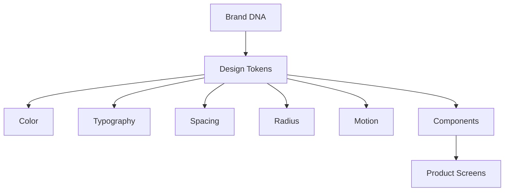
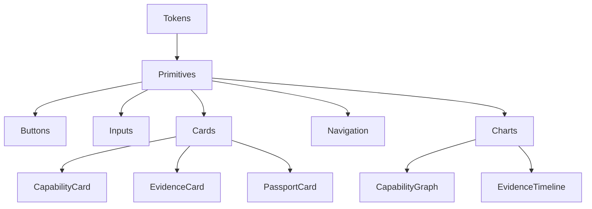
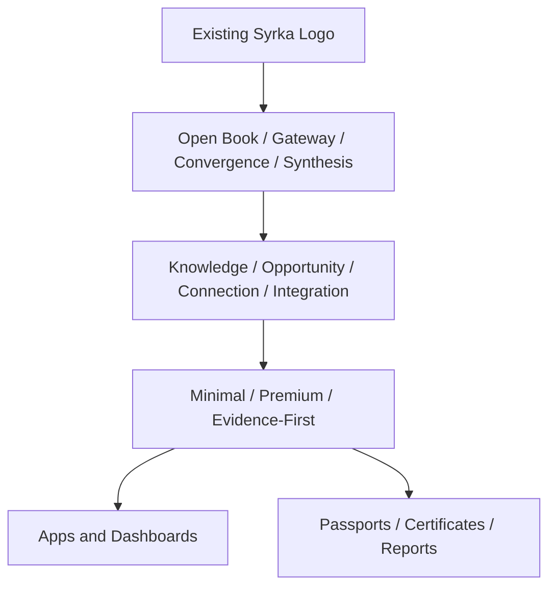
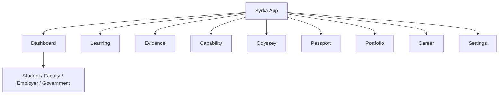
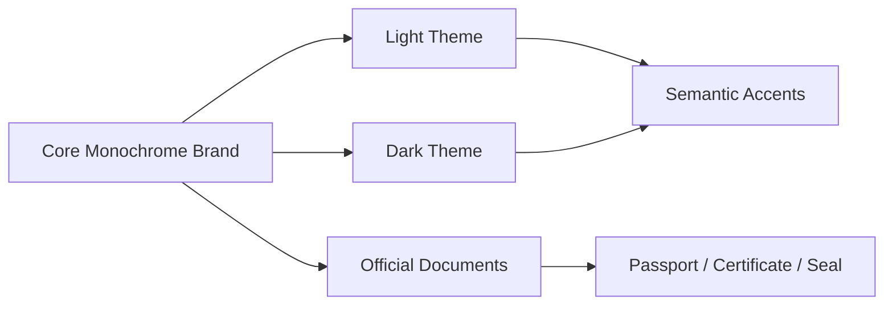

# DESIGN-001 — Syrka Visual Identity & Design System Constitution

Status: Constitutional Design Specification  
Version: 1.0  
Date: 2026-07-08  
Builds upon: Product Suite; UX-001 — Product Experience Architecture  
Canonical visual reference: attached Syrka logo and brand concept  
Decision owners: Brand, Product Design, Design Systems, Frontend Platform, Marketing Design

## 1. Brand DNA

Syrka is the operating system for human capability. Its brand must feel institutional enough for universities and governments, intelligent enough for AI-native capability inference, and human enough for students building their futures.

The existing mark is not redesigned by this specification. It remains the canonical symbol: an open book, a gateway, convergence, and synthesis. Those meanings expand into the design system as follows:

| Logo meaning | Product meaning | Visual design implication |
|---|---|---|
| Open Book | knowledge, learning, evidence | open layouts, generous margins, legible typography |
| Gateway | opportunity, mobility, access | portal-like cards, pathways, framed destination states |
| Convergence | evidence, capability, market signals meeting | graph lines, subtle intersections, connected layouts |
| Synthesis | integration into explainable capability | layered cards, provenance stacks, calm summaries |

### Mission

To transform learning, evidence, and human experience into trusted capability intelligence that helps people move toward meaningful opportunities.

### Vision

A global human capability infrastructure where every learner can prove what they can do, every institution can understand capability formation, every employer can hire based on evidence, and every government can plan workforce mobility with trust.

### Personality

- **Intelligent:** precise, structured, never vague.
- **Calm:** quiet confidence instead of loud persuasion.
- **Institutional:** suitable for universities, governments, and official documents.
- **Human:** supports ambition without reducing people to scores.
- **Evidence-driven:** recommendations are always justified.
- **Premium:** restrained, refined, and durable.

### Voice and emotional tone

Syrka speaks like a trusted advisor: concise, factual, explanatory, and respectful. It avoids hype, gamification excess, and manipulative urgency. The emotional tone should be reassuring: "Your future is understandable, evidence-backed, and actionable."

### Brand promise

Syrka helps people understand what they can credibly do, why that belief is justified, and where that capability can create value.

### Core values

1. Evidence before assertion.
2. Capability before credentials.
3. Explainability before automation.
4. Trust before growth.
5. Mobility before gatekeeping.
6. Human agency before algorithmic authority.
7. Timeless clarity before trend-driven novelty.

### Desired perceptions

| Audience | Desired perception |
|---|---|
| Investors | Syrka is a category-defining infrastructure company, not a feature app. |
| Universities | Syrka is academically serious, interoperable, and institution-safe. |
| Students | Syrka helps me see my potential and prove it with evidence. |
| Employers | Syrka reduces hiring uncertainty with explainable capability evidence. |
| Governments | Syrka supports workforce planning, mobility, and national strategy responsibly. |

## 2. Visual Philosophy

### Minimalism

Minimalism is required because Syrka handles complex ideas: ontology, evidence, capability graphs, recommendations, passports, and policy analytics. The interface must reduce cognitive load by showing only what matters now, with progressive disclosure for deeper evidence.

### Evidence-first design

Every visual pattern should answer: "What supports this claim?" Capability cards, recommendations, and passport claims must show evidence count, confidence, provenance, and explanation access. Evidence is not hidden in footnotes; it is a first-class UI layer.

### Enterprise appearance

Syrka must be credible in boardrooms, ministries, universities, and employer procurement processes. The visual language should use disciplined typography, restrained color, strong alignment, consistent spacing, and official-document quality.

### Calm interfaces

Capability inference affects identity and opportunity. The product must not feel like a social feed, casino, or consumer growth app. Use quiet transitions, neutral backgrounds, deliberate status colors, and clear review paths.

### Typography and whitespace

Typography carries institutional trust. Whitespace creates room for reasoning. Dashboards should not be crowded; they should guide scanning from summary to evidence to action.

### Trustworthy AI

AI appears as an analytical layer, never as magic. AI-generated summaries must include evidence references, confidence, uncertainty, model/run metadata where appropriate, and a path to challenge or review.

## 3. Logo System

The Syrka logo consists of a geometric monoline symbol and the SYRKA wordmark. The concept image establishes a black/white, high-contrast, premium identity with wide letter spacing and applications for app icon, stamp/seal, passport, document, and favicon.

### Primary logo

- Use the full symbol + wordmark lockup for corporate, landing, investor, institutional, and official contexts.
- Maintain the wordmark's wide tracking and geometric calm.
- Use on black, near-black, white, or neutral backgrounds only.

### Secondary logo

- Use symbol-only when space is constrained: app icon, favicon, mobile navigation, compact sidebar, seal, social avatar.
- Use stacked lockup for splash screens, official reports, and presentation covers.

### Monochrome versions

- Primary monochrome: white logo on black/ink background.
- Secondary monochrome: black/ink logo on white/parchment background.
- Avoid multicolor logo treatments.

### Clear space and minimum size

| Asset | Minimum size | Clear space |
|---|---:|---|
| Full logo | 144px wide digital / 38mm print | symbol height on all sides |
| Symbol | 24px digital / 8mm print | half symbol width on all sides |
| Favicon | 16px, 32px, 48px | no additional marks |
| App icon | 1024px source | centered symbol, 18% inset |
| Seal | 28mm print / 96px digital | outer ring thickness x 4 |

### Incorrect usage

Do not stretch, rotate, recolor with gradients, add shadows, outline the wordmark, place over busy imagery, compress letter spacing, add decorative ornaments, alter stroke widths, redraw the symbol, or combine it with unrelated icons.

### Application rules

| Application | Rule |
|---|---|
| Passport branding | symbol centered above passport title; use seal variant for verification. |
| Official documents | symbol + wordmark at top; seal watermark allowed at 4–8% opacity. |
| Certificates | use seal/stamp lockup; include verification QR aligned to grid. |
| Presentations | black or ivory cover, large symbol, restrained title typography. |
| Social media | symbol-only avatar; wordmark in banner with high whitespace. |
| Email signatures | small full logo, name/title, institutional contact. |
| Merchandise | symbol-only preferred; no slogans unless official. |
| Conference booths | large symbol, minimal copy, capability/evidence/gateway messaging. |
| University partnerships | co-brand with equal clear space and neutral divider. |

## 4. Color System

Syrka's color system is nearly monochrome by default. Color is semantic, not decorative. The core brand uses black, white, graphite, silver, and warm institutional neutrals. Accent colors are muted and reserved for state, evidence, capability, confidence, and role differentiation.

### Light mode tokens

| Token | Hex | Purpose | Accessibility / usage |
|---|---|---|---|
| `--color-ink-950` | `#050505` | primary text, logo, premium surfaces | maximum contrast |
| `--color-ink-900` | `#111111` | headings, dark UI blocks | use sparingly |
| `--color-ink-700` | `#2E2E2E` | body text | AA on light |
| `--color-stone-500` | `#71716C` | muted text | use for secondary, not critical |
| `--color-stone-300` | `#C8C7C0` | borders/dividers | low emphasis |
| `--color-stone-100` | `#F4F3EF` | page background | warm institutional neutral |
| `--color-white` | `#FFFFFF` | surfaces/cards | clean content fields |
| `--color-silver` | `#E7E5DE` | official document surfaces | certificates/passport |
| `--color-gold-500` | `#B89B5E` | verified/passport accent | use only for official trust |
| `--color-blue-600` | `#2F5F8F` | information/links | restrained, accessible |
| `--color-green-600` | `#2F6B4F` | success/verified | evidence verified |
| `--color-amber-600` | `#9A6A20` | warning/review needed | do not overuse |
| `--color-red-600` | `#8E2F2F` | danger/revocation/error | high severity only |
| `--color-purple-600` | `#5D4A7A` | AI/reasoning layer | subtle intelligence marker |

### Dark mode tokens

| Token | Hex | Purpose | Accessibility / usage |
|---|---|---|---|
| `--color-bg-dark` | `#050505` | primary dark background | mirrors logo concept |
| `--color-surface-dark` | `#111111` | cards/panels | subtle contrast |
| `--color-surface-raised-dark` | `#181818` | elevated cards | no heavy shadows |
| `--color-border-dark` | `#303030` | dividers | hairline borders |
| `--color-text-dark` | `#F6F5F0` | primary text | strong contrast |
| `--color-muted-dark` | `#A8A8A0` | secondary text | AA where possible |
| `--color-gold-dark` | `#D4BE7F` | verified/passport accent | restrained official highlight |
| `--color-blue-dark` | `#78A6D1` | information/links | accessible on dark |
| `--color-green-dark` | `#78B892` | success | accessible on dark |
| `--color-amber-dark` | `#D0A04F` | warning | accessible on dark |
| `--color-red-dark` | `#D17B7B` | danger | accessible on dark |
| `--color-purple-dark` | `#A997CA` | AI/reasoning | accessible on dark |

### Semantic color families

| Family | Use | Color direction |
|---|---|---|
| Capability | maturity, capability state, skill clusters | neutral + muted blue/green; avoid rainbow graphs |
| Evidence | evidence status, provenance, review | graphite, green verified, amber review, red revoked |
| Confidence | confidence bands | monochrome structure + green/amber/red thresholds |
| Recommendation | next actions and Odyssey | blue for information, purple for AI assistance |
| Odyssey | pathways and milestones | blue/stone lines with gold completion markers |
| Passport | verified identity/capability | black/ivory/gold/seal treatment |
| Government | aggregate dashboards | neutral, blue, amber; avoid individual-level colors |
| Employer | hiring/match flows | neutral, green for verified, blue for match context |
| Faculty | review/intervention | neutral, amber for attention, green for verified |
| Student | growth and journey | neutral, blue and green accents |

## 5. Typography

### Font system

| Role | Recommended font | Fallback |
|---|---|---|
| Primary UI | Inter or Geist Sans | system-ui, -apple-system, Segoe UI, sans-serif |
| Display / brand headlines | Söhne, Inter Display, or Geist | Inter, system-ui |
| Code / technical data | JetBrains Mono or IBM Plex Mono | ui-monospace, SFMono-Regular, monospace |
| Numbers/tables | Tabular figures in primary font | `font-variant-numeric: tabular-nums` |

The wordmark remains its own brand asset and should not be recreated with the UI font.

### Type scale

| Token | Size | Line height | Use |
|---|---:|---:|---|
| `text-xs` | 12px | 16px | captions, metadata |
| `text-sm` | 14px | 20px | secondary UI text |
| `text-base` | 16px | 24px | body and forms |
| `text-lg` | 18px | 28px | emphasized body |
| `text-xl` | 20px | 30px | card titles |
| `text-2xl` | 24px | 32px | page sections |
| `text-3xl` | 32px | 40px | page titles |
| `text-4xl` | 44px | 52px | landing hero |
| `text-5xl` | 56px | 64px | rare display |

### Typographic rules

- Use letter spacing sparingly; reserve wide tracking for brand, labels, and official document headings.
- Body copy should be readable, not compressed.
- Tables use tabular numbers and clear row rhythm.
- Captions explain provenance and confidence; never hide critical uncertainty in low-contrast text.
- Long-form reports use a comfortable measure: 68–78 characters.

## 6. Iconography

Syrka icons derive from the logo's monoline geometry: precise, thin, angled, open, and symmetrical where possible.

| Property | Rule |
|---|---|
| Stroke width | 1.5px at 24px; 2px only for small dense contexts |
| Style | outline by default; filled only for selected/critical state |
| Corners | subtle radius, no cartoon rounding |
| Perspective | flat orthographic, no skeuomorphism |
| Motion | icons may draw in with short line animations, never bounce |
| Grid | 24px base with optical alignment |

### Semantic icon examples

| Concept | Icon direction |
|---|---|
| Learning | open book/gateway line derived from mark |
| Capability | node with evidence-backed check path |
| Evidence | document/artifact with provenance dot |
| Passport | booklet/seal/QR motif |
| Career | pathway/gateway arrow, not corporate ladder cliché |
| Employer | building + verified capability nodes |
| Government | column/seal/aggregate chart |
| Research | paper/network citation |
| Portfolio | curated artifact stack |
| Recommendations | compass/path with evidence dot |
| Analytics | structured chart, minimal color |
| AI | reasoning spark inside bracket, not robot face |
| Notifications | quiet bell/dot |
| Settings | geometric sliders |

## 7. Design Tokens

### Spacing

Use a 4px base grid with intentional whitespace.

| Token | Value | Use |
|---|---:|---|
| `space-0` | 0 | flush alignment |
| `space-1` | 4px | tight icon gaps |
| `space-2` | 8px | compact groups |
| `space-3` | 12px | form gaps |
| `space-4` | 16px | card internal spacing |
| `space-5` | 20px | section grouping |
| `space-6` | 24px | dashboard grid gaps |
| `space-8` | 32px | page sections |
| `space-10` | 40px | large content separation |
| `space-12` | 48px | hero/report spacing |
| `space-16` | 64px | major page bands |
| `space-24` | 96px | landing sections |

### Radius, elevation, opacity, animation

| Token | Value | Use |
|---|---|---|
| `radius-sm` | 6px | inputs, badges |
| `radius-md` | 10px | cards, dialogs |
| `radius-lg` | 16px | major panels |
| `radius-xl` | 24px | app icon / hero surfaces |
| `shadow-subtle` | `0 1px 2px rgba(0,0,0,.06)` | light card lift |
| `shadow-panel` | `0 12px 32px rgba(0,0,0,.10)` | dialogs/menus |
| `opacity-disabled` | 0.45 | disabled controls |
| `duration-fast` | 120ms | hover/focus |
| `duration-base` | 180ms | small transitions |
| `duration-slow` | 280ms | page/modal transitions |
| `ease-standard` | cubic-bezier(.2,.8,.2,1) | default |

### Grid and breakpoints

| Token | Value |
|---|---:|
| `container-sm` | 640px |
| `container-md` | 768px |
| `container-lg` | 1024px |
| `container-xl` | 1200px |
| `container-2xl` | 1440px |
| `breakpoint-sm` | 640px |
| `breakpoint-md` | 768px |
| `breakpoint-lg` | 1024px |
| `breakpoint-xl` | 1280px |
| `breakpoint-2xl` | 1536px |

## 8. Layout Philosophy

### Landing pages

Use strong negative space, a clear hero claim, a quiet visual of evidence-to-capability transformation, and focused conversion points. Avoid crowded SaaS collage sections.

### Dashboards

Dashboards answer the user's next question. Use one primary summary region, one action region, one evidence/status region, and a low-noise activity feed. Avoid more than 5–7 major widgets above the fold.

### Forms

Forms are official and calm. Use clear labels, inline validation, minimal fields per step, and explanations for sensitive data.

### Tables

Tables should support enterprise review: sticky headers, clear filters, density options, keyboard navigation, and export where appropriate.

### Cards

Cards are evidence containers. Every important card has title, summary, status, evidence/provenance, primary action, and optional explanation.

### Graphs and timelines

Capability/knowledge graphs use structure first: spacing, edge weight, grouping, labels, and focus states. Color is secondary. Timelines show chronology and provenance with clear event/evidence distinction.

### Passport and portfolio

Passport uses official-document logic: ivory/black/gold, seal, QR, version, expiry, verification status, and redaction controls. Portfolio is more expressive but still restrained.

## 9. Component Language

| Component | Purpose | States | Accessibility | Variants / behavior |
|---|---|---|---|---|
| Button | trigger clear action | default, hover, focus, active, loading, disabled | visible focus, semantic button | primary, secondary, ghost, danger, link |
| Input | collect data | default, focus, error, disabled, success | label required, error text | text, textarea, search, date, select |
| Dropdown | choose from known set | open, selected, disabled | keyboard, aria-expanded | simple, searchable, multi-select |
| Card | contain related information | default, hover, selected, loading | semantic headings | standard, evidence, capability, passport |
| Capability Card | summarize capability state | emerging to revoked | confidence announced textually | evidence count, maturity, review action |
| Evidence Card | show support/provenance | pending, verified, disputed, revoked | source and status text | artifact preview, review trail |
| Recommendation Card | explain next action | new, accepted, dismissed, expired | reason and confidence text | Odyssey, job, learning, portfolio |
| Passport Card | official claim summary | active, shared, expired, revoked | verification status | QR, version, redaction |
| Timeline | sequence events/evidence | selected, filtered | ordered list fallback | learning/evidence/passport timelines |
| Graph Viewer | capability/knowledge graph | pan, focus, inspect | table/list fallback | force, hierarchy, path view |
| Chart | visualize metrics | hover, focus, empty | alt summary | line, bar, heatmap, network |
| Search | discover people/content | typing, results, empty | keyboard-first | global, scoped, command palette |
| Filter | narrow data | active, clearable | labels | chips, panels, saved filters |
| Navigation | move across product | active, collapsed | landmark roles | sidebar, topbar, mobile tab |
| Dialog | focused decision | open, loading | focus trap | confirm, form, evidence inspector |
| Notification | status update | unread, read, actioned | polite/live region | toast, inbox, banner |
| Badge | semantic label | default, emphasis | text + color | status, role, confidence, evidence |
| Progress Bar | show completion | determinate, indeterminate | value text | Odyssey, onboarding, review |
| Tabs | switch panels | active, disabled | keyboard | underlined, segmented |
| Accordion | progressive disclosure | open/closed | aria controls | evidence details, policy notes |
| Sidebar | app structure | expanded/collapsed | landmarks | role-specific navigation |
| Header | page identity/actions | fixed/static | headings | page, report, dashboard |
| Footer | legal/context | static | navigable links | marketing, app, document |

## 10. Data Visualization

Syrka visualization should make complex relationships understandable without turning capability into entertainment.

| Visualization | Design rule |
|---|---|
| Capability graph | grouped by ontology domain; edge thickness for evidence strength; confidence visible in labels/tooltips |
| Knowledge graph | clear hierarchy and filters; selected node opens evidence drawer |
| Confidence indicator | numeric + band + explanation; never color-only |
| Evidence timeline | chronological, source-labeled, review status visible |
| Career pathway | step path with gaps, prerequisites, and next actions |
| Labour analytics | aggregate only; use subdued charts and clear methodology notes |
| Institution dashboard | cohort trends, assessment quality, evidence review workload |
| Government analytics | country/sector aggregates; strong privacy cues |
| Network visualizations | limited node count by default; progressive expansion |
| Trend charts | restrained line/bar charts; annotations for policy/market events |

## 11. Motion System

Motion communicates continuity and state. It never distracts.

| Motion | Rule |
|---|---|
| Hover | 120ms subtle border/surface change |
| Loading | skeletons for data surfaces; spinner only for short actions |
| Transitions | 180ms standard; preserve spatial continuity |
| Page navigation | fade/slide 8–12px max |
| Micro-interactions | use for confirmation, not delight theater |
| Graph animations | draw edges on load; reduce for large graphs |
| Timeline animations | reveal new events gently |
| Modal behavior | fade overlay + scale 98% to 100% |
| Reduced motion | disable transform animations, keep opacity changes only |

## 12. Imagery

| Asset type | Rule |
|---|---|
| Photography | real universities, laboratories, people working; natural light; no stock clichés |
| Illustrations | abstract diagrams only; avoid cartoon startup people |
| Icons | monoline geometric system |
| Diagrams | precise, grid-based, explain system flows |
| 3D usage | minimal; only for premium passport/object renders if needed |
| Patterns | derive from logo angles/convergence lines at low opacity |
| Textures | subtle paper/grain for official documents only |
| Backgrounds | neutral, spacious, never busy behind text |

## 13. Accessibility

- Meet WCAG AA minimum; target AAA for primary text where feasible.
- All interactive controls require visible focus states.
- Never rely on color alone; pair with labels, icons, and patterns.
- Support reduced motion, high contrast, screen readers, keyboard navigation, and logical heading structure.
- Design for localization, RTL, long names, multilingual labels, and low-bandwidth contexts.
- Graphs require list/table fallbacks and textual summaries.
- Confidence and AI explanations must be readable by assistive technologies.

## 14. Design Inspiration

Syrka may learn from refined platforms but must not copy them.

| Reference | Adopted principle | Avoid copying |
|---|---|---|
| Apple | restraint, premium negative space, hardware-like polish | consumer gloss, excessive spectacle |
| Stripe | clarity, developer trust, documentation quality | bright gradient-heavy marketing language |
| Linear | speed, alignment, typography, command UX | overly dark startup aesthetic |
| GitHub | developer familiarity, trust in technical artifacts | dense legacy UI patterns |
| Palantir | institutional seriousness, analytical dashboards | intimidating surveillance aesthetics |
| Notion | flexible information architecture | casual blocks that weaken official trust |
| Arc Browser | elegant product confidence, subtle motion | novelty-first interaction models |

## 15. Platform Applications

| Surface | Design adaptation |
|---|---|
| Landing website | premium, spacious, logo-led, evidence-to-opportunity story |
| Student dashboard | calm path, capability summary, evidence, next action |
| Faculty dashboard | review queues, cohort signals, curriculum mapping |
| Employer portal | capability search, evidence review, passport verification |
| Government analytics | aggregate dashboards, policy notes, privacy emphasis |
| Portfolio website | polished but personal, evidence-backed project presentation |
| Job Passport | official document language, versioning, seal, QR, verification |
| Reports | institutional typography, strong tables, restrained charts |
| Certificates | seal/stamp, verified data, QR, minimal ornament |
| Official documents | black/ivory, generous margins, formal hierarchy |
| Emails | concise, white/neutral surfaces, clear actions |
| Mobile app | focused next actions, passport/evidence access, compact navigation |
| Desktop app | analytics-heavy workflows and graph exploration |
| Tablet | review, presentation, and classroom workflows |

## 16. Figma Design System

| Page | Frames / organization |
|---|---|
| Cover | logo, version, brand promise, canonical reference |
| Brand | mission, logo meanings, usage, incorrect usage |
| Colors | light/dark palettes, semantic tokens, accessibility samples |
| Typography | scale, specimens, tables, report examples |
| Icons | grid, icon set, semantic examples, do/don't |
| Spacing | grid, containers, page rhythm, responsive examples |
| Tokens | variables for color, type, radius, shadow, motion |
| Components | buttons, forms, cards, navigation, dialogs, charts |
| Student | dashboard, evidence, capability, Odyssey, passport |
| Faculty | course, review queue, curriculum mapping, analytics |
| Employer | search, candidate, passport verification, job pipeline |
| Government | aggregate analytics, corridors, policy brief |
| Portfolio | profile, project pages, share states |
| Passport | document, QR/share, verification states |
| Landing | homepage, product, investor, university pages |
| Navigation | sidebar, topbar, mobile, command palette |
| Responsive | desktop/tablet/mobile rules |
| Prototype | key flows from UX-001 |
| Documentation | component rules, accessibility, implementation notes |

## 17. Google Stitch Readiness

Use these prompts as production-ready starting points. Each prompt assumes the existing Syrka logo and monoline mark are provided as assets.

### Landing page prompt

Create a premium enterprise SaaS landing page for Syrka, the operating system for human capability. Use a near-monochrome palette inspired by the provided black-and-white geometric Syrka logo. The design should feel like Apple-level restraint, Stripe-level clarity, and institutional trust suitable for universities and governments. Use generous whitespace, precise typography, no trendy gradients, and subtle line motifs derived from the logo's open book/gateway/convergence shape. Sections: hero, evidence-to-capability explanation, platform modules, university/employer/government trust, Job Passport preview, CTA.

### Student dashboard prompt

Design a calm student dashboard for Syrka. Visual style: premium monochrome with muted blue/green semantic accents, spacious cards, precise typography, evidence-first AI. Main cards: capability summary, current Odyssey milestone, evidence awaiting review, Job Passport status, recommendations with confidence and evidence count. Show AI as explainable analysis, not a chatbot mascot. Include sidebar navigation and dark/light mode compatibility.

### Faculty dashboard prompt

Design a faculty dashboard for reviewing student capability evidence. Use restrained enterprise styling, clear tables, review queues, cohort analytics, curriculum mapping, and evidence verification cards. Highlight urgent items with muted amber, verified evidence with muted green, and keep the interface calm and uncluttered.

### Employer dashboard prompt

Design an employer portal where recruiters search candidates by verified capability. Include capability-first search filters, candidate match cards, passport verification panel, evidence drawer, hiring pipeline, and consent indicators. Use professional black/ivory/graphite styling with green verified states and gold passport trust accents.

### Government dashboard prompt

Design a government workforce analytics dashboard for aggregate capability gaps, strategic sectors, labour market signals, and mobility corridors. Use privacy-preserving aggregate visuals, muted maps/charts, methodology notes, and official document styling. Avoid consumer dashboard clutter.

### Capability screen prompt

Design a capability detail screen showing what a person can credibly do. Include maturity, confidence, supporting evidence, conflicting evidence, ontology mapping, graph path, reasoning explanation, review history, and next recommended actions. Use structure first, color second.

### Job Passport prompt

Design a digital Job Passport with official document aesthetics: ivory surface, black typography, Syrka symbol, seal, QR verification, version number, expiry, privacy controls, capability claims, evidence links, and share/revoke actions.

## 18. Claude Sonnet Readiness

### Tailwind tokens

```ts
export const syrkaTheme = {
  colors: {
    ink: { 950: '#050505', 900: '#111111', 700: '#2E2E2E' },
    stone: { 100: '#F4F3EF', 300: '#C8C7C0', 500: '#71716C' },
    white: '#FFFFFF',
    silver: '#E7E5DE',
    gold: { 500: '#B89B5E' },
    blue: { 600: '#2F5F8F' },
    green: { 600: '#2F6B4F' },
    amber: { 600: '#9A6A20' },
    red: { 600: '#8E2F2F' },
    purple: { 600: '#5D4A7A' }
  },
  borderRadius: { sm: '6px', md: '10px', lg: '16px', xl: '24px' },
  spacing: { 1: '4px', 2: '8px', 3: '12px', 4: '16px', 6: '24px', 8: '32px', 12: '48px', 16: '64px' }
}
```

### CSS variables

```css
:root {
  --background: #F4F3EF;
  --foreground: #050505;
  --card: #FFFFFF;
  --card-foreground: #111111;
  --border: #C8C7C0;
  --muted: #71716C;
  --primary: #050505;
  --primary-foreground: #FFFFFF;
  --success: #2F6B4F;
  --warning: #9A6A20;
  --danger: #8E2F2F;
  --info: #2F5F8F;
  --ai: #5D4A7A;
  --verified: #B89B5E;
}

.dark {
  --background: #050505;
  --foreground: #F6F5F0;
  --card: #111111;
  --card-foreground: #F6F5F0;
  --border: #303030;
  --muted: #A8A8A0;
}
```

### shadcn/ui customization

- Use `neutral` base theme, then override tokens with Syrka variables.
- Buttons: black primary, outline secondary, ghost tertiary, red destructive.
- Cards: thin border, subtle shadow, `rounded-md` or `rounded-lg`.
- Dialogs: restrained overlay, official typography, clear focus trap.
- Badges: semantic text + subtle background; never color-only.
- Charts: custom muted palette; no rainbow defaults.

### Folder organization

```text
src/
  app/
  components/
    brand/
    layout/
    navigation/
    capability/
    evidence/
    passport/
    charts/
    forms/
  design-system/
    tokens.ts
    theme.css
    component-guidelines.md
  lib/
    cn.ts
    accessibility.ts
```

### Component naming

Use domain-aligned names: `CapabilityCard`, `EvidenceCard`, `PassportClaimCard`, `ConfidenceMeter`, `EvidenceTimeline`, `OntologyBreadcrumb`, `RecommendationReason`, `VerifiedSeal`, `GatewayPanel`.

## 19. Mermaid Diagrams

### 19.1 Design token hierarchy



### 19.2 Component hierarchy



### 19.3 Brand hierarchy



### 19.4 Navigation hierarchy



### 19.5 Theme relationships



## 20. Final Deliverable

DESIGN-001 defines Syrka's permanent visual identity and design system constitution. It preserves the existing logo and expands its meanings into a complete design language for enterprise SaaS, universities, governments, employers, students, investors, official documents, dashboards, portfolios, and passports.

The final visual language is timeless, minimal, premium, trustworthy, evidence-driven, intelligent, institutional, calm, and explainable. Every future Syrka interface should feel like it belongs to the same ecosystem: an open gateway from knowledge to verified capability and opportunity.
