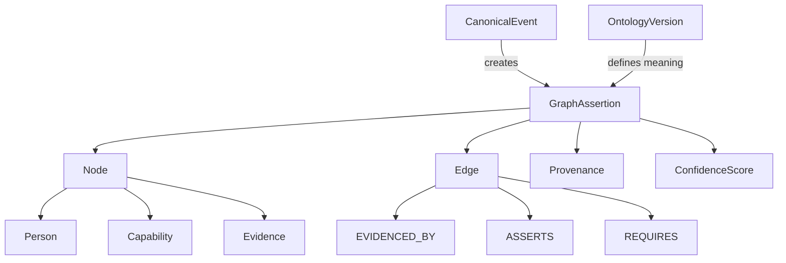
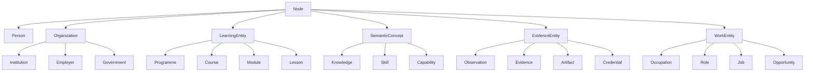
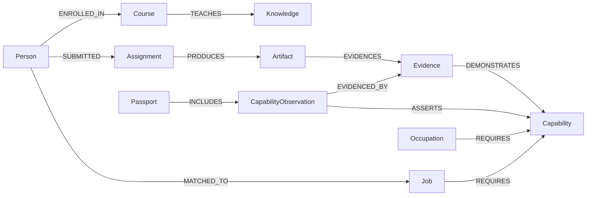
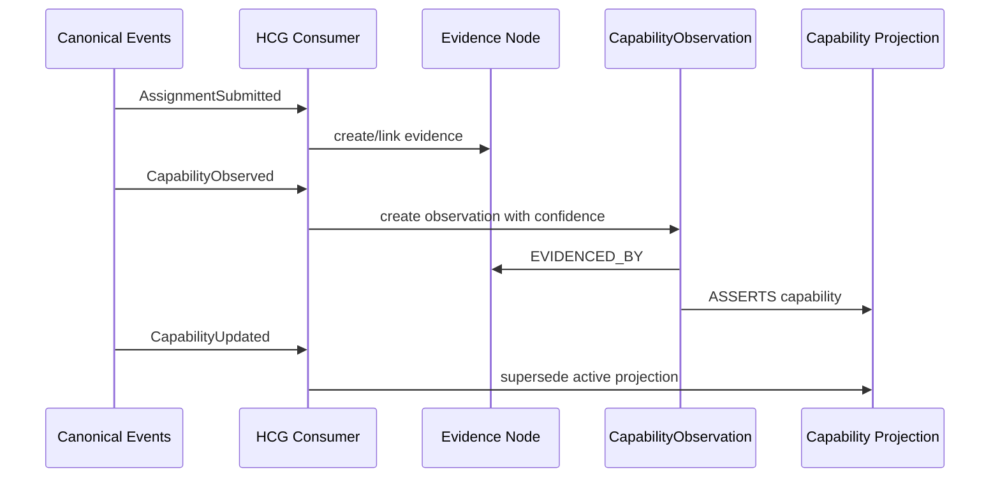
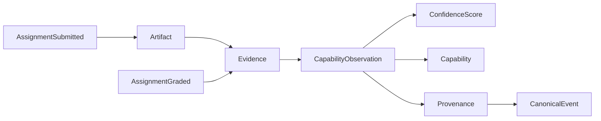
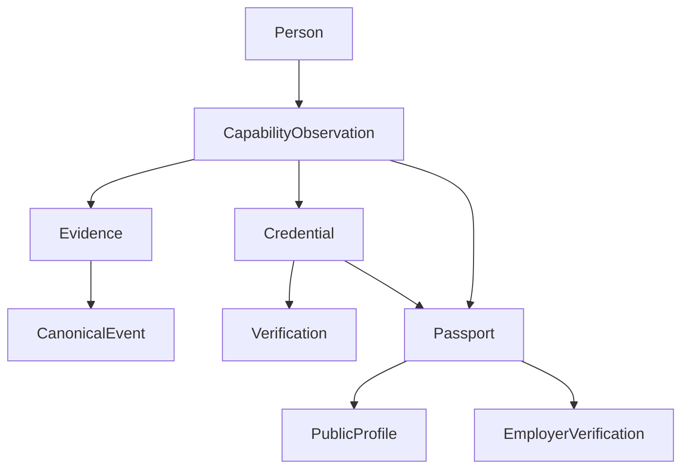
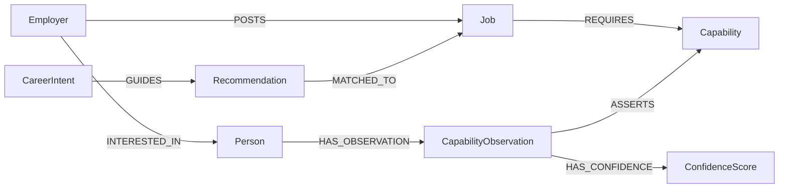
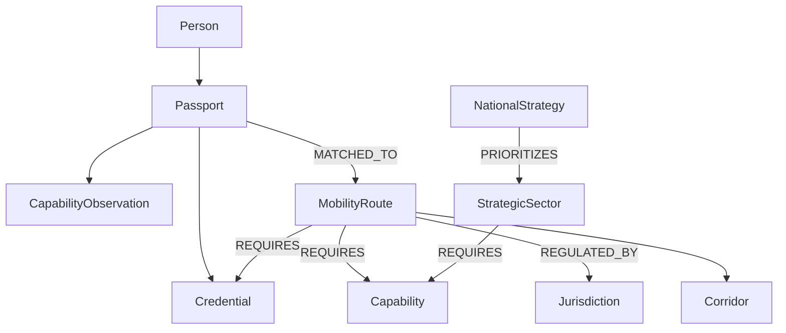

# GRAPH-001 — Syrka Human Capability Graph Specification

Status: Constitutional Engineering Specification  
Version: 1.0  
Date: 2026-07-08  
Builds upon: Product Suite; ADR-001 — Open Source LMS Foundation; ADR-002 — Domain Architecture & Bounded Contexts; CEA-001 — Canonical Event Architecture; ONT-001 — Ontology Constitution  
Decision owners: Knowledge Graph Architecture / AI Engineering / Ontology / Platform Architecture  
Scope: Human Capability Graph metamodel, node and edge catalogues, graph semantics, event-derived mutations, storage architecture, query model, AI integration, scalability, security, governance, diagrams, and implementation appendices

## 1. Executive Overview

The Human Capability Graph (HCG) is Syrka's persistent semantic representation of people, identities, institutions, employers, governments, programmes, courses, learning outcomes, skills, knowledge, capabilities, evidence, credentials, research, projects, technologies, occupations, opportunities, passports, mobility routes, and national strategies over time.

The HCG is not a social graph, an LMS graph, or a static taxonomy. It is the evidence-backed relationship layer that answers:

> **What can this person credibly do, why do we believe it, and where can that capability create value?**

### 1.1 Why a graph instead of relational tables?

Relational tables are excellent for transactional records with known joins. Syrka's core intelligence problem is different: capabilities emerge from multi-hop, temporal, evidence-backed relationships among people, learning activities, artifacts, assessments, credentials, research, projects, labour-market demand, occupations, jurisdictions, and recommendations. These relationships change over time and must remain explainable.

A graph is required because:

1. **Capability is relational.** A capability is not a column on a user row. It is an assertion connecting a person, capability concept, evidence, context, confidence, provenance, ontology version, and validity window.
2. **Evidence is multi-hop.** A Job Passport claim may trace from passport → capability observation → evidence → assignment → artifact → rubric → course outcome → ontology term → occupation requirement.
3. **Recommendations are path-based.** Learning pathways, job matches, mobility routes, and curriculum gaps are graph traversals.
4. **Ontology is relational.** Skills require knowledge, capabilities require skills, occupations require capabilities, credentials verify claims, and jurisdictions regulate mobility.
5. **Temporal evolution matters.** Syrka must represent historical capability, current confidence, decay, supersession, revocation, and future potential.
6. **AI needs grounded context.** Graph retrieval gives AI systems constrained, provenance-rich neighborhoods rather than unstructured guesses.

### 1.2 Why capability is represented as relationships rather than columns

A column such as `sql_skill_score = 0.84` hides the most important facts: what evidence supports the claim, what ontology version defined the capability, which model/rubric inferred it, whether evidence is current, whether it is verified, and whether the capability transfers to a job or jurisdiction.

In the HCG, capability is represented as a graph assertion:

```text
(Person)-[:HAS_OBSERVATION]->(CapabilityObservation)-[:ASSERTS]->(Capability)
(CapabilityObservation)-[:EVIDENCED_BY]->(Evidence)
(CapabilityObservation)-[:HAS_CONFIDENCE]->(ConfidenceScore)
(CapabilityObservation)-[:DERIVED_FROM]->(CanonicalEvent)
(CapabilityObservation)-[:USES_ONTOLOGY_VERSION]->(OntologyVersion)
```

### 1.3 Explainable AI, lifelong learning, and mobility

The graph supports explainable AI by forcing every model output to connect to canonical events, evidence, ontology definitions, confidence scores, and provenance. It supports lifelong learning by preserving a temporal history of capability development and decay. It supports workforce mobility by connecting evidence-backed capability to occupations, credentials, regulations, national strategies, employer demand, and mobility routes.

## 2. Graph Philosophy

| Concept | Definition | Role in HCG |
|---|---|---|
| Node | A typed graph entity representing a person, concept, evidence item, organization, opportunity, event, or state object. | Stores identity and properties of graph entities. |
| Edge | A typed directed relationship between nodes. | Encodes semantic meaning such as `EVIDENCED_BY`, `REQUIRES`, or `MATCHED_TO`. |
| Graph assertion | A claim represented by nodes/edges with provenance, time, ontology version, and confidence where applicable. | Core unit of explainable graph knowledge. |
| Temporal edge | An edge with `valid_from`, `valid_to`, `observed_at`, and/or `superseded_at`. | Represents evolution rather than overwriting state. |
| Provenance | Lineage showing source events, source systems, transformations, models, reviewers, and ontology version. | Makes assertions auditable and reproducible. |
| Graph confidence | Calibrated support for an assertion, derived from evidence quality, trust, recency, and uncertainty. | Prevents overclaiming and enables thresholds. |
| Graph projection | Derived graph state or read model built from canonical events. | Query-optimized and rebuildable. |
| Graph snapshot | Point-in-time materialization of graph state for performance, audit, or reproducibility. | Speeds replay and explanations without replacing events. |
| Graph evolution | Append-only change of graph state caused by canonical events and ontology versions. | Preserves history, decay, revocation, and migration. |

Principles:

- Events create graph mutations; the graph does not replace events.
- Ontology defines meaning; the graph instantiates meaning.
- Every edge has provenance.
- Every assertion is temporal.
- No AI model mutates the graph directly; AI publishes canonical events that graph consumers apply.

## 3. Node Catalogue

### 3.1 Common node properties

All nodes include:

| Property | Meaning |
|---|---|
| `id` | Stable canonical identifier. |
| `type` | Node label/type. |
| `tenant_id` | Tenant boundary where applicable. |
| `created_at` | First creation timestamp. |
| `updated_at` | Last projection update timestamp. |
| `ontology_version` | Ontology version defining semantic type where applicable. |
| `source_event_ids` | Canonical events that created/updated node. |
| `provenance_ref` | Pointer to provenance details. |
| `visibility` | Access classification. |
| `status` | active, deprecated, revoked, archived, candidate. |

### 3.2 Node definitions

| Node type | Purpose | Key properties | Constraints | Lifecycle | Owner | Primary relationships | Indexing strategy |
|---|---|---|---|---|---|---|---|
| Person | Human subject of capability, learning, career, credentials, and mobility. | person_id, display_name_hash, country, status | Must not store secrets; PII minimized. | created, updated, anonymized/archived | Identity | HAS_IDENTITY, HAS_OBSERVATION, HAS_INTENT, HAS_PASSPORT | person_id, tenant_id, country |
| Identity | Auth/federation representation linked to a person or organization. | identity_id, provider, external_subject_hash | One identity maps to one canonical entity per tenant. | linked, unlinked, revoked | Identity | IDENTIFIES, FEDERATED_WITH | identity_id, provider |
| Institution | Education/research/training organization. | institution_id, name, country, type | Tenant-scoped; may host programmes/courses. | active, merged, archived | Identity/Institution | OFFERS, BELONGS_TO, ALIGNED_WITH | institution_id, country |
| Employer | Organization creating work demand. | employer_id, name, industry_id, verified | Must be verified for sensitive actions. | active, suspended, archived | Employer Platform | POSTS, INTERESTED_IN, BELONGS_TO | employer_id, industry_id |
| Government | Public authority or agency. | government_id, jurisdiction_id, authority_type | Must map to jurisdiction. | active, reorganized, archived | National Vision | PUBLISHES, REGULATES | government_id, jurisdiction_id |
| Programme | Structured educational pathway. | programme_id, title, level, credential_type | Belongs to institution. | draft, active, retired | Curriculum | CONTAINS, ALIGNED_WITH | programme_id, institution_id |
| Course | Structured unit of learning. | course_id, source_system, title, course_run | LMS-local IDs mapped externally. | active, completed, archived | Learning Adapter | PART_OF, CONTAINS, TEACHES | course_id, source_system |
| Module | Course subdivision. | module_id, title, sequence | Must belong to course. | active, retired | Learning Adapter | PART_OF, CONTAINS | module_id, course_id |
| Lesson | Discrete learning experience. | lesson_id, title, modality | Viewing alone is weak evidence. | active, retired | Learning Adapter | PART_OF, TEACHES, VIEWED | lesson_id, module_id |
| LearningOutcome | Expected knowledge/skill/capability outcome. | outcome_id, statement, bloom_level | Must align to ontology terms when used for inference. | draft, active, deprecated | Curriculum/Ontology | ALIGNED_WITH, ASSESSED_BY | outcome_id, ontology_term_id |
| Assessment | Evaluation method. | assessment_id, type, rubric_id | Must define evaluated concepts for inference. | active, administered, retired | Learning Adapter/Faculty | ASSESSES, PRODUCES | assessment_id, course_id |
| Assignment | Task assigned to learner. | assignment_id, due_at, type | May produce artifact/evidence. | opened, submitted, graded, archived | Learning Adapter | PART_OF, PRODUCES, SUBMITTED | assignment_id, course_id |
| Project | Bounded effort producing artifact/outcome. | project_id, title, domain, status | May have collaborators. | started, completed, archived | Portfolio/Learning/GitHub | PRODUCED, DEMONSTRATES, LINKED_TO | project_id, owner_id |
| Artifact | Inspectable work product. | artifact_id, uri, content_hash, content_type | Stored by reference; malware/privacy scanned. | created, versioned, archived, revoked | Source domain/Object Storage | PRODUCED, EVIDENCES, DERIVED_FROM | artifact_id, hash |
| Evidence | Provenance-bearing support/contradiction for claims. | evidence_id, evidence_type, strength, quality | Must reference source event/provenance. | observed, verified, revoked, expired | Capability Graph | EVIDENCES, SUPPORTS, CONTRADICTS | evidence_id, subject_id, evidence_type |
| Observation | Captured event/signal. | observation_id, event_type, occurred_at | Must derive from canonical event. | created, compacted/archived | Event/Graph | DERIVED_FROM, MAY_SUPPORT | observation_id, event_id |
| Knowledge | Conceptual/procedural understanding. | knowledge_id, label, domain | Ontology-defined. | active, deprecated | Ontology | REQUIRES, PART_OF | knowledge_id, ontology_version |
| KnowledgeArea | Field/domain of knowledge. | area_id, label, standard_mapping | Hierarchical. | active, deprecated | Ontology | CONTAINS, MAPPED_TO | area_id |
| Skill | Task-specific learned capacity. | skill_id, label, category | Ontology-defined; not same as capability. | active, deprecated | Ontology | REQUIRES, PART_OF, DEMONSTRATED_BY | skill_id |
| Capability | Evidence-backed contextual ability concept. | capability_id, label, category, required_evidence | Must have ontology definition. | active, deprecated | Ontology/Graph | REQUIRES, ASSERTED_BY, MATCHES | capability_id, category |
| CapabilityObservation | Temporal assertion that a subject demonstrates capability. | observation_id, confidence, context, valid_from, valid_to | Requires evidence, provenance, ontology version. | proposed, accepted, superseded, revoked | Capability Graph | ASSERTS, EVIDENCED_BY, HAS_CONFIDENCE | subject_id, capability_id, valid_from |
| Competency | Standard-defined capability/knowledge/skill bundle. | competency_id, framework, level | Maps to standards. | active, deprecated | Ontology/Curriculum | ALIGNED_WITH, REQUIRES | competency_id, framework |
| Credential | Verifiable issuer claim. | credential_id, issuer_id, status, issued_at | Must support verification/revocation. | issued, verified, revoked, expired | Credential Ledger | VERIFIED_BY, SUPPORTS, INCLUDED_IN | credential_id, subject_id |
| Certification | Credential subtype. | certification_id, issuer, expiry | May expire. | issued, verified, expired | Credential Ledger | IS_A, SUPPORTS | certification_id, issuer |
| Portfolio | Curated evidence presentation. | portfolio_id, owner_id, version | Projection, not source truth. | generated, shared, revoked | Portfolio | CONTAINS, DERIVED_FROM | portfolio_id, owner_id |
| Publication | Disseminated research artifact. | publication_id, doi, title, published_at | Authorship confidence required. | imported, verified, corrected | Research Intelligence | AUTHORED, EVIDENCES | doi, publication_id |
| ResearchProject | Research activity producing outputs. | research_project_id, field, status | May involve institutions/persons. | started, completed, archived | Research Intelligence | PRODUCES, AUTHORED_BY | research_project_id |
| Researcher | Person role in research context. | researcher_id, person_id, affiliation | Role projection over Person. | active, inactive | Research/Identity | IS_ROLE_OF, AUTHORED | researcher_id, person_id |
| Technology | Applied technical system/platform. | technology_id, label, vendor_neutral | Ontology-defined. | active, deprecated | Ontology/Market | USED_BY, REQUIRES | technology_id |
| Tool | Instrument used to perform work. | tool_id, label, tool_type | Not same as capability. | active, deprecated | Ontology | USED_BY | tool_id |
| ProgrammingLanguage | Symbolic/computational language. | language_id, name, paradigm | Subtype of Language/Technology. | active, deprecated | Ontology | USED_BY, REQUIRES | language_id |
| Framework | Structured practice/tool framework. | framework_id, name, domain | May be technical/professional. | active, deprecated | Ontology | USED_BY, ALIGNED_WITH | framework_id |
| Occupation | Recognized work category. | occupation_id, title, standard_codes | Maps to O*NET/ISCO/SOC/ESCO. | active, deprecated | Market/Ontology | REQUIRES, BELONGS_TO | occupation_id, standard_code |
| Role | Contextual set of responsibilities. | role_id, title, employer_context | More specific than occupation. | active, deprecated | Employer/Market | REQUIRES, PART_OF | role_id, occupation_id |
| Industry | Economic activity category. | industry_id, label, standard_code | Maps to standards. | active, deprecated | Market | CONTAINS, HAS_DEMAND | industry_id |
| Sector | Broad strategic/economic category. | sector_id, label, strategy_flag | May be national overlay. | active, deprecated | National Vision/Market | CONTAINS, PRIORITIZED_BY | sector_id |
| Job | Concrete paid work opportunity. | job_id, title, employer_id, status | Must belong to employer. | posted, matched, closed, archived | Employer | REQUIRES, MATCHED_TO, POSTED_BY | job_id, employer_id |
| Internship | Temporary work-learning opportunity. | internship_id, employer_id, duration | Opportunity subtype. | posted, matched, completed | Employer/Opportunity | REQUIRES, MATCHED_TO | internship_id |
| Scholarship | Funding/education opportunity. | scholarship_id, sponsor_id, eligibility | Opportunity subtype. | posted, matched, closed | Opportunity | REQUIRES, MATCHED_TO | scholarship_id |
| Opportunity | Generic actionable future option. | opportunity_id, type, status | Supertype for job/internship/scholarship/research collaboration. | created, matched, accepted, closed | Opportunity Engine | MATCHED_TO, RECOMMENDED_FOR | opportunity_id, type |
| CareerIntent | User-controlled future preference model. | intent_id, subject_id, geography, industry, salary | Not capability. | created, updated, revoked | Career Intent | EXPRESSES, GUIDES | subject_id, updated_at |
| Goal | Specific intended future outcome. | goal_id, subject_id, target, horizon | Must be subject-owned or advisor-authored. | created, updated, completed, retired | Career Intent | PART_OF, GUIDES | goal_id, subject_id |
| Recommendation | Explainable suggestion. | recommendation_id, type, score, explanation_ref | Must derive from graph evidence/path. | generated, viewed, accepted, rejected | Opportunity/Odyssey | RECOMMENDED_FOR, DERIVED_FROM | recommendation_id, subject_id |
| Passport | Versioned portable claim package. | passport_id, subject_id, version, status | Projection from graph/credentials. | issued, updated, shared, revoked | Job Passport | INCLUDES, DERIVED_FROM | passport_id, subject_id, version |
| MobilityRoute | Pathway for role/geography/jurisdiction movement. | route_id, from_jurisdiction, to_jurisdiction, occupation_id | Regulated by jurisdiction. | active, revised, retired | Mobility | REQUIRES, REGULATED_BY, MATCHED_TO | route_id, jurisdictions |
| Country | National jurisdiction context. | country_code, name | ISO code required. | active | National Vision | HAS_STRATEGY, REGULATES | country_code |
| Jurisdiction | Legal/regulatory authority context. | jurisdiction_id, type, code | Can be country/region/supranational. | active, changed, retired | National Vision | REGULATES, CONTAINS | jurisdiction_id |
| NationalStrategy | Government strategy/policy object. | strategy_id, country_code, title, period | Source document required. | imported, active, superseded | National Vision | PRIORITIZES, ALIGNED_WITH | strategy_id, country_code |
| StrategicSector | Sector prioritized by strategy. | strategic_sector_id, sector_id, priority_level | Overlay over sector. | active, superseded | National Vision | PRIORITIZED_BY, REQUIRES | strategic_sector_id |
| AIModel | Model used for extraction/inference/recommendation. | model_id, provider, version, eval_version | Provider is replaceable. | registered, active, deprecated | AI Platform | PRODUCED, REVIEWED_BY | model_id, version |
| OntologyVersion | Published immutable ontology release. | version, published_at, status | Required on semantic assertions. | draft, published, deprecated | Ontology | DEFINES, SUPERSEDES | version |
| CanonicalEvent | Immutable business event represented in graph as provenance anchor. | event_id, event_type, occurred_at | Source of graph mutations. | accepted, archived | Event Platform | DERIVED, CAUSED | event_id, event_type |
| ConfidenceScore | Confidence state for assertion. | score, band, method, model_version | Must be calibrated and bounded 0..1. | created, superseded | Inference/Graph | QUALIFIES | assertion_id, score |
| Provenance | Lineage object. | provenance_id, source_system, transformer, reviewer | Must reference source event/model/version. | created, archived | Platform/Graph | DESCRIBES | provenance_id |

## 4. Edge Catalogue

### 4.1 Common edge properties

All edges include:

| Property | Meaning |
|---|---|
| `id` | Stable edge/assertion identifier when materialized. |
| `type` | Relationship type. |
| `created_at` | Creation timestamp. |
| `valid_from` / `valid_to` | Temporal validity window where applicable. |
| `observed_at` | Time the represented fact was observed. |
| `confidence` | Assertion confidence when applicable. |
| `source_event_ids` | Canonical events that produced edge. |
| `provenance_ref` | Provenance node/reference. |
| `ontology_version` | Ontology version defining meaning. |
| `status` | active, superseded, revoked, expired. |

### 4.2 Edge definitions

| Edge | Source → Target | Cardinality | Temporal rules | Confidence rules | Provenance rules | Versioning |
|---|---|---|---|---|---|---|
| HAS_IDENTITY | Person/Organization → Identity | many | valid while identity linked | usually none | identity event required | superseded on unlink |
| IDENTIFIES | Identity → Person/Organization | one active canonical target per tenant | temporal | high trust required | federation/identity provenance | version by provider mapping |
| ENROLLED_IN | Person → Course/Programme | many | valid enrollment window | none or enrollment confidence | enrollment event | updated by enrollment changes |
| COMPLETED | Person → Module/Course/Programme | many | completed_at immutable; revocation edge if corrected | completion confidence optional | completion event | never overwrite; supersede |
| VIEWED | Person → Lesson/Artifact | high cardinality | observed_at | weak evidence confidence | view event | compactable projection allowed |
| SUBMITTED | Person → Assignment/Assessment | many attempts | submitted_at immutable | none; evidence quality separate | submission event | attempt/version specific |
| ASSESSED_BY | Submission/Artifact/Person → Assessment/Assessor | many | assessed_at | assessor trust may apply | grade/rubric event | supersede on regrade |
| PRODUCED | Person/Project/Assignment → Artifact/Publication | many | production time | authorship confidence | source event/artifact hash | versioned artifacts |
| EVIDENCED_BY | CapabilityObservation/Claim → Evidence | many | same validity as claim/evidence | edge inherits evidence weight | evidence event required | new edge on evidence change |
| EVIDENCES | Evidence → Capability/Skill/Knowledge/Claim | many | evidence validity window | evidence strength score | source event/provenance | revoked/expired via status |
| ASSERTS | CapabilityObservation → Capability | one primary capability per observation | observation validity | observation confidence required | inference event | superseded by new observation |
| HAS_CONFIDENCE | Assertion → ConfidenceScore | one active, many historical | confidence validity | score required | scoring provenance | supersede not overwrite |
| REQUIRES | Capability/Occupation/Role/Credential → Skill/Knowledge/Capability/Credential | many | ontology validity | mapping confidence optional | ontology/standard mapping | ontology versioned |
| DEPENDS_ON | Any semantic node → Any semantic node | many | validity window | optional | source rationale | ontology/event versioned |
| DEMONSTRATES | Evidence/Artifact/Project → Capability/Skill | many | evidence validity | demonstration strength required | evidence/inference provenance | supersede on remap |
| USES | Person/Project/Capability/Job → Tool/Technology/Language/Framework | many | observed or required window | optional | source event/ontology | versioned by context |
| CREATED | Person/Organization/AIModel → Artifact/Event/Recommendation | many | created_at immutable | optional | creation event | append-only |
| AUTHORED | Person/Researcher → Publication/Artifact | many | authorship validity | authorship confidence | ORCID/OpenAlex/source | corrections via supersession |
| WORKED_AT | Person → Employer/Institution | many | employment dates | source confidence | professional evidence/consent | temporal |
| EMPLOYED_BY | Role/Job/Person → Employer | many | employment/job validity | optional | employer/professional source | temporal |
| INTERESTED_IN | Employer/Person → Person/Opportunity | many | interest time/window | optional | employer/user event | append-only/revocable |
| MATCHED_TO | Person/Passport/CapabilityProfile → Opportunity/Job/MobilityRoute | many | recommendation validity | match score required | recommendation event | supersede on rematch |
| BELONGS_TO | Course/Programme/Job/Node → Institution/Employer/Tenant | many but one canonical owner per context | valid ownership window | none | source event | migration on ownership change |
| ALIGNED_WITH | Outcome/Course/Capability/Curriculum → Standard/Strategy/Competency | many | ontology/strategy validity | alignment confidence | curriculum/ontology source | versioned mapping |
| REGULATED_BY | Credential/Profession/MobilityRoute → Jurisdiction/Government | many | regulation validity | none | policy source | superseded by rule changes |
| SUPPORTED_BY | Claim/Recommendation/Decision → Evidence/Capability | many | support validity | support weight | reasoning provenance | append-only |
| CONTRADICTS | Evidence/Observation → Claim/CapabilityObservation | many | contradiction validity | contradiction weight | evidence/provenance | append-only |
| SUPERSEDES | Node/Edge/AssertionVersion → prior Node/Edge/AssertionVersion | one-to-many | superseded_at | none | migration/event provenance | immutable |
| DERIVED_FROM | Projection/Inference/Evidence/GraphAssertion → CanonicalEvent/Artifact | many | derivation time | none | mandatory | immutable |
| LINKED_TO | External entity/reference → canonical node | many | link validity | link confidence | connector provenance | revoked on unlink |
| PART_OF | Module/Lesson/Outcome/CredentialComponent → Course/Programme/Credential | many | structural validity | none | LMS/curriculum/ontology | versioned by structure |
| CONTAINS | Parent entity → child entity | many | structural validity | none | source provenance | inverse of PART_OF |
| TEACHES | Course/Lesson/Module → Knowledge/Skill/Capability | many | course version validity | curriculum mapping confidence | curriculum mapping | ontology versioned |
| ASSESSES | Assessment/Assignment → LearningOutcome/Skill/Capability | many | assessment version validity | validity score optional | rubric/curriculum mapping | versioned by assessment |
| RECOMMENDED_FOR | Recommendation/Opportunity/LearningAction → Person/Cohort | many | recommendation expiry | score required | recommendation event | supersede on regeneration |
| INCLUDES | Passport/Portfolio → Claim/Evidence/Credential | many | passport version validity | inherited | passport event | versioned by passport |
| PRIORITIZES | NationalStrategy → Sector/Capability/Occupation | many | strategy period | priority score optional | policy source | strategy versioned |
| POSTS | Employer → Job/Opportunity | many | job lifecycle | none | employer event | updated via job events |
| VERIFIED_BY | Credential/Evidence/Claim → Verification/Issuer/Government | many | verification validity | verification trust | verification event | revocation via edge status |
| REVIEWED_BY | Inference/Observation/Claim → Person/AIModel/HumanReview | many | review timestamp | reviewer trust | review event | append-only |

## 5. Graph Semantics

### 5.1 Directed vs undirected edges

All HCG edges are stored as directed typed relationships. Undirected semantics are represented by two directed edges or by query-level interpretation only when explicitly defined. For example, `LINKED_TO` may be traversed bidirectionally in queries, but its stored direction still records source and target meaning.

### 5.2 Typed relationships

Every edge type must be registered in the graph schema and ONT-001 relationship vocabulary. Ad hoc relationship names are forbidden.

### 5.3 Hyperedges

Some assertions involve more than two entities, such as "Person demonstrated Capability through Evidence in Context with Confidence." HCG represents these as assertion nodes rather than native hyperedges:

```text
(Person)-[:HAS_OBSERVATION]->(CapabilityObservation)
(CapabilityObservation)-[:ASSERTS]->(Capability)
(CapabilityObservation)-[:EVIDENCED_BY]->(Evidence)
(CapabilityObservation)-[:HAS_CONFIDENCE]->(ConfidenceScore)
(CapabilityObservation)-[:IN_CONTEXT_OF]->(Course/Project/Job)
```

### 5.4 Temporal validity

- Every assertion edge can include `valid_from` and `valid_to`.
- Historical assertions are never deleted to represent change.
- Revocation creates revocation/supersession edges and status changes through event-derived mutations.
- Point-in-time queries must specify an `as_of` timestamp.

### 5.5 Confidence propagation

Confidence does not blindly propagate through all paths. Propagation rules are relationship-specific:

| Path | Propagation rule |
|---|---|
| Evidence → CapabilityObservation | evidence weight contributes to observation confidence. |
| Capability → Occupation match | minimum/weighted coverage of required capabilities. |
| Credential → Capability | credential supports only mapped capabilities and criteria. |
| Course completion → Capability | weak support unless assessed evidence exists. |
| Similar capability transfer | decayed by ontology transfer distance and context mismatch. |

### 5.6 Provenance inheritance

Derived assertions inherit source event IDs and provenance references from upstream evidence and add their own transformation/model/reviewer provenance. Inherited provenance must not be collapsed into a single string.

### 5.7 Semantic constraints and integrity rules

1. `CapabilityObservation` must have at least one `EVIDENCED_BY` edge.
2. `CapabilityObservation` must have exactly one primary `ASSERTS` edge to `Capability`.
3. `CapabilityObservation` must link to `OntologyVersion`.
4. `MATCHED_TO` edges must include score, explanation reference, and source recommendation event.
5. `Passport` claim edges must reference graph assertions or verified credentials.
6. Direct Person → Capability edges are projections only and must derive from observation nodes.
7. No graph mutation may occur without canonical event provenance.
8. LMS-native IDs may appear only as source properties or mapping nodes, never as canonical IDs.

## 6. Graph Evolution

### 6.1 Event-to-graph mutation rule

Canonical events are the only source of graph mutations. The graph consumer applies deterministic transformations from events to graph nodes/edges. Direct writes from AI models, dashboards, or connectors are forbidden.

### 6.2 Mutation pipeline

```text
Canonical Event
  → Schema validation
  → Idempotency check
  → Ontology lookup
  → Node upsert
  → Edge assertion
  → Confidence/provenance attachment
  → Projection/snapshot update
  → Audit event
```

### 6.3 Example: AssignmentSubmitted to capability update

```text
AssignmentSubmitted
  → Artifact node created/linked
  → Evidence node created
  → Person SUBMITTED Assignment
  → Evidence DERIVED_FROM CanonicalEvent

AssignmentGraded
  → Assessment/grade evidence strengthened
  → Evidence VERIFIED_BY/ASSESSED_BY assessor

CapabilityObserved
  → CapabilityObservation node created
  → Person HAS_OBSERVATION CapabilityObservation
  → CapabilityObservation ASSERTS Capability
  → CapabilityObservation EVIDENCED_BY Evidence
  → CapabilityObservation HAS_CONFIDENCE ConfidenceScore

CapabilityUpdated
  → active capability projection updated
  → prior projection SUPERSEDED if needed

RecommendationGenerated
  → Recommendation node created
  → Recommendation DERIVED_FROM graph path
  → Recommendation RECOMMENDED_FOR Person

PassportUpdated
  → Passport version node updated
  → Passport INCLUDES selected claims/evidence
```

### 6.4 Idempotency and reproducibility

- Each mutation stores `source_event_ids` and deterministic assertion IDs.
- Reprocessing the same event must produce the same graph state.
- Replays run in isolated consumer groups and compare checksums/snapshots.
- Non-deterministic AI outputs must be captured as events before graph application.

## 7. Graph Storage

### 7.1 Technology evaluation

| Option | Strengths | Weaknesses | Fit |
|---|---|---|---|
| Neo4j | Mature property graph, Cypher, strong ecosystem, good developer experience, Graph Data Science. | Licensing/cost considerations, horizontal scaling complexity at very large scale. | Strong MVP and medium-scale fit. |
| Memgraph | High-performance openCypher-compatible graph, streaming orientation. | Smaller ecosystem and enterprise maturity than Neo4j. | Strong real-time candidate, evaluate after MVP. |
| Amazon Neptune | Managed RDF/property graph, scalable AWS integration, SPARQL/Gremlin/openCypher support. | Cloud lock-in, operational/query ergonomics, cost. | Long-term managed scale candidate if AWS chosen. |
| PostgreSQL extensions | Operational simplicity with existing Supabase/Postgres, SQL familiarity. | Graph traversal performance and semantics limited. | Good for projections/mapping, not core HCG at scale. |
| Apache AGE | Graph extension in PostgreSQL. | Less mature for mission-critical large graph workloads. | Prototype/adjacent use, not constitutional HCG initially. |
| RDF triple stores | Standards-based semantics, OWL/RDF/SPARQL, strong ontology alignment. | Property graph developer ergonomics and product query complexity. | Excellent semantic layer; may complement property graph. |

### 7.2 Recommended MVP architecture

**MVP:** Neo4j-compatible property graph for the HCG, plus Supabase PostgreSQL for graph metadata/projections, object storage for evidence artifacts, and vector database for semantic retrieval.

Rationale:

- Fastest path for graph engineers and AI engineers.
- Cypher is practical for explainability and product queries.
- Property graph model naturally represents temporal, confidence, and provenance properties on edges.
- Integrates well with graph-based RAG and recommendation exploration.

### 7.3 Recommended long-term architecture

**Long-term:** Dual-layer graph architecture:

1. **Property Graph HCG** for operational capability, evidence, recommendation, passport, and product queries.
2. **RDF/OWL semantic ontology layer** for standards mapping, reasoning constraints, validation, and interoperability.
3. **PostgreSQL projections** for dashboards and API read models.
4. **Vector indexes** for evidence and semantic retrieval.
5. **Event store** as immutable source for graph rebuild.

If scale or managed operations require it, evaluate Neptune or distributed graph infrastructure for multi-region deployments while preserving the logical graph model.

## 8. Query Model

### 8.1 Query principles

- Product queries should use graph APIs, not direct database access.
- Queries must enforce tenant and privacy policy.
- Explainability queries must return paths, evidence, confidence, and provenance.
- High-impact queries must be auditable.

### 8.2 Explain why a capability exists

```cypher
MATCH (p:Person {id: $personId})-[:HAS_OBSERVATION]->(o:CapabilityObservation)-[:ASSERTS]->(c:Capability {id: $capabilityId})
MATCH (o)-[:EVIDENCED_BY]->(e:Evidence)-[:DERIVED_FROM]->(ev:CanonicalEvent)
OPTIONAL MATCH (o)-[:HAS_CONFIDENCE]->(cs:ConfidenceScore)
OPTIONAL MATCH (o)-[:USES_ONTOLOGY_VERSION]->(ov:OntologyVersion)
RETURN p.id, c.id, o.context, cs.score, cs.band, collect({evidence: e.id, event: ev.event_id, type: ev.event_type}) AS evidence, ov.version
ORDER BY o.valid_from DESC
LIMIT 10;
```

### 8.3 Show evidence supporting a capability

```cypher
MATCH (:Person {id: $personId})-[:HAS_OBSERVATION]->(o:CapabilityObservation)-[:ASSERTS]->(:Capability {id: $capabilityId})
MATCH (o)-[r:EVIDENCED_BY]->(e:Evidence)
RETURN e.id, e.evidence_type, e.quality, r.confidence, e.status, e.provenance_ref
ORDER BY e.quality DESC;
```

### 8.4 Find capability gaps for a role

```cypher
MATCH (role:Role {id: $roleId})-[:REQUIRES]->(required:Capability)
OPTIONAL MATCH (:Person {id: $personId})-[:HAS_OBSERVATION]->(obs:CapabilityObservation)-[:ASSERTS]->(required)
OPTIONAL MATCH (obs)-[:HAS_CONFIDENCE]->(score:ConfidenceScore)
WITH required, max(coalesce(score.score, 0.0)) AS bestScore
WHERE bestScore < $threshold
RETURN required.id, required.label, bestScore, $threshold - bestScore AS gap
ORDER BY gap DESC;
```

### 8.5 Recommend learning pathways

```cypher
MATCH (:Person {id: $personId})-[:HAS_GOAL|HAS_INTENT*1..2]->(goal)
MATCH (goal)-[:TARGETS]->(target:Occupation)-[:REQUIRES]->(cap:Capability)
OPTIONAL MATCH (:Person {id: $personId})-[:HAS_OBSERVATION]->(:CapabilityObservation)-[:ASSERTS]->(cap)
WITH cap
MATCH (course:Course)-[:TEACHES|ASSESSES]->(cap)
RETURN course.id, course.title, collect(cap.id) AS addressedCapabilities
ORDER BY size(addressedCapabilities) DESC;
```

### 8.6 Match candidates to jobs

```cypher
MATCH (job:Job {id: $jobId})-[:REQUIRES]->(cap:Capability)
MATCH (p:Person)-[:HAS_OBSERVATION]->(obs:CapabilityObservation)-[:ASSERTS]->(cap)
MATCH (obs)-[:HAS_CONFIDENCE]->(score:ConfidenceScore)
WHERE score.score >= $minConfidence
WITH p, job, count(cap) AS matchedCaps, avg(score.score) AS avgConfidence
MATCH (job)-[:REQUIRES]->(allReq:Capability)
WITH p, job, matchedCaps, avgConfidence, count(allReq) AS totalReq
RETURN p.id, matchedCaps, totalReq, toFloat(matchedCaps)/totalReq AS coverage, avgConfidence
ORDER BY coverage DESC, avgConfidence DESC;
```

### 8.7 Find transferable capabilities across industries

```cypher
MATCH (source:Industry {id: $sourceIndustry})<-[:BELONGS_TO]-(:Occupation)-[:REQUIRES]->(cap:Capability)
MATCH (cap)<-[:REQUIRES]-(:Occupation)-[:BELONGS_TO]->(target:Industry)
WHERE target.id <> source.id
RETURN cap.id, cap.label, collect(DISTINCT target.id) AS targetIndustries
ORDER BY size(targetIndustries) DESC;
```

### 8.8 Generate Job Passport evidence trails

```cypher
MATCH (passport:Passport {id: $passportId})-[:INCLUDES]->(claim:CapabilityObservation)-[:ASSERTS]->(cap:Capability)
MATCH (claim)-[:EVIDENCED_BY]->(e:Evidence)-[:DERIVED_FROM]->(ev:CanonicalEvent)
OPTIONAL MATCH (claim)-[:HAS_CONFIDENCE]->(score:ConfidenceScore)
RETURN passport.id, cap.label, score.score, collect({evidence: e.id, event: ev.event_type, occurred_at: ev.occurred_at}) AS trail;
```

## 9. AI Integration

### 9.1 AI interaction model

AI systems interact with the graph through controlled retrieval and event publication:

1. AI retrieves graph neighborhoods through policy-aware graph APIs.
2. AI retrieves evidence artifacts through signed evidence references.
3. AI reasons over ontology-defined concepts and graph paths.
4. AI produces structured outputs with evidence IDs, concept IDs, confidence, and explanation.
5. AI output is validated and published as canonical events.
6. Graph consumers apply those events to mutate graph state.

### 9.2 Retrieval and graph RAG

Graph RAG combines:

- ontology definitions
- person capability neighborhood
- evidence paths
- role/occupation requirements
- market/national strategy context
- prior recommendations and outcomes
- confidence/provenance metadata

The graph constrains AI prompts to known nodes and relationship types, reducing hallucination.

### 9.3 Capability inference inputs

Capability inference consumes:

- `Evidence` nodes and artifact references
- related `Skill`, `Knowledge`, and `Capability` nodes
- assessment/rubric context
- prior `CapabilityObservation` history
- ontology version
- source trust and evidence quality
- contradiction/revocation edges

### 9.4 Recommendation inputs

Recommendation engines consume:

- current capability profile
- capability gaps to roles/opportunities
- career intent and goals
- market demand and national strategy edges
- mobility constraints
- learning pathway edges
- prior recommendation feedback

### 9.5 Hallucination prevention

- AI may only assert concept IDs present in ontology or mark candidates for ontology review.
- AI output must validate against schema and graph constraints.
- AI cannot directly write graph nodes/edges.
- High-impact assertions require human review or policy threshold approval.
- Every AI-derived assertion records model ID, prompt version, evidence IDs, and graph snapshot reference.

## 10. Performance & Scalability

### 10.1 Planning estimates

| Scale | People | Nodes/person avg | Edges/person avg | Total nodes | Total edges |
|---|---:|---:|---:|---:|---:|
| Pilot | 10k | 200–500 | 500–2k | 2M–5M | 5M–20M |
| Regional | 1M | 200–800 | 500–3k | 200M–800M | 500M–3B |
| National | 10M | 300–1k | 1k–5k | 3B–10B | 10B–50B |
| Multi-country | 50M+ | 300–1.5k | 1k–8k | 15B+ | 50B+ |

### 10.2 Growth per institution

Growth drivers:

- LMS events converted to observations/evidence
- assessments and submissions
- artifacts and projects
- capability observations over time
- credentials and passports
- employer/job matching
- analytics and recommendations

High-volume view/session events should be compacted into analytics projections unless they become durable evidence.

### 10.3 Multi-tenant isolation

- Every tenant-scoped node/edge carries `tenant_id` or belongs to a tenant partition.
- Global ontology nodes are shared read-only.
- Cross-tenant analytics require anonymized aggregate projections.
- Employer/government views use disclosure policies and purpose-bound access.

### 10.4 Caching and indexing

Required indexes:

- Person: `person_id`, `tenant_id`, `country`
- CapabilityObservation: `subject_id`, `capability_id`, `valid_from`, `status`
- Evidence: `evidence_id`, `subject_id`, `evidence_type`, `status`
- CanonicalEvent: `event_id`, `event_type`, `occurred_at`
- Job/Opportunity: `job_id`, `employer_id`, `occupation_id`, `status`
- Ontology: `concept_id`, `version`
- Passport: `passport_id`, `subject_id`, `version`

Caching:

- capability profile cache by person/version
- passport evidence trail cache by passport version
- role requirement cache
- ontology neighborhood cache
- recommendation candidate cache

### 10.5 Horizontal scaling, backup, recovery

- Partition operational graph by tenant/country/person shard where supported.
- Use read replicas for dashboard/explainability traffic.
- Store immutable events as rebuild source.
- Take graph snapshots for faster recovery.
- Validate backups through replay drills.
- Target RPO: <= 15 minutes for graph mutations; RTO: <= 4 hours for core graph service at regional scale.

## 11. Security

### 11.1 Access model

Access is policy-based and evaluated by subject, tenant, role, purpose, consent, jurisdiction, and relationship.

| Security concern | Rule |
|---|---|
| Node-level access | Sensitive nodes such as Person, Evidence, Credential, Passport require scoped authorization. |
| Edge visibility | Edges may reveal sensitive facts; `EMPLOYER_INTERESTED_IN`, `CONTRADICTS`, and `MOBILITY_BLOCKED` are highly restricted. |
| Multi-tenancy | Tenant filters are mandatory for all tenant-scoped traversals. |
| Encryption | Graph storage encrypted at rest and in transit. Evidence artifacts encrypted separately. |
| Audit trails | Sensitive graph reads and all graph mutations emit audit events. |
| Provenance verification | High-impact graph assertions must verify source event signatures/provenance. |
| Sensitive relationships | Credential, consent, employer interest, mobility, risk, and contradiction edges require stricter scopes. |

### 11.2 Query safety

- API layer enforces traversal depth and result limits.
- Policy engine filters nodes and edges before returning paths.
- Explanations redact evidence artifacts unless user has access.
- Public profiles use precomputed disclosure projections, not live unrestricted graph traversal.

### 11.3 AI security

- AI retrieval uses least-privilege service scopes.
- Prompt context excludes inaccessible graph paths.
- Model outputs cannot bypass authorization or mutate graph directly.
- AI-generated graph assertions require canonical events and validation.

## 12. Governance

| Question | Decision |
|---|---|
| Who owns graph schema? | Capability Intelligence Team with Ontology and Platform co-approval. |
| Who introduces node types? | Owning domain proposes; Graph Schema Council approves. |
| Who approves relationship changes? | Graph Schema Council, Ontology Council, affected domain owners, Security/Privacy for sensitive edges. |
| Migration strategy | Additive first; dual-write/replay for breaking changes; source events remain rebuild source. |
| Versioning policy | Graph schema versions follow semantic versioning and reference ontology versions. |

### 12.1 Change process

1. Proposal with business need, node/edge definitions, examples, constraints, and access model.
2. Ontology alignment review.
3. Event sourcing review: which canonical events create/update/delete/supersede graph elements.
4. Security/privacy review.
5. Migration and replay plan.
6. Test fixtures and validation rules.
7. Approval and versioned publication.

### 12.2 Breaking changes

Breaking changes require a new accepted graph specification update or ADR. Existing graph assertions must remain interpretable through schema version metadata.

## 13. Mermaid Diagrams

### 13.1 Graph metamodel



### 13.2 Node hierarchy



### 13.3 Relationship network



### 13.4 Capability evolution



### 13.5 Evidence flow



### 13.6 Job Passport derivation



### 13.7 Employer matching



### 13.8 Workforce mobility graph



## 14. Appendices

### Appendix A — Property definitions

| Property | Type | Applies to | Required | Notes |
|---|---|---|---:|---|
| `id` | string | all nodes/materialized edges | yes | canonical stable ID |
| `tenant_id` | string | tenant-scoped nodes/edges | conditional | global ontology nodes may omit |
| `source_event_ids` | string[] | all assertions | yes | canonical event provenance |
| `ontology_version` | string | semantic nodes/edges | yes | version used for meaning |
| `confidence` | float 0..1 | confidence-bearing edges/nodes | conditional | calibrated score |
| `valid_from` | datetime | temporal assertions | conditional | required for current-state assertions |
| `valid_to` | datetime/null | temporal assertions | conditional | null means currently valid |
| `status` | enum | all nodes/edges | yes | active/superseded/revoked/expired |
| `visibility` | enum | sensitive nodes/edges | yes | public/internal/restricted/highly_restricted |
| `provenance_ref` | string | all assertions | yes | points to provenance node/details |

### Appendix B — Additional Cypher examples

Find all evidence paths for a passport:

```cypher
MATCH path = (:Passport {id: $passportId})-[:INCLUDES]->(:CapabilityObservation)-[:EVIDENCED_BY]->(:Evidence)-[:DERIVED_FROM]->(:CanonicalEvent)
RETURN path;
```

Find stale capabilities:

```cypher
MATCH (p:Person)-[:HAS_OBSERVATION]->(o:CapabilityObservation)-[:ASSERTS]->(c:Capability)
WHERE o.valid_to IS NULL AND o.observed_at < datetime() - duration({months: $months})
RETURN p.id, c.id, o.observed_at, o.confidence;
```

Find contradiction paths:

```cypher
MATCH (e:Evidence)-[:CONTRADICTS]->(o:CapabilityObservation)-[:ASSERTS]->(c:Capability)
RETURN e.id, o.id, c.id, e.provenance_ref;
```

### Appendix C — GraphQL example

```graphql
query ExplainCapability($personId: ID!, $capabilityId: ID!) {
  person(id: $personId) {
    capability(id: $capabilityId) {
      label
      confidence { score band method }
      observations {
        context
        validFrom
        evidence {
          id
          type
          quality
          provenance { sourceSystem sourceEventId }
        }
      }
    }
  }
}
```

### Appendix D — Graph validation rules

1. Every `CapabilityObservation` must have `ASSERTS`, `EVIDENCED_BY`, `HAS_CONFIDENCE`, `DERIVED_FROM`, and ontology version references.
2. Every graph mutation must reference at least one canonical event.
3. No LMS-native ID may be used as canonical graph ID.
4. Sensitive edge types require visibility and policy metadata.
5. `SUPERSEDES` must point to an existing prior assertion.
6. Revoked credentials must not support current passport claims.
7. `MATCHED_TO` edges require score and explanation reference.
8. Direct `Person` → `Capability` edges must be marked projection-only.
9. Every ontology concept node must reference an ontology version.
10. Replayed graph state must be checksum-comparable for deterministic projections.

### Appendix E — SHACL-style constraints

```ttl
syrka:CapabilityObservationShape a sh:NodeShape ;
  sh:targetClass syrka:CapabilityObservation ;
  sh:property [ sh:path syrka:asserts ; sh:minCount 1 ; sh:maxCount 1 ; sh:class syrka:Capability ] ;
  sh:property [ sh:path syrka:evidencedBy ; sh:minCount 1 ; sh:class syrka:Evidence ] ;
  sh:property [ sh:path syrka:hasConfidence ; sh:minCount 1 ; sh:class syrka:ConfidenceScore ] ;
  sh:property [ sh:path syrka:derivedFrom ; sh:minCount 1 ; sh:class syrka:CanonicalEvent ] ;
  sh:property [ sh:path syrka:ontologyVersion ; sh:minCount 1 ] .
```

### Appendix F — Example graph snapshot

```json
{
  "snapshot_id": "hcg_snapshot_2026_07_08_001",
  "tenant_id": "tenant_sa_001",
  "as_of": "2026-07-08T00:00:00Z",
  "graph_schema_version": "1.0.0",
  "ontology_version": "1.0.0",
  "event_range": {
    "from": "2026-01-01T00:00:00Z",
    "to": "2026-07-08T00:00:00Z"
  },
  "node_count": 12500000,
  "edge_count": 78000000,
  "checksum": "sha256:..."
}
```

### Appendix G — Migration example

```text
Change: CapabilityObservation confidence model v1 → v2.
1. Publish graph schema 1.1.0.
2. Publish ConfidenceModelUpdated event.
3. Replay CapabilityObserved events into isolated projection.
4. Create new ConfidenceScore nodes with method=v2.
5. SUPERSEDES edges connect v2 confidence to v1 confidence.
6. Compare dashboard/passport outputs.
7. Promote v2 projection after review.
```

### Appendix H — Performance benchmark targets

| Benchmark | Pilot target | Regional target |
|---|---:|---:|
| Explain capability path P95 | < 500 ms | < 1.5 s |
| Passport evidence trail P95 | < 1 s | < 3 s |
| Candidate/job match batch | 10k candidates/min | 1M candidates/hour |
| Capability gap query P95 | < 750 ms | < 2 s |
| Event-to-graph mutation latency P95 | < 5 s | < 30 s |
| Snapshot restore drill | < 1 hour | < 8 hours |

## 15. Final Decision

GRAPH-001 establishes the Human Capability Graph as Syrka's persistent semantic relationship layer. Every capability, recommendation, passport claim, employer match, and mobility decision must be traceable through graph paths to canonical events, evidence, ontology versions, confidence, and provenance.

The HCG remains independent of Open edX, any LMS, any AI provider, and any specific database technology. Physical graph storage may evolve, but the logical graph model, canonical node and edge semantics, event-derived mutation rules, provenance requirements, and explainability constraints are constitutional and must govern all future implementations.
