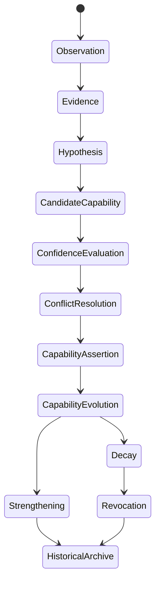
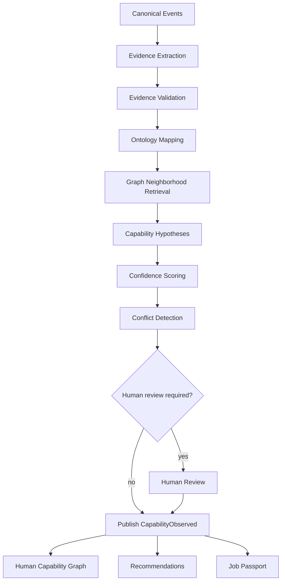
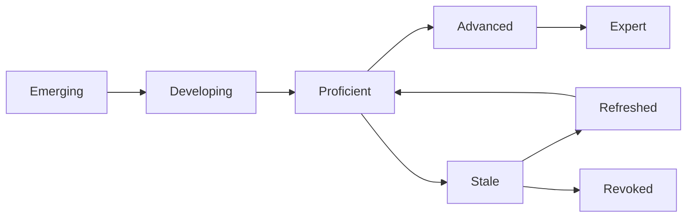
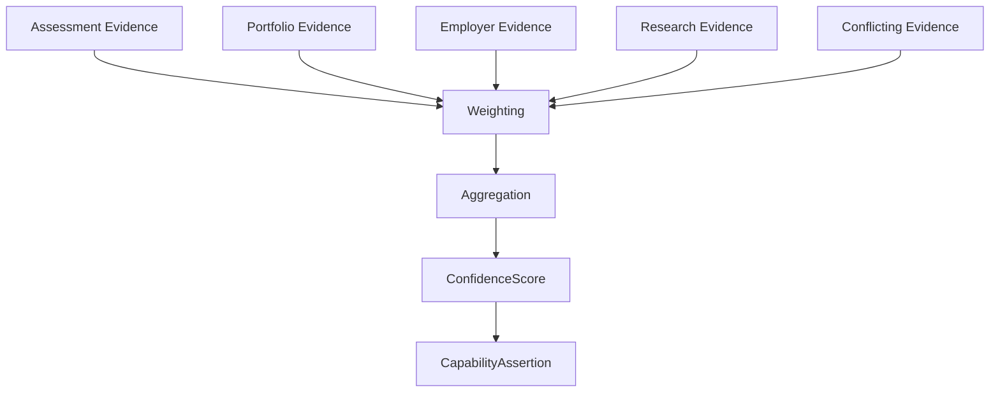
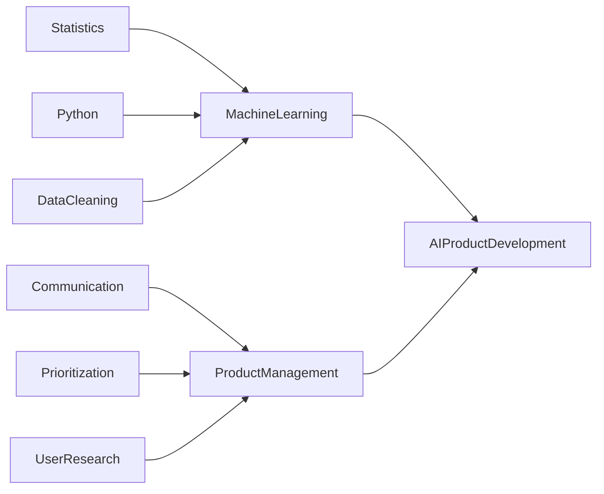
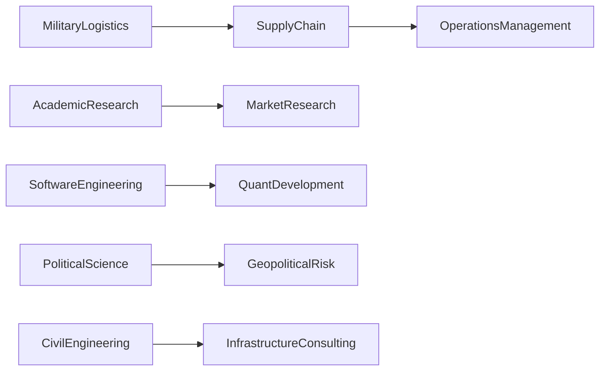
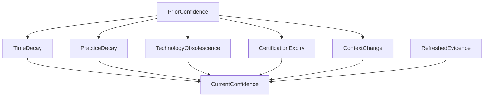
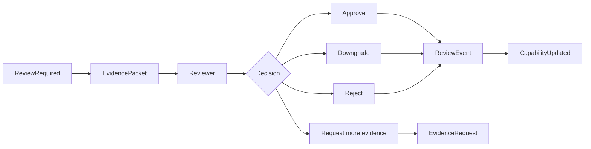

# INF-001 — Syrka Capability Inference Constitution

Status: Constitutional Engineering Specification  
Version: 1.0  
Date: 2026-07-08  
Builds upon: Product Suite; ADR-001 — Open Source LMS Foundation; ADR-002 — Domain Architecture & Bounded Contexts; CEA-001 — Canonical Event Architecture; ONT-001 — Ontology Constitution; GRAPH-001 — Human Capability Graph Specification; REASON-001 — Evidence & Reasoning Constitution  
Decision owners: AI Science / Knowledge Engineering / Ontology / ML Architecture / Platform Architecture / Research  
Scope: Capability definitions, lifecycle, inference pipeline, evidence aggregation, evolution, dependencies, similarity, transfer, decay, verification, AI independence, human oversight, explainability, examples, and governance

## 1. Executive Overview

Capability inference is Syrka's central intelligence layer. It is the process that transforms educational activity, assessments, projects, research, professional evidence, credentials, employer signals, and canonical events into evidence-backed capability assertions that can power learning recommendations, career intelligence, employer matching, workforce planning, government analytics, and the Syrka Job Passport.

Capability inference is distinct from adjacent layers:

| Layer | Responsibility | What it does not do |
|---|---|---|
| Ontology | Defines what concepts mean. | Does not decide whether a person has a capability. |
| Evidence & Reasoning | Defines how Syrka reasons from evidence. | Does not own capability lifecycle state. |
| Human Capability Graph | Represents semantic relationships over time. | Does not independently invent conclusions. |
| Capability Inference | Converts evidence into capability observations, confidence updates, recommendations, and passport-eligible claims. | Does not redefine ontology or bypass reasoning rules. |
| AI models | Assist extraction, classification, mapping, scoring, and explanation. | Are not constitutional sources of truth. |

The inference layer transforms educational data into workforce intelligence by converting raw learning and activity events into portable, context-aware, evidence-backed capability claims. A course completion is not a capability. A grade is not a capability. A GitHub repository is not a capability. A capability emerges only when evidence is mapped to ontology concepts, evaluated for relevance and quality, placed in graph context, scored for confidence, checked for contradiction, and published as a canonical capability event.

Constitutional premise:

```text
Evidence + Ontology + Graph Context + Reasoning Rules + Confidence Model + Review Policy
  → Capability Observation / Capability Update / Recommendation / Passport Claim
```

## 2. Capability Definition

| Term | Canonical definition | Example | Counterexample |
|---|---|---|---|
| Capability | Evidence-backed, context-aware ability to perform actions, solve problems, produce outcomes, or exercise judgment at stated confidence. | Can design normalized relational database schemas in academic project context. | "Completed Database 101" without assessed evidence. |
| Capability Observation | A temporal evidence-backed observation that a subject demonstrates or may demonstrate a capability. | `CapabilityObserved` from graded schema project. | A static skill label on a profile. |
| Capability Assertion | Accepted claim that a subject has a capability in a context with confidence/provenance. | Passport claim for SQL data modeling at Strong confidence. | LLM free-text claim with no evidence. |
| Capability State | Current graph projection of capability confidence, evidence, validity, and status. | active, strong, verified, stale, revoked. | Raw event stream. |
| Capability Confidence | Calibrated support level for a capability assertion under uncertainty. | 0.84 Strong. | Grade percentage copied as confidence. |
| Capability Strength | Practical robustness of capability across difficulty, contexts, and evidence diversity. | Strong across coursework, project, and internship. | One easy quiz result. |
| Capability Context | Conditions under which capability is believed to hold. | academic, production, clinical, regulated jurisdiction. | Universal claim without boundaries. |
| Capability Freshness | Current relevance of evidence supporting a capability. | Cloud certification renewed this year. | Five-year-old framework knowledge in obsolete version. |
| Capability Evolution | Change in capability state over time. | Emerging → Supported → Strong. | Overwriting old state. |
| Capability Decay | Reduction in confidence due to time, disuse, obsolescence, contradiction, or context shift. | Legacy AngularJS skill decays for modern frontend roles. | Deleting prior evidence. |
| Capability Revocation | Invalidation or removal of current positive support due to revoked evidence, fraud, policy, or review. | Revoked credential removes passport support. | Hiding inconvenient evidence. |
| Capability Transferability | Degree to which capability in one context supports another context. | Military logistics supports supply-chain operations. | Assuming all leadership transfers equally. |
| Capability Similarity | Semantic closeness between capabilities based on ontology, evidence, tasks, tools, and outcomes. | Python and Java share programming foundations but differ ecosystems. | Treating Python and accounting as similar due to same course. |
| Capability Hierarchy | Parent/child organization of capabilities. | Data engineering contains pipeline design. | Job title hierarchy. |
| Capability Dependency | Required or supporting capability relationship. | Machine learning requires statistics and programming. | Skill popularity correlation. |
| Capability Composite | Capability composed of multiple capabilities, skills, knowledge, and behaviors. | Product management combines research, prioritization, communication. | Single isolated task. |
| Capability Gap | Difference between observed capability state and required target state. | Missing clinical license for residency pathway. | Low self-esteem. |
| Capability Potential | Plausible future capability under defined support and learning conditions. | High potential for AI after math/programming evidence. | Verified capability. |
| Capability Readiness | Degree to which capability/profile satisfies requirements for action, role, credential, or mobility route. | Ready for junior data analyst role. | Interest in data science. |
| Capability Risk | Risk that a capability claim is overstated, stale, biased, context-mismatched, or unsupported. | High risk from self-report-only claim. | Low confidence itself without reason. |
| Capability Verification | Confirmation of evidence/claim by trusted process, issuer, employer, expert, or government. | Professional license verified. | Course page viewed. |
| Capability Validation | Check that inference conforms to ontology, evidence rules, schemas, thresholds, and policy. | Schema and rule validation before `CapabilityObserved`. | Model output accepted directly. |

## 3. Capability Lifecycle

```text
Observation
  ↓
Evidence
  ↓
Hypothesis
  ↓
Candidate Capability
  ↓
Confidence Evaluation
  ↓
Conflict Resolution
  ↓
Capability Assertion
  ↓
Capability Evolution
  ↓
Capability Strengthening
  ↓
Capability Decay
  ↓
Capability Revocation
  ↓
Historical Archive
```

| Stage | Meaning | Events/graph objects | Rule |
|---|---|---|---|
| Observation | Syrka captures something that happened. | canonical events, observation nodes | Not a conclusion. |
| Evidence | Observation/artifact becomes relevant to a claim. | Evidence node, `DERIVED_FROM` | Must have provenance. |
| Hypothesis | System proposes possible capability. | candidate inference object | Not user-facing as verified claim. |
| Candidate Capability | Hypothesis mapped to ontology concept/context. | capability concept, context | Requires ontology version. |
| Confidence Evaluation | Evidence is scored and aggregated. | ConfidenceScore | Must be calibrated and explainable. |
| Conflict Resolution | Contradictions are represented and evaluated. | `CONTRADICTS`, review flags | Conflicts never hidden. |
| Capability Assertion | Accepted capability observation is published. | `CapabilityObserved`, HCG assertion | Requires evidence and provenance. |
| Capability Evolution | State changes with new evidence. | `CapabilityUpdated`, supersession edges | Append-only history. |
| Capability Strengthening | Confidence/strength increases through evidence. | updated confidence | Requires non-redundant support. |
| Capability Decay | Confidence decreases due to staleness/change. | decay event/update | Capability-specific decay rules. |
| Capability Revocation | Current assertion invalidated. | revocation/correction event | History preserved. |
| Historical Archive | Past state retained for audit/explanation. | snapshots/events | Reproducible from event store. |

## 4. Inference Pipeline

### 4.1 Inputs

| Input | Purpose |
|---|---|
| Canonical Events | Immutable facts such as `AssignmentGraded`, `GitHubRepositoryLinked`, `CredentialVerified`. |
| Human Capability Graph | Existing capability, evidence, ontology, occupation, and opportunity context. |
| Ontology | Canonical meaning of capabilities, dependencies, similarity, hierarchy, and standards. |
| Evidence | Validated artifacts, assessments, credentials, reviews, research, projects, work signals. |
| Market Signals | Demand, salary, occupation requirements, emerging skills, disruption signals. |
| Career Intent | User goals, preferences, geography, industry, salary, constraints. |
| Human Review | Faculty, employer, peer, expert, government, or student challenge outcomes. |

### 4.2 Outputs

| Output | Meaning |
|---|---|
| Capability Assertions | Accepted evidence-backed claims with context/confidence/provenance. |
| Confidence Updates | Changes to capability confidence, strength, decay, or risk. |
| Recommendations | Learning, career, evidence collection, opportunity, or mobility suggestions. |
| Job Passport Claims | Portable claims that meet passport inclusion thresholds and disclosure policy. |
| Learning Path Suggestions | Actions to close capability gaps or increase confidence. |

### 4.3 Pipeline stages

```text
1. Ingest canonical event
2. Validate event and evidence references
3. Extract evidence features
4. Map evidence to ontology concepts
5. Retrieve graph neighborhood
6. Generate capability hypotheses
7. Score evidence and confidence
8. Detect conflicts and decay
9. Apply policy/human-review gates
10. Publish capability events
11. Update graph projections
12. Trigger recommendations/passport updates
```

No stage may bypass canonical events, ontology, graph provenance, or reasoning rules.

## 5. Evidence Aggregation

### 5.1 Combination rules

| Pattern | Effect on confidence |
|---|---|
| Multiple independent strong evidence items | Significant confidence increase. |
| Repeated identical weak signals | Small increase, quickly saturates. |
| Duplicate evidence from same source | Deduplicated or heavily discounted. |
| Evidence across contexts | Increases transferability and strength. |
| Evidence covering all required sub-capabilities | Increases composite capability confidence. |
| Missing required component | Caps confidence for composite capability. |
| Strong contradiction | Reduces confidence and may trigger review. |
| Revoked evidence | Removed from positive support; may create contradiction. |
| Expired evidence | Supports history, weakens current confidence. |
| Refreshed evidence | Restores or increases freshness/confidence. |

### 5.2 Aggregation formula family

A capability confidence function must be versioned and reproducible:

```text
C(capability, subject, context, t) = aggregate(
  weighted_supporting_evidence,
  weighted_conflicting_evidence,
  required_component_coverage,
  source_trust,
  evidence_independence,
  freshness,
  context_match,
  calibration_adjustment,
  human_review_adjustment
)
```

Aggregation is not a naive average. It must account for the weakest required component, evidence diversity, contradiction, and uncertainty.

### 5.3 Evidence expiry and refresh

- Evidence expiry is capability-specific and jurisdiction-specific where required.
- Expiry does not delete historical capability; it lowers current confidence.
- Refresh occurs when new evidence confirms continued capability in a relevant context.
- Refreshed evidence must be independent enough to avoid artificial confidence inflation.

## 6. Capability Evolution

| Evolution driver | Effect | Example |
|---|---|---|
| Practice | Increases confidence/strength if practice is relevant and non-trivial. | repeated clinical simulations. |
| Feedback | Improves capability when followed by better evidence. | rubric feedback then improved project. |
| Work experience | Strengthens context-specific capability. | production incidents resolved. |
| Research output | Strengthens research/analytical capability. | publication with clear contribution. |
| Forgetting/disuse | Causes decay when capability requires active practice. | unused language fluency. |
| Technological change | Obsoletes or narrows capability. | old framework version. |
| Industry evolution | Changes capability relevance or requirements. | AI changes data analyst role. |
| Credential renewal | Refreshes verified support. | safety certification renewed. |
| Revocation/fraud | Reduces or invalidates support. | plagiarized project discovered. |

Capability maturity bands:

| Maturity | Meaning |
|---|---|
| Exposed | Person has encountered concept; no performance evidence. |
| Emerging | Early evidence exists; limited context. |
| Developing | Multiple evidence items; gaps remain. |
| Proficient | Reliable performance in defined context. |
| Advanced | Strong performance across varied contexts. |
| Expert | Sustained high-confidence capability with transfer, judgment, and recognition. |
| Stale | Historical evidence exists but current confidence decayed. |
| Revoked | Positive assertion invalidated for current use. |

## 7. Capability Dependencies

| Dependency type | Definition | Rule |
|---|---|---|
| Prerequisite capability | Required before target can be credibly performed. | Caps target confidence if missing. |
| Supporting capability | Increases likelihood/quality but not strictly required. | Adds support but does not cap alone. |
| Composite capability | Capability composed of multiple capabilities/skills/knowledge. | Confidence depends on coverage and weakest critical component. |
| Transferable capability | Capability reusable across contexts. | Requires context similarity and transfer evidence. |
| Specialized capability | Capability tied to narrow domain/tool/jurisdiction. | Transfer is limited. |
| General capability | Broad capability applicable across many contexts. | Requires diverse evidence to avoid vagueness. |
| Hidden capability | Capability suggested indirectly by evidence. | Must remain hypothesis until direct/strong support exists. |
| Latent capability | Potential capability not yet demonstrated. | Cannot be passport claim; can guide recommendations. |

Dependency rules:

1. Required dependencies may cap confidence.
2. Supporting dependencies may increase confidence but cannot prove target alone.
3. Composite capabilities require explicit component coverage.
4. Latent/hidden capabilities must not be represented as verified capability.
5. Dependency graphs are ontology-versioned.

## 8. Capability Similarity

Similarity is semantic, not label-based. It uses ontology distance, shared prerequisites, shared tools, task overlap, evidence transfer, industry context, and historical transition outcomes.

| Pair | Similarity rationale | Transfer caution |
|---|---|---|
| Python ↔ Java | Shared programming concepts, OOP, debugging, software design. | Syntax/ecosystem/tooling differ. |
| Statistics ↔ Econometrics | Shared probability, regression, inference. | Econometrics has domain assumptions and causal methods. |
| Leadership ↔ Team Management | Shared coordination, communication, accountability. | Leadership scope may exceed team operations. |
| OSINT ↔ Intelligence Analysis | Shared evidence collection, source evaluation, inference. | Legal/security context differs. |
| Urban Planning ↔ Urban Regeneration | Shared spatial, policy, community, infrastructure concepts. | Regeneration includes finance, redevelopment, stakeholder delivery. |

Similarity metrics:

```text
similarity = ontology_overlap + prerequisite_overlap + task_overlap + tool_overlap + evidence_transfer_rate + market_transition_success - context_penalty
```

Similarity must produce explanation, not only score.

## 9. Capability Transfer

Capability transfer is inference that evidence in one context supports capability in another context.

| Transfer example | Transferable elements | Required caution |
|---|---|---|
| Military logistics → Supply Chain | planning, coordination, inventory, risk, operations. | civilian systems, commercial metrics, software tools. |
| Academic research → Market Research | literature review, methods, data analysis, writing. | customer/business context and speed. |
| Software Engineering → Quantitative Development | programming, algorithms, testing, systems thinking. | finance math, risk, low-latency or quant methods. |
| Political Science → Geopolitical Risk | institutions, policy analysis, qualitative reasoning. | market/security forecasting and data sources. |
| Civil Engineering → Infrastructure Consulting | infrastructure systems, project constraints, regulation. | client advisory, finance, strategy consulting. |

Transfer rules:

1. Transfer never creates verified capability by itself.
2. Transfer creates hypotheses or lower-confidence support unless direct evidence exists.
3. Transfer confidence decays with context distance.
4. Transfer requires ontology path and evidence path.
5. High-impact transfer claims require human/expert review.

## 10. Capability Decay

| Decay type | Trigger | Effect |
|---|---|---|
| Time decay | Evidence age exceeds freshness window. | Confidence decreases gradually or sharply by capability. |
| Practice decay | No recent performance/practice. | Practical capability weakens. |
| Knowledge obsolescence | Domain knowledge changes. | Older evidence loses relevance. |
| Certification expiry | Credential expires. | Verified support removed for current claims. |
| Industry disruption | Market requirements change. | Context match decreases. |
| Technology shift | Tools/frameworks/languages change. | Tool-specific capability decays. |
| Skill atrophy | Human performance declines without use. | Confidence and readiness decrease. |
| Context change | New jurisdiction/role/domain. | Transferability and readiness decrease. |

Decay rule:

```text
current_confidence = prior_confidence × freshness_factor × practice_factor × context_factor × technology_relevance × contradiction_factor
```

Decay must be explainable and reversible through refreshed evidence.

## 11. Capability Verification

Verification strength ranking from weakest to strongest by default:

| Rank | Verification type | Strength | Notes |
|---:|---|---|---|
| 1 | Self-reported capability | Very weak | Can seed hypotheses only. |
| 2 | Behavioral/passive evidence | Weak | Attendance/views/discussion need caution. |
| 3 | Portfolio-backed capability | Medium | Depends on authenticity and review. |
| 4 | Assessment-backed capability | Medium-strong | Depends on assessment validity and difficulty. |
| 5 | Peer-reviewed capability | Medium-strong | Depends on peer trust and bias controls. |
| 6 | Research-backed capability | Strong | Requires authorship/contribution clarity. |
| 7 | Employer-verified capability | Strong | Context-specific; bias checks required. |
| 8 | Government-recognized capability | Very strong for regulated context | Jurisdiction-specific. |
| 9 | Professional-license capability | Very strong when current | Strong for regulated practice; may not cover all capabilities. |

Verification is claim-specific. A professional license may strongly verify legal eligibility but only partially support a specific technical capability.

## 12. AI Independence

AI providers may participate in inference by extracting evidence, mapping ontology concepts, proposing hypotheses, summarizing artifacts, detecting conflicts, estimating similarity, or drafting explanations. Providers remain subordinate to this constitution.

Rules:

1. GLM, Claude, GPT, Gemini, and future models are interchangeable adapters.
2. Model output is candidate evidence/reasoning, not accepted capability.
3. Model-specific confidence is not Syrka confidence.
4. Every model output must cite evidence IDs and ontology concept IDs.
5. Provider replacement requires regression tests on capability inference benchmarks.
6. No downstream passport, graph, or recommendation service may require provider-specific opaque fields.
7. AI-derived high-impact claims require policy gates and possibly human review.

## 13. Human Oversight

| Oversight type | Purpose | Constitutional rule |
|---|---|---|
| Faculty review | Validate educational evidence and assessment interpretation. | Review event required; cannot erase history. |
| Employer review | Validate workplace evidence and role performance. | Must record employer context and potential bias. |
| Student appeal | Allow challenge of evidence/inference/passport claim. | Must provide resolution and graph update. |
| Government review | Validate regulated mobility/credential recognition. | Jurisdiction overlay applies. |
| Expert adjudication | Resolve domain-specific ambiguity. | Expert identity and rationale recorded. |
| Capability correction | Correct mapping, evidence, or confidence error. | Publish correction/supersession event. |
| Capability revocation | Invalidate current claim. | Preserve historical assertion with revoked status. |
| Human override | Override model/rule output. | Must include rationale and reviewer authority. |

Oversight preserves provenance by creating new canonical events and graph assertions. It never deletes inconvenient history.

## 14. Explainability

Every inferred capability must answer:

| Question | Required content |
|---|---|
| What evidence created it? | Evidence IDs, artifacts, assessments, credentials, reviews. |
| What evidence contradicts it? | Contradictory evidence IDs and handling rationale. |
| Why does Syrka believe it exists? | Reasoning summary, evidence weights, ontology mapping. |
| What ontology concepts were used? | Concept IDs and ontology version. |
| Which graph paths were traversed? | HCG path summary or query trace. |
| What confidence exists? | Score, band, model/rule version, calibration status. |
| What uncertainty remains? | Missing evidence, stale evidence, context limitations, model disagreement. |
| What review history exists? | Human review, appeal, correction, revocation events. |

Minimum capability inference record:

```json
{
  "capability_observation_id": "cap_obs_001",
  "subject_id": "person_123",
  "capability_id": "capability:sql_data_modeling",
  "context": "academic database project",
  "confidence": { "score": 0.84, "band": "Strong", "model": "confidence@1.0.0" },
  "evidence_ids": ["evidence_assignment_789", "artifact_schema_project"],
  "contradictions": [],
  "ontology_version": "1.0.0",
  "graph_paths": ["Person->CapabilityObservation->Evidence->CanonicalEvent"],
  "source_event_ids": ["AssignmentSubmitted:abc", "AssignmentGraded:def"],
  "uncertainty": ["academic context, not production setting"],
  "review_history": []
}
```

## 15. Mermaid Diagrams

### 15.1 Capability lifecycle



### 15.2 Inference pipeline



### 15.3 Capability evolution



### 15.4 Evidence aggregation



### 15.5 Capability dependency graph



### 15.6 Capability transfer graph



### 15.7 Capability decay model



### 15.8 Human review workflow



## 16. Constitutional Examples

### 16.1 Student completing an economics degree

| Step | Example |
|---|---|
| Canonical events | `CourseCompleted`, `AssignmentGraded`, `ResearchPublished`, `CredentialVerified`. |
| Evidence | econometrics exams, thesis, data analysis project, degree credential. |
| Ontology mappings | statistics, econometrics, policy analysis, research methods. |
| Graph mutations | Evidence nodes link to CapabilityObservations for statistical analysis and economic reasoning. |
| Reasoning | Strong assessed evidence supports academic economics capability; limited workplace evidence creates uncertainty. |
| Inference | `CapabilityObserved: econometric_modeling` at Strong confidence. |
| Confidence evolution | increases after thesis/project; decays if no recent analytical work. |
| Recommendations | market research internship, policy analyst role, data analytics bridge. |
| Passport updates | include verified degree and econometrics capability with evidence trail. |

### 16.2 Software engineer building open-source projects

| Step | Example |
|---|---|
| Canonical events | `GitHubRepositoryLinked`, `CommitObserved`, `PullRequestMerged`, `ProjectCompleted`. |
| Evidence | merged PRs, tests, architecture docs, issue discussions. |
| Ontology mappings | software design, testing, collaboration, API design. |
| Graph mutations | repositories and artifacts evidence engineering capabilities. |
| Reasoning | Independent code evidence supports applied engineering; lack of employer review limits production confidence. |
| Inference | API design and testing capabilities Supported/Strong depending project quality. |
| Confidence evolution | strengthens with reviews, stars not treated as direct capability evidence. |
| Recommendations | backend role, open-source fellowship, production internship. |
| Passport updates | include selected repositories with contribution provenance. |

### 16.3 Medical student entering residency

| Step | Example |
|---|---|
| Canonical events | `AssessmentGraded`, `ClinicalRotationCompleted`, `CredentialVerified`. |
| Evidence | exams, OSCEs, supervised rotations, medical degree. |
| Ontology mappings | clinical reasoning, patient communication, procedural knowledge. |
| Graph mutations | supervised evidence links to clinical capability observations. |
| Reasoning | Regulated context requires verified credentials and jurisdiction rules. |
| Inference | clinical readiness capability only after supervised/verified evidence. |
| Confidence evolution | decays for procedures without recent practice. |
| Recommendations | residency pathways, remediation for weak rotations. |
| Passport updates | include regulated credential claims only if verified. |

### 16.4 Researcher publishing papers

| Step | Example |
|---|---|
| Canonical events | `ResearchPublished`, `ResearchCapabilityMapped`, `ORCIDLinked`. |
| Evidence | publications, datasets, citations, coauthor roles. |
| Ontology mappings | research design, methodology, domain knowledge. |
| Graph mutations | publication evidence supports research capability with authorship confidence. |
| Reasoning | Authorship contribution must be clear; citations are impact signals, not capability proof alone. |
| Inference | research design capability Strong if repeated and reviewed. |
| Confidence evolution | strengthens with independent publications and grants. |
| Recommendations | lab collaborations, grants, expert roles. |
| Passport updates | include selected publications and mapped research capabilities. |

### 16.5 Construction worker gaining certifications

| Step | Example |
|---|---|
| Canonical events | `CredentialVerified`, `EmployerEvidenceVerified`, `ProjectCompleted`. |
| Evidence | safety certificates, site supervisor review, completed projects. |
| Ontology mappings | safety compliance, equipment operation, site coordination. |
| Graph mutations | credential and employer evidence support regulated capability. |
| Reasoning | Certification expiry sharply affects current verified capability. |
| Inference | safety compliance capability Verified while credential current. |
| Confidence evolution | decays at expiry; refreshed by renewal. |
| Recommendations | renewal training, higher-responsibility roles. |
| Passport updates | include license/cert with expiry and verification status. |

### 16.6 Military officer transitioning to civilian employment

| Step | Example |
|---|---|
| Canonical events | `ProfessionalExperienceObserved`, `CredentialVerified`, `EmployerInterested`. |
| Evidence | service record, logistics projects, leadership reviews. |
| Ontology mappings | operations planning, logistics, leadership, risk management. |
| Graph mutations | military capabilities linked to civilian transfer hypotheses. |
| Reasoning | Transfer to supply chain is plausible but context gap remains. |
| Inference | logistics planning Strong; civilian supply-chain readiness Supported until direct evidence. |
| Confidence evolution | strengthens with civilian certifications/projects. |
| Recommendations | supply-chain certification, operations roles. |
| Passport updates | include transfer explanation and context limitations. |

### 16.7 Entrepreneur building startups

| Step | Example |
|---|---|
| Canonical events | `ProjectCompleted`, `EmployerEvidenceVerified`, `PortfolioGenerated`. |
| Evidence | product launches, revenue, customer interviews, team building. |
| Ontology mappings | product strategy, sales, leadership, financial planning. |
| Graph mutations | startup artifacts and outcomes support composite capabilities. |
| Reasoning | Outcomes matter but attribution and survivorship bias considered. |
| Inference | entrepreneurial execution capability Strong with validated outcomes. |
| Confidence evolution | strengthens across multiple ventures or reviewed outcomes. |
| Recommendations | venture roles, product leadership, incubators. |
| Passport updates | include projects and measurable outcomes. |

### 16.8 Career switch from finance to AI

| Step | Example |
|---|---|
| Canonical events | `CourseCompleted`, `AssignmentGraded`, `ProjectCompleted`, `CareerIntentUpdated`. |
| Evidence | statistics background, Python projects, ML coursework, portfolio. |
| Ontology mappings | finance analytics, statistics, Python, machine learning. |
| Graph mutations | finance capabilities connected to AI transfer hypotheses. |
| Reasoning | Statistical reasoning transfers; ML production evidence still required. |
| Inference | data analysis Strong; ML engineering Emerging/Supported depending projects. |
| Confidence evolution | strengthens with deployed AI projects and reviews. |
| Recommendations | ML portfolio projects, AI analyst roles, bridge curriculum. |
| Passport updates | include transferable analytics capabilities and AI learning evidence. |

## 17. Governance

| Governance area | Rule |
|---|---|
| Inference rule ownership | AI Platform Team owns implementation; Ontology, Graph, Reasoning, Security, and domain owners approve constitutional semantics. |
| Rule evolution | Rules are versioned and require regression tests before production. |
| Versioning | Inference models, confidence functions, evidence weights, prompts, and policy gates have independent versions. |
| Regression testing | Test sets cover evidence sufficiency, contradiction, decay, transfer, jurisdiction, bias, and revocation. |
| Bias monitoring | Evaluate outcomes by cohort, institution, country, language, accessibility, gender where legally/ethically permitted, and socioeconomic proxy where appropriate. |
| Fairness evaluation | High-impact inference must measure disparate error, false positives, false negatives, and appeal outcomes. |
| Jurisdiction overlays | Local regulations affect verification/readiness, not global concept definitions. |
| Institution overlays | Institutional rubrics and mappings may specialize evidence, not redefine capability. |
| Policy overrides | Overrides publish canonical events and preserve prior history. |

Change process:

1. Propose inference rule/model change.
2. Identify affected capabilities, evidence types, graph paths, and products.
3. Run regression and fairness tests.
4. Review with Ontology, Graph, Reasoning, Security/Privacy, and domain owners.
5. Dual-run against prior version where high-impact.
6. Publish versioned release notes and migration/replay plan.
7. Monitor drift, appeals, and outcome quality.

## 18. Final Decision

INF-001 establishes how Syrka infers human capability. Capabilities are never declared by users, courses, LMSs, credentials, or AI models alone. They emerge through evidence-backed, ontology-grounded, graph-aware, confidence-scored, reviewable, reproducible inference.

This constitution governs capability inference, learning recommendations, career intelligence, employer matching, workforce planning, government analytics, and Job Passport generation. Every capability can be challenged, reviewed, strengthened, weakened, transferred, decayed, or revoked while preserving historical provenance and independence from any AI provider or LMS implementation.
