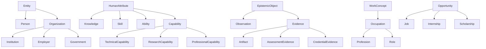
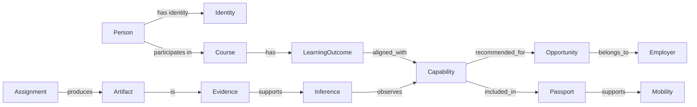
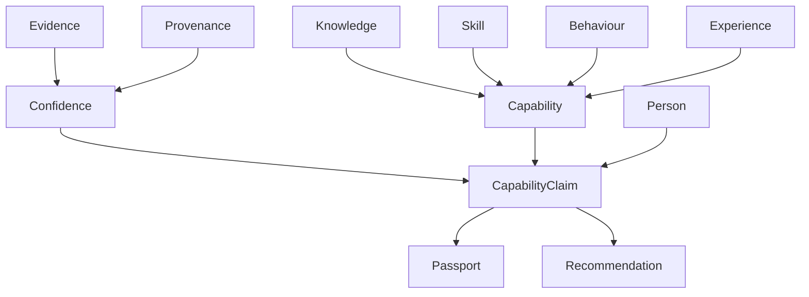
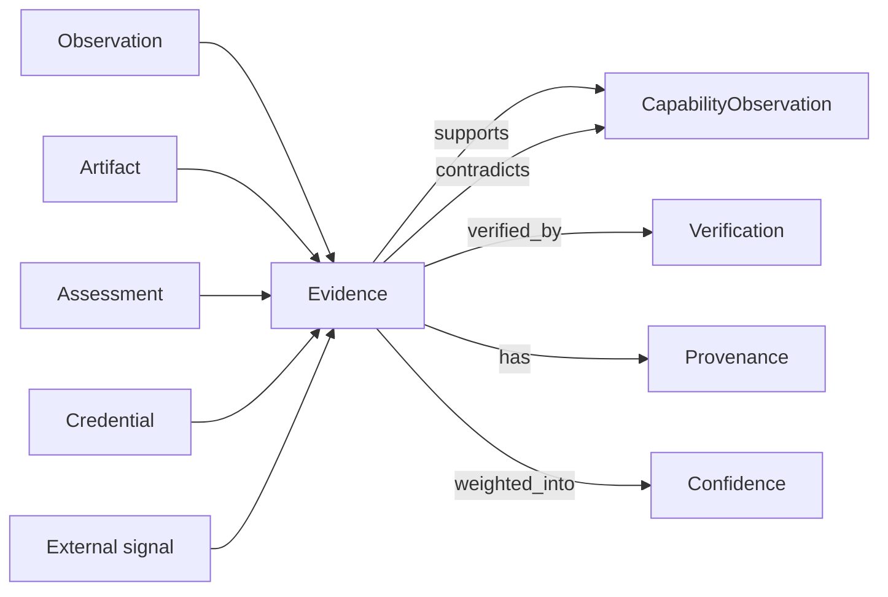
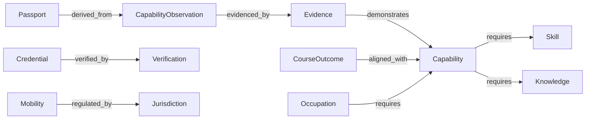
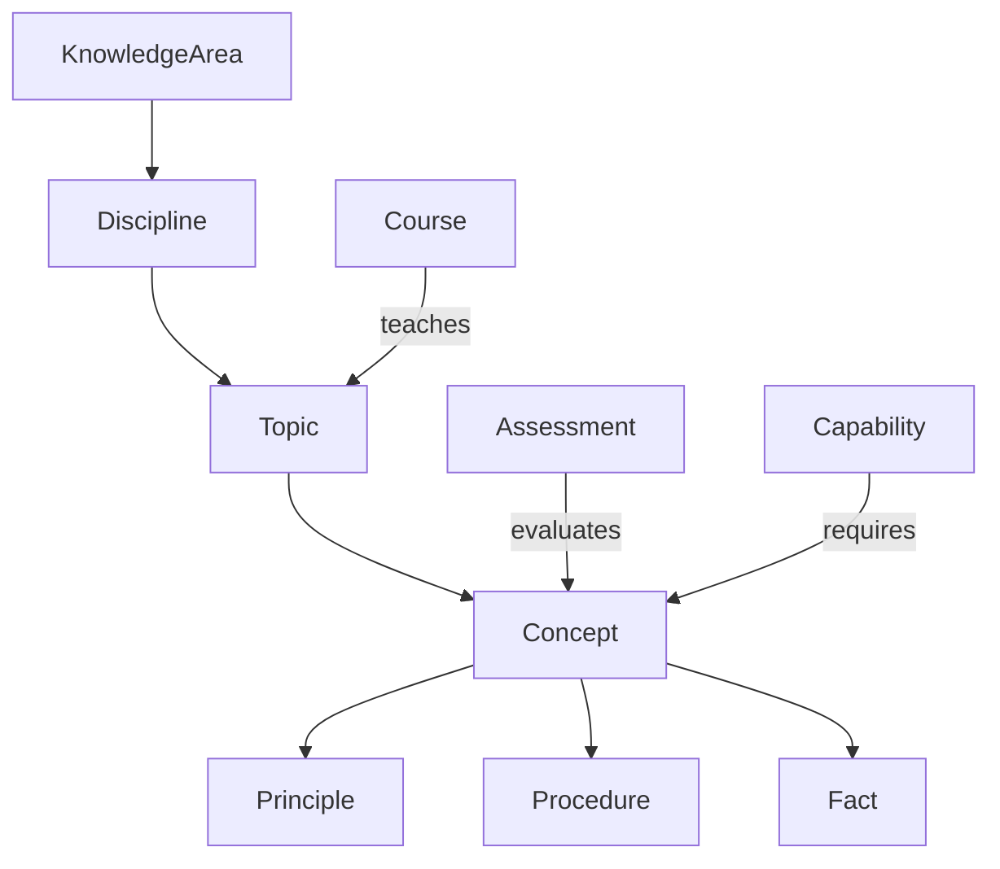
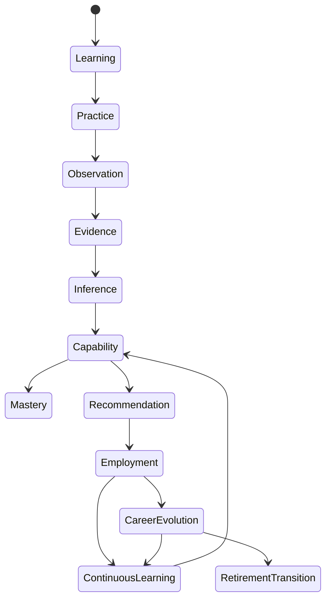
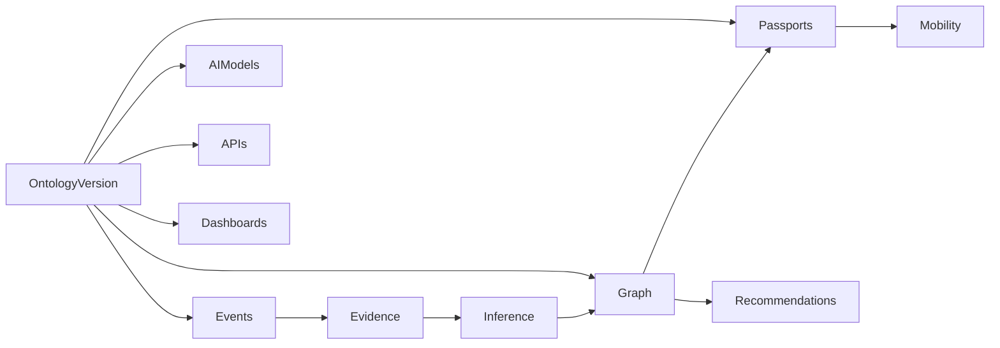

# ONT-001 — Syrka Ontology Constitution

Status: Constitutional Engineering Specification  
Version: 1.0  
Date: 2026-07-08  
Builds upon: Product Suite; ADR-001 — Open Source LMS Foundation; ADR-002 — Domain Architecture & Bounded Contexts; CEA-001 — Canonical Event Architecture  
Decision owners: Ontology / AI Architecture / Knowledge Engineering / Platform Architecture  
Scope: Canonical semantic definitions, relationships, capability model, evidence model, confidence model, graph semantics, AI semantics, ontology versioning, governance, and implementation examples

## 1. Executive Overview

Syrka's ontology is the semantic constitution of the platform. It defines what every important concept means before those concepts appear in APIs, events, databases, dashboards, AI prompts, graph nodes, vector indexes, credentials, passports, employer workflows, government reports, or cross-border mobility decisions.

Ontology is the foundation of Syrka because Syrka's product does not merely store educational records. Syrka models human capability. Every system ultimately answers one question:

> **What can this person credibly do?**

To answer that question, Syrka must define the difference between a person, identity, course, learning outcome, skill, knowledge, competency, capability, assessment, evidence, confidence, credential, occupation, job, mobility route, and national strategy. Without canonical definitions, AI systems infer from ambiguous labels; dashboards display inconsistent metrics; employers misread passports; governments compare incompatible signals; and LMS data leaks implementation-specific meaning into Syrka's intelligence layer.

Semantic consistency matters because Syrka is a distributed, AI-native, event-driven system. Events are immutable, but their meaning is only stable if the ontology behind them is stable. `CapabilityObserved` is useful only if the term `Capability` has one canonical meaning. `CredentialVerified` is useful only if `Credential`, `Verification`, and `Trust` have formal boundaries. `OpportunityMatched` is useful only if `Opportunity`, `Occupation`, `Career Intent`, and `Capability Gap` are defined consistently.

AI requires formal definitions rather than informal labels because language models are probabilistic and context-sensitive. A label like "communication" can mean verbal fluency, written clarity, persuasion, multilingual translation, team coordination, or stakeholder management. Syrka's ontology disambiguates concepts, constrains reasoning, requires evidence, records provenance, and forces every inference to cite the semantic version used.

Ontology differs from adjacent artifacts:

| Artifact | Purpose | Source of truth? | Example |
|---|---|---:|---|
| Ontology | Defines meaning, concepts, relationships, constraints | Yes, for semantics | `Capability is an evidence-backed ability to perform in context` |
| Taxonomy | Hierarchical classification | No, partial semantic structure | skill categories, industry families |
| Database | Stores records and state | Yes, for stored data only | `capability_observations` table |
| API | Contract for interaction | Yes, for interface shape | `/ontology/terms` |
| Event | Immutable business fact | Yes, for occurrence | `CapabilityObserved` |
| Graph | Connected representation of entities/relationships | Derived from ontology and events | person-demonstrates-capability |
| AI prompt | Runtime instruction to model | No | rubric reasoning prompt |
| Dashboard | Presentation/read model | No | capability heatmap |

The ontology is technology-independent, LMS-independent, country-independent, and institution-independent. Open edX, Canvas, Moodle, a graph database, PostgreSQL, vector indexes, and AI providers may all implement or consume ontology concepts; none may redefine them.

## 2. Philosophical Foundations

| Concept | Canonical definition | Justification and boundary |
|---|---|---|
| Reality | The set of states, events, entities, constraints, and relationships that exist independently of Syrka's representation. | Syrka models reality; it does not create it. A student may be capable even before Syrka observes evidence. |
| Knowledge | Structured understanding of facts, concepts, principles, procedures, and relationships that can inform action or judgment. | Knowledge may exist without demonstrated performance. It is necessary but not sufficient for capability. |
| Learning | A process through which a person changes knowledge, skill, behavior, judgment, or capability through study, practice, experience, feedback, or reflection. | Learning is a process, not proof. Evidence of learning may support capability inference. |
| Competence | A recognized level of adequacy against a defined standard, context, or role expectation. | Competence is standard-relative. It may be institutional, professional, or regulatory. |
| Capability | An evidence-backed, context-aware ability of a person or group to perform actions, solve problems, produce outcomes, or exercise judgment at a stated confidence level. | Capability is Syrka's primary object. It requires evidence, context, provenance, and confidence. |
| Skill | A learned capacity to perform a specific task, technique, operation, or behavior. | A skill is narrower than capability. Multiple skills plus knowledge and judgment may compose a capability. |
| Intelligence | The capacity to acquire, integrate, reason over, and apply knowledge and evidence to produce adaptive behavior or decisions. | Syrka models intelligence operationally through evidence and explainable decisions, not as a fixed human trait. |
| Evidence | A provenance-bearing observation, artifact, assessment, credential, or external signal that can support or weaken a claim. | Evidence is not identical to truth. It affects confidence. |
| Observation | A captured event or signal that something occurred. | Observations become evidence only when relevant to a claim. |
| Truth | The degree to which a claim corresponds to reality. | Syrka does not assert absolute truth for capabilities; it maintains evidence-backed confidence. |
| Confidence | A calibrated estimate that a claim is supported by available evidence under known uncertainty. | Confidence is not certainty. It must include source, model, and evidence context. |
| Uncertainty | The known or unknown limitations affecting confidence, including missing data, ambiguous evidence, model error, recency, bias, and context mismatch. | Uncertainty must be represented explicitly to prevent overclaiming. |
| Explainability | The ability to show why a conclusion was reached, including evidence, ontology version, reasoning path, model/rule version, assumptions, and limitations. | AI outputs without explanation cannot drive high-impact Syrka decisions. |
| Human Potential | The plausible future capability a person may develop under certain learning, practice, support, context, and opportunity conditions. | Potential is prospective and uncertain. It must not be represented as verified capability. |

## 3. Core Ontology

### 3.1 Concept record format

Every canonical ontology concept is represented as a versioned concept record:

```json
{
  "concept_id": "ont:capability",
  "label": "Capability",
  "definition": "An evidence-backed, context-aware ability...",
  "version_introduced": "1.0.0",
  "status": "active",
  "parents": ["ont:human_attribute"],
  "children": ["ont:technical_capability", "ont:research_capability"],
  "synonyms": ["demonstrated capability"],
  "deprecated_terms": ["skill score"],
  "external_mappings": [
    { "standard": "ESCO", "relation": "broader_than", "target": "skill/competence" }
  ]
}
```

### 3.2 Foundational concepts

The following table defines Syrka's core concepts. For each row, examples are valid instances; counter-examples indicate boundary violations; external mappings are semantic alignments, not identity claims unless marked equivalent.

| Concept | Canonical definition | Purpose | Boundaries | Examples | Counter-examples | Parent concepts | Child concepts | Synonyms | Deprecated terminology | External standards mapping |
|---|---|---|---|---|---|---|---|---|---|---|
| Person | A human being represented as a subject of learning, evidence, capability, intent, credential, employment, or mobility. | Anchor human capability modeling. | Not an account, login, organization, cohort, or AI agent. | student, faculty member, worker | user session, institution | Entity | Learner, FacultyMember, Worker, Researcher | human subject | user-as-person | Schema.org Person; W3C VC credentialSubject |
| Identity | A platform-recognized representation of an entity used for authentication, authorization, federation, and linkage. | Establish secure reference to persons/orgs. | Not equal to full personhood. One person may have multiple linked identities. | Supabase user, SSO subject | capability profile | DigitalEntity | StudentIdentity, EmployerIdentity | account | LMS user as source of truth | OIDC subject; SAML NameID |
| Institution | An educational, research, workforce, or training organization that hosts or validates learning and evidence. | Tenant, governance, curriculum context. | Not an employer unless acting in education role. | university, school, institute | ministry, private job board | Organization | University, School, ResearchInstitute | education provider | campus as institution | ISCED provider concepts; Schema.org CollegeOrUniversity |
| Employer | An organization that creates work demand, jobs, projects, internships, or hiring signals. | Model labour demand and verification. | Not every organization is an employer in a given context. | company, hospital hiring nurses | university acting only as school | Organization | Company, PublicEmployer, NGOEmployer | hiring organization | recruiter as employer | Schema.org Organization; O*NET employer context |
| Government | A public authority responsible for policy, regulation, national strategy, workforce planning, or credential recognition. | Model national vision and jurisdiction. | Not a country itself; not a political party. | ministry of labour, education authority | employer association | PublicAuthority | Ministry, Agency, Regulator | public authority | state as generic owner | ISO country context; public sector standards |
| Programme | A coherent educational pathway leading to outcomes, credits, credential, degree, or preparation for roles. | Connect curricula to capability pathways. | Larger than a course; not a job pathway unless educational. | BSc Computer Science | single lesson | CurriculumEntity | DegreeProgramme, CertificateProgramme | program | major-as-course | ISCED programme; EQF qualification context |
| Course | A structured unit of learning within a programme or offering. | Map LMS course data to curriculum semantics. | Does not equal capability. | Data Structures course | textbook, video | CurriculumEntity | CourseRun, Module | class | Open edX course as canonical course | IMS/LMS course; Schema.org Course |
| Module | A subdivision of a course around a topic or outcome. | Support granular learning/evidence mapping. | Larger than lesson; smaller than course. | recursion module | entire degree | CurriculumEntity | Lesson, Activity | unit | block as universal module | SCORM/SCO partial; LMS module concepts |
| Lesson | A discrete learning experience focused on content, activity, or practice. | Map content interactions. | Viewing a lesson is not evidence of mastery alone. | lecture video, reading | assessment grade | LearningExperience | ContentLesson, PracticeLesson | class session | page_view as lesson | Schema.org LearningResource |
| Learning Outcome | A statement of what a learner is expected to know, do, or value after learning. | Bridge curriculum to ontology. | Not necessarily verified achievement. | "implement binary search" | course title | CurriculumSemanticObject | KnowledgeOutcome, SkillOutcome | objective | outcome as capability | EQF learning outcomes; Bloom's taxonomy |
| Assessment | A designed method for evaluating knowledge, skill, competency, or capability. | Produce evaluative evidence. | Not all assignments are assessments; not all assessments are valid. | quiz, exam, rubric project | content page | EvaluationMethod | Quiz, Assignment, Rubric | evaluation | grade as assessment | Open Badges criteria; educational assessment standards |
| Assignment | A task assigned to a learner that may produce an artifact or performance evidence. | Capture submitted evidence. | Not automatically assessment unless evaluated. | essay, coding task | lesson view | LearningTask | ProjectAssignment, WrittenAssignment | task | homework as universal term | LMS assignment concepts |
| Project | A bounded effort to produce an artifact, result, experiment, implementation, or solution. | Strong evidence of integrated capability. | Not every assignment is a project. | capstone, GitHub app | quiz attempt | EvidenceProducingActivity | ResearchProject, EngineeringProject | practical work | coursework as project | CDIO/project-based learning mappings |
| Research | Systematic inquiry intended to produce new knowledge, interpretation, evidence, or scholarly contribution. | Model research capability and outputs. | Not every reading activity is research. | experiment, literature review | blog opinion only | KnowledgeProduction | Publication, Dataset, Grant | scholarly inquiry | paper as research | Dublin Core; ORCID; OpenAlex |
| Publication | A disseminated research or knowledge artifact with authorship and source metadata. | Evidence for research capability. | Publication is artifact; research is activity. | article, preprint, conference paper | private note | Artifact | JournalArticle, Preprint | paper | citation as publication | Dublin Core; Crossref; Schema.org ScholarlyArticle |
| Skill | Learned capacity to perform a specific task, operation, technique, or behavior. | Fine-grained capability building block. | Narrower than capability; may lack context/outcome. | SQL joins, active listening | general employability | HumanAttribute | TechnicalSkill, SoftSkill | technique | skill score | ESCO skill/competence; O*NET skills |
| Knowledge | Structured understanding of facts, concepts, procedures, principles, and relationships. | Model cognitive prerequisites and domains. | Knowing is not doing. | graph theory concepts | passing grade | HumanAttribute | KnowledgeArea, Concept | understanding | content familiarity | Bloom knowledge dimension |
| Knowledge Area | A coherent domain or field of knowledge. | Organize knowledge hierarchy. | Broader than individual concept. | machine learning, anatomy | one formula | Knowledge | Discipline, Topic | subject area | course category | UNESCO ISCED fields; ACM CCS |
| Competency | A standard-defined combination of knowledge, skills, behaviors, and performance criteria for a role/context. | Align institutions/regulators. | More standard-bound than capability. | ABET outcome, nursing competency | raw skill | StandardizedHumanAttribute | ProfessionalCompetency | competence | competency score without evidence | EQF competence; ABET outcomes |
| Capability | Evidence-backed, context-aware ability to perform actions, solve problems, produce outcomes, or exercise judgment at confidence level. | Primary object of Syrka. | Requires evidence, provenance, context, confidence. | can design normalized DB schema | watched DB lecture | HumanCapability | TechnicalCapability, ResearchCapability | demonstrated ability | skill score, talent label | ESCO broader; O*NET abilities/skills; W3C VC claims |
| Ability | A general capacity or aptitude to perform a class of actions. | Distinguish potential/general capacity from evidenced capability. | Less evidence/context-bound than capability. | numerical reasoning | verified credential | HumanAttribute | CognitiveAbility, PhysicalAbility | aptitude | innate talent as fact | O*NET abilities |
| Behaviour | Observable action pattern in context. | Model collaboration, habits, professionalism. | Not moral judgment by itself. | submits work early | identity trait | ObservablePattern | CollaborationBehaviour | conduct | personality score | xAPI activity patterns |
| Habit | Repeated behavior pattern over time. | Model consistency and decay. | Requires repeated observations. | daily practice streak | one login | Behaviour | LearningHabit, WorkHabit | routine | engagement as habit | none direct |
| Experience | Participation in activities or contexts over time. | Model exposure and practice. | Experience alone does not prove capability. | internship, lab work | credential with no activity | HumanHistory | WorkExperience, ResearchExperience | exposure | years as capability | LinkedIn/profile standards |
| Expertise | High-confidence, deep, transferable capability within a domain based on strong evidence over time. | Represent advanced mastery. | Not self-declared seniority. | expert in distributed systems | completed intro course | CapabilityState | DomainExpertise | mastery | expert label without proof | professional certification mappings |
| Tool | An instrument used to perform work or learning. | Map capability context. | Tool is not capability. | Git, microscope | programming language as concept may be technology/language | Resource | SoftwareTool, LabTool | instrument | platform as capability | Schema.org SoftwareApplication |
| Technology | Applied technical system, platform, method, or artifact used to produce outcomes. | Connect skills to market demand. | Broader than tool; not same as knowledge area. | Kubernetes, CRISPR | teamwork | Resource | Tool, Platform, Protocol | tech | vendor skill as capability | ESCO technologies; O*NET tools |
| Method | A systematic procedure or approach. | Model procedural capability. | Not a tool; may use tools. | randomized trial, agile sprint | Python | KnowledgeObject | ResearchMethod, DesignMethod | methodology | framework as method always | Dublin Core method; research methods taxonomies |
| Framework | A structured set of concepts, practices, tools, or rules used to organize work. | Model professional/technical context. | Not every library is a framework. | React, Scrum, EQF | single function | KnowledgeObject | TechnicalFramework, GovernanceFramework | model | tool as framework | technology taxonomies |
| Language | A formal, natural, or programming system used for communication or computation. | Model communication/programming capabilities. | Not synonymous with literacy or fluency. | Arabic, Python, SQL | IDE | SymbolicSystem | NaturalLanguage, ProgrammingLanguage | language system | language skill as language | ISO 639; programming language registries |
| Certification | A formal attestation issued by an authority that a requirement was met. | Credential evidence input. | Certification is one type of credential. | AWS cert | portfolio | CredentialType | ProfessionalCertification | certificate | badge as always cert | Open Badges; VC |
| Credential | A verifiable claim issued by an authority about identity, achievement, qualification, or status. | Trust and passport foundation. | Not all credentials prove capability. | degree, license, badge | unverified resume line | TrustArtifact | Degree, License, Badge, Certification | qualification | certificate as universal credential | W3C VC; Open Badges; EQF qualifications |
| Evidence | Provenance-bearing item that supports or weakens a claim. | Ground all inference. | Evidence is not conclusion. | graded project | unsupported self-claim | EpistemicObject | AssessmentEvidence, ArtifactEvidence | proof, signal | data point as proof | W3C evidence property; xAPI statements |
| Observation | Captured fact or signal of activity/state. | Raw input to evidence. | Observation may be irrelevant. | lesson viewed, commit observed | capability claim | EpistemicObject | LearningObservation, MarketObservation | signal | event as all evidence | xAPI statement; CEA event |
| Artifact | A produced or collected object that can be inspected. | Durable evidence reference. | Not all evidence is artifact. | PDF, code repo, dataset | attendance status | EvidenceObject | SubmissionArtifact, PortfolioArtifact | work product | file as evidence always | Dublin Core resource |
| Portfolio | Curated collection of artifacts, reflections, credentials, and capability claims. | Present evidence to audiences. | Presentation layer, not source truth. | project portfolio | transcript alone | PresentationObject | PublicPortfolio | showcase | CV as portfolio always | Europass partial; Schema.org CreativeWork |
| Reflection | A person's explanation of learning, reasoning, growth, or intent. | Qualitative evidence and metacognition. | Not proof alone. | learning reflection | grade | EvidenceObject | LearningReflection | self-assessment | testimonial as reflection | educational portfolio standards |
| Intent | A stated or inferred orientation toward future action or outcome. | Model goals and preferences. | Intent is not commitment or capability. | wants AI career | job offer | MentalState | Goal, Aspiration, CareerIntent | preference | prediction as intent | none direct |
| Goal | A specific intended outcome. | Drive recommendations. | More concrete than aspiration. | become data analyst in 12 months | interest in tech | Intent | LearningGoal, CareerGoal | objective | KPI as all goals | OKR-style mappings |
| Aspiration | A broader desired future identity, role, or life direction. | Long-range career modeling. | Less specific than goal. | work in climate tech | salary requirement | Intent | CareerAspiration | ambition | dream as goal | career guidance frameworks |
| Career Intent | User-controlled model of career aspirations, constraints, preferences, geography, industry, and salary expectations. | Personalize opportunity/mobility. | Not employer demand; not capability. | remote AI role in Riyadh | inferred skill | Intent | GeographicIntent, IndustryIntent | career preference | career score | HR-XML partial |
| Occupation | A recognized category of work performed across employers. | Map capabilities to labour market. | Not a job posting or role title alone. | software developer | senior backend engineer at X | LabourConcept | Profession, RoleFamily | job family | job as occupation | ISCO; SOC; O*NET; ESCO occupations |
| Role | A set of responsibilities in an organizational/work context. | Match people to concrete expectations. | More contextual than occupation. | ML engineer intern | industry | WorkConcept | JobRole, ProjectRole | position | title as role always | HR job architecture |
| Profession | A socially/professionally recognized occupation often with standards or regulation. | Support licensing/mobility. | Not all occupations are professions. | physician, architect | cashier | Occupation | LicensedProfession | vocation | career as profession | ISCO/SOC; licensing bodies |
| Industry | Economic activity category grouping organizations and work. | Market/national analysis. | Not a sector priority itself. | healthcare, fintech | Python | EconomicConcept | IndustryGroup | vertical | sector as always industry | NAICS, ISIC, NACE |
| Sector | Broad economic or strategic area, often policy-defined. | National vision alignment. | May span industries. | energy sector | job role | EconomicConcept | StrategicSector | domain | industry synonym | ISIC/NACE; national plans |
| Labour Market | The system of supply/demand for work, skills, wages, occupations, and mobility. | Opportunity and policy intelligence. | Not one job board. | Saudi AI labour market | class enrollment | EconomicSystem | RegionalLabourMarket | job market | hiring list | ILO/statistical frameworks |
| Opportunity | A possible future action/pathway that may benefit a person or institution. | Recommendation target. | Opportunity is not guarantee. | job, internship, course, grant | capability | FutureOption | Job, Scholarship, Internship | option | recommendation | Schema.org JobPosting partial |
| Job | A paid work position with employer, role, responsibilities, and conditions. | Employer matching. | Not occupation category. | Data Analyst at Company X | software developer occupation | Opportunity | FullTimeJob, PartTimeJob | position | vacancy | Schema.org JobPosting; HR-XML |
| Internship | Temporary supervised work/learning opportunity. | Early-career matching. | Not full profession or course. | summer analyst internship | degree | Opportunity | PaidInternship, ResearchInternship | placement | co-op as always internship | work-integrated learning standards |
| Scholarship | Financial/academic support opportunity tied to eligibility. | Education opportunity matching. | Not credential. | graduate scholarship | salary | Opportunity | MeritScholarship | grant | award as credential | financial aid standards |
| Research Collaboration | Opportunity to jointly produce research outputs. | Connect research capabilities. | Not any discussion. | lab project invitation | citation | Opportunity | LabCollaboration | collaboration | group chat | ORCID/OpenAlex relation partial |
| Passport | Versioned, portable, evidence-backed package of capability and credential claims for disclosure. | Workforce mobility and employer trust. | Not raw CV; not all graph state. | Syrka Job Passport | LMS transcript | TrustPresentation | JobPassport | capability passport | resume as passport | W3C VC presentation; Europass partial |
| Capability Profile | A structured view of a person's capabilities, evidence, confidence, gaps, and evolution. | Dashboards and public profile. | View/projection, not source truth. | public capability page | database user | PresentationObject | PublicCapabilityProfile | profile | skill list | Schema.org ProfilePage partial |
| Recommendation | An explainable suggestion generated from capabilities, intent, opportunities, and constraints. | Guide action. | Not decision unless accepted/enforced. | take course, apply to job | ad impression | DecisionSupportObject | LearningRecommendation, JobRecommendation | suggestion | ranking as recommendation | recommender systems concepts |
| Decision | A committed outcome that affects state, access, eligibility, recommendation, verification, or mobility. | Audit high-impact outcomes. | Must be traceable and appealable if high-impact. | mobility approved | displayed option | GovernanceObject | AutomatedDecision, HumanDecision | determination | model output as decision | GDPR automated decision context |
| Inference | A reasoned conclusion derived from evidence, rules, models, and ontology. | Produce capability observations. | Not raw observation. | capability inferred from project | submitted file | ReasoningObject | AIInference, RuleInference | conclusion | prediction as fact | AI governance/evidence rules |
| Confidence | Calibrated estimate of support for a claim given evidence and uncertainty. | Quantify belief and thresholds. | Not probability alone; includes calibration/context. | 0.82 confidence in SQL capability | grade percent | EpistemicMeasure | ConfidenceScore | certainty score | trust score | statistical confidence/calibration |
| Trust | Degree to which a source, issuer, process, or claim can be relied upon for a purpose. | Weight evidence and credentials. | Trust is contextual and revocable. | accredited issuer trust | popularity | EpistemicMeasure | SourceTrust, IssuerTrust | reliability | confidence synonym | W3C trust registries partial |
| Provenance | Lineage of data, evidence, inference, or claim, including source, transformation, version, actor/model, and time. | Explain and audit. | Not just citation. | source event + model version | URL only | EpistemicMetadata | DataProvenance, ModelProvenance | lineage | source link | W3C PROV-O; Dublin Core provenance |
| Verification | Process of checking authenticity, issuer, integrity, or factual status of a claim/artifact. | Trust credentials/evidence. | Verification does not prove broad capability. | credential signature check | inference | TrustProcess | CredentialVerification | validation | validation synonym | W3C VC verification |
| Validation | Process of checking conformance to rules, schema, standard, or quality criteria. | Data/semantic quality. | May not establish authenticity. | schema validation | identity proof | QualityProcess | SchemaValidation, RubricValidation | conformance check | verification | JSON Schema; SHACL |
| Quality | Degree to which evidence, data, process, artifact, or outcome meets fitness-for-purpose criteria. | Weight evidence and analytics. | Not moral value. | high-quality project evidence | high grade only | EvaluationMeasure | EvidenceQuality, DataQuality | fitness | excellence as quality | ISO quality concepts |
| Mastery | Sustained high-confidence capability across varied contexts with transfer and low uncertainty. | Advanced capability state. | More than one success. | repeated robust performance | single perfect quiz | CapabilityState | DomainMastery | expertise | completion | mastery learning theory |
| Proficiency | Level of performance on a capability or skill scale. | Support passports and pathways. | Scale must be defined. | beginner/intermediate/advanced | confidence alone | CapabilityMeasure | ProficiencyLevel | level | grade | CEFR-like scales; EQF levels partial |
| Performance | Observable execution quality in a task/context/time. | Evidence source. | Momentary; not enduring capability alone. | score in coding challenge | potential | ObservationMeasure | TaskPerformance | result | capability | assessment theory |
| Potential | Plausible future capability under specified conditions. | Growth recommendations. | Not verified present capability. | likely to succeed in ML pathway | certified skill | ProspectiveMeasure | GrowthPotential | promise | talent as fact | predictive analytics |
| Mobility | Ability/process of moving across jobs, institutions, regions, countries, or regulated pathways. | Workforce corridor logic. | Not physical movement alone. | eligible for cross-border nursing route | job search only | WorkforceProcess | WorkforceMobility, AcademicMobility | movement | migration | ILO/labour mobility concepts |
| Jurisdiction | Legal/regulatory territory or authority context. | Consent, credentials, mobility. | Not always country; can be state/region. | EU, Saudi Arabia, California | institution | GovernanceContext | Country, Region | legal context | location | ISO/legal jurisdiction |
| Country | Sovereign or recognized national context. | National vision and overlays. | Not a market by itself. | Saudi Arabia, Malta | city | Jurisdiction | CountryProfile | nation | government | ISO 3166 |
| National Strategy | Formal strategic plan or policy priorities for a country/government. | Align curricula/workforce. | Not any news article. | Vision 2030 | employer plan | PolicyObject | WorkforceStrategy | national vision | manifesto as strategy | government policy docs |
| Strategic Sector | Sector prioritized by national/institutional strategy. | Workforce planning. | Not all industries. | renewable energy priority | retail category | Sector | PrioritySector | target sector | hot industry | national plans/industrial classifications |
| Labour Demand | Observed or forecast need for work/capabilities in a market. | Recommendations/curriculum. | Not one job posting alone. | rising demand for cloud security | course popularity | MarketSignal | SkillDemand, OccupationDemand | demand signal | trend | BLS/ILO/job postings |
| Capability Gap | Difference between required capabilities and observed capabilities at person/cohort/market level. | Drive learning and policy. | Not moral deficiency. | lacks evidence for data modeling | low confidence due missing data | Gap | SkillGap, CurriculumGap | gap | weakness | skills gap literature |
| Risk | Possible adverse outcome with likelihood, impact, and uncertainty. | Interventions and governance. | Risk is not destiny. | dropout risk, bias risk | low grade alone | ProspectiveMeasure | LearningRisk, MobilityRisk | concern | label | risk management standards |
| Ethics | Principles governing fair, accountable, human-centered, and responsible use of data/AI. | Guard high-impact systems. | Not optional policy afterthought. | bias review, consent | compliance checklist only | GovernanceConcept | AIEthics, DataEthics | responsible AI | morals | OECD/UNESCO AI principles |
| Consent | Revocable permission or legal basis for processing/sharing data for a purpose. | Privacy and user agency. | Not blanket ownership transfer. | share passport with employer | terms acceptance only | GovernanceObject | DataConsent, DisclosureConsent | permission | opt-in as permanent | GDPR consent concepts |
| Privacy | Control and protection of personal/sensitive information according to law, ethics, and user expectation. | Trust and compliance. | Not secrecy alone. | restricted grade event | public profile claim | GovernanceConcept | DataPrivacy, EducationalPrivacy | confidentiality | security synonym | GDPR, FERPA concepts |

## 4. Concept Relationships

### 4.1 Canonical relationship types

| Relationship | Formal meaning | Domain/range rule | Transitive? | Inverse | Example | Invalid use |
|---|---|---|---:|---|---|---|
| `is_a` | Subclass/specialization relationship. | Concept → Concept | yes | `has_subtype` | TechnicalSkill is_a Skill | Course is_a Capability |
| `part_of` | Whole-part containment. | Entity/Concept → Entity/Concept | context-dependent | `has_part` | Module part_of Course | Skill part_of Person |
| `requires` | Source cannot be achieved/performed without target prerequisite. | Capability/Role/Credential → Skill/Knowledge/Capability | no | `required_by` | DataEngineeringCapability requires SQLSkill | Lesson requires Job |
| `depends_on` | Source relies on target but not necessarily prerequisite. | Any → Any | no | `supports_dependency_of` | Recommendation depends_on MarketSignal | Country depends_on Quiz |
| `demonstrates` | Evidence/person/artifact shows support for capability/skill. | Evidence/Artifact/Person → Capability/Skill | no | `demonstrated_by` | Project demonstrates API design capability | Course demonstrates student |
| `evidenced_by` | Claim is supported by evidence. | Claim/CapabilityObservation → Evidence | no | `evidences` | CapabilityObserved evidenced_by AssignmentGraded | Evidence evidenced_by Capability |
| `derived_from` | Object was computed/transformed from source. | Projection/Inference/Event → Event/Evidence | no | `derives` | CapabilityUpdated derived_from CapabilityObserved | Course derived_from Student |
| `supports` | Evidence/concept increases confidence in claim. | Evidence/Observation → Claim | no | `supported_by` | Peer review supports collaboration capability | Revoked evidence supports credential |
| `contradicts` | Evidence/concept decreases confidence or conflicts with claim. | Evidence/Observation → Claim | no | `contradicted_by` | plagiarism finding contradicts authorship evidence | Unrelated lesson contradicts capability |
| `improves` | Event/action raises expected capability/quality/outcome. | Activity/Event → Capability/Metric | no | `improved_by` | Practice improves fluency | Credential improves country |
| `degrades` | Event/time/action lowers confidence/capability/quality. | Event/Condition → Capability/Metric | no | `degraded_by` | stale evidence degrades confidence | Course degrades identity |
| `verified_by` | Claim/artifact verified by authority/process. | Claim/Credential → Verification/Authority | no | `verifies` | Credential verified_by IssuerSignature | Skill verified_by CourseTitle |
| `recommended_for` | Recommendation target is appropriate for subject/context. | Opportunity/Course/Action → Person/Cohort/Role | no | `has_recommendation` | Internship recommended_for Student | Person recommended_for Job without context |
| `belongs_to` | Entity is owned/associated with context. | Entity → Organization/Tenant/Person | no | `has_member` | Course belongs_to Institution | Capability belongs_to LMS |
| `aligned_with` | Concept supports or maps to strategy/standard/outcome. | Concept/Curriculum → Strategy/Standard | no | `has_alignment` | CourseOutcome aligned_with ABETOutcome | Student aligned_with Credential |
| `regulated_by` | Entity/action is constrained by authority/rule. | Credential/Profession/Mobility → Jurisdiction/Regulator | no | `regulates` | NursingLicense regulated_by Ministry | Quiz regulated_by Employer |
| `replaces` | New concept supersedes old concept operationally. | ConceptVersion → ConceptVersion | no | `replaced_by` | SkillV2 replaces SkillV1 | Event replaces Person |
| `supersedes` | New assertion/version takes precedence while history remains. | Assertion/Version → Assertion/Version | no | `superseded_by` | PassportV2 supersedes PassportV1 | Grade supersedes Course |
| `mapped_to` | Semantic correspondence to external concept. | SyrkaConcept → ExternalConcept | no | `mapped_from` | Occupation mapped_to ISCO code | Person mapped_to Skill |

### 4.2 Relationship rules

1. Relationships are typed and versioned.
2. Relationship meaning is immutable within an ontology version.
3. Relationship assertions may have confidence, provenance, jurisdiction, and validity windows.
4. `is_a` relationships define inheritance of semantic constraints.
5. `mapped_to` relationships must state equivalence type: `exact`, `close`, `broader`, `narrower`, or `related`.
6. `demonstrates`, `supports`, and `contradicts` require evidence/provenance.
7. `verified_by` requires verifier identity, verification method, and timestamp.
8. Jurisdiction-specific relationships must be overlays, not mutations of the global ontology.

## 5. Capability Model

### 5.1 Formal definition

A **Capability** is an evidence-backed, context-aware ability of a person or group to perform actions, solve problems, produce outcomes, or exercise judgment at a stated confidence level, under specified constraints, with traceable provenance.

Canonical representation:

```text
CapabilityClaim = f(subject, capability, context, evidence, confidence, provenance, time, ontology_version)
```

### 5.2 Capability vs adjacent concepts

| Concept | Difference from capability |
|---|---|
| Skill | Skill is task-specific; capability combines skills, knowledge, judgment, context, and evidence. |
| Competency | Competency is standard-defined adequacy; capability is evidence-backed ability that may or may not map to a standard. |
| Knowledge | Knowledge is understanding; capability is demonstrated ability to apply knowledge. |
| Ability | Ability can be general/potential; capability is contextual and evidenced. |
| Performance | Performance is an observed result at a time; capability is inferred from one or more performances/evidence items. |
| Credential | Credential is a trusted claim by issuer; capability may be supported by credential but still requires semantic interpretation. |

### 5.3 Measurement

Capability is measured through:

- evidence relevance
- evidence strength
- evidence diversity
- evidence recency
- assessor/source trust
- task difficulty
- context similarity
- consistency over time
- transfer across contexts
- external verification
- uncertainty and bias checks

### 5.4 Evolution, decay, transfer, verification, revocation

| Process | Definition | Rule |
|---|---|---|
| Evolution | Capability changes through learning, practice, feedback, work, research, or new evidence. | Store temporal graph states; never overwrite history. |
| Decay | Confidence decreases when evidence becomes stale, contradicted, or context changes. | Decay functions are capability-specific and provenance-backed. |
| Transfer | Capability in one context supports confidence in adjacent context. | Requires ontology relationship and transfer confidence. |
| Verification | A trusted process/authority confirms evidence or claim authenticity. | Verification raises trust but may not fully prove capability. |
| Revocation | A prior credential/evidence/claim is invalidated. | Publish revocation event and update confidence; do not delete history. |

### 5.5 Human Capability Graph representation

Capability graph pattern:

```text
(Person)-[:HAS_OBSERVATION]->(CapabilityObservation)
(CapabilityObservation)-[:EVIDENCED_BY]->(Evidence)
(CapabilityObservation)-[:ASSERTS]->(Capability)
(CapabilityObservation)-[:USES_ONTOLOGY_VERSION]->(OntologyVersion)
(CapabilityObservation)-[:HAS_CONFIDENCE]->(ConfidenceScore)
(Capability)-[:REQUIRES]->(Skill)
(Capability)-[:REQUIRES]->(Knowledge)
(Evidence)-[:DERIVED_FROM]->(CanonicalEvent)
```

## 6. Evidence Model

### 6.1 Evidence categories

| Evidence type | Definition | Examples | Default strength | Risks |
|---|---|---|---|---|
| Observation | Captured signal/event. | lesson view, attendance | weak to medium | may show exposure only |
| Artifact | Inspectable produced object. | code repo, essay, dataset | medium to strong | authenticity/plagiarism |
| Assessment | Evaluated performance. | quiz, rubric, exam | medium to strong | assessment validity |
| External signal | Non-Syrka source signal. | GitHub, LinkedIn, ORCID | weak to strong | consent/API reliability |
| Behavioural evidence | Repeated behavior pattern. | collaboration, punctuality | weak to medium | bias/context risk |
| Research evidence | Scholarly output/activity. | publication, citation, grant | medium to strong | authorship contribution ambiguity |
| Engineering evidence | Software/product work signal. | commit, PR, tests | medium to strong | superficial commits |
| Professional evidence | Work/credential/career signal. | role history, cert | weak to strong | self-reporting |
| Peer evidence | Review by peers. | peer review, endorsement | weak to medium | collusion/social bias |
| AI-generated evidence | AI extraction/classification output. | rubric analysis | weak unless reviewed | hallucination/model error |
| Human-reviewed evidence | Evidence reviewed by trusted human. | instructor-verified project | strong | reviewer inconsistency |
| Weak evidence | Low relevance/trust/specificity. | page view | weak | overinterpretation |
| Strong evidence | High relevance/trust/difficulty/verification. | graded capstone with rubric | strong | still context-limited |
| Conflicting evidence | Evidence contradicting claim. | failed advanced task | negative | may be stale or context-specific |
| Revoked evidence | Evidence invalidated by authority/process. | revoked credential | negative/ignored | audit needed |
| Expired evidence | Evidence beyond validity window. | old safety license | reduced | decay model required |

### 6.2 Evidence contribution to confidence

Evidence contributes to confidence through weighted factors:

```text
confidence_delta = relevance × quality × trust × difficulty × recency × independence × authenticity × context_similarity - contradiction_penalty
```

Rules:

1. No single weak evidence item can verify a high-impact capability.
2. Independent corroborating evidence increases confidence more than repeated identical evidence.
3. Revoked evidence cannot positively support a claim after revocation effective time.
4. Expired evidence may support historical capability but not current capability unless refreshed.
5. AI-generated evidence requires human review for high-impact claims.

## 7. Confidence Model

| Concept | Canonical definition | Use in Syrka |
|---|---|---|
| Confidence | Calibrated support for a claim given evidence and uncertainty. | Capability claims, recommendations, mobility decisions. |
| Uncertainty | Known/unknown limits that reduce confidence. | Missing evidence, ambiguity, model error. |
| Probability | Numeric likelihood estimate under a model. | Input to confidence but not identical. |
| Reliability | Stability/consistency of source or method. | Evidence weighting. |
| Validity | Whether evidence measures what it claims to measure. | Assessment quality. |
| Trust | Contextual reliance on source/issuer/process. | Credential/evidence weighting. |
| Calibration | Alignment between confidence scores and observed correctness. | Model governance. |
| Confidence threshold | Minimum confidence for a product action. | Passport claim inclusion, recommendation, mobility approval. |
| Explainability | Traceable rationale for score/claim. | Required for high-impact decisions. |
| Bias | Systematic error affecting groups/contexts. | Fairness reviews and mitigation. |
| Human review | Authorized human evaluation of evidence/inference. | Required above risk thresholds. |
| Model disagreement | Divergence among models/rules/reviewers. | Triggers uncertainty or review. |
| Evidence weighting | Relative contribution of evidence. | Scoring model. |
| Recency | Time relevance of evidence. | Decay and freshness. |
| Confidence decay | Reduction over time/context change. | Current capability estimates. |

Threshold bands:

| Band | Range | Meaning | Allowed use |
|---|---:|---|---|
| Hypothesis | 0.00–0.39 | Insufficient support | internal exploration only |
| Emerging | 0.40–0.59 | Some evidence | learning recommendations |
| Supported | 0.60–0.74 | Useful evidence | dashboards with caveats |
| Strong | 0.75–0.89 | Strong evidence | passport candidate claims |
| Verified | 0.90–1.00 | Strong, verified, current evidence | high-stakes passport/mobility where policy allows |

## 8. Human Capability Lifecycle

```text
Learning → Practice → Observation → Evidence → Inference → Capability → Mastery → Recommendation → Employment → Continuous Learning → Career Evolution → Retirement/Transition
```

| Stage | Meaning | Canonical events | Ontology objects |
|---|---|---|---|
| Learning | Person engages with educational experience. | `LessonViewed`, `ModuleCompleted` | Lesson, Module, Knowledge |
| Practice | Person performs tasks to improve. | `AssignmentOpened`, `ProjectStarted` | Assignment, Project, Skill |
| Observation | Platform records activity/signal. | any canonical observation event | Observation |
| Evidence | Observation/artifact becomes relevant support. | `AssignmentSubmitted`, `CommitObserved` | Evidence, Artifact |
| Inference | AI/rules/humans derive claim. | `CapabilityObserved` | Inference, Confidence |
| Capability | Claim updates capability graph. | `CapabilityUpdated` | Capability |
| Mastery | Sustained high-confidence capability. | `MasterySignalDetected` | Mastery, Expertise |
| Recommendation | System suggests next action. | `RecommendationGenerated` | Recommendation, Opportunity |
| Employment | Person engages work opportunity. | `OpportunityAccepted` | Job, Role, Employer |
| Continuous learning | New evidence updates capability. | learning/research/work events | Capability evolution |
| Career evolution | Intent/pathway changes over time. | `CareerIntentUpdated` | Career Intent, Aspiration |
| Retirement/transition | Capability remains historical; active intent changes. | profile/intent events | Career state |

## 9. Ontology Hierarchies

### 9.1 Hierarchy templates

```text
Knowledge
  Knowledge Area
    Discipline
      Topic
        Concept
          Principle / Procedure / Fact

Skill
  Technical Skill
  Cognitive Skill
  Communication Skill
  Collaboration Skill
  Research Skill
  Professional Skill

Capability
  Technical Capability
  Analytical Capability
  Research Capability
  Creative Capability
  Leadership Capability
  Mobility Capability
  Professional Capability

Occupation
  Occupation Family
    Occupation
      Role
        Job

Industry/Sector
  Economic Sector
    Industry
      Sub-industry
        Employer Domain

Credential
  Degree
  Certificate
  License
  Badge
  Micro-credential
  Professional Certification
```

### 9.2 Required hierarchies

| Hierarchy | Root | Design rule |
|---|---|---|
| Knowledge | Knowledge | Separate concepts from courses that teach them. |
| Skills | Skill | Skills are task-specific and may compose capabilities. |
| Capabilities | Capability | Capabilities require evidence and context. |
| Occupations | Occupation | Map to ISCO/SOC/O*NET/ESCO where possible. |
| Industries | Sector/Industry | Support national and labour market overlays. |
| Technologies | Technology | Distinguish technologies, tools, frameworks, languages. |
| Research fields | Knowledge Area/Research Field | Map to publications and grants. |
| Educational programmes | Programme | Link programmes to courses/outcomes/credentials. |
| Curricula | CurriculumEntity | Model outcomes and assessment coverage. |
| Credentials | Credential | Separate issuer, verification, and claim semantics. |
| Countries | Jurisdiction/Country | Use jurisdiction overlays, not global mutation. |
| Strategic priorities | National Strategy | Link to sectors, occupations, capabilities. |
| Tools | Tool | Tools are context for skills/capabilities. |
| Programming languages | Language/Technology | Programming language is both symbolic system and technology context. |
| AI models | Technology/AIModel | AI provider/model is implementation context, not ontology owner. |
| Professional frameworks | Framework/Competency | Map standards and competency frameworks. |

## 10. External Standards Mapping

| Standard | Syrka mapped concepts | Semantic relationship | Difference/notes |
|---|---|---|---|
| ESCO | Skill, Competency, Occupation | close/broader/narrower mappings | ESCO mixes skill/competence; Syrka separates skill, competency, capability. |
| O*NET | Skill, Ability, Knowledge, Work Activity, Occupation | close mappings | O*NET has rich occupational descriptors; Syrka adds evidence/provenance/confidence. |
| ISCO | Occupation | close/exact for occupational classes | ISCO is classification, not capability evidence. |
| SOC | Occupation | close/exact for US occupations | Jurisdiction-specific occupational taxonomy. |
| EQF | Credential, Competency, Learning Outcome, Proficiency | related/close | EQF levels are qualification framework; Syrka capability confidence is evidence-based. |
| National Qualification Frameworks | Credential, Competency, Learning Outcome | jurisdiction overlay | Must not override global definitions; map through overlay. |
| Bloom's Taxonomy | Learning Outcome, Cognitive Process | related | Bloom classifies cognitive demand, not evidence-backed capability. |
| ABET | Competency, Learning Outcome, Programme Outcome | close | ABET outcomes are accreditation standards; Syrka maps evidence to them. |
| UNESCO ISCED | Programme, Knowledge Area, Field | close | ISCED classifies education fields/programmes, not human capability. |
| Dublin Core | Publication, Artifact, Metadata | close | Metadata vocabulary for resources, not capability model. |
| Schema.org | Person, Course, Organization, JobPosting, CreativeWork | related/close | Web schema lacks evidence/confidence semantics. |
| Open Badges | Credential, Achievement, Evidence | close | Badge is credential artifact; Syrka separately models capability inference. |
| W3C Verifiable Credentials | Credential, Verification, Subject, Claim | close | VC provides proof format; Syrka defines semantic meaning of claims. |

Mapping rule:

```json
{
  "syrka_concept_id": "ont:occupation:software_developer",
  "external_standard": "ISCO",
  "external_id": "2512",
  "mapping_relation": "close",
  "confidence": 0.92,
  "jurisdiction": "global",
  "provenance": "mapping-review-2026-07",
  "ontology_version": "1.0.0"
}
```

## 11. Human Capability Graph Semantics

### 11.1 Node types

| Node type | Meaning |
|---|---|
| PersonNode | Human subject. |
| IdentityNode | Digital identity/account/federation reference. |
| CapabilityNode | Canonical capability concept. |
| SkillNode | Canonical skill concept. |
| KnowledgeNode | Knowledge concept/area. |
| EvidenceNode | Evidence item or evidence bundle. |
| ObservationNode | Canonical event-derived observation. |
| ArtifactNode | Durable evidence artifact. |
| CredentialNode | Credential/claim/proof. |
| OccupationNode | Occupation/role category. |
| OpportunityNode | Job/internship/research/scholarship opportunity. |
| InstitutionNode | Education/research institution. |
| EmployerNode | Employer organization. |
| JurisdictionNode | Country/region/legal context. |
| StrategyNode | National/institutional strategy. |
| OntologyVersionNode | Published ontology version. |
| ConfidenceNode | Confidence state/score. |
| ProvenanceNode | Source/model/transform lineage. |

### 11.2 Edge semantics

Edges use relationship types from section 4 and may include:

- `valid_from`, `valid_to`
- `observed_at`
- `confidence`
- `source_event_ids`
- `ontology_version`
- `jurisdiction`
- `provenance_ref`
- `review_status`

### 11.3 Temporal consistency

Graph assertions are temporal. A capability can be true with high confidence for one validity window and lower confidence later. Historical graph states must be reproducible from events, ontology versions, and confidence models.

### 11.4 Jurisdiction overlays

Jurisdiction overlays add regulatory mappings, qualification recognition, occupation labels, and mobility rules. They never mutate global concept definitions.

### 11.5 Ontology versioning in graph

Every graph assertion references the ontology version used at creation. When ontology versions change, graph migrations create new assertions or mappings rather than rewriting historical assertions.

## 12. AI Semantics

### 12.1 AI interpretation rules

1. AI systems must use canonical concept IDs, not free-text labels, for persistent claims.
2. AI prompts must include ontology version when reasoning about capability.
3. AI outputs must include evidence references and confidence.
4. AI may propose concepts but cannot publish ontology changes.
5. AI may infer capability only from allowed evidence types.
6. High-impact inferences require policy checks and sometimes human review.
7. AI must distinguish present capability, potential, intent, and recommendation.

### 12.2 Reasoning constraints

- Never infer capability from course enrollment alone.
- Never infer verified capability from self-report alone.
- Never treat credential verification as broad capability verification unless credential criteria map to capability evidence.
- Never use protected attributes to raise/lower capability confidence.
- Never collapse country-specific requirements into global definitions.
- Never publish a high-confidence claim without evidence and provenance.

### 12.3 Hallucination prevention

- Use ontology retrieval by concept ID.
- Validate outputs against JSON Schema/SHACL constraints.
- Require evidence IDs for every claim.
- Reject unknown concept labels unless mapped or proposed as candidate concepts.
- Log model, prompt, ontology, and evidence versions.

### 12.4 Human override and governance

Human reviewers may approve, reject, downgrade, or annotate AI inferences. Overrides create new events and graph assertions; they do not delete original AI outputs.

## 13. Versioning

### 13.1 Version numbering

Ontology versions use semantic versioning:

```text
MAJOR.MINOR.PATCH
```

- **MAJOR** — breaking semantic change or changed canonical definition.
- **MINOR** — new concepts, relationships, mappings, or non-breaking hierarchy additions.
- **PATCH** — typo, documentation, example, or metadata correction that does not change meaning.

### 13.2 Immutability and deprecation

Published definitions are immutable within a version. Deprecated concepts remain resolvable forever with `deprecated`, `replaced_by`, and migration guidance.

### 13.3 Backward compatibility

Backward-compatible changes cannot alter prior concept meaning. They may add child concepts, mappings, examples, translations, or constraints that do not invalidate prior assertions.

### 13.4 Migration

Migration plans must specify:

1. affected concepts
2. affected relationships
3. impacted events and graph assertions
4. projection rebuild requirements
5. AI prompt/model changes
6. backward mapping
7. validation tests

### 13.5 Semantic drift prevention

- Concepts have canonical definitions and forbidden synonyms.
- Dashboards and APIs display labels but store concept IDs.
- AI prompts use retrieved definitions, not ad hoc terms.
- External standard mappings record equivalence type and confidence.

### 13.6 Overlays

Jurisdiction and institution overlays can add local labels, mappings, regulatory rules, and qualification equivalences. They cannot redefine global concepts.

## 14. Governance

| Governance question | Decision |
|---|---|
| Who owns ontology? | Syrka Ontology Council, operationally maintained by Ontology Team. |
| Who proposes changes? | Domain teams, AI teams, customer implementation teams, research/policy teams. |
| Who approves changes? | Ontology Council plus affected domain owners; Security/Privacy for sensitive concepts. |
| How are disputes resolved? | Evidence-based semantic review; CTO/Chief Ontologist final tie-break for constitutional concepts. |
| How are breaking changes prevented? | Schema/SHACL validation, compatibility review, impact analysis, ADR requirement for constitutional changes. |
| How are new concepts introduced? | Proposal → definition → examples/counter-examples → mapping → review → versioned publication. |

Required concept proposal fields:

```text
label
canonical definition
business purpose
boundaries
examples
counter-examples
parent/child concepts
relationships
external mappings
privacy/security impact
AI reasoning impact
migration impact
owner
reviewers
```

## 15. Mermaid Diagrams

### 15.1 Ontology hierarchy



### 15.2 Concept map



### 15.3 Capability model



### 15.4 Evidence model



### 15.5 Relationship graph



### 15.6 Knowledge graph



### 15.7 Human capability lifecycle



### 15.8 Semantic dependency graph



## 16. Appendices

### Appendix A — Canonical glossary

| Term | Short definition |
|---|---|
| Capability | Evidence-backed contextual ability with confidence and provenance. |
| Evidence | Provenance-bearing support or contradiction for a claim. |
| Confidence | Calibrated support under uncertainty. |
| Provenance | Lineage of data, evidence, inference, or claim. |
| Credential | Verifiable issuer claim about subject/status/achievement. |
| Passport | Portable, versioned package of selected verified claims. |
| Ontology version | Immutable semantic release used by events/graph/AI. |
| Overlay | Jurisdiction/institution extension that does not redefine global meaning. |

### Appendix B — Relationship matrix

| From \ To | Skill | Knowledge | Capability | Evidence | Credential | Occupation | Jurisdiction |
|---|---|---|---|---|---|---|---|
| Skill | `is_a`, `requires` | `requires` | `part_of` | none | none | `mapped_to` | overlay only |
| Knowledge | `supports` | `is_a`, `part_of` | `requires` | none | none | `mapped_to` | overlay only |
| Capability | `requires` | `requires` | `is_a`, `depends_on` | `evidenced_by` | `supported_by` | `recommended_for` inverse | `regulated_by` when applicable |
| Evidence | `demonstrates` | `demonstrates` | `demonstrates/supports/contradicts` | `derived_from` | `supports` | none | jurisdiction metadata |
| Credential | none | none | `supports` | `evidenced_by` | `is_a` | `regulated_by` | `regulated_by` |
| Occupation | `requires` | `requires` | `requires` | none | `requires` | `is_a` | `regulated_by` |

### Appendix C — Concept index

```text
Ability, Artifact, Aspiration, Assessment, Behaviour, Capability, Capability Gap,
Capability Profile, Career Intent, Certification, Competency, Confidence, Consent,
Country, Course, Credential, Decision, Employer, Ethics, Evidence, Experience,
Expertise, Framework, Goal, Government, Habit, Identity, Industry, Inference,
Institution, Intent, Internship, Job, Jurisdiction, Knowledge, Knowledge Area,
Labour Demand, Labour Market, Language, Learning Outcome, Lesson, Method,
Mobility, Module, National Strategy, Observation, Occupation, Opportunity,
Passport, Performance, Person, Portfolio, Potential, Privacy, Profession,
Programme, Project, Proficiency, Publication, Quality, Recommendation,
Reflection, Research, Research Collaboration, Risk, Role, Scholarship, Sector,
Skill, Strategic Sector, Technology, Tool, Trust, Validation, Verification
```

### Appendix D — JSON-LD example

```json
{
  "@context": {
    "syrka": "https://ontology.syrka.ai/",
    "prov": "http://www.w3.org/ns/prov#",
    "schema": "https://schema.org/"
  },
  "@id": "syrka:capability/software_api_design",
  "@type": "syrka:Capability",
  "syrka:definition": "Ability to design reliable software APIs in context.",
  "syrka:requires": ["syrka:skill/http_semantics", "syrka:knowledge/distributed_systems"],
  "syrka:evidencedBy": "syrka:evidence/project_123",
  "syrka:ontologyVersion": "1.0.0"
}
```

### Appendix E — OWL example

```ttl
syrka:Capability a owl:Class .
syrka:Skill a owl:Class .
syrka:Knowledge a owl:Class .
syrka:requires a owl:ObjectProperty ;
  rdfs:domain syrka:Capability ;
  rdfs:range owl:Thing .
syrka:evidencedBy a owl:ObjectProperty ;
  rdfs:domain syrka:CapabilityObservation ;
  rdfs:range syrka:Evidence .
```

### Appendix F — RDF triple example

```ttl
syrka:person_123 syrka:hasCapabilityObservation syrka:obs_456 .
syrka:obs_456 syrka:asserts syrka:capability_sql_data_modeling .
syrka:obs_456 syrka:evidencedBy syrka:evidence_assignment_789 .
syrka:obs_456 syrka:confidence "0.84"^^xsd:decimal .
syrka:obs_456 syrka:ontologyVersion "1.0.0" .
```

### Appendix G — Graph example

```cypher
MERGE (p:Person {id: 'person_123'})
MERGE (c:Capability {id: 'capability_sql_data_modeling'})
MERGE (e:Evidence {id: 'evidence_assignment_789'})
MERGE (o:CapabilityObservation {id: 'obs_456', confidence: 0.84, ontologyVersion: '1.0.0'})
MERGE (p)-[:HAS_OBSERVATION]->(o)
MERGE (o)-[:ASSERTS]->(c)
MERGE (o)-[:EVIDENCED_BY]->(e)
```

### Appendix H — Capability example

```json
{
  "subject_id": "person_123",
  "capability_id": "capability:sql_data_modeling",
  "context": "undergraduate database systems project",
  "confidence": 0.84,
  "threshold_band": "Strong",
  "evidence_refs": ["event:AssignmentGraded:abc", "artifact:project_schema_pdf"],
  "ontology_version": "1.0.0",
  "explanation": "Rubric-scored project demonstrated normalization, relationships, constraints, and query design."
}
```

### Appendix I — Evidence example

```json
{
  "evidence_id": "evidence_assignment_789",
  "evidence_type": "AssessmentEvidence",
  "source_event_id": "event_assignment_graded_001",
  "artifact_refs": ["object://submissions/schema_project.pdf"],
  "assessor": "faculty_456",
  "quality": 0.88,
  "trust": 0.91,
  "recency": "2026-07-08T00:00:00Z",
  "valid_for": ["capability:sql_data_modeling"]
}
```

### Appendix J — Reasoning example

```text
Claim: Person can design normalized relational schemas.
Evidence: Graded schema project, rubric score 91%, instructor feedback, SQL migration artifact.
Ontology: capability:sql_data_modeling requires knowledge:normal_forms and skill:relationship_modeling.
Reasoning: Evidence demonstrates required skill and knowledge in project context.
Confidence: 0.84 because evidence is recent, assessed, artifact-backed, and aligned; not 0.95 because context is academic not production.
```

### Appendix K — Ontology validation rules

1. Every concept must have one canonical definition.
2. Every active concept must have at least one parent except root concepts.
3. No concept may be both active and deprecated.
4. Deprecated concepts must include replacement or rationale.
5. External mappings must state equivalence relation.
6. Capability concepts must define required evidence types or evidence guidance.
7. Relationship assertions must use registered relationship types.
8. AI-facing concepts must include examples and counter-examples.
9. Jurisdiction overlays must reference global concepts and may not redefine them.
10. Published versions are immutable.

## 17. Final Decision

ONT-001 establishes Syrka's official semantic constitution. Every future API, event, graph, database, AI model, recommendation engine, dashboard, credential, passport, connector, and external integration must use these definitions or explicitly propose a versioned ontology change.

The ontology guarantees that every concept has exactly one canonical meaning; every capability is grounded in evidence; every inference is explainable; every relationship is formally defined; every AI decision is semantically constrained; and Syrka remains independent of any LMS, database, AI provider, or jurisdiction while supporting versioned overlays for local requirements.
