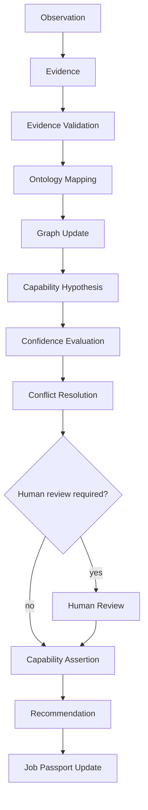
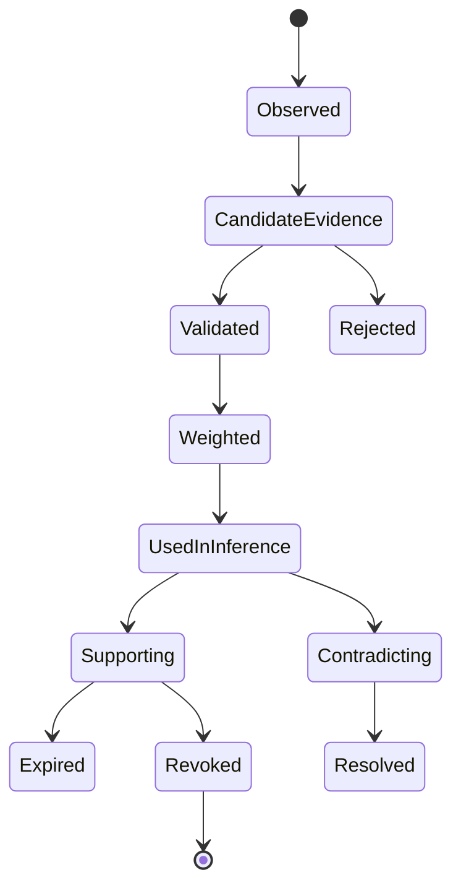
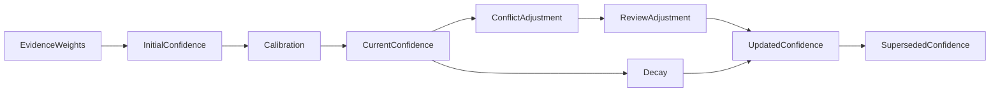
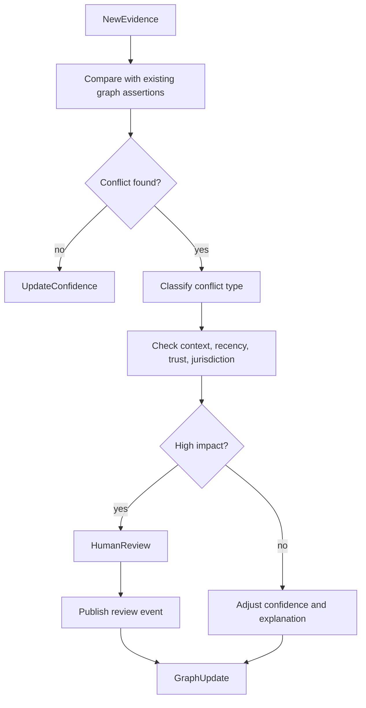
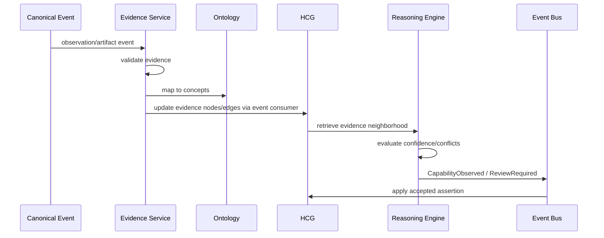
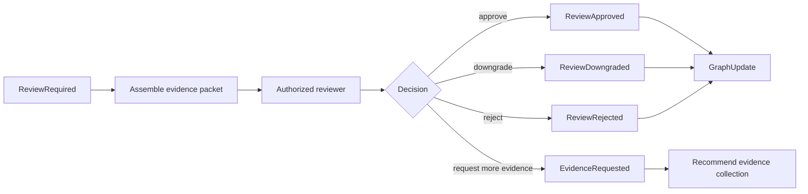

# REASON-001 — Syrka Evidence & Reasoning Constitution

Status: Constitutional Engineering Specification  
Version: 1.0  
Date: 2026-07-08  
Builds upon: Product Suite; ADR-001; ADR-002; CEA-001; ONT-001; GRAPH-001  
Decision owners: AI Science / Knowledge Engineering / Ontology / Platform Architecture / Research  
Scope: Epistemology, evidence evaluation, reasoning lifecycle, confidence constitution, conflict resolution, explainability, human review, AI-provider independence, and reasoning diagrams

## 1. Executive Overview

REASON-001 defines **how Syrka reasons**. It does not define a model, prompt, vendor, or runtime implementation. It defines the constitutional rules that every inference engine, recommendation engine, AI agent, ranking service, employer matcher, Job Passport generator, workforce mobility engine, dashboard, and future intelligent service must obey.

Syrka does not make guesses. Syrka constructs evidence-backed explanations. A conclusion is acceptable only when it is grounded in canonical events, mapped to ontology concepts, represented in the Human Capability Graph, scored with calibrated confidence, and accompanied by provenance and uncertainty.

Reasoning is separated from AI models because AI models are implementation details. GLM, Claude, GPT, Gemini, open-source models, symbolic reasoners, rules engines, graph algorithms, and future systems may all participate in reasoning. None is the source of truth. The source of truth is the chain:

```text
Canonical Events → Evidence → Ontology Mapping → Graph Assertions → Reasoning Outputs → Human/Policy Review → Product Decisions
```

Reasoning must survive LLM-provider changes because Syrka's strategic value is not a prompt tuned for one model. Syrka's strategic value is the epistemic system: what counts as evidence, how evidence is weighed, how uncertainty is exposed, how conflicting evidence is represented, how humans review decisions, and how every conclusion can be reproduced from events and graph state.

First principles:

1. Evidence precedes inference.
2. Observations are not conclusions.
3. Capabilities are inferred, never declared.
4. Confidence is earned.
5. Conflicting evidence is represented, not discarded.
6. AI must expose uncertainty.
7. Provenance is mandatory.
8. Human review can override AI, but never erase history.
9. Every conclusion is reproducible from canonical events.

## 2. Epistemology

| Concept | Canonical definition | Justification and boundary |
|---|---|---|
| Observation | A captured event or signal that something occurred. | Observations are raw or lightly normalized facts. A lesson view is an observation, not proof of mastery. |
| Signal | A measurable indicator that may be relevant to a claim. | Signals can be weak, noisy, or indirect. They require interpretation before becoming evidence. |
| Evidence | A provenance-bearing observation, artifact, assessment, credential, or external signal that can support or weaken a claim. | Evidence is evaluated for relevance, quality, trust, and freshness. It is not automatically conclusive. |
| Fact | An accepted immutable canonical event or verified graph assertion about something that occurred or was recorded. | Facts are not necessarily final truth; they are accepted records in Syrka's system. |
| Claim | A statement that may be true, false, uncertain, disputed, or context-dependent. | Capability assertions, passport claims, and recommendations are claims requiring support. |
| Hypothesis | A tentative claim proposed for evaluation. | A hypothesis may guide investigation but cannot appear as verified capability. |
| Inference | A reasoned conclusion derived from evidence, ontology, graph relationships, rules, models, and confidence evaluation. | Inference is not raw AI output; it is structured reasoning with provenance. |
| Explanation | Human- and machine-readable account of why a conclusion was reached. | Must include supporting evidence, conflicting evidence, ontology concepts, graph paths, confidence, uncertainty, and limitations. |
| Confidence | Calibrated degree of support for a claim under known uncertainty. | Confidence is earned from evidence and can decay, increase, or be overridden. |
| Uncertainty | Known and unknown limits affecting confidence. | Includes missing evidence, ambiguity, source unreliability, recency, model disagreement, bias, and context mismatch. |
| Belief | Syrka's current confidence-weighted stance toward a claim. | Belief is provisional and changes with new evidence. |
| Verification | Process of checking authenticity, issuer trust, integrity, or external validity. | Verification can raise trust but does not automatically prove broad capability. |
| Validation | Process of checking conformance to schema, ontology, rubric, policy, or quality standard. | Validation ensures structure and rule compliance, not necessarily truth. |
| Truth | Correspondence between a claim and reality. | Syrka approximates truth through evidence-backed confidence; it does not claim absolute certainty for human capability. |
| Contradiction | Evidence or reasoning that materially conflicts with a claim or other evidence. | Contradictions are modeled explicitly and may lower confidence or trigger review. |
| Assumption | A premise used in reasoning that is not fully established by available evidence. | Assumptions must be declared and minimized in high-impact reasoning. |
| Reasoning | The governed process of transforming observations and evidence into explanations, confidence, assertions, recommendations, or decisions. | Reasoning is constitutional and model-independent. |
| Decision | A committed outcome that affects state, eligibility, access, ranking, disclosure, mobility, or user action. | High-impact decisions require auditability, explainability, and appeal. |
| Recommendation | An explainable suggestion that proposes a course of action but does not itself force an outcome. | Recommendations must be traceable to graph paths and evidence. |

## 3. Evidence Evaluation

### 3.1 Evidence evaluation dimensions

Every evidence item is evaluated across these dimensions:

| Dimension | Meaning | Constitutional rule |
|---|---|---|
| Quality | Fitness of evidence for its intended inference purpose. | Low-quality evidence cannot support high-confidence claims alone. |
| Strength | Degree to which evidence directly supports or contradicts a claim. | Direct assessed performance is stronger than passive activity. |
| Freshness | Whether evidence remains current for the capability context. | Time-sensitive capabilities require recent evidence. |
| Recency | Time elapsed since evidence was observed/verified. | Recency contributes to decay and current capability confidence. |
| Completeness | Whether evidence covers all required aspects of a capability. | Partial evidence supports partial confidence only. |
| Reliability | Trustworthiness and consistency of source/method. | Reliable sources weigh more than untrusted sources. |
| Independence | Degree to which evidence sources are non-duplicative. | Independent corroboration increases confidence more than repetition. |
| Conflict | Whether evidence contradicts other evidence or claims. | Conflicts must be represented and reasoned over. |
| Decay | Reduction in evidence value over time or context change. | Decay functions are capability-specific. |
| Aggregation | Combining multiple evidence items into claim support. | Aggregation must be reproducible and explainable. |
| Weighting | Assigned contribution of evidence to confidence. | Weights must be governed, versioned, and auditable. |
| Redundancy | Duplicate or near-duplicate evidence. | Redundant evidence should not inflate confidence. |
| Provenance | Source, lineage, transformation, reviewer/model, and event IDs. | Evidence without provenance cannot support high-impact claims. |

### 3.2 Evidence source classes

| Evidence class | Examples | Default stance | Review requirement |
|---|---|---|---|
| Human-reviewed evidence | instructor rubric, verified portfolio review | strong if assessor trusted | required for high-impact claims when available |
| AI-generated evidence | rubric extraction, code analysis, semantic mapping | provisional | human/policy review for high-impact uses |
| External evidence | GitHub, LinkedIn, ORCID, OpenAlex, employer systems | variable | consent and source verification required |
| Employer evidence | hiring feedback, work performance, employer interest | strong for work context but may be biased | bias and conflict checks required |
| Research evidence | publication, dataset, citation, lab project | strong for research capability if authorship clear | authorship/contribution review required |
| Portfolio evidence | curated artifacts, reflections, project demos | medium to strong | authenticity and artifact review required |
| Assessment evidence | quizzes, exams, assignments, rubrics | medium to strong | assessment validity required |
| Behavioral evidence | attendance, collaboration, punctuality, discussion | weak to medium | high bias risk; never sole source for high-impact decisions |

### 3.3 Evidence scoring model

Evidence support is computed as a reproducible, versioned function:

```text
support(evidence, claim) = relevance × quality × reliability × independence × authenticity × freshness × context_match × difficulty - conflict_penalty
```

Rules:

1. Evidence scores are not universal; they are claim-specific.
2. The same evidence may strongly support one claim and weakly support another.
3. Evidence used in high-impact claims must have provenance, source trust, and retention policy.
4. Evidence must link to canonical events and graph nodes.
5. Revoked or invalid evidence cannot positively support current claims.
6. Expired evidence can support historical claims but only weakly supports current claims unless refreshed.

## 4. Reasoning Pipeline

### 4.1 Lifecycle overview

```text
Observation
  ↓
Evidence
  ↓
Evidence Validation
  ↓
Ontology Mapping
  ↓
Graph Update
  ↓
Capability Hypothesis
  ↓
Confidence Evaluation
  ↓
Conflict Resolution
  ↓
Human Review (if required)
  ↓
Capability Assertion
  ↓
Recommendation
  ↓
Job Passport Update
```

### 4.2 Stage definitions

| Stage | Purpose | Inputs | Outputs | Constitutional requirements |
|---|---|---|---|---|
| Observation | Capture something that happened. | canonical event, source signal | observation node/event | Must not be treated as conclusion. |
| Evidence | Identify observation/artifact as relevant to claim. | observation, artifact, credential | evidence item | Must include provenance and relevance. |
| Evidence Validation | Check structure, authenticity, consent, source, and quality. | evidence item | validated/rejected evidence | Invalid evidence cannot support claims. |
| Ontology Mapping | Map evidence to canonical concepts. | validated evidence, ontology | concept mappings | Must use ontology version and mapping confidence. |
| Graph Update | Instantiate evidence and relationships in HCG. | events/evidence/mappings | graph assertions | Must be reproducible from canonical events. |
| Capability Hypothesis | Propose candidate capability claim. | evidence, graph paths, ontology | hypothesis | Must remain provisional until evaluated. |
| Confidence Evaluation | Score support and uncertainty. | hypothesis, evidence weights, graph state | confidence score | Must be calibrated and explainable. |
| Conflict Resolution | Identify and reason over contradictions. | claim/evidence/conflicts | adjusted confidence or review | Conflicts must not be hidden. |
| Human Review | Human adjudication when risk/uncertainty requires. | evidence, explanation, conflicts | review event/outcome | Review changes history through new events. |
| Capability Assertion | Publish accepted capability observation/update. | hypothesis, confidence, review | `CapabilityObserved` / `CapabilityUpdated` | Must cite evidence and provenance. |
| Recommendation | Suggest next action/pathway/opportunity. | graph, intent, market, capabilities | `RecommendationGenerated` | Must explain path and uncertainty. |
| Job Passport Update | Include/revise portable claims. | verified capability/credential events | `PassportUpdated` | Must include evidence trail and disclosure policy. |

### 4.3 Reproducibility rule

A reasoning output is valid only if Syrka can reproduce or audit it from:

- canonical event IDs
- evidence references
- ontology version
- graph snapshot or replay range
- confidence model version
- reasoning rule/model version
- prompt/template version if AI-assisted
- human review event if applicable

## 5. Confidence Constitution

### 5.1 Confidence generation

Confidence is generated by evaluating evidence support, contradiction, uncertainty, source trust, context fit, and model/rule reliability. Confidence is never copied from a grade, badge, employer statement, or AI model output without calibration.

### 5.2 Confidence calibration

Calibration requires comparing predicted confidence against reviewed outcomes over time. Confidence models must be evaluated by cohort, institution, country, language, accessibility context, and evidence type to detect systematic error.

### 5.3 Confidence decay

Confidence decays when:

- evidence becomes stale
- capability context changes
- technology changes
- contradiction appears
- credential expires
- source trust decreases
- ontology mapping is superseded

Decay is capability-specific. For example, compliance certifications may expire sharply, while foundational mathematics may decay slowly.

### 5.4 Confidence inheritance

Confidence inheritance is constrained:

| Source path | Inheritance rule |
|---|---|
| Skill → Capability | Skill evidence contributes only to capability aspects requiring that skill. |
| Credential → Capability | Credential supports mapped capabilities only if credential criteria are known. |
| Course completion → Capability | Weak support unless linked to assessed evidence. |
| Project → Occupation | Supports occupation fit through required capability coverage. |
| Similar capability → adjacent capability | Transfer confidence decays by semantic distance and context mismatch. |

### 5.5 Confidence aggregation

Aggregation must account for:

- independent evidence count
- diversity of evidence contexts
- strongest evidence item
- weakest required component
- recency distribution
- contradictions
- uncertainty
- assessor/source trust
- rubric validity
- model disagreement

Aggregation cannot be a naive average unless explicitly justified and documented.

### 5.6 Confidence conflicts

When high-confidence evidence conflicts with other high-confidence evidence, Syrka must lower certainty, expose contradiction, and trigger review if the claim is high-impact.

### 5.7 Thresholds

| Threshold band | Range | Meaning | Permitted use |
|---|---:|---|---|
| Unsupported | 0.00–0.39 | Not enough evidence. | no capability claim; may guide data collection |
| Emerging | 0.40–0.59 | Early support. | learning recommendations only |
| Supported | 0.60–0.74 | Meaningful support. | dashboards with caveats |
| Strong | 0.75–0.89 | Strong evidence. | passport candidate claim after policy checks |
| Verified | 0.90–1.00 | Very strong, current, verified support. | high-impact claims where allowed |

### 5.8 Human overrides and model disagreement

Human overrides change confidence by publishing review events. They never erase AI outputs. Model disagreement is represented as uncertainty and may trigger ensemble adjudication or human review.

### 5.9 Explainability requirements

Every confidence score must explain:

- evidence used
- evidence excluded and why
- weights applied
- contradiction handling
- model/rule version
- calibration status
- uncertainty drivers
- human review status

## 6. Conflict Resolution

### 6.1 Constitutional conflict rules

1. Conflicting evidence must be represented, not discarded.
2. Source trust affects weighting but cannot erase contradictions.
3. Recent strong evidence may outweigh stale evidence, but stale evidence remains in history.
4. Context matters: failure in exams may contradict academic mastery but not necessarily practical project capability.
5. High-impact contradictions require human review.
6. Jurisdiction-specific conflicts are resolved through overlays, not global semantic changes.
7. Conflicting AI models do not vote by popularity; they trigger uncertainty analysis.

### 6.2 Scenario rules

| Scenario | Reasoning rule |
|---|---|
| Excellent grades but poor portfolio | Separate assessment performance from artifact/project capability. Lower confidence in applied capability until portfolio evidence improves. |
| Excellent GitHub but failed exams | Recognize practical engineering evidence while representing academic knowledge gaps. Do not collapse both into one score. |
| Employer praises but assessments disagree | Weight employer evidence for workplace context; inspect bias, specificity, and role relevance. Trigger review if passport claim affected. |
| Outdated certifications vs recent projects | Expired certifications lose current verification strength; recent strong project evidence may support current capability separately. |
| Conflicting AI models | Compare evidence references, ontology mappings, calibration, and uncertainty. Do not average blindly. |
| Multiple institutions | Preserve institution provenance and assessment validity differences. Normalize through ontology, not grade equivalence alone. |
| Different jurisdictions | Apply jurisdiction overlays for regulated capabilities and credentials. Global capability may remain while local eligibility differs. |

### 6.3 Conflict outcomes

Possible outcomes:

- confidence reduced
- claim narrowed to context
- claim split into separate capabilities
- additional evidence requested
- human review required
- evidence revoked or corrected
- ontology mapping revised
- recommendation withheld
- passport claim excluded or downgraded

## 7. Explainability

Every inference must answer:

| Question | Required answer |
|---|---|
| What evidence supports this? | List evidence IDs, source events, artifacts, assessments, credentials, and reviews. |
| Why was conflicting evidence discounted? | Explain recency, context mismatch, source trust, revocation, or lower relevance. |
| Which ontology concepts were used? | Include concept IDs and ontology version. |
| Which graph relationships were traversed? | Provide graph path or path summary. |
| Which canonical events contributed? | Include event IDs and event types. |
| What confidence exists? | Include score, band, threshold, calibration status. |
| What uncertainty remains? | Missing evidence, model disagreement, bias risk, context limitations, stale data. |

Minimum explanation object:

```json
{
  "claim_id": "cap_obs_123",
  "claim_type": "CapabilityObserved",
  "conclusion": "Person demonstrates SQL data modeling capability in academic project context.",
  "confidence": { "score": 0.84, "band": "Strong", "model": "confidence_model@1.0.0" },
  "ontology": { "version": "1.0.0", "concept_ids": ["capability:sql_data_modeling"] },
  "supporting_evidence": ["evidence_assignment_789", "artifact_schema_project"],
  "conflicting_evidence": [],
  "graph_paths": ["Person->CapabilityObservation->Evidence->CanonicalEvent"],
  "source_events": ["AssignmentSubmitted:abc", "AssignmentGraded:def"],
  "uncertainty": ["academic context, not production setting"],
  "human_review": { "required": false, "status": "not_required" }
}
```

## 8. Human Review

### 8.1 Review types

| Review type | Purpose | Reviewer | Output event |
|---|---|---|---|
| Faculty review | Validate educational evidence, rubrics, assessment interpretation. | instructor/faculty | `HumanReviewCompleted` or domain-specific review event |
| Employer verification | Validate workplace evidence, role performance, hiring feedback. | employer-authorized reviewer | `EmployerEvidenceVerified` |
| Peer review | Validate collaboration, research, portfolio, code review signals. | peers/reviewers | `PeerReviewCompleted` |
| Student challenge | Allow subject to dispute evidence, inference, or disclosure. | student + review team | `CapabilityDisputed`, `EvidenceDisputed` |
| Appeal process | Formal review of high-impact adverse decision. | independent reviewer/committee | `AppealResolved` |
| Correction process | Correct erroneous evidence, mapping, or score. | domain owner/reviewer | `EvidenceCorrected`, `InferenceCorrected` |
| Evidence revocation | Invalidate evidence or credential. | issuer/source/domain owner | `EvidenceRevoked`, `CredentialRevoked` |
| Capability revocation | Invalidate or supersede capability assertion. | capability authority/review team | `CapabilityRevoked` or `CapabilityUpdated` |

### 8.2 Human review principles

1. Reviewers must see supporting and conflicting evidence.
2. Review decisions must include rationale.
3. Reviews create new canonical events.
4. Reviews can override AI confidence but cannot delete history.
5. High-impact reviews require reviewer identity, role, timestamp, and policy basis.
6. Student-visible decisions must provide challenge/appeal path where appropriate.

### 8.3 Appeal and correction flow

```text
Student challenge
  → evidence/inference freeze for high-impact use if policy requires
  → reviewer assignment
  → evidence packet review
  → decision: uphold / correct / revoke / request more evidence
  → canonical review event
  → graph update
  → dashboard/passport/recommendation projection update
```

## 9. AI Independence

### 9.1 Provider independence

The reasoning layer is independent of GLM, Claude, GPT, Gemini, open-source models, symbolic engines, and future models. Providers may generate candidate interpretations, summaries, embeddings, classifications, or reasoning traces, but Syrka accepts only outputs that pass constitutional validation.

### 9.2 Model adapter rule

Each AI provider is an adapter behind a reasoning interface:

```text
Evidence Bundle + Ontology Context + Graph Context + Reasoning Task
  → Model Adapter
  → Structured Candidate Output
  → Validator
  → Confidence/Conflict Engine
  → Canonical Event
```

### 9.3 Replaceability requirements

- Prompts are versioned but not constitutional truth.
- Model outputs must be structured and schema-valid.
- Outputs must cite evidence IDs and ontology concept IDs.
- Model-specific confidence is not accepted as Syrka confidence without calibration.
- Model replacement requires regression evaluation on reasoning test sets.
- No provider-specific opaque field may be required for downstream graph/passport/recommendation logic.

### 9.4 Reasoning test sets

Syrka maintains model-independent reasoning tests:

- evidence sufficiency cases
- evidence conflict cases
- stale evidence cases
- jurisdiction overlay cases
- bias/sensitive attribute cases
- adversarial portfolio cases
- credential revocation cases
- recommendation explanation cases

A new model must pass these tests before production use.

## 10. Mermaid Diagrams

### 10.1 Reasoning pipeline



### 10.2 Evidence lifecycle



### 10.3 Confidence lifecycle



### 10.4 Conflict resolution flow



### 10.5 Capability derivation flow



### 10.6 Human review flow



## 11. Final Decision

REASON-001 establishes Syrka's epistemological constitution. Every capability, recommendation, passport claim, employer match, ranking, AI inference, and mobility decision must be evidence-backed, reproducible, explainable, confidence-scored, provenance-rich, and open to review where appropriate.

AI models are interchangeable implementation details. Syrka's reasoning truth comes from canonical events, evaluated evidence, ontology definitions, graph relationships, calibrated confidence, conflict representation, and human-governed review processes.
