# UX-001 — Syrka Product Experience Architecture

Status: Constitutional Product Specification  
Version: 1.0  
Date: 2026-07-08  
Builds upon: Product Suite; ADR-001 — Open Source LMS Foundation; ADR-002 — Domain Architecture & Bounded Contexts; CEA-001 — Canonical Event Architecture; ONT-001 — Ontology Constitution; GRAPH-001 — Human Capability Graph Specification; REASON-001 — Evidence & Reasoning Constitution; INF-001 — Capability Inference Constitution  
Decision owners: Product / UX Architecture / Design / Frontend Engineering / Platform Architecture  
Scope: User roles, application hierarchy, navigation, workflows, information architecture, permissions, dashboards, interactions, MVP scope, Figma readiness, Google Stitch prompts, Claude implementation guidance, diagrams, and appendices

## 1. Executive Overview

Syrka is not an LMS, portfolio site, LinkedIn clone, job board, or course marketplace. Syrka is an AI-powered Human Capability Platform. Its product experience must constantly reinforce one question:

> **What can I become, and what evidence supports that journey?**

UX is separated from implementation because the interface must express Syrka's ontology and reasoning model regardless of frontend framework, backend service, LMS provider, AI model, or database. Next.js routes, Supabase tables, graph queries, and Open edX adapters may evolve; the product experience architecture remains stable.

The product experience reflects the ontology by treating concepts as user-facing information architecture:

- **Capability** becomes dashboard cards, profile claims, passport entries, and opportunity requirements.
- **Evidence** becomes evidence timelines, artifact cards, assessment details, and verification trails.
- **Confidence** becomes visible confidence meters with explanation, not hidden scores.
- **Provenance** becomes source labels, event history, review history, and trust indicators.
- **Career intent** becomes Odyssey goals, pathways, preferences, and recommendation constraints.
- **Ontology relationships** become learning pathways, capability gaps, transfer maps, and career routes.

UX reinforces trust in AI by never presenting AI as magic. AI should be calm, specific, evidence-backed, and inspectable. Every recommendation must expose why it was made, which evidence was used, which uncertainty remains, and what the user can do next.

Product tone:

- intelligent
- calm
- premium
- explainable
- evidence-driven
- minimal
- enterprise-grade
- accessible
- global

## 2. User Personas

| Persona | Goals | Needs | Permissions | Primary workflows | Success metrics | Pain points |
|---|---|---|---|---|---|---|
| Student | Understand capabilities, improve, build passport, find opportunities. | Clear roadmap, evidence, feedback, privacy control. | Own profile/evidence/passport; view courses/recommendations; share selectively. | onboarding, learning, evidence review, Odyssey, portfolio, passport, apply. | capability growth, completed actions, opportunities matched, passport shares. | confusion about what matters, opaque AI, scattered evidence. |
| Faculty | Teach, assess, monitor students, verify evidence, improve curriculum. | Cohort insights, rubrics, capability review, interventions. | Course/cohort access; review assigned evidence; curriculum mappings. | course management, student monitoring, evidence verification, feedback. | student progress, intervention resolution, assessment quality. | dashboard overload, manual review burden, unclear capability mapping. |
| University Administrator | Improve outcomes, align curriculum, monitor institution. | Program analytics, employability data, accreditation support. | Institution-wide aggregates; admin configuration; no unnecessary PII. | analytics, curriculum mapping, reports, settings. | outcome improvement, gap closure, employer alignment. | fragmented systems, weak labour-market visibility. |
| Employer | Find capability-fit candidates and verify claims. | Trustworthy search, passport verification, hiring pipeline. | Employer profile/jobs; view shared profiles/passports; contact candidates. | onboarding, role creation, candidate matching, evidence review, pipeline. | matches reviewed, interviews, hires, reduced screening time. | unreliable resumes, skills inflation, poor signal quality. |
| Government Analyst | Understand workforce gaps, national priorities, mobility corridors. | National dashboards, forecasts, policy insights, cohort mobility. | Aggregated/anonymized data; corridor analytics; policy overlays. | labour analytics, capability gaps, strategic sector views, mobility planning. | policy decisions supported, gap reduction, corridor outcomes. | stale statistics, inconsistent education data. |
| Researcher | Showcase research capability and find collaboration. | Publication mapping, evidence trails, collaboration matches. | Own research profile; institution/research data depending role. | link ORCID/research, review mappings, collaboration recommendations. | collaborations, grants, research impact signals. | attribution ambiguity, disconnected research systems. |
| Mentor | Guide learners using evidence and goals. | Learner roadmap, safe notes, recommendations, progress. | Access only assigned mentees and consented data. | review learner, suggest actions, track progress. | mentee progress, action completion. | too much data, unclear next best step. |
| Parent (future) | Support learner progress where legally appropriate. | High-level progress, wellbeing signals, consented visibility. | Minor/guardian-scoped access only. | view progress, support actions, notifications. | engagement, learner support. | privacy boundaries, over-surveillance risk. |
| Career Advisor | Help students choose pathways and opportunities. | Capability gaps, market alignment, Odyssey plans. | Assigned students/cohorts; recommendations; notes. | advising session, pathway planning, opportunity matching. | successful pathway transitions, student satisfaction. | generic career advice, lack of evidence. |
| Recruiter | Source candidates and manage pipeline. | Search, filters, verified passports, communication. | Employer-scoped candidate data shared/authorized. | search, shortlist, verify, contact, pipeline. | qualified candidates, response rate, hire rate. | noisy applications, unverifiable claims. |
| System Administrator | Configure platform safely. | Tenant, integrations, roles, policies, observability. | Platform/institution admin scopes. | user management, integrations, policy config, audits. | uptime, configuration accuracy, incident resolution. | complex permissions, integration failures. |

## 3. Product Architecture

### 3.1 Application hierarchy

```text
Landing
  ├─ Product story
  ├─ Trust / evidence / AI explainability
  ├─ Role entry points
  └─ Request demo / sign in
Authentication
  ├─ Login
  ├─ Register
  ├─ SSO
  ├─ Forgot password
  └─ MFA / consent
Dashboard
  ├─ Role-specific home
  ├─ Alerts
  ├─ Recommendations
  └─ Recent evidence
Learning
  ├─ Courses
  ├─ Modules
  ├─ Lessons
  ├─ Assignments
  ├─ Submissions
  └─ Feedback
Evidence
  ├─ Evidence timeline
  ├─ Evidence detail
  ├─ Artifacts
  ├─ Reviews
  └─ Disputes
Capability
  ├─ Capability dashboard
  ├─ Capability graph
  ├─ Capability detail
  ├─ Confidence explanation
  └─ Capability gaps
Odyssey
  ├─ Goals
  ├─ Roadmap
  ├─ Learning plan
  ├─ Opportunity plan
  └─ Progress
Job Passport
  ├─ Passport overview
  ├─ Claims
  ├─ Verification trail
  ├─ Share controls
  └─ Public preview
Portfolio
  ├─ Projects
  ├─ Publications
  ├─ Artifacts
  ├─ Reflections
  └─ Generated portfolio
Career
  ├─ Career intent
  ├─ Pathways
  ├─ Opportunities
  ├─ Market signals
  └─ Applications
Employers
  ├─ Employer dashboard
  ├─ Company profile
  ├─ Roles/jobs
  ├─ Candidate search
  ├─ Candidate profile
  └─ Hiring pipeline
Research
  ├─ Publications
  ├─ Research profile
  ├─ Collaboration recommendations
  └─ Research capability map
Settings
  ├─ Profile
  ├─ Privacy and consent
  ├─ Integrations
  ├─ Notifications
  └─ Account/security
Administration
  ├─ Institution management
  ├─ Users and roles
  ├─ Curriculum mapping
  ├─ Analytics
  ├─ Integrations
  ├─ Audit logs
  └─ Policy configuration
```

### 3.2 Product surfaces

| Surface | Primary roles | Purpose |
|---|---|---|
| Student app | Student, mentor, advisor | Personal growth, learning, capabilities, Odyssey, passport. |
| Faculty app | Faculty, advisor | Course/cohort monitoring, evidence review, interventions. |
| Employer app | Employer, recruiter | Job creation, search, passport verification, pipeline. |
| Government app | Government analyst | National/corridor analytics and policy insights. |
| Admin app | System/institution admin | Configuration, roles, integrations, audits. |
| Public profile | Student/employer/public viewer | User-controlled capability proof and portfolio sharing. |

## 4. Navigation Architecture

| Navigation layer | Design |
|---|---|
| Global navigation | Persistent role-aware sidebar on desktop; bottom tab/sheet on mobile. Shows Dashboard, Learning, Capability, Odyssey, Passport, Portfolio, Career, Settings. |
| Role-specific navigation | Employer sees Dashboard, Roles, Search, Pipeline, Analytics, Settings. Faculty sees Dashboard, Courses, Students, Evidence Review, Curriculum, Analytics. Government sees National Dashboard, Labour, Education, Corridors, Forecasts. |
| Context navigation | Within a course, show Overview, Modules, Assignments, Evidence, Analytics. Within a capability, show Evidence, Confidence, Related Skills, Opportunities. |
| Secondary navigation | Tabs inside major objects: overview, evidence, graph, recommendations, settings. |
| Breadcrumbs | Required for nested objects: Course → Module → Lesson → Assignment. |
| Search | Global semantic search across courses, evidence, capabilities, opportunities, candidates, research. Scoped by role/permission. |
| Quick actions | Add evidence, update career intent, share passport, create job, review evidence, generate portfolio. |
| Keyboard shortcuts | `/` search, `g d` dashboard, `g c` capabilities, `g p` passport, `?` help. |
| Mobile navigation | Bottom nav with 4–5 primary items; overflow sheet for secondary sections. |
| Desktop navigation | Collapsible left sidebar + command palette. |
| Future tablet UX | Split-view navigation with graph/evidence side panels. |

## 5. Information Architecture

### 5.1 Screen specification matrix

| Screen | Purpose | Primary info | Actions | AI interactions | Evidence/confidence/explanation | Related screens |
|---|---|---|---|---|---|---|
| Landing | Explain Syrka value by role. | product narrative, trust, role CTAs | request demo, sign in | none or guided demo | high-level examples only | Login, Register |
| Login/Register | Authenticate and capture consent. | auth form, SSO options | login, register, reset | none | consent links | Onboarding |
| Student Dashboard | Daily command center. | current capabilities, next actions, alerts | continue learning, update intent | explain recommendations | capability/evidence snippets | Capability, Odyssey, Passport |
| Course | Show course progress and evidence links. | modules, outcomes, assignments | continue, submit | study suggestions | outcome-to-capability mapping | Module, Assignment |
| Assignment | Complete and submit task. | instructions, rubric, due date | submit, request help | rubric clarification | evidence potential preview | Submission, Evidence |
| Evidence Timeline | Review evidence history. | events/artifacts/reviews | filter, dispute, add context | summarize evidence | evidence strength/confidence impact | Evidence Detail |
| Capability Dashboard | Show what person can credibly do. | capability cards, gaps, confidence | inspect, improve, dispute | explain capability | confidence + evidence | Capability Detail |
| Capability Detail | Explain one capability. | definition, evidence, graph paths | add evidence, dispute, share | explanation Q&A | full provenance | Evidence, Odyssey |
| Odyssey | Personal growth roadmap. | goals, pathway, milestones | accept plan, adjust goals | roadmap generation | evidence-backed recommendations | Career, Learning |
| Portfolio | Curated work proof. | projects, artifacts, reflections | generate, edit, share | draft descriptions | evidence-linked artifacts | Public Profile |
| Job Passport | Portable verified claims. | claims, credentials, share status | issue, update, share, revoke | claim explanation | verification trail/confidence | Passport Share |
| Employer Dashboard | Hiring command center. | roles, matches, pipeline | create role, review candidates | candidate insights | passport trust indicators | Search, Candidate |
| Candidate Profile | Evaluate candidate with consent. | capabilities, evidence, passport | shortlist, contact, verify | match explanation | evidence trail | Pipeline |
| Faculty Dashboard | Monitor courses/cohorts. | risk, mastery, evidence reviews | intervene, review | cohort insights | evidence awaiting review | Student Detail |
| Government Dashboard | National intelligence. | gaps, sectors, forecasts | filter, export, drilldown | policy insight summaries | aggregate confidence | Corridors, Forecasts |
| Settings | Control profile/privacy/integrations. | account, consent, integrations | update, revoke, connect | privacy guidance | consent evidence | Audit/Privacy |
| Admin Panel | Configure tenant. | users, roles, integrations | invite, configure, audit | none | audit trails | Institution Management |

### 5.2 Notifications

Notifications must be actionable, explainable, and low-noise. Examples:

- Evidence reviewed.
- Capability confidence changed.
- Passport claim needs renewal.
- Employer viewed shared passport.
- Recommendation generated because a capability gap changed.
- Faculty intervention requested.
- Credential expiring.

## 6. Student Experience

### 6.1 Journey map

```text
First login
  → Onboarding
  → Profile and career intent
  → Learning entry
  → Assignment/submission
  → Evidence timeline
  → Capability dashboard
  → Recommendations
  → Odyssey roadmap
  → Portfolio generation
  → Job Passport issue/share
  → Employment/opportunity workflow
```

### 6.2 Screens

| Stage | Screen | UX requirements |
|---|---|---|
| First login | Welcome | Explain Syrka in one sentence; ask role/goal; avoid overwhelming graph terms. |
| Onboarding | Profile setup | Collect programme, interests, goals, privacy preferences, integrations. |
| Profile | Capability profile | Show identity, education, career intent, evidence connections. |
| Learning | Course/module/lesson | LMS content can be embedded/linked but Syrka layer shows capability relevance. |
| Assignments | Assignment/submission | Show rubric, due date, expected evidence, capability impact. |
| Evidence | Evidence timeline/detail | Let student inspect, annotate, dispute, and understand evidence strength. |
| Capability | Dashboard/detail/graph | Capability cards show confidence, evidence count, freshness, next step. |
| Recommendations | Recommendation detail | Every recommendation says why, evidence used, and expected impact. |
| Odyssey | Roadmap | Goal-driven pathway with milestones and confidence improvement targets. |
| Portfolio | Project/artifact builder | Evidence-backed portfolio, not free-form bragging. |
| Job Passport | Passport overview/share | User controls disclosure; claims are explainable. |
| Employment | Opportunity/apply | Match score, capability fit, gaps, share passport option. |

## 7. Faculty Experience

| Area | Required UX |
|---|---|
| Course management | Course overview, modules, outcomes, assessments, capability mappings. |
| Student monitoring | Cohort table with risk, mastery, missing evidence, recent activity. |
| Capability review | Review evidence packet, ontology mapping, confidence suggestion, approve/downgrade/reject. |
| Evidence verification | Verify artifacts, rubrics, submissions, authenticity, and feedback. |
| Recommendations | Suggested interventions and next learning actions. |
| Curriculum mapping | Map outcomes/assessments to capabilities and labour-market/national priorities. |
| Analytics | Assessment quality, capability coverage, gap trends. |
| Feedback | Structured feedback that can become evidence. |
| Assessment | Rubric builder aligned to ontology concepts. |

Faculty UX must reduce review burden. Use queues, batch review, confidence filters, and evidence summaries, but always allow full evidence inspection.

## 8. Employer Experience

| Area | Required UX |
|---|---|
| Employer onboarding | Company verification, domains, hiring goals, data/privacy agreement. |
| Company profile | Employer brand, sectors, roles, verified status. |
| Role creation | Define job requirements using capability ontology, not only keywords. |
| Capability search | Search candidates by capabilities, confidence, evidence freshness, availability, location. |
| Student matching | Match explanations: required capabilities met/missing, evidence sources. |
| Evidence review | Passport/evidence viewer with redaction and consent boundaries. |
| Passport verification | Verify claims, credentials, provenance, expiry, and share permissions. |
| Hiring pipeline | Shortlist, contact, interview, offer, feedback. |
| Analytics | Role funnel, match quality, capability supply, hiring outcomes. |
| Communication | Consent-aware messaging and status updates. |

Employer UX must feel more trustworthy than a resume database. Every candidate claim shown to employers must be consented, evidence-backed, and explainable.

## 9. Government Experience

| Area | Required UX |
|---|---|
| National dashboards | Capability supply, demand, education alignment, mobility readiness. |
| Labour analytics | Skill/capability demand, salary, vacancy, growth, AI displacement. |
| Capability gaps | National, sector, region, institution, and programme-level gaps. |
| Education analytics | Curriculum alignment, graduate readiness, institutional outcomes. |
| Strategic sectors | National priority sector capability pipelines. |
| Mobility corridors | Corridor readiness, supply/demand, credential gaps, approvals. |
| Policy insights | Explainable policy briefs, data sources, confidence, limitations. |
| Forecasts | Scenario modelling and uncertainty bands. |

Government UX must default to aggregate and privacy-preserving views. Individual-level views require explicit legal basis and strict audit.

## 10. Dashboard Architecture

| Dashboard | Widgets/cards | KPIs | Alerts | Actions |
|---|---|---|---|---|
| Student | capability summary, Odyssey next step, evidence timeline, passport status, opportunities | confidence growth, evidence freshness, roadmap progress | expiring credential, review needed | continue learning, add evidence, share passport |
| Faculty | cohort mastery, risk list, review queue, assessment quality, curriculum coverage | review backlog, mastery distribution, intervention success | high-risk students, unmapped assessment | review evidence, intervene, map outcome |
| Employer | open roles, candidate matches, pipeline, passport verifications | match quality, shortlist rate, time-to-review | candidate response, expiring role | create role, search, verify |
| Government | capability supply/demand, sector gaps, corridor readiness, forecasts | gap index, readiness, demand growth | strategic gap, credential bottleneck | drill down, export, scenario |
| Administrator | users, integrations, roles, audit, system health | active users, sync status, errors | failed integration, policy breach | configure, invite, audit |
| Researcher | publications, capability map, collaboration suggestions, impact signals | mapped outputs, collaboration fit | unmapped publication | connect ORCID, review mapping |
| Mentor | mentee progress, next actions, capability gaps, notes | action completion, progress velocity | stalled mentee | suggest action, schedule |

## 11. Screen Catalogue

### 11.1 MVP screens

| Screen | Route suggestion | Primary owner | MVP? |
|---|---|---|---|
| Landing | `/` | Growth/Product | yes |
| Login | `/login` | Identity | yes |
| Register | `/register` | Identity | yes |
| Forgot Password | `/forgot-password` | Identity | yes |
| Onboarding | `/onboarding` | Student | yes |
| Student Dashboard | `/[country]/student` | Student | yes |
| Student Profile | `/[country]/student/profile` | Student | yes |
| Course | `/[country]/student/courses/[courseId]` | Learning | yes |
| Module | `/[country]/student/courses/[courseId]/modules/[moduleId]` | Learning | yes |
| Lesson | `/[country]/student/lessons/[lessonId]` | Learning | yes |
| Assignment | `/[country]/student/assignments/[assignmentId]` | Learning | yes |
| Submission | `/[country]/student/submissions/[submissionId]` | Learning | yes |
| Evidence Timeline | `/[country]/student/evidence` | Capability | yes |
| Evidence Detail | `/[country]/student/evidence/[evidenceId]` | Capability | yes |
| Capability Dashboard | `/[country]/student/capabilities` | Capability | yes |
| Capability Graph | `/[country]/student/capabilities/graph` | Capability | v2-lite in MVP if feasible |
| Capability Detail | `/[country]/student/capabilities/[capabilityId]` | Capability | yes |
| Recommendation Detail | `/[country]/student/recommendations/[id]` | Odyssey | yes |
| Odyssey | `/[country]/student/odyssey` | Odyssey | yes |
| Learning Roadmap | `/[country]/student/roadmap` | Odyssey | yes |
| Portfolio | `/[country]/student/portfolio` | Portfolio | yes |
| Job Passport | `/[country]/student/passport` | Passport | yes |
| Opportunities | `/[country]/student/opportunities` | Opportunity | yes |
| Employer Dashboard | `/[country]/employer` | Employer | yes |
| Employer Search | `/[country]/employer/search` | Employer | yes |
| Candidate Profile | `/[country]/employer/candidates/[id]` | Employer | yes |
| Faculty Dashboard | `/[country]/faculty` | Faculty | yes |
| Faculty Student Detail | `/[country]/faculty/students/[id]` | Faculty | yes |
| Curriculum Mapping | `/[country]/faculty/curriculum` | Curriculum | yes |
| Institutional Analytics | `/[country]/university` | Institution | yes |
| Government Dashboard | `/[country]/ministry` | Government | yes |
| Government Scenario | `/[country]/ministry/scenario/[id]` | Government | yes |
| Notifications | `/notifications` | Platform | yes |
| Settings | `/settings` | Platform | yes |
| Admin Panel | `/admin` | Admin | yes |
| Institution Management | `/admin/institutions` | Admin | yes |

### 11.2 Future screens

Parent portal, mentor workspace, native mobile offline workspace, advanced graph explorer, corridor operations console, public profile builder, recruiter CRM integrations, advanced research collaboration workspace, government data-room exports, and institution accreditation pack generator.

## 12. User Flows

### 12.1 New student flow

```mermaid
flowchart LR
    Register --> Profile[Complete profile]
    Profile --> Assessment[Take baseline assessment]
    Assessment --> Graph[Receive capability graph]
    Graph --> Odyssey[Receive Odyssey]
    Odyssey --> Learning[Complete learning]
    Learning --> Evidence[Evidence generated]
    Evidence --> Passport[Update passport]
    Passport --> Apply[Apply for internship]
```

### 12.2 Employer journey

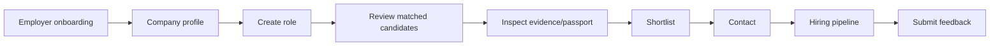

### 12.3 Faculty journey

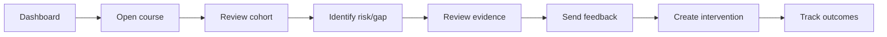

### 12.4 Government journey

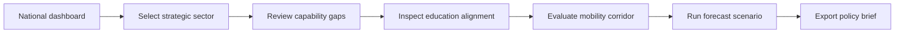

### 12.5 Researcher journey

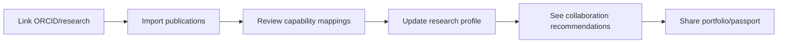

## 13. AI Interaction Design

| Topic | Rule |
|---|---|
| How AI appears | As explainable assistants, inline summaries, recommendation rationale, evidence analysis, and roadmap suggestions. |
| When AI speaks | When it can cite evidence, explain uncertainty, and propose an action. |
| When AI remains silent | When evidence is insufficient, privacy is unclear, or answer would be speculative/high-impact without review. |
| Explainability UX | Always show "Why?" and "Evidence" affordances near recommendations and capability claims. |
| Confidence UX | Use bands and plain-language labels; avoid false precision as primary display. |
| Evidence UX | Evidence cards show source, date, type, strength, confidence impact, and provenance. |
| Recommendation UX | Recommendation cards include reason, expected impact, effort, confidence, and alternatives. |
| Conversation UX | AI chat is scoped to current context and cannot invent claims. It should say when evidence is missing. |
| Inline suggestions | Use subtle cards/chips, not intrusive modals. |
| Feedback collection | Users can mark useful/not useful, dispute, add context, or request human review. |
| Trust indicators | Verified, human-reviewed, AI-assisted, stale, disputed, revoked, and jurisdiction-specific badges. |

AI must never appear magical. It should behave like an evidence-aware guide.

## 14. Design Principles

| Principle | Specification |
|---|---|
| Typography | Modern, readable, premium; generous line height; tabular numerals for metrics. |
| Spacing | Calm spacing, strong grouping, avoid dense admin clutter on student surfaces. |
| Information density | Progressive disclosure: summary → explanation → evidence → provenance. |
| Color | Neutral enterprise palette; accent colors for capability, evidence, confidence, risk. Avoid red/green-only meaning. |
| Accessibility | WCAG AA baseline; semantic HTML; visible focus; screen reader labels. |
| Motion | Subtle and purposeful; no distracting animation in analytical views. |
| Loading states | Skeletons for cards/tables; explicit AI processing states with cancel/retry. |
| Error states | Explain what failed, why it matters, and how to recover. |
| Empty states | Teach next action and explain why data is missing. |
| Micro-interactions | Evidence expand, confidence tooltip, copy/share, save filters. |
| Dark mode | Premium dark mode for dashboards; preserve contrast and chart readability. |
| Light mode | Default for institutional and student use. |
| Enterprise appearance | Trustworthy, restrained, data-rich but not cluttered. |

## 15. MVP vs Future

| Feature area | MVP | Version 2 | Version 3 | Long-term vision |
|---|---|---|---|---|
| Student dashboard | Capability summary, next actions, evidence timeline | graph explorer | personalized AI coach | lifelong capability OS |
| Learning | course/assignment views via LMS adapter | richer embedded learning | adaptive learning | full Syrka-native learning runtime |
| Evidence | timeline, detail, dispute | evidence explorer | advanced provenance graph | personal evidence vault |
| Capability | cards/detail/confidence | interactive graph | simulations/what-if | dynamic human capability twin |
| Odyssey | roadmap and recommendations | multi-path planning | collaborative mentoring | autonomous career navigation |
| Passport | issue/share/verify | VC export | cross-border credentials | global mobility passport |
| Employer | role creation/search/profile | ATS integrations | talent communities | capability marketplace |
| Faculty | cohort dashboard/review queue | rubric builder | AI curriculum copilot | capability-driven teaching OS |
| Government | national dashboards/scenarios | corridor console | policy simulation | real-time workforce operating system |
| Research | basic publication mapping | collaboration engine | grant matching | research capability network |
| Mobile | responsive web | native companion | offline evidence capture | mobile-first passport wallet |

MVP must focus on: student capability dashboard, evidence, Odyssey, passport, faculty review, employer matching, and government/institution dashboards already aligned with the current app direction.

## 16. Component Inventory

| Component | Purpose | Key states |
|---|---|---|
| Navigation Sidebar | Role-aware primary navigation. | expanded/collapsed/mobile. |
| Top Bar | Search, notifications, profile, quick actions. | default/search active. |
| Card | Generic content container. | default/loading/error/empty. |
| Capability Card | Display capability, confidence, evidence count, freshness, next action. | emerging/supported/strong/verified/stale/disputed. |
| Evidence Card | Show evidence source, type, date, strength, provenance. | verified/reviewed/AI-assisted/revoked/expired. |
| Recommendation Card | Explain action suggestion. | accepted/rejected/saved/completed. |
| Passport Card | Show claim or credential in passport. | included/shareable/expired/revoked/private. |
| Timeline | Chronological evidence/capability history. | filtered/grouped. |
| Graph Viewer | Explore capability/evidence/ontology paths. | overview/focused/path explanation. |
| Confidence Meter | Human-readable confidence display. | banded with explanation. |
| Evidence Explorer | Filter/search evidence and provenance. | table/card/graph modes. |
| Search | Semantic global search. | command palette/inline. |
| Filters | Narrow lists by role-relevant dimensions. | saved/temporary. |
| Tables | Enterprise data display. | sortable/filterable/exportable. |
| Forms | Data entry with validation. | dirty/saved/error. |
| Charts | KPI and trends. | accessible legends/tooltips. |
| Badges | Status/trust indicators. | verified/stale/disputed/revoked. |
| Tags | Ontology labels and filters. | selected/unselected. |
| Progress Bars | Roadmap and completion. | percentage/milestone. |
| Notifications | Actionable alerts. | unread/read/resolved. |
| Dialogs | Focused decisions. | confirm/cancel/destructive. |
| Explainability Drawer | Side panel for why/how. | evidence/confidence/provenance tabs. |

## 17. Accessibility

| Requirement | Design rule |
|---|---|
| WCAG AA | Minimum contrast, keyboard access, semantic structure. |
| Keyboard navigation | All navigation, filters, dialogs, and graph lists accessible by keyboard. |
| Screen readers | ARIA labels for charts, confidence meters, graph paths, badges. |
| High contrast | Dedicated high-contrast tokens. |
| Reduced motion | Respect OS preference and disable nonessential motion. |
| Localization | All text externalized; avoid hardcoded date/number formats. |
| RTL support | Layout mirrors for Arabic and other RTL languages. |
| Low-bandwidth mode | Disable heavy graph animations, lazy-load charts, compressed evidence previews. |

## 18. Mobile Experience

| Area | Strategy |
|---|---|
| Native app strategy | Start responsive web/PWA; native companion when passport/evidence wallet and push notifications mature. |
| Responsive layouts | Cards stack; tables become lists; graph becomes focused path viewer. |
| Offline capability | Future: offline passport, saved roadmap, evidence capture drafts. |
| Push notifications | Credential expiry, employer interest, review completed, roadmap reminders. |
| Quick actions | share passport, scan/upload evidence, update goal, view next step. |
| Gesture support | swipe cards only for low-risk actions; destructive actions require confirmation. |

## 19. Figma Readiness

Figma page hierarchy:

```text
Cover
Foundations
  ├─ Product principles
  ├─ Personas
  ├─ Accessibility
  └─ Content tone
Design Tokens
  ├─ Color
  ├─ Typography
  ├─ Spacing
  ├─ Radius/shadow
  └─ Motion
Components
  ├─ Navigation
  ├─ Cards
  ├─ Evidence
  ├─ Capability
  ├─ Passport
  ├─ Tables/forms
  ├─ Charts
  └─ Dialogs/drawers
Navigation
  ├─ Student nav
  ├─ Faculty nav
  ├─ Employer nav
  ├─ Government nav
  └─ Admin nav
Student
  ├─ Onboarding
  ├─ Dashboard
  ├─ Learning
  ├─ Evidence
  ├─ Capability
  ├─ Odyssey
  ├─ Portfolio
  └─ Passport
Faculty
Employer
Government
Admin
Flows
Prototypes
Future
```

Each frame should include purpose, user question, primary action, evidence/confidence behavior, and responsive notes.

## 20. Google Stitch Readiness

Production-ready prompts:

| Target | Prompt |
|---|---|
| Landing Page | Design a premium, calm landing page for Syrka, an AI-powered Human Capability Platform. Emphasize evidence-backed capability, explainable AI, Job Passport, employers, universities, and governments. Use minimal enterprise layout, strong typography, role CTAs, and trust indicators. |
| Student Dashboard | Create a student dashboard showing capability summary, Odyssey next steps, recent evidence, recommendations, Job Passport status, and opportunities. Every AI recommendation has a visible Why/Evidence affordance. Calm premium UI, no clutter. |
| Faculty Dashboard | Create a faculty dashboard with cohort mastery, review queue, risk alerts, assessment quality, curriculum coverage, and intervention actions. Enterprise-grade, evidence-focused, with filters and clear review cards. |
| Employer Dashboard | Create an employer dashboard for capability-based hiring: roles, matches, passport verifications, pipeline, and analytics. Candidate cards show verified capabilities, confidence bands, evidence count, and consent status. |
| Government Dashboard | Create a national workforce dashboard showing strategic sectors, capability gaps, labour demand, education alignment, mobility corridor readiness, and forecast cards. Use aggregate privacy-preserving design. |
| Capability Screen | Create a capability detail screen with definition, confidence meter, evidence timeline, graph path, supporting and conflicting evidence, recommendations, and explanation drawer. |
| Odyssey | Create a personal career Odyssey roadmap showing goals, milestones, learning actions, opportunity actions, confidence gains, and adjustable career intent. |
| Job Passport | Create a Job Passport screen with verified claims, credentials, evidence trails, sharing controls, expiry warnings, and public preview. |
| Portfolio | Create an evidence-backed portfolio builder with projects, artifacts, reflections, publications, generated narrative, and share controls. |
| Profile | Create a profile screen with identity, career intent, integrations, education, capabilities summary, privacy controls, and public profile preview. |
| Settings | Create settings for account, privacy/consent, integrations, notifications, security, language, accessibility, and data export. |
| Navigation | Create role-aware navigation for student/faculty/employer/government/admin with sidebar desktop and bottom navigation mobile. |

## 21. Claude Readiness

### 21.1 Implementation map

| Screen | React components | Next.js route | API | Supabase tables/projections | Events | Ontology concepts | Graph queries |
|---|---|---|---|---|---|---|---|
| Student Dashboard | `DashboardShell`, `CapabilitySummary`, `NextActionCard`, `EvidenceTimeline`, `PassportStatus` | `/[country]/student` | `/api/students/profile`, `/api/students/adaptive-path`, `/api/students/job-recommendations` | profiles, learning_sessions, capability projections | `DashboardViewed`, `RecommendationGenerated` | Capability, Evidence, CareerIntent | current capability profile, next gaps |
| Capability Detail | `CapabilityHeader`, `ConfidenceMeter`, `EvidenceList`, `GraphPath`, `ExplainabilityDrawer` | `/[country]/student/capabilities/[id]` | future `/api/capabilities/[id]` | capability_observations, evidence projections | `CapabilityViewed`, `CapabilityDisputed` | Capability, Evidence, Confidence | explain capability path |
| Evidence Timeline | `EvidenceFilter`, `EvidenceCard`, `EvidenceDetailDrawer` | `/[country]/student/evidence` | future `/api/evidence` | evidence projections | `EvidenceViewed`, `EvidenceDisputed` | Evidence, Provenance | evidence by subject |
| Odyssey | `Roadmap`, `GoalEditor`, `RecommendationCard`, `MilestoneTracker` | `/[country]/student/odyssey` | `/api/students/adaptive-path` | career_intents, recommendations | `CareerIntentUpdated`, `RecommendationAccepted` | Goal, CareerIntent, Opportunity | roadmap capability gaps |
| Job Passport | `PassportOverview`, `ClaimCard`, `ShareControls`, `VerificationTrail` | `/[country]/student/passport` | future `/api/passport` | passport projections | `PassportIssued`, `PassportShared` | Passport, Credential, Capability | passport evidence trails |
| Employer Search | `SearchFilters`, `CandidateCard`, `CapabilityFit`, `ConsentBadge` | `/[country]/employer/search` | future `/api/employer/search` | employer_jobs, candidate projections | `OpportunityMatched`, `EmployerInterested` | Job, Capability, Employer | candidate/job match |
| Faculty Dashboard | `CohortTable`, `ReviewQueue`, `RiskCard`, `CurriculumCoverage` | `/[country]/faculty` | existing/future faculty APIs | cohort analytics, evidence review | `FacultyInterventionCreated` | Assessment, Capability, Evidence | cohort gaps |
| Government Dashboard | `NationalKpiGrid`, `SectorGapChart`, `CorridorReadiness`, `ScenarioCard` | `/[country]/ministry` | existing ministry/scenario APIs | national analytics projections | `PolicyBriefGenerated` | NationalStrategy, StrategicSector | aggregate capability gaps |
| Settings | `ProfileSettings`, `PrivacyConsent`, `Integrations`, `NotificationPrefs` | `/settings` | auth/profile APIs | profiles, consents, integrations | `ConsentGranted`, `ConsentRevoked` | Consent, Privacy | consent-linked evidence |

### 21.2 Engineering guidance

- Keep UI components domain-aware but not business-rule owners.
- Fetch projections through APIs; never query LMS databases from frontend.
- Every AI/recommendation card must include an explanation affordance.
- Use TypeScript types for ontology/event/graph concepts.
- Treat PDF/exports as generated artifacts; source of truth remains markdown/spec/API data.
- Respect country route segment for jurisdiction-specific overlays.

## 22. Mermaid Diagrams

### 22.1 Site map

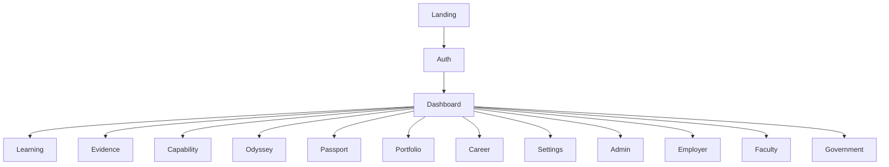

### 22.2 Navigation tree

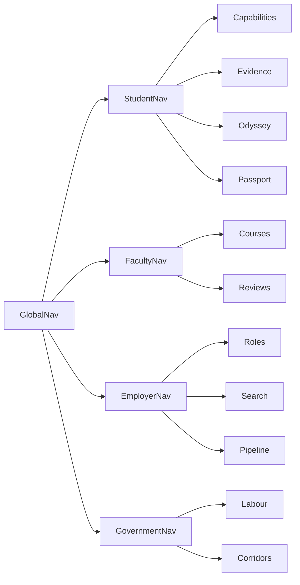

### 22.3 Role permissions

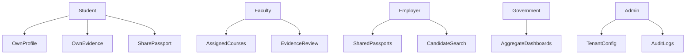

### 22.4 Student journey

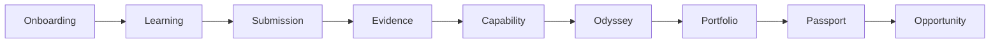

### 22.5 Employer journey

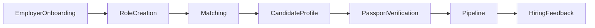

### 22.6 Faculty journey

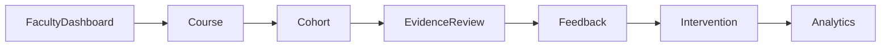

### 22.7 Government journey

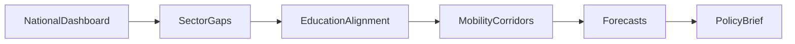

### 22.8 Dashboard relationships

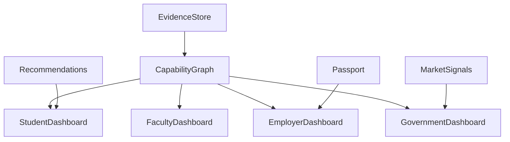

### 22.9 Screen dependencies

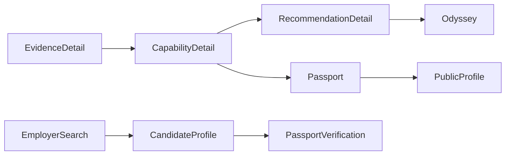

### 22.10 Component hierarchy

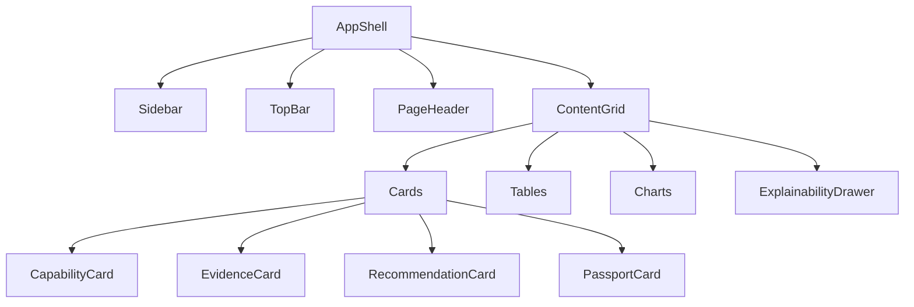

## 23. Appendices

### Appendix A — Navigation matrix

| Role | Primary nav | Secondary nav |
|---|---|---|
| Student | Dashboard, Learning, Evidence, Capability, Odyssey, Passport, Portfolio, Career | Settings, Integrations, Notifications |
| Faculty | Dashboard, Courses, Students, Evidence Review, Curriculum, Analytics | Settings, Notifications |
| Employer | Dashboard, Roles, Search, Candidates, Pipeline, Analytics | Company, Settings |
| Government | National Dashboard, Labour, Education, Sectors, Corridors, Forecasts | Exports, Settings |
| Admin | Admin, Institutions, Users, Roles, Integrations, Audit | Policies, System Health |

### Appendix B — Permission matrix

| Action | Student | Faculty | Employer | Government | Admin |
|---|---:|---:|---:|---:|---:|
| View own evidence | yes | assigned only | shared only | no individual by default | policy-bound |
| Dispute own evidence | yes | no | no | no | policy-bound |
| Review student evidence | no | assigned | no | no | policy-bound |
| Search candidates | no | no | consented pool | aggregate only | policy-bound |
| View passport | own/shared | assigned/shared | shared | aggregate/authorized | policy-bound |
| Export reports | own | course/cohort | employer | aggregate | yes |
| Configure tenant | no | no | employer profile only | no | yes |

### Appendix C — Interaction patterns

- Progressive disclosure: summary, detail, evidence, provenance.
- Confidence bands over raw scores unless detail view.
- Explanations in side drawers to avoid page clutter.
- Empty states teach evidence collection.
- Disputes and appeals are always visible where claims affect user opportunity.
- Role-specific language avoids internal architecture terms.

### Appendix D — Design glossary

| Term | UX meaning |
|---|---|
| Capability Card | Summary of evidence-backed ability. |
| Evidence Trail | Chronological/provenance path for a claim. |
| Odyssey | Personalized roadmap from current capability to desired future. |
| Passport Claim | Shareable verified capability/credential claim. |
| Confidence Band | Human-readable support level. |
| Explanation Drawer | Inspectable AI/evidence reasoning panel. |

### Appendix E — Future features

- Native mobile passport wallet.
- Voice-first mentor assistant.
- Interactive graph simulations.
- Cross-border corridor operations console.
- Credential issuer portal.
- Parent/guardian experience.
- Advanced team/project collaboration.
- Institutional accreditation package generator.
- Employer ATS plugin.
- Public capability profile SEO pages.

### Appendix F — Implementation notes

- Current repository already uses country-scoped routes for student, faculty, employer, ministry, and university surfaces; preserve this pattern for jurisdiction overlays.
- Use API route boundaries for domain projections.
- Add route groups by product surface as the app grows.
- Prefer reusable components in `components/` or `packages/ui` as architecture matures.
- Never expose Open edX-native terminology unless inside learning adapter admin screens.
- Use canonical concepts in copy: capability, evidence, confidence, passport, Odyssey, opportunity.

## 24. Final Decision

UX-001 establishes Syrka's product experience architecture. Every future Figma design, Google Stitch prototype, Claude implementation, frontend route, dashboard, and product workflow must reinforce Syrka as an AI-powered Human Capability Platform.

The interface must keep the MVP focused while allowing long-term expansion. Every screen must reflect ontology, every capability must be evidence-backed, every recommendation must be explainable, and every role must navigate complexity through calm, trusted, purposeful product structure rather than conventional LMS clutter.
